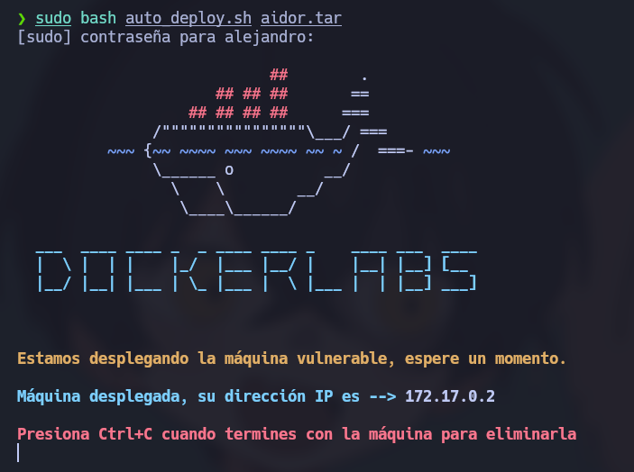
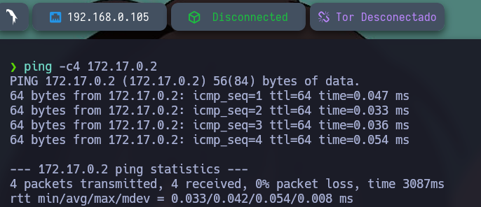
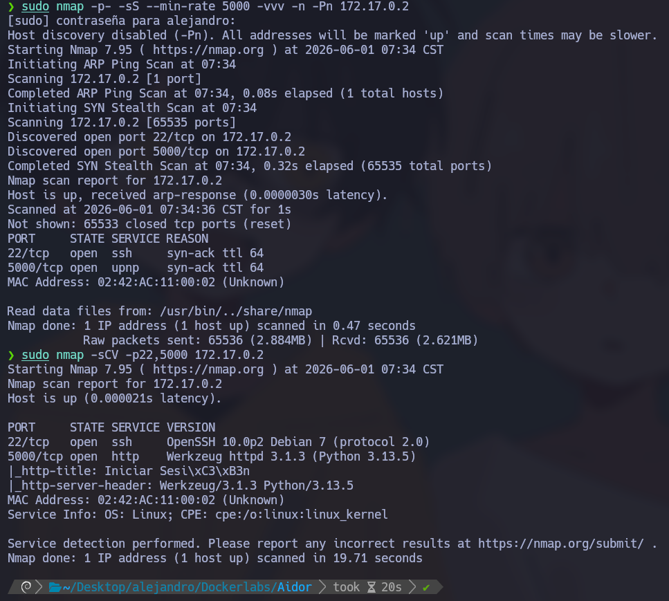
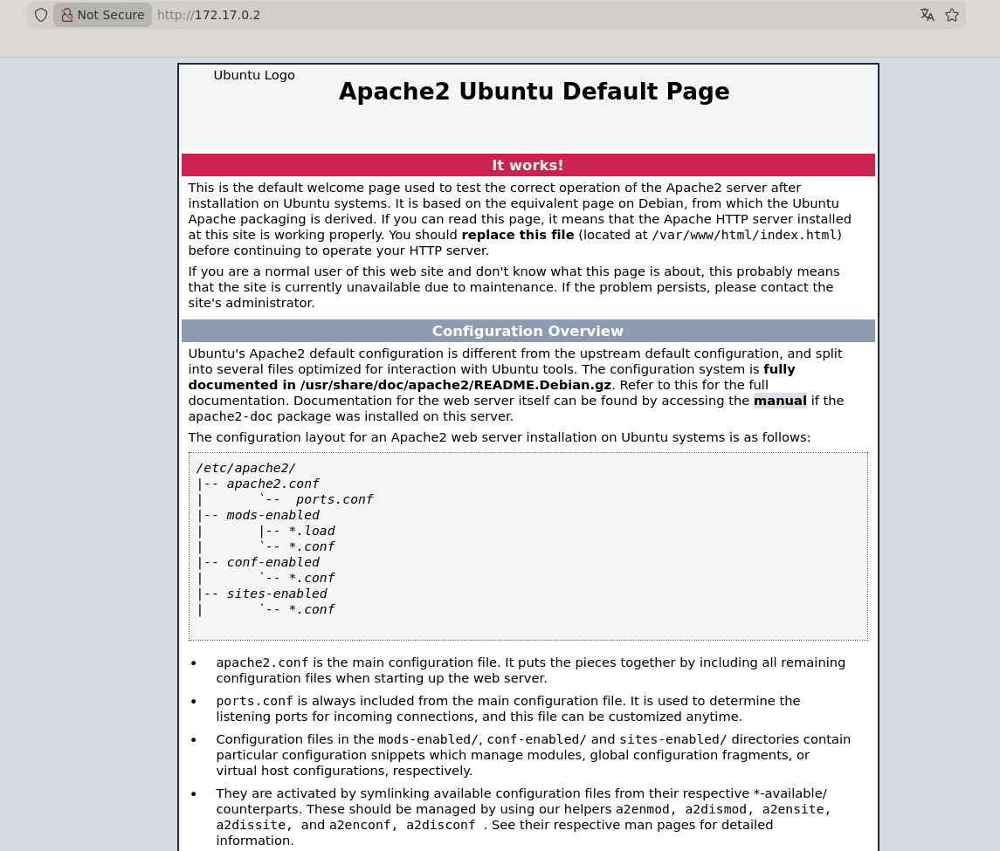
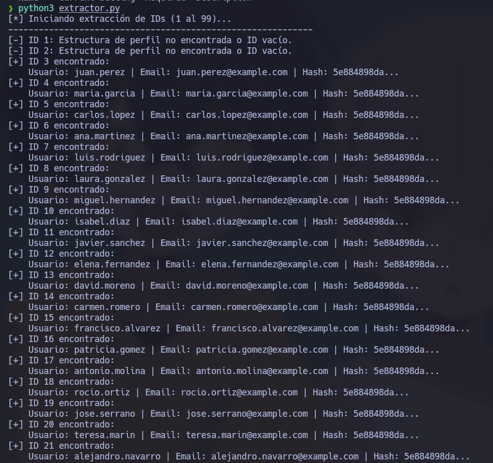
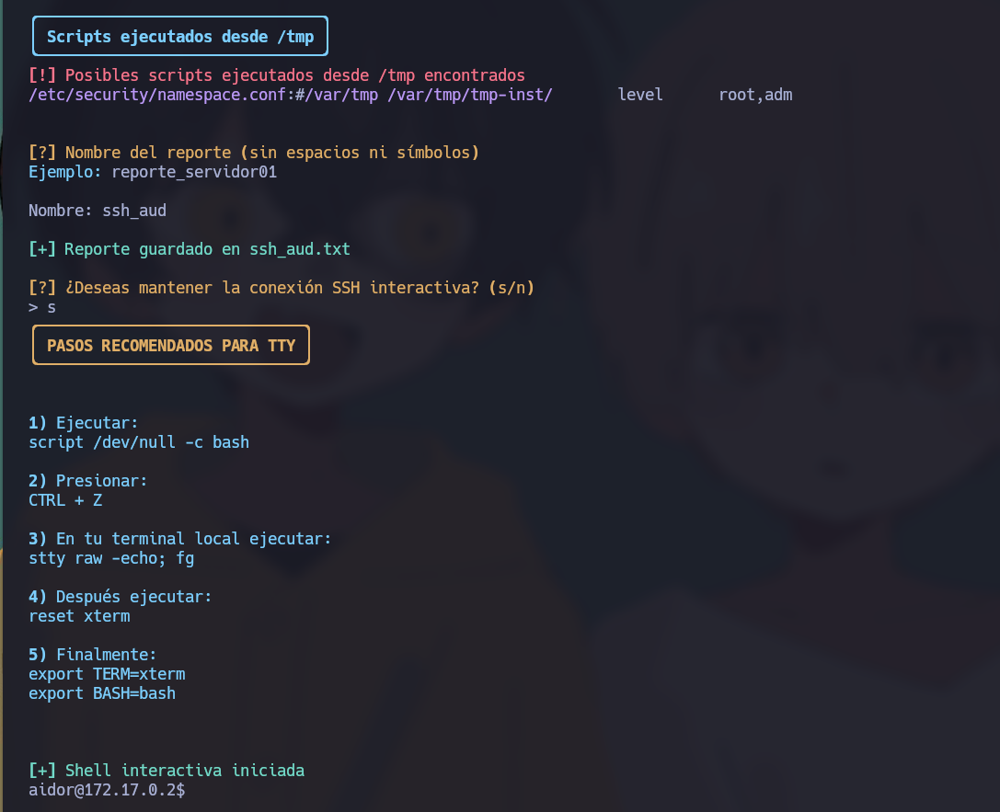
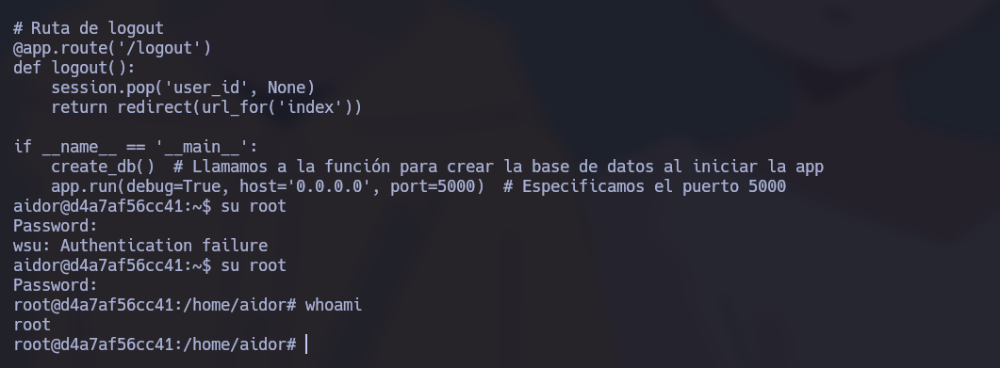

# 🧠 **Informe de Pentesting – Máquina: Aidor**

### 💡 **Dificultad:** Fácil

📦 **Plataforma:** DockerLabs


---

# 🚀 **1. Despliegue del Entorno**

El primer paso consiste en desplegar la máquina vulnerable proporcionada por la plataforma. Para ello, se descomprime el archivo entregado y se ejecuta el script de automatización.

### 📦 Descompresión del laboratorio

```bash
unzip aidor.zip
```

### ⚙️ Despliegue del contenedor

```bash
sudo bash auto_deploy.sh aidor.tar
```

Este script inicializa el entorno Docker con la máquina objetivo, asignándole una IP interna accesible desde el host atacante.



---

# 📶 **2. Comprobación de Conectividad**

Antes de iniciar el reconocimiento, se valida la conectividad con la máquina víctima mediante una petición ICMP.

```bash
ping -c1 172.17.0.2
```

El objetivo responde correctamente, confirmando que el host está activo y accesible dentro de la red local del entorno Docker.



---

# 🔍 **3. Reconocimiento y Escaneo de Puertos**

## 📡 Escaneo completo de puertos TCP

Se realiza un escaneo agresivo de todos los puertos TCP con el objetivo de identificar servicios expuestos:

```bash
sudo nmap -p- --open -sS --min-rate 5000 -vvv -n -Pn 172.17.0.2
```

### 📌 Resultados obtenidos

* `22/tcp` → SSH (OpenSSH)
* `5000/tcp` → Servicio HTTP (Apache)

Se confirma que la superficie de ataque incluye un servicio web y un servicio de acceso remoto.

---

## 🧩 Enumeración de versiones y servicios

Se ejecuta un escaneo más detallado para identificar versiones y configuración de los servicios:

```bash
nmap -sCV -p22,5000 172.17.0.2
```

Este análisis permite detectar información relevante como el tipo de servidor web, posibles endpoints y configuración del servicio SSH.



---

# 🌐 **4. Enumeración Web**

Accedemos al servicio HTTP:

```
http://172.17.0.2:5000
```

Se observa una página por defecto de Apache, lo que indica una aplicación poco visible a nivel superficial pero potencialmente vulnerable en rutas internas.



---

## 🔎 Fuzzing de directorios

Se realiza un ataque de enumeración de rutas ocultas utilizando Gobuster:

```bash
gobuster dir -u http://172.17.0.2:5000 \
-w /usr/share/wordlists/dirbuster/directory-list-2.3-medium.txt \
-x .env,.php,.bak,.old,.zip,.txt \
-b 403,404 --exclude-length 365
```

### 📌 Rutas descubiertas

* `/register`
* `/logout`
* `/dashboard`
* `/console`

Estas rutas indican la existencia de una aplicación web dinámica con funcionalidades de autenticación y panel de usuario.


---

# 🧪 **5. Análisis de la Aplicación Web**

## 👤 Registro de usuarios

En `/register` se observa un sistema de registro funcional. Al intentar registrar el usuario `admin`, el sistema indica que ya existe, lo que confirma la existencia de cuentas predefinidas.

Al crear un usuario propio, el registro es exitoso, asignando un identificador incremental (`ID=55`).

---

## 🔓 Descubrimiento de vulnerabilidad IDOR

Al manipular el parámetro `ID` asociado al usuario, se observa que:

* Cambiar el ID permite acceder a información de otros usuarios.
* El sistema devuelve datos sensibles como:

  * Usuarios
  * Correos electrónicos
  * Contraseñas en hash SHA-1

Esto confirma una vulnerabilidad de tipo:

> 🔥 **IDOR (Insecure Direct Object Reference)**

---

# 🛠️ **6. Automatización de extracción de datos**

Se desarrolla un script en Python para automatizar la enumeración de usuarios mediante el abuso del IDOR, extrayendo hashes de contraseñas y almacenándolos en un archivo para su posterior análisis.

Este paso permite agilizar la recopilación de credenciales expuestas por la aplicación.



---

# 🔐 **7. Cracking de hashes**

Se identifican hashes repetidos y únicos. Posteriormente, se procede a su cracking utilizando `John the Ripper`.

```bash
john --format=Raw-MD5 --wordlist=/usr/share/wordlists/rockyou.txt hash.txt
```

### 📌 Contraseñas recuperadas:

* chocolate
* pingu
* pepe

Estas credenciales corresponden a distintos usuarios del sistema.

---

# 🔑 **8. Ataque de fuerza bruta SSH**

Se construyen diccionarios personalizados:

* Lista de usuarios válidos (`usuarios.txt`)
* Lista de contraseñas crackeadas (`contrasenashas.txt`)

Se utiliza Hydra para el ataque:

```bash
hydra -L usuarios.txt -P contrasenashas.txt ssh://172.17.0.2
```

### 📌 Resultado

Se obtiene acceso válido:

```
aidor:chocolate
```

---

# 🖥️ **9. Acceso al sistema vía SSH**

Con las credenciales obtenidas, se accede al sistema mediante SSH, obteniendo una shell como el usuario `aidor`.

Esto permite explorar el sistema internamente y buscar posibles escaladas de privilegios.



---

# ⬆️ **10. Escalada de privilegios**

Durante la enumeración del sistema, se localiza un archivo Python en el directorio `/home`.

Al analizar su contenido, se descubre que contiene un hash MD5 asociado al usuario root.

---

## 🔓 Cracking del hash de root

Se extrae el hash y se crackea nuevamente con John:

```bash
john --format=Raw-MD5 --wordlist=/usr/share/wordlists/rockyou.txt roothash.txt
```

### 📌 Resultado:

```
estrella
```

---

# 👑 **11. Acceso root**

Con la contraseña obtenida, se realiza el cambio de usuario:

```bash
su root
```

Se obtiene acceso total al sistema con privilegios de administrador.



---
