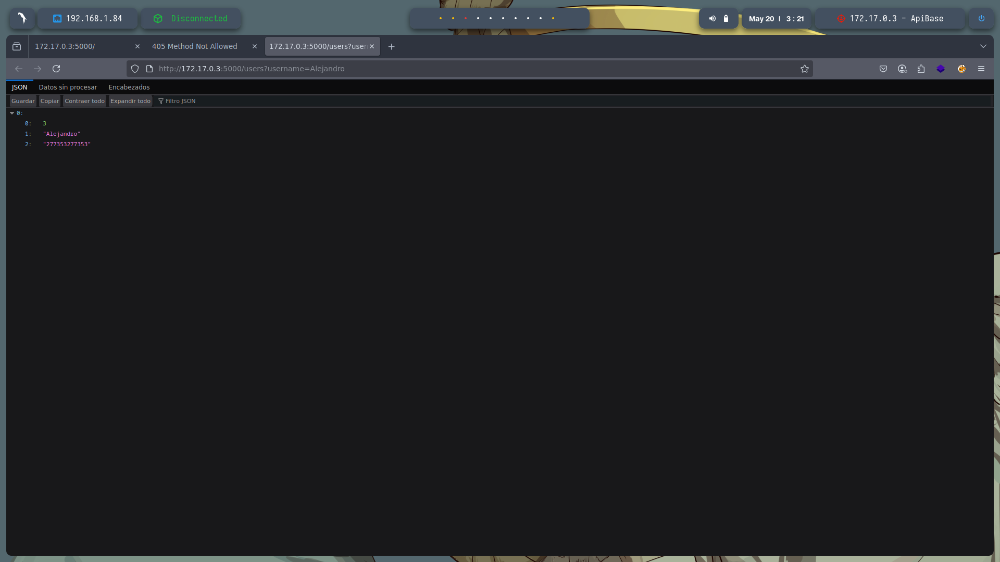
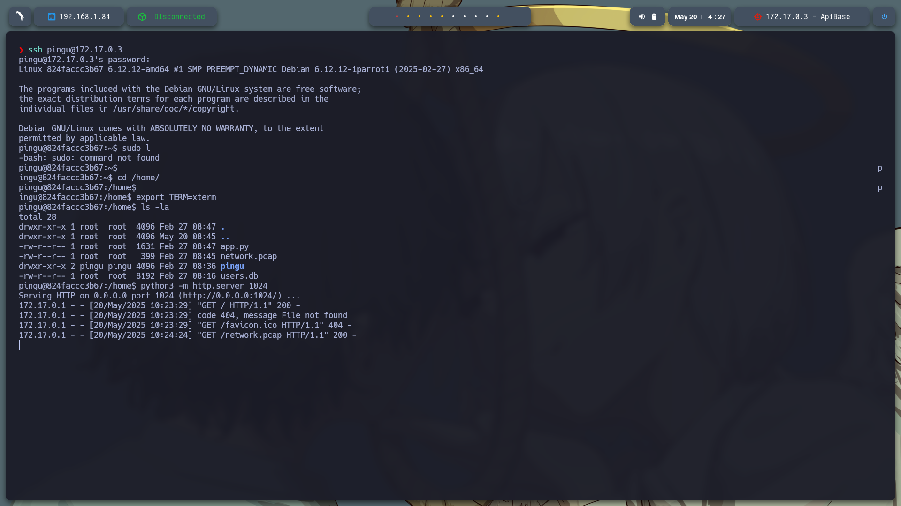

# 🧠 **Informe de Pentesting – Máquina: ApiBase** 

### 💡 **Dificultad:** Fácil


---

## 📝 **Descripción de la máquina**


---

## 🎯 **Objetivo**


---

## ⚙️ **Despliegue de la máquina**

Se descarga el archivo comprimido de la máquina vulnerable y se lanza el contenedor Docker mediante el script incluido:

```bash
unzip apibase.zip
sudo bash auto_deploy.sh apibase.tar
```


---

## 📡 **Comprobación de conectividad**

Verificamos que la máquina se encuentra activa respondiendo a peticiones ICMP (ping):

```bash
ping -c1 172.17.0.3
```


---

## 🔍 **Escaneo de Puertos**

Realizamos un escaneo completo para detectar todos los puertos abiertos:

```bash
sudo nmap -p- --open -sS --min-rate 5000 -vvv -n -Pn 172.17.0.3 -oG allPorts.txt
```

**Puertos detectados:**

* `22/tcp`: SSH
* `5000/tcp`: HTTP


Luego, analizamos los servicios y versiones asociados a esos puertos:

```bash
nmap -sCV -p22,80 172.17.0.3 -oN target.txt
```


Nos vamos a ver la API en http://172.17.0.3:5000 donde poemos ver que hice una solicitud para añadir usuarios (probablemente un GET o POST) a la raíz del servidor (/), pero el backend no tiene lógica implementada para manejar esa ruta directamente.


---
directorio /users que se descubre en la pagina


Realizamos fuzzing gobuster dir -u http://172.17.0.3:5000 -w /usr/share/seclists/Discovery/Web-Content/directory-list-2.3-medium.txt -t 20 -add-slash -b 403,404 -x .php,.html,.txt y encontramos los directorios:


http://172.17.0.3:5000/add

Nota: El error "405 Method Not Allowed" significa que estás haciendo una solicitud con un método HTTP (como GET o POST) que no está permitido para la ruta a la que estás accediendo (No se puede hacer por la pagina web) tambien la habiamos visto en la pagina api.

http://172.17.0.3:5000/console


En la página principal se indica que es posible añadir un usuario, pero desde la interfaz web no parece funcionar. Por ello, realizaremos un envío mediante una petición POST, siguiendo la estructura requerida para que el servidor la acepte correctamente.

curl -X POST "http://172.17.0.3:5000/add" -H "Content-Type: application/x-www-form-urlencoded" --data "username=Alejandro&email=AlejandroSL@gmail.com.com&password=277353277353"
Nota: sabemos que tuvimos azito porque vemos el mensaje: 
{
  "message": "User added"
}


usamos curl -X GET "http://172.17.0.3:5000/users?username=Alejandro" para ver el usuario añadido sabemos que existe el metodo users por la api mostrada en la pagina


---



Con toda esta informacion nos vamos a burpsuite:  burpsuite &> /dev/null & disown y interceotamos la peticion de: http://172.17.0.3:5000/users?username=Alejandro activamos nuestro proxi, en bursuite no vamos a proxi inteseptamos la peticion (recargar la pagina) y en bursuite clic derecho a la peticon y send to repeter y nos movemos a la pestaña repeter donde estara interceptado la peticion


Al dar clic en sen mandamos la peticion y nos devuelve el get de nuestro usuario funciona correctamente


Se prueba en mandar ina inyeccion cambiando Alejandro por ' y nos da un HTTP/1.0 500 INTERNAL SERVER ERROR esto nos muestra que si es vulnerable a inyecciones


Se llevó a cabo una inyección SQL en el parámetro `username` mediante la cadena `'or 1=1-- -`. Esta técnica permitió evadir los filtros de autenticación y ejecutar una consulta maliciosa, obteniendo como respuesta una lista completa de usuarios y contraseñas almacenados en la base de datos del servidor.

Usuario: pingu
Contraseña: your_password

Usario:pingu 
Contraseñapinguinasio


Entramos al servicio de SSH con las credenciales Usuario: pingu Contraseña: Contraseñapinguinasio donde buscando alguna escala no encotre nada vulnerable pero encontre un archivo que guarda trafico de red network.pcap, podemos descargar el archivo con  wget http://172.17.0.3:1024/network.pcap en nuestro host atacante o entrando a la url: http://172.17.0.3:1024/



---


---


Usamos wireshark para ver el contenido


Al revisar los paqutes se encotro la contraseña de root balulero

Entramos a root con su root balulero


