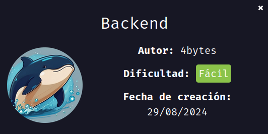
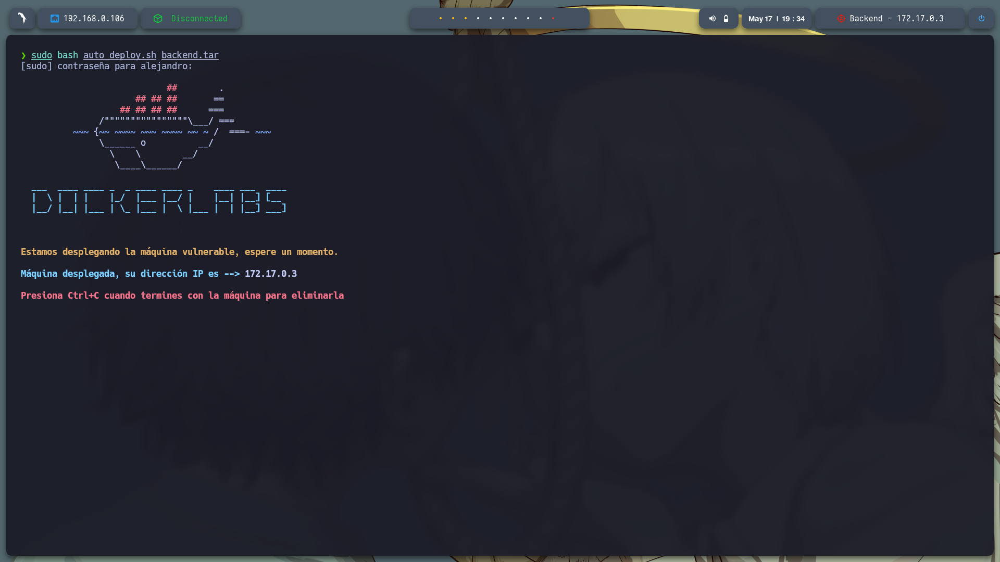
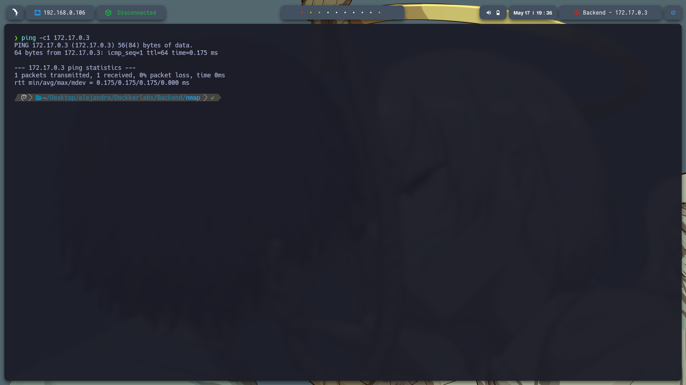
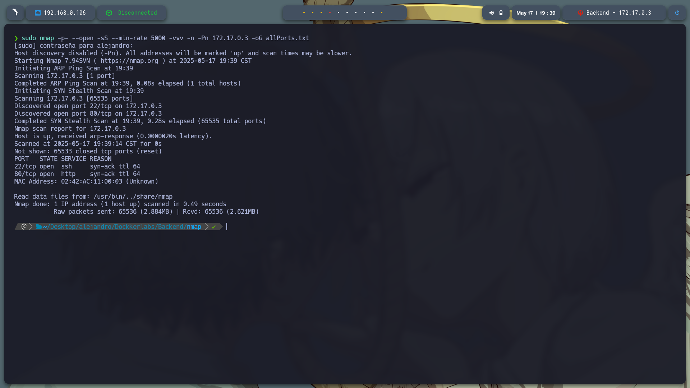
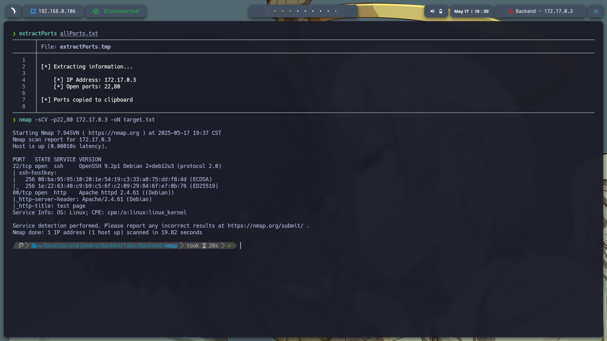

# **Máquina: Backend**

### **Dificultad:** Fácil

### 📝 **Descripción:**


### 🎯 **Objetivo:**




---

## 🖥️ **Despliegue de la máquina**

Descargamos el archivo `backend.zip`, lo descomprimimos y desplegamos la máquina usando el script `auto_deploy.sh` proporcionado. Esto inicia la máquina vulnerable dentro de un contenedor Docker:

```bash
unzip backend.zip
sudo bash auto_deploy.sh backend.tar
```



---

## 📡 **Comprobación de conectividad**

Verificamos la conexión con un simple `ping` a la IP asignada (172.17.0.3):

```bash
ping -c1 172.17.0.3
```



---

## 🔍 **Escaneo de puertos**

Ejecutamos un escaneo de puertos completo con `nmap`:

```bash
sudo nmap -p- --open -sS --min-rate 5000 -vvv -n -Pn 172.17.0.3 -oG allPorts.txt
```

Puertos descubiertos:

* **22/tcp** – SSH
* **80/tcp** – HTTP



Posteriormente, realizamos un escaneo más detallado sobre los puertos encontrados:

```bash
nmap -sCV -p22,8009,8080 172.17.0.3 -oN target.txt
```



---

Entre http://172.17.0.3/ en donde se encuntra alojado una pagina web donde se ecnotro que existe un login.html 


