# 🧠 **Informe de Pentesting – Máquina: BaluFood**

### 💡 **Dificultad:** Fácil

### 🧩 **Plataforma:** DockerLabs

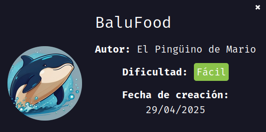

---

## 📝 **Descripción de la máquina**

BaluFood es una máquina vulnerable en contenedor Docker que simula el entorno de una aplicación web de pedidos de comida. El objetivo es identificar y explotar vulnerabilidades para obtener acceso no autorizado y, finalmente, escalar privilegios hasta obtener acceso como root.

---

## 🎯 **Objetivo**

* Acceso inicial a través de la interfaz web o servicios expuestos.
* Escalado de privilegios hasta obtener acceso root.
* Documentación de los pasos seguidos, técnicas utilizadas y hallazgos.

---

## ⚙️ **Despliegue de la máquina**

Se descarga y despliega el entorno vulnerable utilizando el script incluido:

```bash
unzip balufood.zip
sudo bash auto_deploy.sh backend.tar
```

Esto lanza el contenedor Docker con la máquina BaluFood.
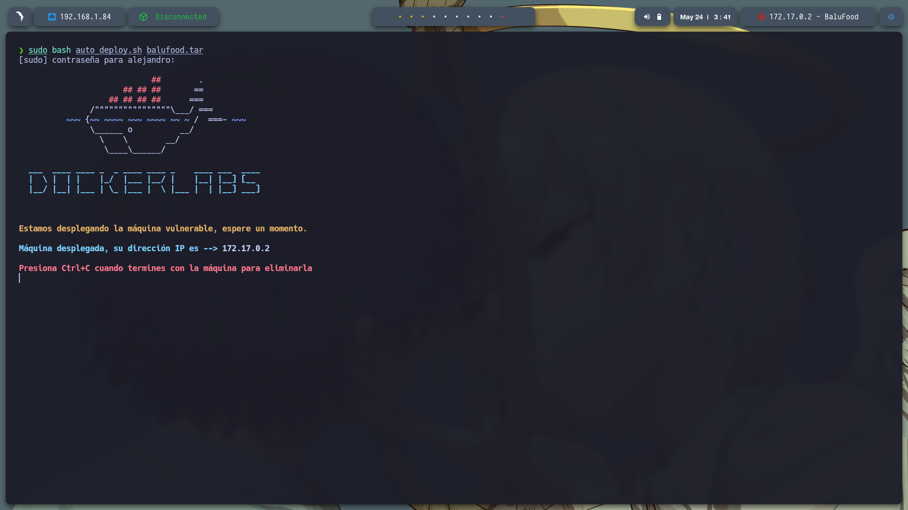

---

## 📡 **Comprobación de conectividad**

Se realiza una prueba de conectividad mediante ping hacia la dirección IP del contenedor:

```bash
ping -c1 172.17.0.2
```

Esto confirma que la máquina está activa y accesible.
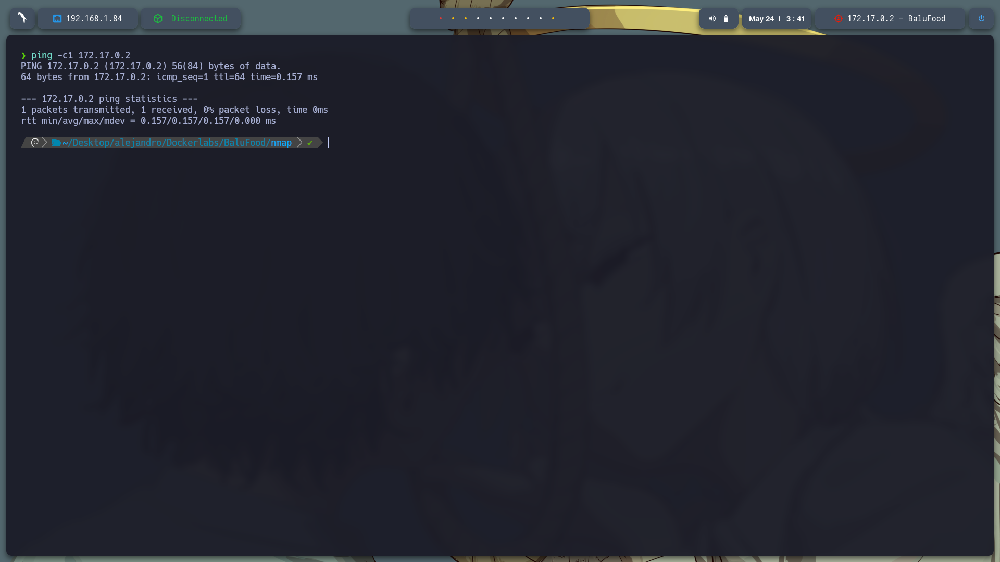

---

## 🔍 **Escaneo de Puertos**

### Escaneo completo de puertos:

```bash
sudo nmap -p- --open -sS --min-rate 5000 -vvv -n -Pn 172.17.0.2 -oG allPorts.txt
```

* `-p-`: Escanea todos los puertos del 1 al 65535.
* `--open`: Muestra solo puertos abiertos.
* `-sS`: Escaneo TCP SYN.
* `--min-rate 5000`: Aumenta la velocidad del escaneo.
* `-Pn`: Omite el ping previo.
* `-oG`: Guarda el resultado en formato grepable.

**Puertos abiertos encontrados:**

* `22/tcp`: SSH
* `5000/tcp`: HTTP

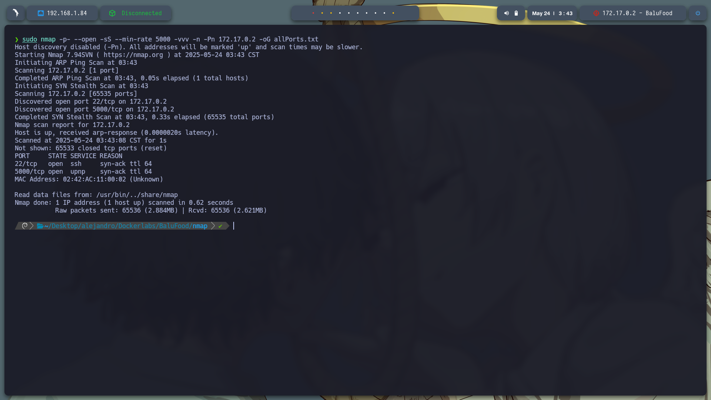

### Detección de versiones y servicios:

```bash
nmap -sCV -p22,5000 172.17.0.2 -oN target.txt
```

* `-sC`: Ejecuta scripts por defecto.
* `-sV`: Detecta versiones de servicios.

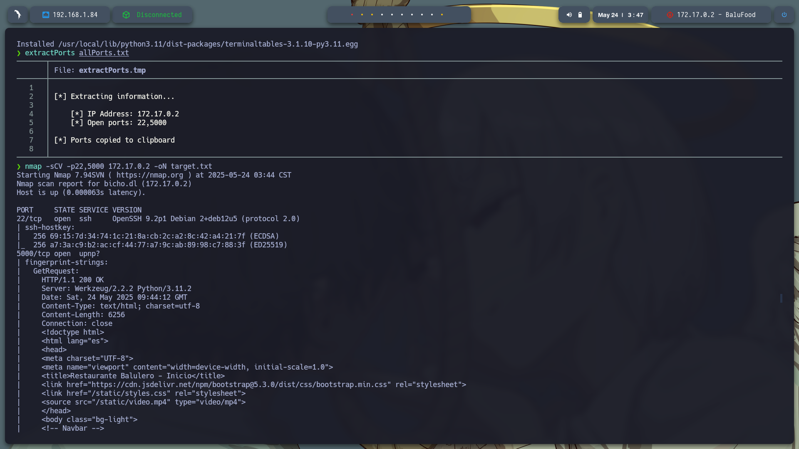

---

## 🌐 **Exploración Web**

Accedemos a `http://172.17.0.2:5000/` y observamos una aplicación web de restaurante con opciones como menú, pedidos y comentarios.

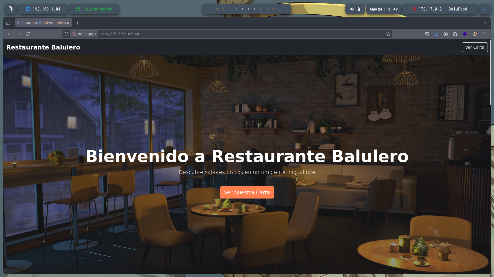

### Formulario de login

Visitamos `http://172.17.0.2:5000/login`, encontramos un formulario de acceso.

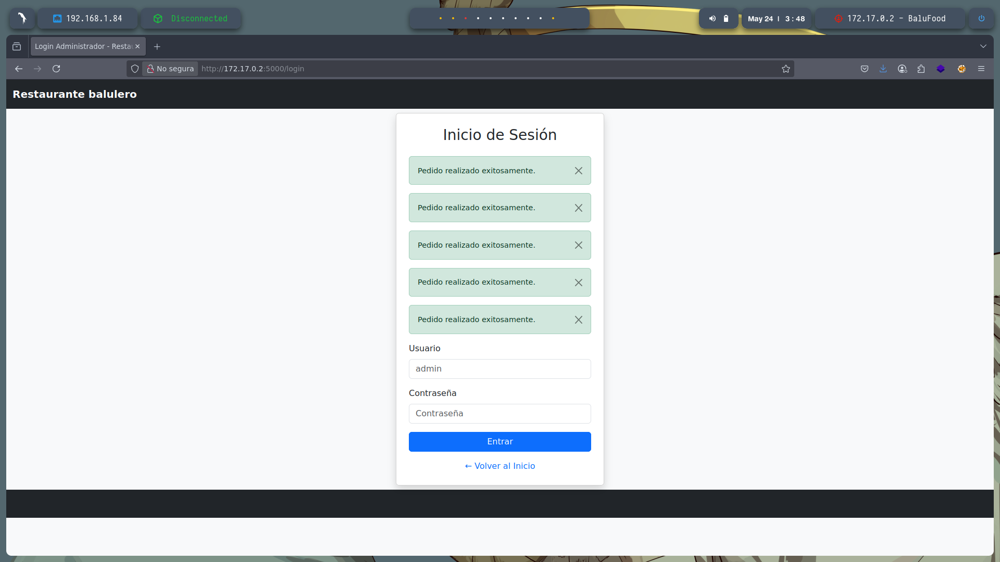

Probamos credenciales comunes:

* **Usuario:** `admin`
* **Contraseña:** `admin`

Accedemos exitosamente al panel de administración en `/admin`.

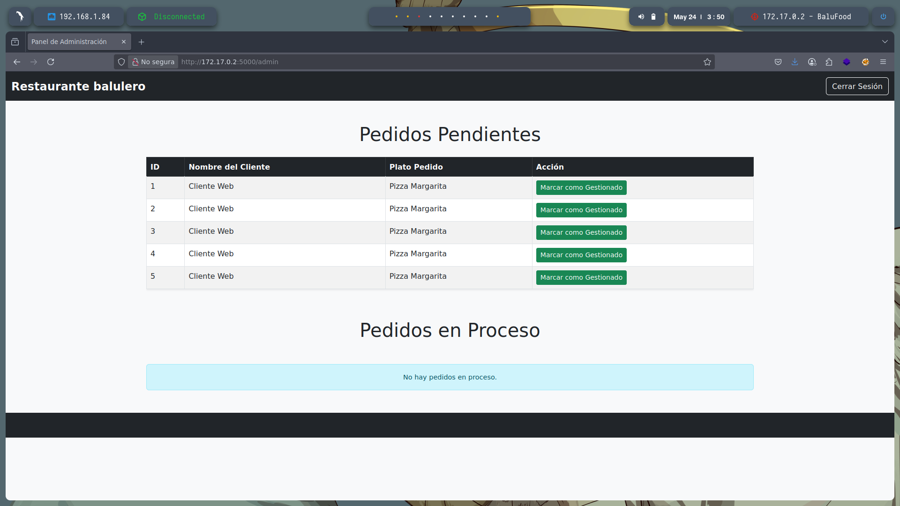

> **Nota:** También es posible acceder directamente navegando a `http://172.17.0.2:5000/admin`.

### Comentario con credenciales

Al revisar el código fuente de la página de administrador encontramos un comentario HTML:

```html
<!-- Backup de acceso: sysadmin:backup123 -->
```

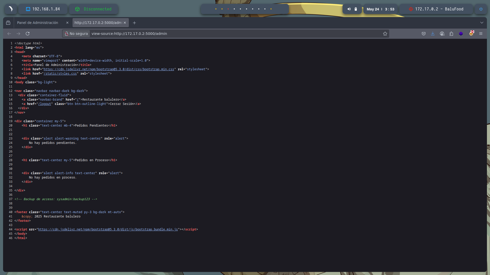

---

## 🧭 **Fuzzing de directorios**

Ejecutamos `gobuster` para descubrir rutas ocultas:

```bash
gobuster dir -u http://172.17.0.2:5000/ \
-w /usr/share/wordlists/dirbuster/directory-list-2.3-medium.txt \
-t 20 -x .php,.html,.txt -b 403,404 -o gobuster.txt
```

* `-w`: Wordlist utilizada.
* `-x`: Extensiones buscadas.
* `-b`: Códigos de respuesta a omitir.
* `-t`: Hilos para mayor velocidad.

Se descubre el directorio `/console`, lo que sugiere una posible consola interactiva (como Flask Debug Console).

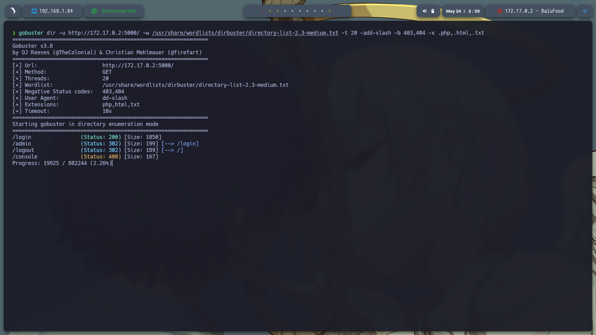

---

## 🔐 **Acceso por SSH**

Probamos las credenciales encontradas `sysadmin:backup123` para conectarnos por SSH:

```bash
ssh sysadmin@172.17.0.2
```

¡Acceso exitoso!

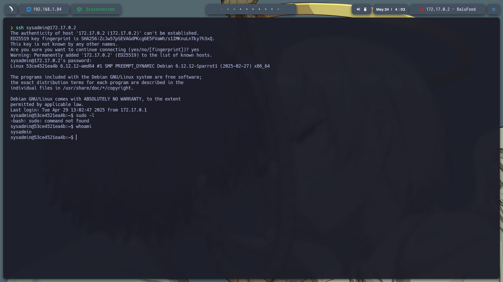

### Verificación de privilegios

```bash
sudo -l
```

No tiene permisos sudo.

### Búsqueda de archivos interesantes

Se inspecciona el directorio `/home/` y se encuentran dos usuarios: `sysadmin` y `balulero`. Dentro del home de `sysadmin`, se encuentra un archivo `app.py`.

```bash
cat ~/app.py
```

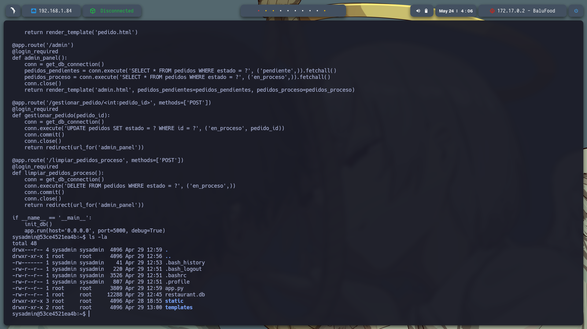

El contenido del script revela una **clave secreta**:

```python
secret_key = "cuidaditocuidadin"
```

Usamos esta clave como contraseña para intentar acceder como `balulero` por SSH:

```bash
ssh balulero@172.17.0.2
```

¡Acceso exitoso!

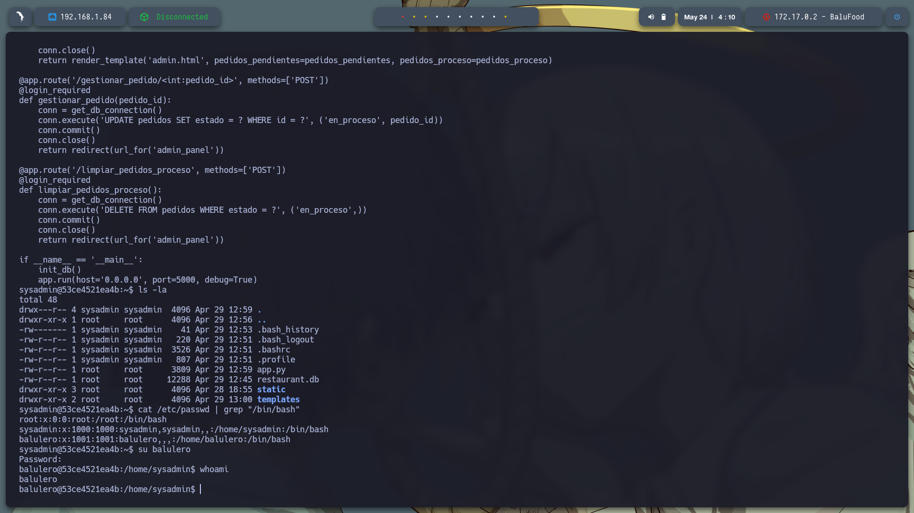

---

## ⬆️ **Escalada de Privilegios**

Ya dentro del usuario `balulero`, buscamos archivos y configuraciones que nos den acceso como root.

### Análisis del archivo `.bashrc`

Revisamos el archivo `.bashrc`:

```bash
cat ~/.bashrc
```

Encontramos el siguiente alias:

```bash
alias ser-root='sudo su -'
```

Esto sugiere que el usuario puede ejecutar `sudo su -` sin contraseña. Probamos directamente:

```bash
sudo su -
```

¡Acceso root conseguido!

---

## 🏁 **Resumen**

| Etapa                | Resultado                             |
| -------------------- | ------------------------------------- |
| Acceso Web           | Formulario login expuesto             |
| Credenciales comunes | admin\:admin                          |
| Código fuente web    | Comentario con usuario: sysadmin      |
| Acceso por SSH       | sysadmin\:backup123                   |
| Revisión de scripts  | Clave encontrada: "cuidaditocuidadin" |
| Acceso como balulero | Contraseña: cuidaditocuidadin         |
| Escalada a root      | Alias sudo encontrado en `.bashrc`    |

---

