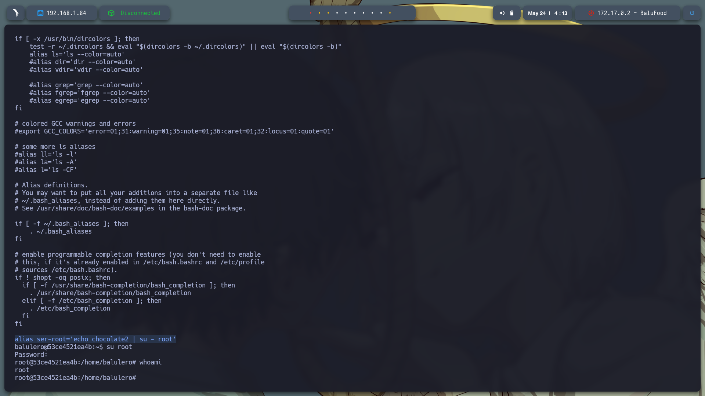

# 🧠 **Informe de Pentesting – Máquina: BaluFood** 

### 💡 **Dificultad:** Fácil

### 🧩 **Plataforma:** DockerLabs


---

## 📝 **Descripción de la máquina**


---

## 🎯 **Objetivo**


---

## ⚙️ **Despliegue de la máquina**

Se descarga el archivo comprimido de la máquina vulnerable y se lanza el contenedor Docker mediante el script incluido:

```bash
unzip balufood.zip
sudo bash auto_deploy.sh backend.tar
```


---

## 📡 **Comprobación de conectividad**

Verificamos que la máquina se encuentra activa respondiendo a peticiones ICMP (ping):

```bash
ping -c1 172.17.0.2
```


---

## 🔍 **Escaneo de Puertos**

Realizamos un escaneo completo para detectar todos los puertos abiertos:

```bash
sudo nmap -p- --open -sS --min-rate 5000 -vvv -n -Pn 172.17.0.2 -oG allPorts.txt
```

**Puertos detectados:**

* `22/tcp`: SSH
* `5000/tcp`: HTTP


Luego, analizamos los servicios y versiones asociados a esos puertos:

```bash
nmap -sCV -p22,80 172.17.0.2 -oN target.txt
```


---

Al ver que esta el puerto 5000 esta abierto nos vamos a http://172.17.0.2:5000/ para visualizar lo que aloja y nos damos cuenta que es la pagina de un restaurante y en la parte de abajo hay una seccion de comentarios.


Al navegar entre pestañas y ver la funciones que tiene como el de ver menu,realizar pedidos, logro encontrar un formulario de registro http://172.17.0.2:5000/login


Al probar credenciales comunes logro accedes con usuario: admin Contraseña admin, nos reditige a http://172.17.0.2:5000/admin y se logra ver lo pedidos que realice previamente.


Nota: Al poner el directorio: /admin tambien no da acceso a la pagina del adminitrador

Al revisar el codigo fuento de esta pestaña puedo notar que hay uno comentario con credenciales, <!-- Backup de acceso: sysadmin:backup123 -->


Realice fuzzing gobuster dir -u http://172.17.0.2:5000/ -w /usr/share/wordlists/dirbuster/directory-list-2.3-medium.txt -t 20 -add-slash -b 403,404 -x .php,.html,.txt y encontramos mas directorios el mas interesante seria el directorio /console que podriamon intetar una explotacion como en la maquina Bichos ya hecha.


Probamos la credenciales encontradas para entrar al servicio de SSH y son validas 


Usamos sudo -l sin exito, busque archivos en /opt sin exito asi que busco usuarios en home y encontre: balulero y sysadmin por el cual estamos conectados, dentro de este usuario hay un app.py, 


Al revisar el codigo encontramos una clave secreta cuidaditocuidadin asi usamos esta contraseña para acceder como balulero con exito


Al revisar el contenido de usuario en el archivo: .bashrc que leimos con: cat ~/.bashrc encontramos unas posibles credenciales para root: alias ser-root='echo chocolate2 | su - root' lo probamos: su root y accedimos a root con exito


