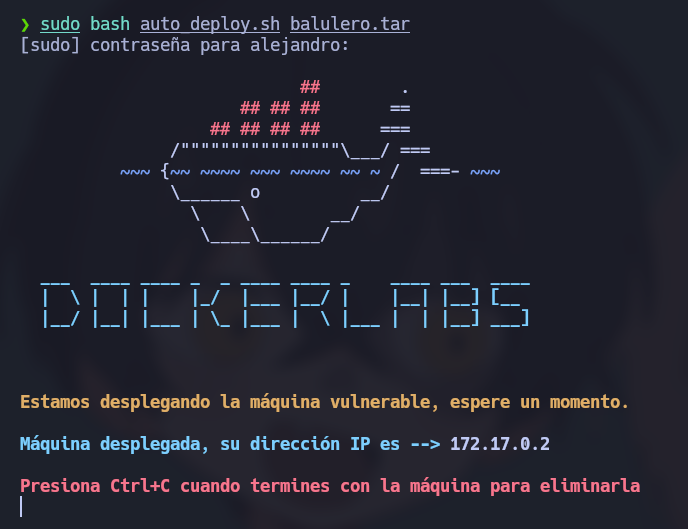
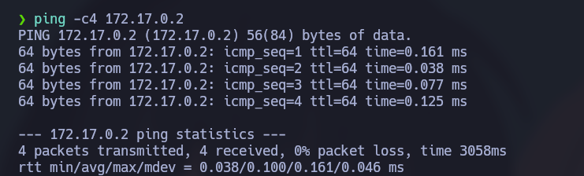
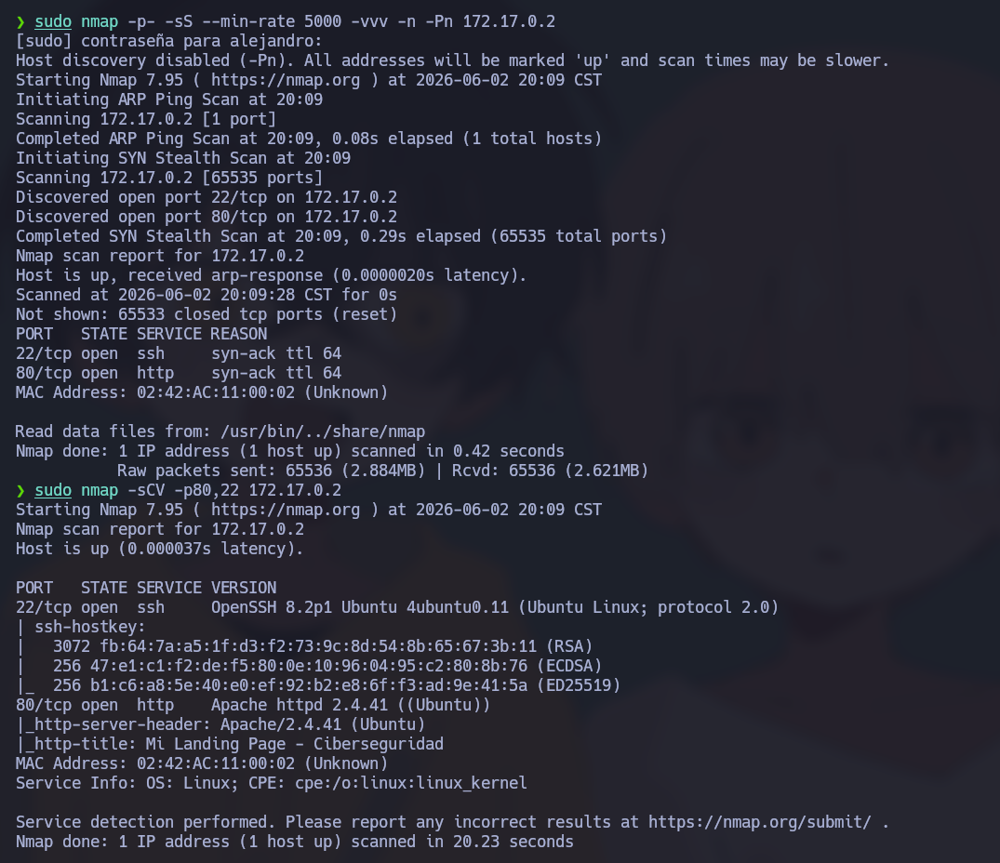

# 🧠 Informe de Pentesting – Máquina: Balulero

### 💡 Dificultad: Fácil

### 🧩 Plataforma: DockerLabs


---

# ⚙️ Despliegue de la máquina

Antes de iniciar el proceso de reconocimiento y explotación, se procede a desplegar la máquina vulnerable proporcionada por DockerLabs.

La máquina se distribuye comprimida en formato `.zip`, conteniendo una imagen Docker y un script automatizado que facilita su ejecución.

```bash
unzip balulero.zip
sudo bash auto_deploy.sh balulero.tar
```

Una vez finalizado el despliegue, la máquina queda disponible dentro de la red local de Docker.



---

# 📡 Comprobación de conectividad

Antes de comenzar la fase de enumeración, es importante verificar que el objetivo se encuentre activo y responda correctamente dentro de la red.

```bash
ping -c4 172.17.0.2
```

### Explicación:

* **ping** → Herramienta utilizada para verificar conectividad mediante ICMP.
* **-c4** → Envía únicamente un paquete ICMP.

La recepción de respuesta confirma:

* Existencia del host objetivo
* Conectividad de red funcional
* Baja latencia, esperada al ejecutarse dentro de Docker



---
# 🔍 Fase de reconocimiento – Escaneo de puertos

La enumeración inicial comienza identificando los puertos expuestos por el sistema.

Se realiza un escaneo completo sobre todos los puertos TCP:

```bash
sudo nmap -p- --open -sS --min-rate 5000 -vvv -n -Pn 172.17.0.2
```

## Explicación detallada de parámetros:

* **-p-** → Escanea los 65535 puertos TCP.
* **--open** → Muestra únicamente puertos abiertos.
* **-sS** → Ejecuta un SYN Scan (Stealth Scan).
* **--min-rate 5000** → Fuerza una velocidad mínima de envío de paquetes.
* **-vvv** → Incrementa el nivel de verbosidad.
* **-n** → Evita la resolución DNS.
* **-Pn** → Omite la detección previa de hosts activos.

---

## 📌 Resultado obtenido

El escaneo revela los siguientes servicios expuestos:

* **22/tcp → SSH**
* **80/tcp → HTTP**

Esto indica que la superficie de ataque inicial se encuentra orientada principalmente hacia servicios web.

---
# Enumeración de servicios

Una vez identificados los puertos abiertos, se ejecuta un análisis más profundo para obtener información adicional sobre versiones y configuraciones:

```bash
nmap -sCV -p22,80 172.17.0.2
```

### Explicación:

* **-sC** → Ejecuta scripts NSE básicos.
* **-sV** → Detecta versiones de servicios.
* **-p22,80** → Analiza únicamente los puertos especificados.



---
