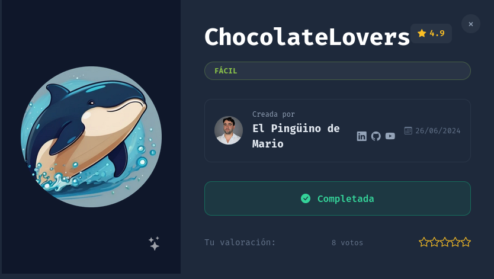
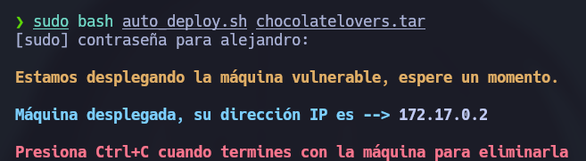

# 🧠 **Informe de Pentesting – Máquina: ChocolateLovers**

### 💡 **Dificultad:** Fácil

📦 **Plataforma:** DockerLabs




---

# 🚀 **Despliegue de la Máquina**

Para iniciar la máquina vulnerable, primero descomprimimos el archivo proporcionado y posteriormente ejecutamos el script de despliegue:

```bash
unzip chocolatelovers.zip
sudo bash auto_deploy.sh chocolatelovers.tar
```



---

# 📶 **Comprobación de Conectividad**

Una vez desplegada la máquina, verificamos que el objetivo se encuentre activo y responda correctamente a peticiones ICMP:

```bash
ping -c1 172.17.0.2
```


---

