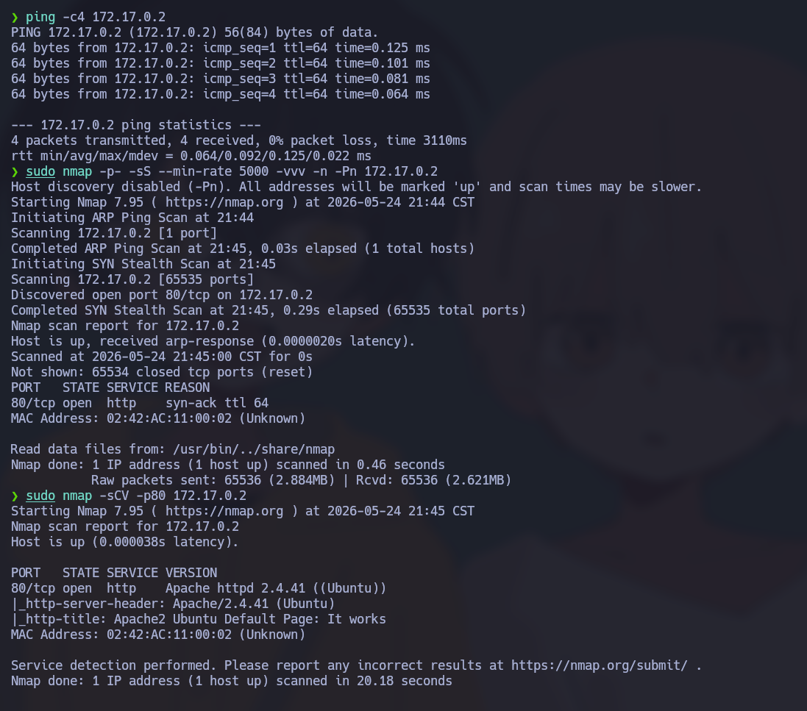
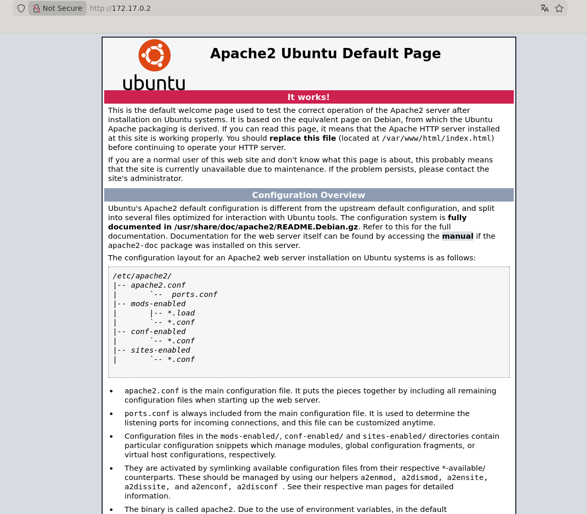

# 🧠 **Informe de Pentesting – Máquina: ChocolateLovers**

### 💡 **Dificultad:** Fácil

📦 **Plataforma:** DockerLabs


---

# 🚀 **Despliegue de la Máquina**

Para iniciar la máquina vulnerable, primero descomprimimos el archivo proporcionado y posteriormente ejecutamos el script de despliegue:

```bash
unzip chocolatelovers.zip
sudo bash auto_deploy.sh chocolatelovers.tar
```


---

# 📶 **Comprobación de Conectividad**

Una vez desplegada la máquina, verificamos que el objetivo se encuentre activo y responda correctamente a peticiones ICMP:

```bash
ping -c1 172.17.0.2
```
# 🔍 **Escaneo de Puertos**

## 🔎 Escaneo Completo de Puertos

Se realiza un escaneo completo sobre todos los puertos TCP para identificar los servicios expuestos en la máquina víctima:

```bash
sudo nmap -p- --open -sS --min-rate 5000 -vvv -n -Pn 172.17.0.2
```

### 📌 Puertos Abiertos Detectados

* `80/tcp` → Servicio HTTP

---

## 🧩 Enumeración de Servicios y Versiones

Después de identificar los puertos abiertos, procedemos a detectar versiones y configuraciones de los servicios activos:

```bash
nmap -sCV -p21,80 172.17.0.2
```



---

## 🖥️ Acceso Inicial a la Aplicación Web

Accedemos al servicio web desde el navegador:

```bash
http://172.17.0.2
```

La página carga correctamente y muestra una aplicación web funcional.



---

Buscamos directorios y subdominios sin exito

```bash
gobuster vhost --append-domain -u http://172.17.0.2 -w /usr/share/wordlists/seclists/Discovery/DNS/subdomains-top1million-110000.txt -k 
```
```bash
gobuster dir -u http://172.17.0.2 -w /usr/share/wordlists/dirbuster/directory-list-2.3-medium.txt -x .env,.php,.bak,.old,.zip,.txt -b 403,404 --exclude-length 301
```


