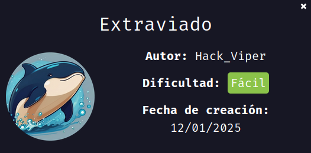
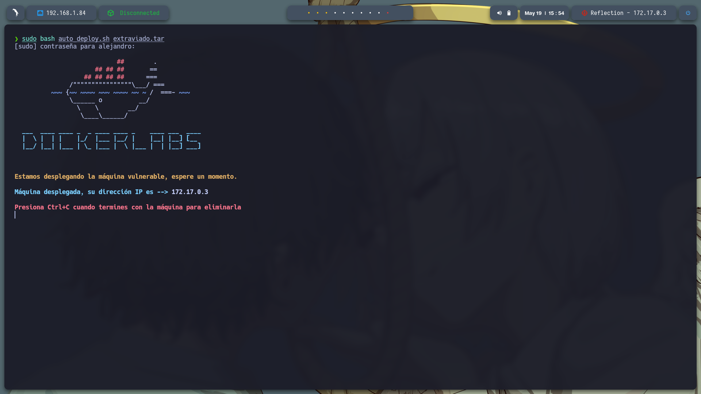
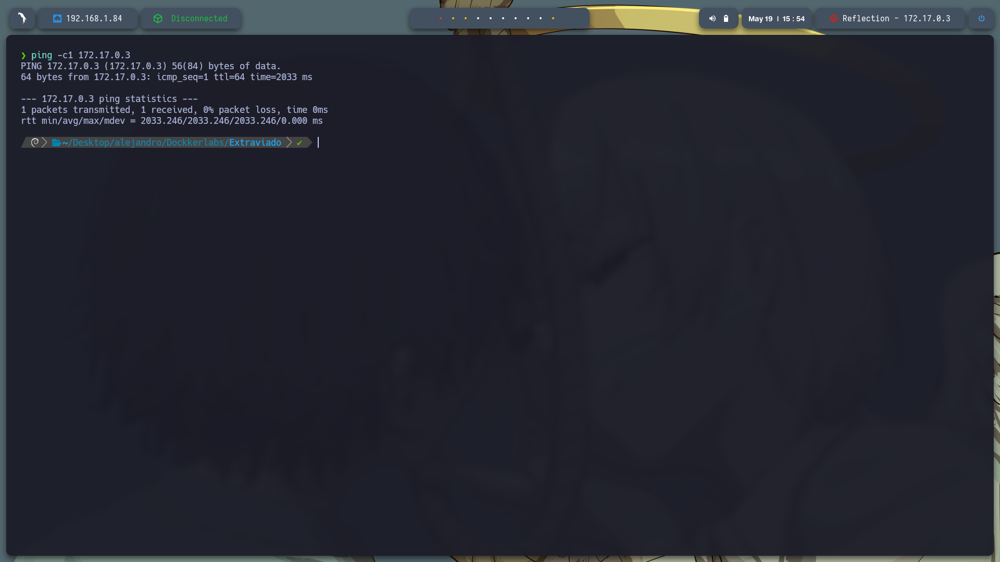
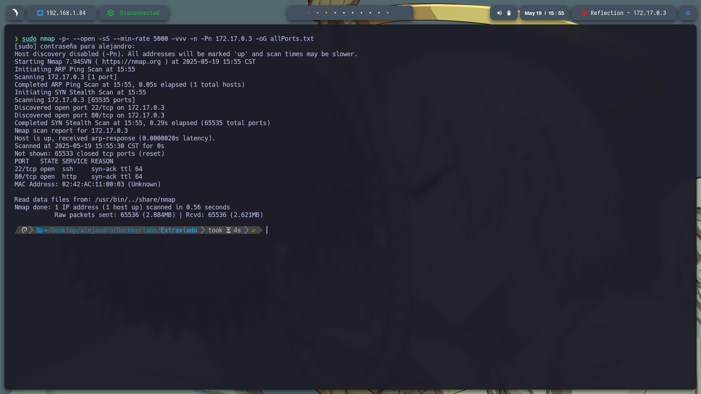
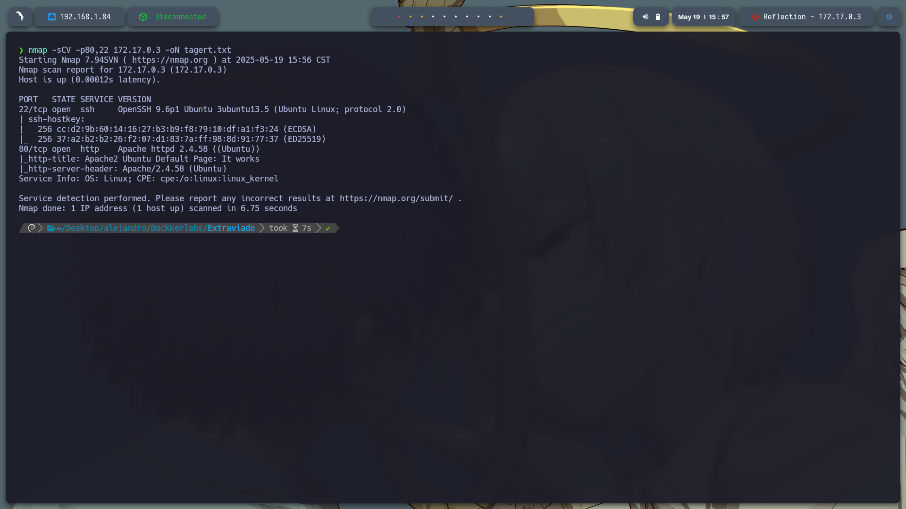
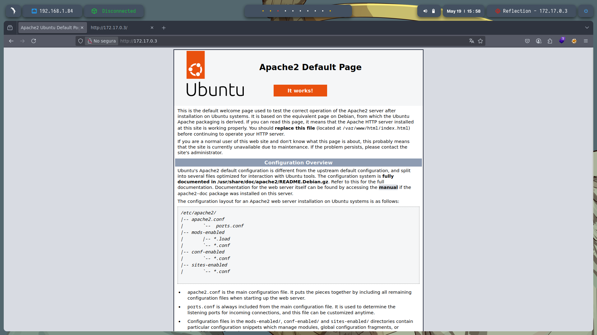
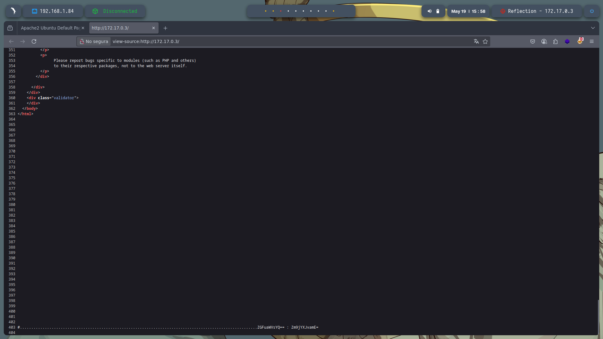
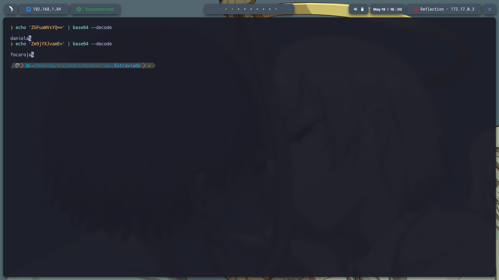
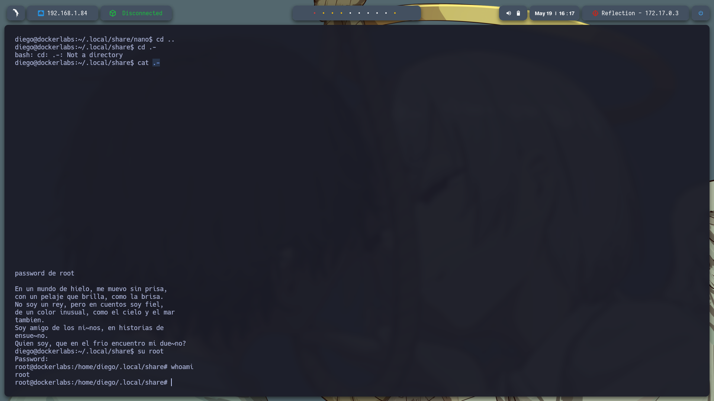

# 🧠 **Informe de Pentesting – Máquina: Extraviado** 

### 💡 **Dificultad:** Fácil


### 🕵️‍♂️ **Tipo de ataque:** 




---

## 📝 **Descripción de la máquina**


---

## 🎯 **Objetivo**


---

## ⚙️ **Despliegue de la máquina**

Se descarga el archivo comprimido de la máquina vulnerable y se lanza el contenedor Docker mediante el script incluido:

```bash
unzip extraviado.zip
sudo bash auto_deploy.sh extraviado.tar
```



---

## 📡 **Comprobación de conectividad**

Verificamos que la máquina se encuentra activa respondiendo a peticiones ICMP (ping):

```bash
ping -c1 172.17.0.3
```



---

## 🔍 **Escaneo de Puertos**

Realizamos un escaneo completo para detectar todos los puertos abiertos:

```bash
sudo nmap -p- --open -sS --min-rate 5000 -vvv -n -Pn 172.17.0.3 -oG allPorts.txt
```

**Puertos detectados:**

* `22/tcp`: SSH
* `80/tcp`: HTTP



Luego, analizamos los servicios y versiones asociados a esos puertos:

```bash
nmap -sCV -p22,80 172.17.0.3 -oN target.txt
```



---

Entre a la pagina que estaba alojado en el puerto: 80 http://172.17.0.3 y se muestra la pagina default de apache pero al buscar en su codigo fuente se encotro: ZGFuaWVsYQ== : Zm9jYXJvamE= al ver que al final usa signos = puedo suponer que es base64


---


Para descodificarlo use: 

echo 'ZGFuaWVsYQ==' | base64 --decode
daniela%  

echo 'Zm9jYXJvamE=' | base64 --decode
focaroja%   



Accedemos a SSH como usuario daniela, busque permisos sudo -l sin exito busque usuarios en cd /home y encontre el usuario diego, dentro del directorio de daniela hay un direcotio oculto .secreto con un oculto .passdiego donde se encotro un codigo
en base64 usamos la misma tecnica echo 'YmFsbGVuYW5lZ3Jh' | base64 --decode y obtenemos la contraseña de diego ballenanegra% entramos como diego su diego, y encntramos un directorio oculto .passroot con un archivo .pass que tiene un codigo en base64 
lo descodigficamos echo 'YWNhdGFtcG9jb2VzdGE=' | base64 --decode y obtenemos acatampocoesta% sin exito buscamos otra manera, despues de buscar entre directorio nos ubicamos en cd /home/diego/.local/share y encontramos un archivo lo leemos con cat .-
y nos muestra un asetijo donde la respuesta es "osoazul" porque el acertijo describe un animal ficticio del hielo, peludo, azul, amigable y típico en cuentos.

accedemos a root con las credenciales obtenidas

