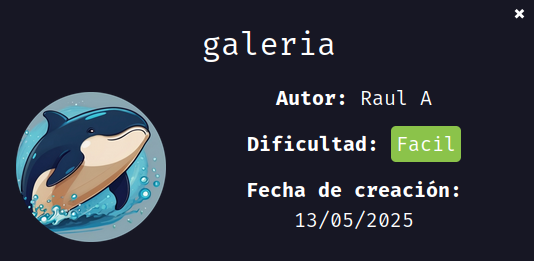
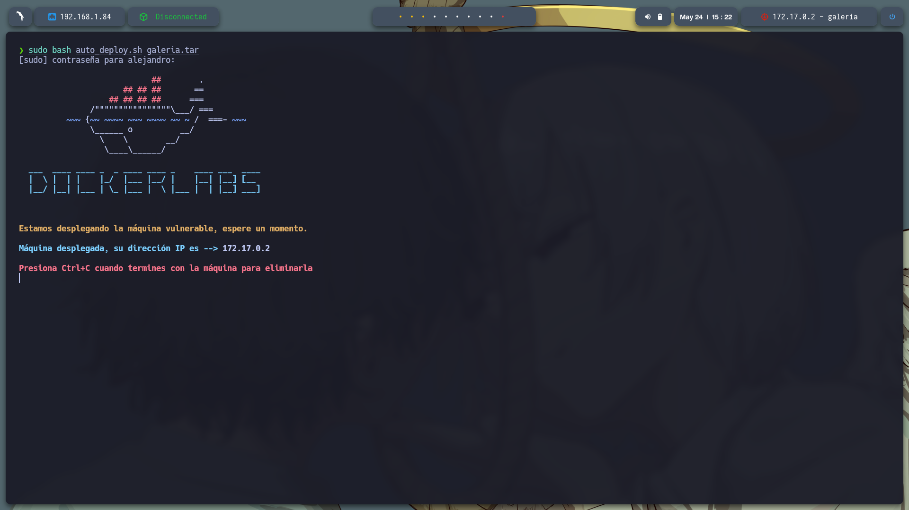
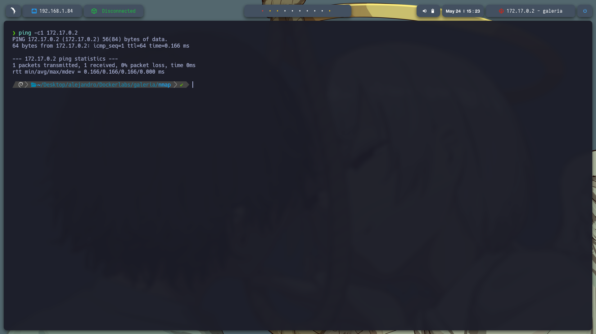
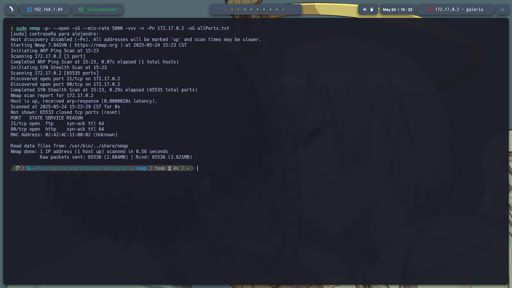
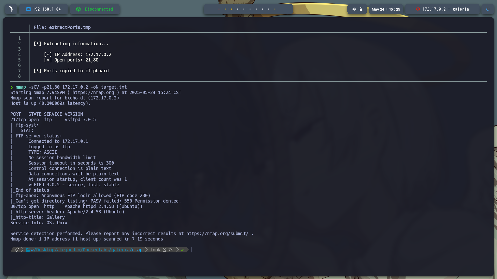
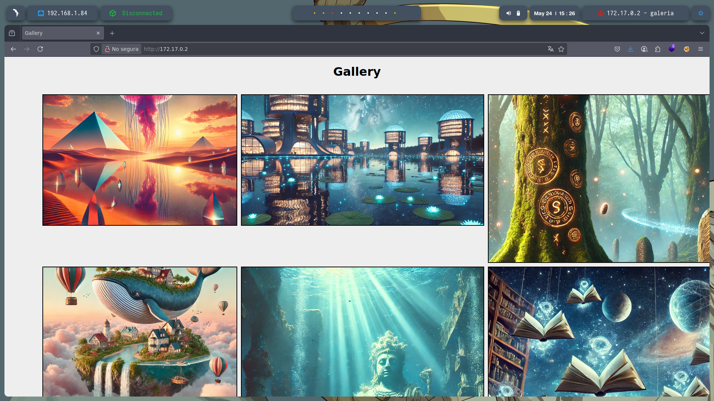
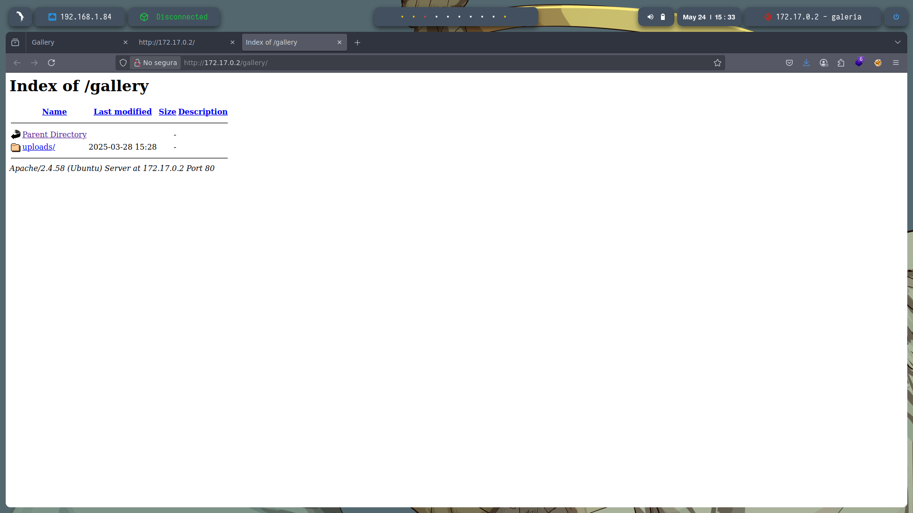
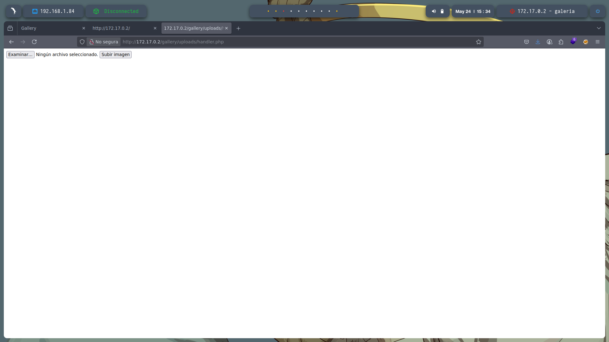
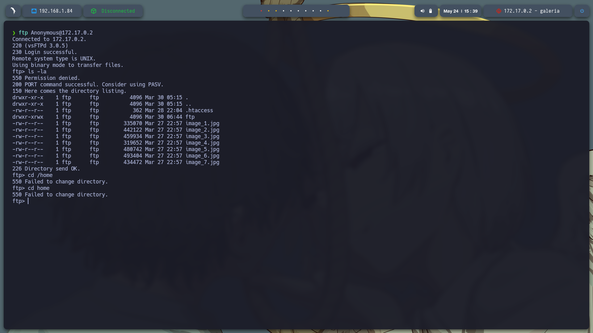
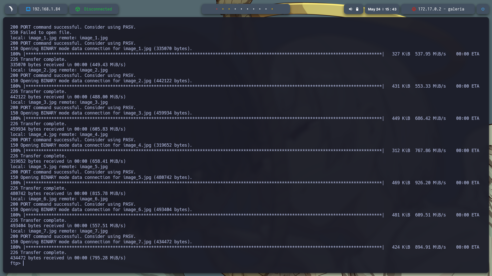

# 🧠 **Informe de Pentesting – Máquina: Galeria**

### 💡 **Dificultad:** Fácil

### 🧩 **Plataforma:** DockerLabs




---

## 📝 **Descripción de la máquina**

---

## 🎯 **Objetivo**


---

## ⚙️ **Despliegue de la máquina**

Se descarga el archivo comprimido de la máquina vulnerable y se lanza el contenedor Docker mediante el script incluido:

```bash
unzip backend.zip
sudo bash auto_deploy.sh backend.tar
```



---

## 📡 **Comprobación de conectividad**

Verificamos que la máquina se encuentra activa respondiendo a peticiones ICMP (ping):

```bash
ping -c1 172.17.0.2
```



---

## 🔍 **Escaneo de Puertos**

Realizamos un escaneo completo para detectar todos los puertos abiertos:

```bash
sudo nmap -p- --open -sS --min-rate 5000 -vvv -n -Pn 172.17.0.2 -oG allPorts.txt
```

**Puertos detectados:**

* `21/tcp`: FTP
* `80/tcp`: HTTP



Luego, analizamos los servicios y versiones asociados a esos puertos:

```bash
nmap -sCV -p22,80 172.17.0.2 -oN target.txt
```
Encontramos en el servicio de FTP tiene activo el usuario Anonymous, con esto podemos logearnos sin nedesidad de una contraseña.


Entramos a ver la pagina que corre en el puerto 80 en ladireccion http://172.17.0.2 ynos encontramos con una pagina que muestra imagenes de pinturas.


Realizamos fuzzing gobuster dir -u http://172.17.0.2/ -w /usr/share/wordlists/dirbuster/directory-list-2.3-medium.txt -t 20 -add-slash -b 403,404 -x .php,.html,.txt y encontramos 2 directorios:
/index.html           
/gallery


---



Donde exixte un handler.php que nos deja subir archivos



Entramos a ftp con el usuario Anonymous buscamos archivos con ls -la y encontramos algunos:

-rw-r--r--    1 ftp      ftp           362 Mar 28 22:04 .htaccess
drwxr-xrwx    1 ftp      ftp          4096 Mar 30 06:44 ftp
-rw-r--r--    1 ftp      ftp        335070 Mar 27 22:57 image_1.jpg
-rw-r--r--    1 ftp      ftp        442122 Mar 27 22:57 image_2.jpg
-rw-r--r--    1 ftp      ftp        459934 Mar 27 22:57 image_3.jpg
-rw-r--r--    1 ftp      ftp        319652 Mar 27 22:57 image_4.jpg
-rw-r--r--    1 ftp      ftp        480742 Mar 27 22:57 image_5.jpg
-rw-r--r--    1 ftp      ftp        493404 Mar 27 22:57 image_6.jpg
-rw-r--r--    1 ftp      ftp        434472 Mar 27 22:57 image_7.jpg



Descargue todo el contenido a mi host par su analicis:
binary # para las imagenes
prompt #Desactivar confirmación por archivo 
mget * #Descarga todo el contenido del directorio actual



Revisamos .htaccess y es un script que le dice al servidor que trate ciertos archivos, incluso si parecen imágenes (.jpg, .png), como si fueran programas PHP. También permite ver imágenes y mostrar el contenido del directorio.
asi que puedo confirmar que existe una revellshell con php en el directorio en encontramos en la pagina


