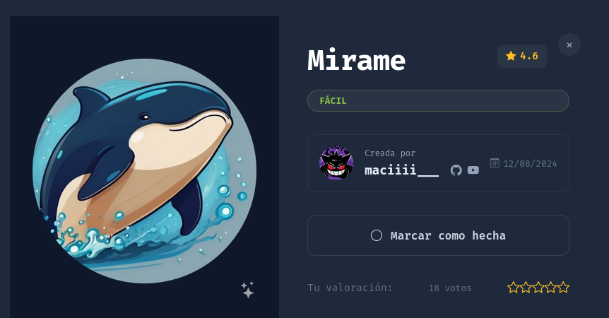
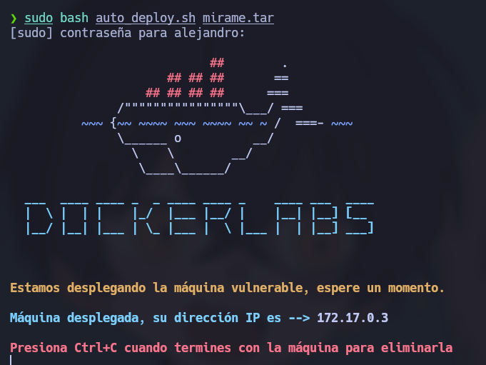
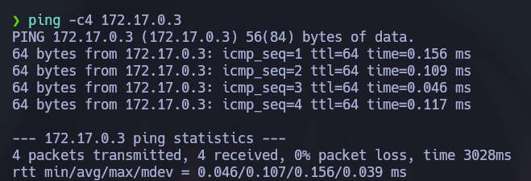

# 🧠 **Informe de Pentesting – Máquina: Mirame**

### 💡 **Dificultad:** Fácil

### 🧩 **Plataforma:** DockerLabs

---



---

# ⚙️ **Despliegue de la máquina**

Se descarga el archivo comprimido de la máquina vulnerable y se despliega el contenedor Docker utilizando el script proporcionado por el laboratorio:

```bash
unzip backend.zip
sudo bash auto_deploy.sh mirame.tar
```



Primero se comprueba si se tiene conexiòn con el objetivo



