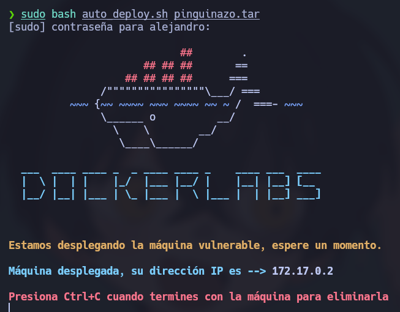
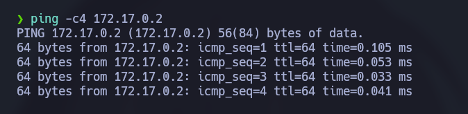
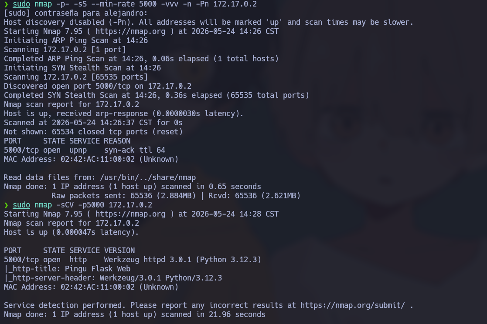

# 🧠 **Informe de Pentesting – Máquina: Pinguinazo**

### 💡 **Dificultad:** Fácil

### 🧩 **Plataforma:** DockerLabs

---



---

Primero se realiza un ping para verificar si se tiene conexiòn

---

```bash
ping -c4 172.17.0.2
```


---

Posteriormente con la herramienta de nmap se valida los puertos que se tiene abierto

```bash
sudo nmap -p- -sS --min-rate 5000 -vvv -n -Pn 172.17.0.2
```
## 📌 Puerto detectados

* `5000/tcp`
 
Posteriormente se valida que servicio y versiòn esta corriendo el los puertos encontrados para validar si exite algun vector de ataque en eate caso no se encontro alguno

```bash
sudo nmap -sCV -p5000 172.17.0.2
```

