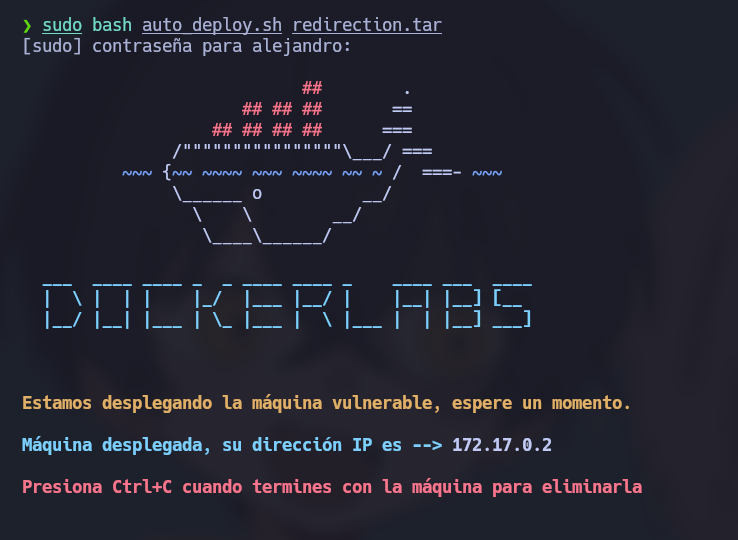
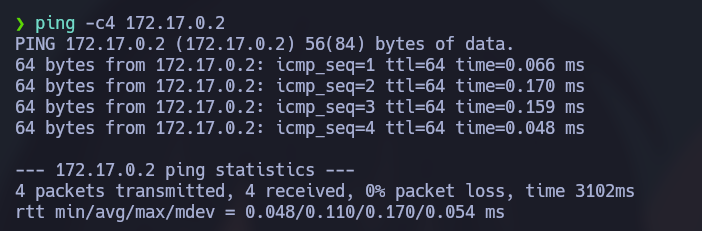
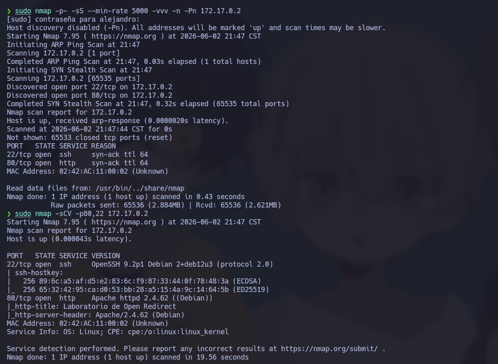

# 🧠 Informe de Pentesting – Máquina: Redirection

### 💡 Dificultad: Fácil

### 🧩 Plataforma: DockerLabs


---

# ⚙️ Despliegue de la máquina

Antes de comenzar el proceso de reconocimiento y explotación, se procede al despliegue del laboratorio vulnerable proporcionado por DockerLabs.

La máquina se distribuye comprimida en formato `.zip`, incluyendo la imagen Docker necesaria para su ejecución y un script automatizado encargado de simplificar el proceso de despliegue.

Para iniciar el entorno vulnerable se ejecutan los siguientes comandos:

```bash
unzip redirection.zip
sudo bash auto_deploy.sh redirection.tar
```

## Explicación

* **unzip balulero.zip** → Extrae los archivos necesarios para el despliegue.
* **auto_deploy.sh** → Automatiza la carga de la imagen Docker y la creación del contenedor.
* **balulero.tar** → Imagen utilizada para desplegar la máquina vulnerable.

Una vez finalizado el proceso, el contenedor queda disponible dentro de la red interna de Docker.



---

# 📡 Verificación de conectividad

Antes de iniciar las fases de reconocimiento, se valida la disponibilidad del objetivo dentro de la red.

```bash
ping -c 4 172.17.0.2
```

## Explicación de parámetros

* **ping** → Herramienta utilizada para comprobar conectividad mediante paquetes ICMP.
* **-c 4** → Envía únicamente cuatro solicitudes ICMP.

La recepción de respuestas confirma:

* Disponibilidad del objetivo
* Conectividad funcional entre atacante y víctima
* Baja latencia esperada en entornos Docker



---

# 🔍 Fase de reconocimiento – Enumeración de puertos

La fase inicial de reconocimiento se centra en identificar la superficie de exposición del objetivo.

Para ello se realiza un escaneo completo sobre todos los puertos TCP:

```bash
sudo nmap -p- --open -sS --min-rate 5000 -vvv -n -Pn 172.17.0.2
```

## Explicación detallada

* **-p-** → Escanea los 65535 puertos TCP.
* **--open** → Muestra únicamente puertos abiertos.
* **-sS** → Realiza un SYN Scan.
* **--min-rate 5000** → Incrementa la velocidad de envío.
* **-vvv** → Aumenta la verbosidad.
* **-n** → Evita resolución DNS.
* **-Pn** → Omite el descubrimiento previo del host.

---

## Resultado del reconocimiento

El análisis revela únicamente dos servicios expuestos:

* **22/tcp → SSH**
* **80/tcp → HTTP**

La reducida superficie de ataque sugiere que la explotación probablemente se centrará en el servicio web.

---

# 🔬 Enumeración de servicios

Con los puertos identificados, se realiza una enumeración más profunda.

```bash
nmap -sCV -p22,80 172.17.0.2
```

## Explicación

* **-sC** → Ejecuta scripts NSE básicos.
* **-sV** → Identifica versiones.
* **-p22,80** → Limita el análisis.

Durante esta fase se confirma:

* Servicio SSH activo
* Servidor web funcional
* Posibles vectores relacionados con autenticación



---

# 🌐 Enumeración web

Se accede al servicio HTTP:

```bash
http://172.17.0.2
```

La página presenta un formulario de autenticación simple.


