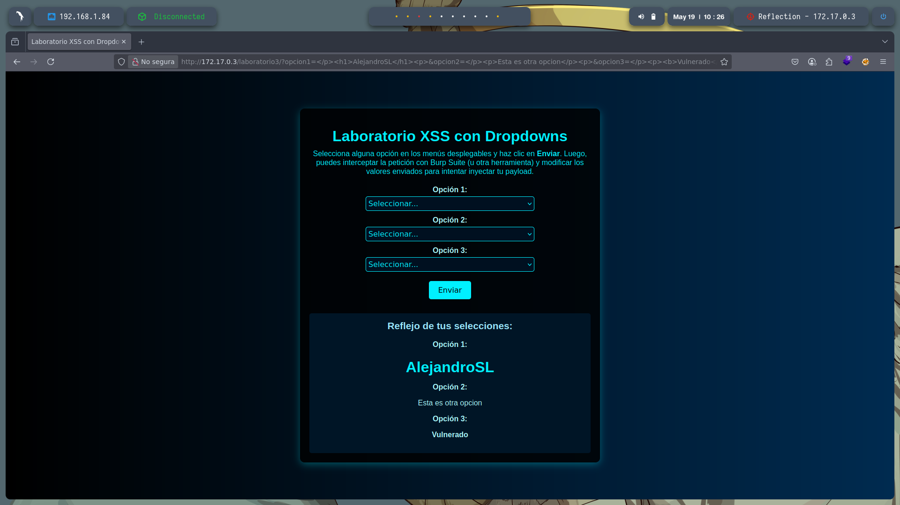
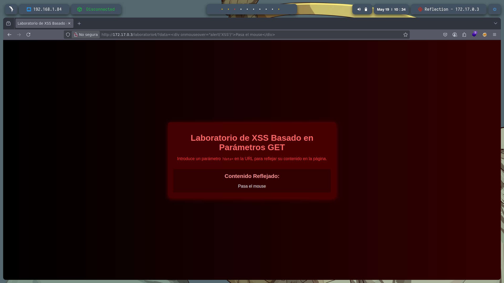
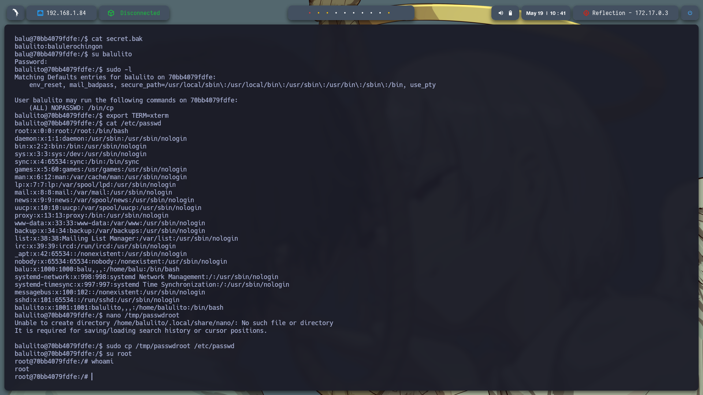

# 🧠 **Informe de Pentesting – Máquina: Reflection**

### 💡 **Dificultad:** Fácil

### 🧩 **Plataforma:** DockerLabs

### 🕵️‍♂️ **Tipo de ataque:** Inyección SQL + Escalada de privilegios con SUID


---

## 📝 **Descripción de la máquina**


---

## 🎯 **Objetivo**

---

## ⚙️ **Despliegue de la máquina**

Se descarga el archivo comprimido de la máquina vulnerable y se lanza el contenedor Docker mediante el script incluido:

```bash
unzip reflection.zip
sudo bash auto_deploy.sh reflection.tar
```


---

## 📡 **Comprobación de conectividad**

Verificamos que la máquina se encuentra activa respondiendo a peticiones ICMP (ping):

```bash
ping -c1 172.17.0.3
```


---

## 🔍 **Escaneo de Puertos**

Realizamos un escaneo completo para detectar todos los puertos abiertos:

```bash
sudo nmap -p- --open -sS --min-rate 5000 -vvv -n -Pn 172.17.0.3 -oG allPorts.txt
```

**Puertos detectados:**

* `22/tcp`: SSH
* `80/tcp`: HTTP


Luego, analizamos los servicios y versiones asociados a esos puertos:

```bash
nmap -sCV -p22,80 172.17.0.3 -oN target.txt
```


---

Nos vamos al servicio web que esta alojado en http://172.17.0.3/ y encontramos unos laboratorios XXS


XSS Reflejado
Entramos a Laboratorio de XSS Reflejado y escribo un encabezado <h1>Prueba insertar html</h1> y vemos que lo ejecuta


---


XSS Almacenado
El payload <p style="color:blue;">Azul</p> funciona porque es una etiqueta HTML que define un párrafo con estilo CSS; el texto “Azul” se muestra en color azul. No contiene JavaScript ni código malicioso, por lo que el navegador lo procesa normalmente. En cambio, payloads como <script>alert('XSS')</script> se almacenan pero no se ven porque los scripts no generan contenido visible y pueden ser bloqueados por el navegador por razones de seguridad. Aunque se guarden en el servidor, si hay filtros o políticas activas, su ejecución puede impedirse para evitar ataques XSS.
En este laboratorio es simililar el primero solo que ahora se alamcena
Ejemplo de otro pyload:<div onmouseover="alert('XSS')">Pasa el mouse</div>


Laboratorio XSS con Dropdowns

http://172.17.0.3/laboratorio3/?opcion1=%3C/p%3E%3Ch1%3EAlejandroSL%3C/h1%3E%3Cp%3E&opcion2=%3C/p%3E%3Cp%3EEsta%20es%20otra%20opcion%3C/p%3E%3Cp%3E&opcion3=%3C/p%3E%3Cp%3E%3Cb%3EVulnerado%3C/b%3E%3C/p%3E
Este ataque funciona porque la aplicación refleja directamente los parámetros de la URL en el HTML sin sanitizarlos. Al cerrar etiquetas como </p> y añadir nuevas (<h1>, <p>, <b>), se rompe el formato original del sitio y se reemplaza el contenido mostrado. Así se eliminan los textos “Opción 1, 2, 3” y se muestra solo el mensaje personalizado. Esto es posible porque el navegador interpreta las etiquetas HTML inyectadas como parte legítima del documento.


XSS Basado en Parámetros GET
http://172.17.0.3/laboratorio4/?data=%3Cdiv%20onmouseover=%22alert(%27XSS%27)%22%3EPasa%20el%20mouse%3C/div%3E
El XSS basado en parámetros GET ocurre cuando una aplicación web refleja directamente el contenido de un parámetro de la URL en la página sin sanitizarlo. En el ejemplo, el parámetro data contiene un <div> con un evento onmouseover que ejecuta alert('XSS'). Al cargar la página, el navegador interpreta y muestra ese código HTML y JavaScript. Cuando el usuario pasa el mouse sobre el <div>, se ejecuta la alerta. Esto demuestra que el sitio es vulnerable, permitiendo ejecución de código malicioso desde la URL.


---


Nota: para conseguir las credenciales de SSH revisarr el codigo fuete y muestra las credenciales o simplemte dar clck en la pagina y lo mostrara: 
Usuario: balu
Password: balulero

El usuario balulito tiene un archivo llamado secret.bak que contenía credenciales (balulito:balulerochingon). Usando estas credenciales, hice login con su balulito. Luego, verifique los comandos sudo disponibles con sudo -l y vio que podía ejecutar /bin/cp sin contraseña. Aproveche este permiso para copiar un archivo modificado /tmp/passwdroot al sistema /etc/passwd. En este archivo modificado, se eliminó la “x” en la línea de root, lo que permite que la contraseña del usuario root esté en texto plano. Finalmente, con este cambio, pude hacer su root y obtener acceso root completo al sistema.



