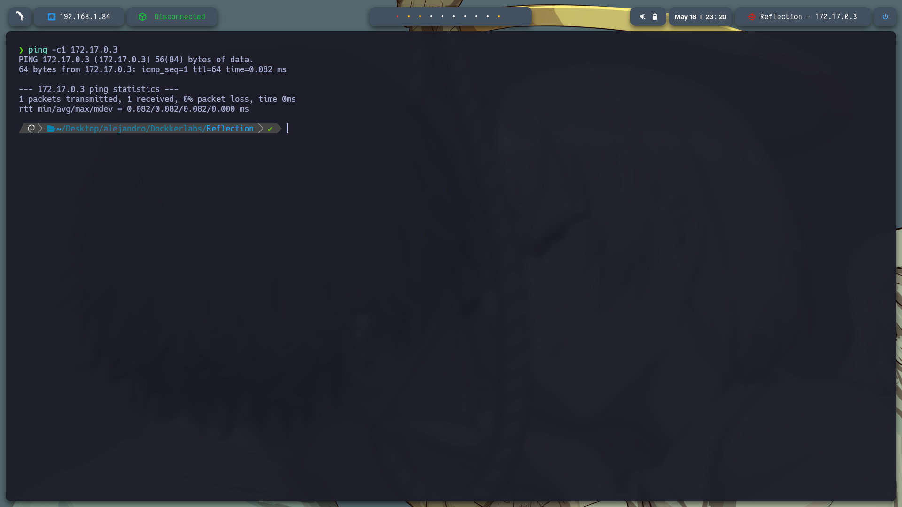
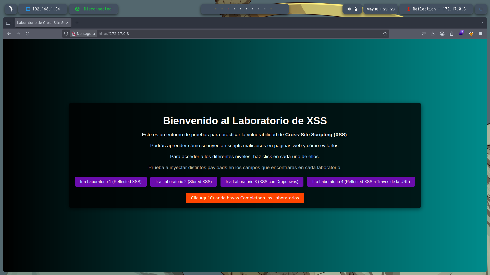

# 🧠 **Informe de Pentesting – Máquina: Reflection**

### 💡 **Dificultad:** Fácil

### 🧩 **Plataforma:** DockerLabs

### 🕵️‍♂️ **Tipo de ataque:** Inyección SQL + Escalada de privilegios con SUID


---

## 📝 **Descripción de la máquina**


---

## 🎯 **Objetivo**

---

## ⚙️ **Despliegue de la máquina**

Se descarga el archivo comprimido de la máquina vulnerable y se lanza el contenedor Docker mediante el script incluido:

```bash
unzip reflection.zip
sudo bash auto_deploy.sh reflection.tar
```


---

## 📡 **Comprobación de conectividad**

Verificamos que la máquina se encuentra activa respondiendo a peticiones ICMP (ping):

```bash
ping -c1 172.17.0.3
```



---

## 🔍 **Escaneo de Puertos**

Realizamos un escaneo completo para detectar todos los puertos abiertos:

```bash
sudo nmap -p- --open -sS --min-rate 5000 -vvv -n -Pn 172.17.0.3 -oG allPorts.txt
```

**Puertos detectados:**

* `22/tcp`: SSH
* `80/tcp`: HTTP


Luego, analizamos los servicios y versiones asociados a esos puertos:

```bash
nmap -sCV -p22,80 172.17.0.3 -oN target.txt
```


---

Nos vamos al servicio web que esta alojado en http://172.17.0.3/ y encontramos unos laboratorios XXS


Entramos a Laboratorio de XSS Reflejado y escribo un encabezado <h1>Prueba insertar html</h1> y vemos que lo ejecuta


---


